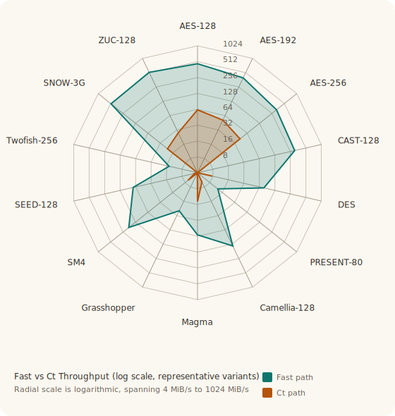

# ANALYSIS — Algorithms, Design Decisions, and Performance

Explains why each cipher family is structured as it is: the algorithmic
background, key design choices, and measured throughput, including the
software fast-vs-constant-time tradeoff for the ciphers that expose separate
`Ct` variants.

---

## Common API

Every cipher struct implements the `BlockCipher` trait:

```rust
pub trait BlockCipher {
    const BLOCK_LEN: usize;
    fn encrypt(&self, block: &mut [u8]);
    fn decrypt(&self, block: &mut [u8]);
}
```

The `encrypt_block` / `decrypt_block` methods taking typed `&[u8; N]` arrays
remain on each struct for callers that know the block size at compile time.
The trait methods provide a uniform interface for generic code such as the
throughput benchmarks.

---

## Modes of Operation

- Reference: `sp800-38a`, `sp800-38b`, `sp800-38d`, `sp800-38e`, `sp800-38f`, `rfc8452`.
- Implemented now: generic SP 800-38A wrappers (`Ecb`, `Cbc`, `Cfb`, `Ofb`,
  `Ctr`), SP 800-38B `Cmac`, SP 800-38D `Gcm` / `Gmac`, and SP 800-38E `Xts`.
- Scope: these wrappers are generic over any `BlockCipher` in the crate, so
  they work across AES, DES, Camellia, PRESENT, CAST-128, and the other block
  ciphers without duplicating mode logic in each cipher module. `Gcm` / `Gmac`
  and `Xts` require 128-bit block ciphers, which is the standards-constrained
  case.
- Not implemented yet: key wrap and RFC 8452 AES-GCM-SIV. Those require
  dedicated framing or polynomial machinery beyond the reusable mode layer.

The implemented mode layer is intentionally the reusable foundation layer: it
makes the raw block ciphers immediately usable for standards-based
confidentiality, storage confidentiality, and message-authentication
constructions without baking those wrappers into each cipher module. RFC 8452
was reviewed as part of this split; its AES-GCM-SIV design is a
nonce-misuse-resistant AEAD around AES and `POLYVAL`, so it still belongs in a
dedicated AEAD module rather than in the basic generic wrappers.

Correctness coverage is concentrated in [src/modes/mod.rs](/Users/darrell/cryptography/src/modes/mod.rs):

- SP 800-38A AES-128 vectors for `Ecb`, `Cbc`, `Cfb`, `Ofb`, and `Ctr`
- SP 800-38B AES-CMAC vectors
- SP 800-38D AES-GCM vectors, including AAD handling and wrong-tag rejection
- OpenSSL cross-checks for `Xts`
- a non-AES generic-path test (`Ctr` over `Des`) to prove the wrappers are not
  accidentally hard-wired to AES

The biggest operational caveat remains the same one the standards stress:
these wrappers make the primitives available, but IV, nonce, tweak, and key
management are still protocol responsibilities. `Gcm` in particular requires
nonce uniqueness, and the portable `GHASH` path is documented as not
constant-time.

---

## Hash Functions and XOFs

- Reference: `fips180-4`, `fips202`.
- Hashes: the crate includes `Sha1`, the full SHA-2 family (`Sha224`,
  `Sha256`, `Sha384`, `Sha512`, `Sha512_224`, `Sha512_256`), the SHA-3 family
  (`Sha3_224`, `Sha3_256`, `Sha3_384`, `Sha3_512`), plus the XOFs `Shake128`
  and `Shake256`.
- Why SHAKE matters here: `Shake128` / `Shake256` provide the XOF abstraction
  needed for upcoming `XDRBG` work without introducing external dependencies.

The SHA-3 / SHAKE implementation is a direct Keccak-f[1600] sponge. The fixed
SHA-3 hashes use the FIPS 202 SHA-3 domain suffix `0x06`, while the SHAKE XOFs
use the FIPS 202 SHAKE suffix `0x1f`. This keeps the internal sponge reusable
across both fixed-output hashing and variable-length output generation.

The SHA-1 and SHA-2 implementations follow the FIPS 180-4 Merkle-Damgard
constructions directly. The SHA-2 set includes both the 32-bit word family and
the 64-bit word family, including the truncated SHA-512 variants.

That also means the raw SHA-1 / SHA-2 digests inherit the usual
length-extension caveat. They are appropriate as hash functions, but they
should not be used directly as keyed authenticators; use `Hmac<H>` for that, or
use SHA-3 / SHAKE when sponge-based hashing semantics are preferable.

Coverage is intentionally a mix of fixed vectors and external cross-checks:

- SHA-1, SHA-2, and SHA-3 empty-string vectors
- streaming `abc` tests across the major fixed-output variants
- SHAKE empty-input and streaming squeeze tests
- OpenSSL cross-checks for representative `Sha256` and HMAC cases where the
  external tool supports the algorithm directly

---

## Message Authentication

- Reference: `fips198-1`, `sp800-38b`, `sp800-38d`.
- Implemented now: generic `Hmac<H>` for any in-tree `Digest`, plus the
  block-cipher MACs `Cmac` and `Gmac` in the mode layer.
- Scope: `Hmac<H>` covers SHA-1, SHA-2, SHA-3, and future digest additions
  without per-hash wrapper code.

`Hmac<H>` follows the standard FIPS 198-1 / RFC 2104 inner-pad / outer-pad
construction over the hash function's byte-oriented block size. For the SHA-3
family, that means the Keccak rate in bytes, which is the block size used by
HMAC-SHA3.

The practical guidance is straightforward:

- use `Hmac<H>` when you need a hash-based MAC
- use `Cmac` when you specifically need the NIST block-cipher MAC
- use `Gmac` only when you actually want the GCM hash/MAC construction without
  the encryption half

All three are integrity mechanisms, not signatures, and all three still depend
on correct key and nonce discipline in the surrounding protocol.

---

## CSPRNGs

- Reference: `sp800-90a-r1`.
- Implemented now: historical `BlumBlumShub`, historical `BlumMicali`, and
  standards-based `CtrDrbgAes256`.
- Scope: the historical generators are educational/reference-grade; the
  standards-track DRBG is the one intended for practical deterministic byte
  generation.

`CtrDrbgAes256` follows the SP 800-90A Rev. 1 AES-256 CTR_DRBG construction in
its no-derivation-function form. It stores the 256-bit key and 128-bit `V`
state directly, supports reseeding and optional additional input, and wipes its
internal state on drop.

`BlumBlumShub` and `BlumMicali` are intentionally small `u128` reference
implementations, not large-parameter deployment generators. They are useful for
historical study, bit-generator experiments, and validating the shared `Csprng`
trait shape, but they are not substitutes for modern DRBG deployments.

---

## Coverage Matrix

There are no standalone correctness scripts in this repository. Correctness is
checked by per-module unit tests (`cargo test`), and throughput is measured by
the separate Criterion benchmark crate under `benchmarks/`.

| Family | Public types | Correctness coverage | Benchmark coverage |
|--------|--------------|----------------------|--------------------|
| AES | `Aes128/192/256`, `Aes128/192/256Ct` | NIST KATs for fast and `Ct` paths, S-box self-checks, fast-vs-`Ct` equivalence (`cargo test aes::tests`) | `cipher_bench` for fast-vs-`Ct`; `aes_bench` for focused AES comparisons |
| CAST-128 / CAST5 | `Cast128`, `Cast128Ct` | RFC 2144 40/80/128-bit KATs for fast and `Ct` paths (`cargo test cast128::tests`) | `cipher_bench` |
| Camellia | `Camellia128/192/256`, `Camellia128/192/256Ct` | RFC 3713 Appendix A KATs for all 3 key sizes, `Ct` S-box self-checks (`cargo test camellia::tests`) | `cipher_bench` |
| DES / 3DES | `Des`, `DesCt`, `TripleDes` | DES KATs, `DesCt` KAT, 2-key and 3-key TDES coverage (`cargo test des::tests`) | `cipher_bench` |
| PRESENT | `Present80`, `Present80Ct`, `Present128`, `Present128Ct` | CHES 2007 80-bit KATs, 128-bit KATs, `Ct` S-box self-checks (`cargo test present::tests`) | `cipher_bench` |
| Serpent | `Serpent128/192/256`, `Serpent128/192/256Ct` | Submission-vector KATs for all 3 key sizes, `Ct` S-box self-checks (`cargo test serpent::tests`) | `cipher_bench` |
| Twofish | `Twofish128/192/256`, `Twofish128/192/256Ct` | Submission zero-key KATs for all 3 key sizes, fast-vs-`Ct` q-permutation self-checks (`cargo test twofish::tests`) | `cipher_bench` |
| SEED | `Seed`, `SeedCt` | RFC 4009 Appendix B KATs, zero-key round-key KAT, `Ct` S-box self-checks (`cargo test seed::tests`) | `cipher_bench` |
| Simon | all 10 variants | Known-answer vectors for every variant (`cargo test simon::tests`) | `cipher_bench` |
| Speck | all 10 variants | Known-answer vectors for every variant (`cargo test speck::tests`) | `cipher_bench` |
| Magma | `Magma`, `MagmaCt` | RFC vector for fast and `Ct`, plus fast-vs-`Ct` equivalence (`cargo test magma::tests`) | `cipher_bench` |
| Grasshopper | `Grasshopper`, `GrasshopperCt` | RFC vectors, round-trip checks, fast-vs-`Ct` equivalence (`cargo test grasshopper::tests`) | `cipher_bench` |
| SM4 | `Sm4`, `Sm4Ct`, `Sms4`, `Sms4Ct` | Spec example, 1,000,000-encryption vector, alias checks, fast-vs-`Ct` equivalence (`cargo test sm4::tests`) | `cipher_bench` |
| ChaCha20 / XChaCha20 | `ChaCha20`, `XChaCha20` | RFC 8439 ChaCha20 block vector, XChaCha HChaCha20 vector, cross-check that XChaCha matches HChaCha20-derived ChaCha20 (`cargo test chacha20::tests`) | `cipher_bench` |
| Salsa20 | `Salsa20` | eSTREAM known-answer vector, XOR round-trip, chunked-stream consistency (`cargo test salsa20::tests`) | `cipher_bench` |
| ZUC-128 | `Zuc128`, `Zuc128Ct` | Official keystream vectors, partial/fill tests, fast-vs-`Ct` equivalence (`cargo test zuc::tests`) | `cipher_bench` |
| Hashes / XOFs | `Sha1`, `Sha2*`, `Sha3*`, `Shake*` | FIPS vectors, streaming tests, and representative OpenSSL cross-checks (`cargo test hash::`) | not benchmarked |
| HMAC | `Hmac<H>` | RFC / FIPS vectors, streaming equivalence, and OpenSSL cross-checks (`cargo test hash::hmac::tests`) | not benchmarked |
| Modes | `Ecb`, `Cbc`, `Cfb`, `Ofb`, `Ctr`, `Cmac`, `Gcm`, `Gmac`, `Xts` | SP 800-38A/B/D vectors, OpenSSL XTS cross-checks, generic non-AES path test (`cargo test modes::tests`) | not benchmarked |
| CSPRNGs | `BlumBlumShub`, `BlumMicali`, `CtrDrbgAes256` | reference sequences, byte-packing checks, and SP 800-90A CAVP KAT (`cargo test cprng::`) | not benchmarked |

---

## ML Distinguisher Experiments

The repository also includes an `ml/` experiment harness that generates raw
fixed-width ciphertext samples and trains neural-network classifiers on them.
This is a distinguisher experiment, not a claim of practical cryptanalysis: if
held-out accuracy rises above chance, the first question is whether the dataset
generator leaked structure, not whether the cipher has been "broken".

The harness currently exposes three classifier families:

- a residual 1D CNN (`cnn`)
- a patch Transformer (`transformer`)
- a byte-level Transformer (`byte_transformer`)

The completed runs published below cover the CNN family and the byte-level
Transformer. The patch-Transformer path is available for wider samples, but it
does not yet have a completed published run in this summary table.

On the current 11-class setup, chance accuracy is `1/11 = 0.0909`. The runs
completed so far stayed at or near that baseline:

| Run | Model | Sample width | Held-out result |
|-----|-------|-------------:|----------------:|
| `pytorch-mps-run1` | residual 1D CNN | 32 bytes | `0.0883` |
| `pytorch-mps-run2` | residual 1D CNN | 32 bytes | `0.0899` |
| `adaptive/s32_base-seed1337` | residual 1D CNN | 32 bytes | `0.0926` |
| `adaptive/s256_large-seed2337` | wider residual 1D CNN | 256 bytes | `0.0910` |
| `byte-transformer-mps-256-run2` | byte-level transformer | 256 bytes | `0.0909` |

The best completed result (`0.0926`) is still effectively chance. No completed
run from the current CNN or Transformer families produced a reproducible
held-out accuracy meaningfully above baseline, so the current conclusion is
simple: the implemented sample generator and tested model families have not
found a useful distinguisher. The code remains in `ml/` for anyone who wants to
try larger models, different feature constructions, or stronger dataset
controls.

---

## Cipher Families

### Block Ciphers

#### SIMON

- Reference: `simon-speck-2013`.
- History: published by the NSA in 2013 as a lightweight block cipher family optimized for hardware.
- Properties: Feistel family with 10 variants spanning 32- to 128-bit block sizes; compact round function; software performance is respectable but trails comparable SPECK variants.
- Usage and deprecation: suitable for research, compatibility work, and environments that specifically require SIMON. It is not a mainstream default for new software designs, largely because ecosystem adoption outside the lightweight-crypto niche is limited.
- Known issues: many variants use 32-, 48-, 64-, or 96-bit blocks, so long-message limits matter sooner than they do with 128-bit block ciphers. Generic block modes are available in the crate, but callers still have to choose and use a safe mode themselves because there is no SIMON-specific protocol or AEAD wrapper here.

Simon (Beaulieu et al., NSA 2013) is a Feistel cipher optimised for hardware.
Its round function is:

```math
f(x) = (S^1 x \,\&\, S^8 x) \oplus S^2 x
```

where $S^n$ denotes left-rotation by $n$ bits. The AND of two rotations is the
intentional hardware-friendly nonlinearity.  Each encrypt round reads one
64-bit round key and performs five rotation-and-XOR operations — cheap on any
64-bit ALU but expensive in software relative to the equivalent circuit area.

#### Key schedule

The key schedule expands `m` key words into `T` round keys using the recurrence

```math
k_i = \left(\sim k_{i-m}\right) \oplus \left(I \oplus S^{-1}\right)\left(S^{-3}(k_{i-1})\right) \oplus z_j[(i-m) \bmod 62] \oplus 3
```

where $z_j$ is one of five 62-bit LFSR constants tabulated in the paper. Five
Z sequences cover all ten variants; `j` is chosen to provide maximum algebraic
separation between the subkey stream and the plain constant `3`.

The round-key array is a compile-time fixed-size `[u64; T]` stack allocation,
avoiding any heap use.  Key expansion runs once at construction time and is not
included in the throughput measurements.

#### Implementation notes

Byte convention follows the NSA C reference: the two block words are stored
little-endian with `x` (the word entering `f`) first; key words are stored
little-endian with $k_0$ first. This matches the paper's Appendix B test
vectors exactly.

The `simon_variant!` macro instantiates all ten structs from a single
parameterised definition.  A `z`-sequence index is a macro argument because
it selects a compile-time constant expression; no runtime dispatch occurs.

---

#### SPECK

- Reference: `simon-speck-2013`.
- History: published alongside SIMON by the NSA in 2013 as the software-oriented member of the lightweight pair.
- Properties: ARX family with 10 variants; excellent software throughput, especially in the 128-bit block variants; simple round structure and strong performance on general-purpose CPUs.
- Usage and deprecation: useful for interop, benchmarking, and constrained-environment experiments. Like SIMON, it is not the default recommendation for new general-purpose applications because broad standards adoption is limited and policy acceptance has been uneven.
- Known issues: smaller-block variants have the same birthday-bound concerns as SIMON. Generic block modes are available in the crate, but there is no SPECK-specific authenticated-encryption wrapper here. While the implementation is naturally closer to constant-time than the table-driven ciphers, protocol misuse remains the larger risk.

Speck (Beaulieu et al., NSA 2013) is an Add-Rotate-XOR (ARX) cipher whose
round function is:

```math
x \leftarrow \left(S^{(-\alpha)}(x) + y\right) \oplus k
```

```math
y \leftarrow S^{\beta}(y) \oplus x
```

The first line right-rotates $x$ by $\alpha$, adds $y$ modulo $2^n$, and XORs
the round key. The second line left-rotates $y$ by $\beta$ and XORs in the new
$x$.

For Speck32/64 the rotation constants are $(\alpha,\beta) = (7,2)$; for all other
variants they are `(8,3)`.  Addition, rotation, and XOR map to exactly three
native 64-bit instructions — the tightest possible round function.

#### Why Speck is faster than Simon

Simon's round function requires two rotations plus an AND before the final
XOR, and AND is not invertible, so the inverse round differs structurally
from the forward round.  Speck's ARX round is self-inverse with only sign
changes; the compiler produces nearly identical code for encrypt and decrypt.
More importantly, 64-bit add/rotate/XOR fully exploit the integer execution
units of modern 64-bit CPUs.  At 128-bit block size (64-bit word), Speck
exceeds 1 GiB/s on Apple M4; no other cipher in this suite reaches that rate
without hardware acceleration.

#### Key schedule

The Speck key schedule uses a 40-entry stack `ℓ`-array (the theoretical
maximum across all variants) and no heap allocation.  `ℓ` stores only the
`m−1` "side" words needed for the next round, overwritten in place.

---

#### AES

- Reference: `fips197` (primary standard); `daemen-rijmen-2002` (design reference).
- History: standardized by NIST as FIPS 197 in 2001 after the Rijndael competition; it is the dominant general-purpose block cipher in modern protocols and software.
- Properties: 128-bit block cipher with 128/192/256-bit keys; the main practical choice for new designs; broad public analysis and hardware support.
- Usage and deprecation: preferred default block cipher in this repository for general-purpose use. The `Aes128`/`Aes192`/`Aes256` types are the fast table-based software paths. `Aes128Ct`/`Aes192Ct`/`Aes256Ct` exist for software-only constant-time use. AES itself is not deprecated.
- Known issues: the fast AES types (`Aes128`, `Aes192`, `Aes256`) use T-tables and are not constant-time; use the `Ct` variants or a separate hardware-backed implementation if side channels matter. The crate now provides generic block modes plus `Gcm`, `Gmac`, and `Xts`, but higher-level protocol framing and nonce/IV discipline are still the caller's responsibility.

AES (FIPS 197) uses a byte-substitution, row-shift, column-mix, and key-add
round structure operating in $\mathrm{GF}(2^8)$.

#### T-table implementation

The standard software optimisation fuses SubBytes, ShiftRows, and MixColumns
into four 256-entry 32-bit lookup tables `TE0–TE3` (encryption) and
`TD0–TD3` (decryption).  Each table entry precomputes, for one byte input
value `v`, the full 32-bit column contribution after mixing:

```
TE0[v] = {mul2(S[v]),  S[v],       S[v],       mul3(S[v])}  (big-endian)
```

Processing four 8-bit byte lanes in parallel with table lookups reduces a
round to 16 table reads and 12 XOR operations per 128-bit block.  All
$\mathrm{GF}(2^8)$ multiplications are precomputed at compile time; none occur at
encryption time.

Decryption uses the inverse tables `TD0–TD3` constructed from `INV_SBOX`
and the inverse MixColumns coefficients `{0x0e, 0x0b, 0x0d, 0x09}`.

#### Key expansion

Key expansion produces round keys at construction time.  The 10/12/14-round
schedules for AES-128/192/256 are precomputed into fixed-size arrays
`[u32; 44]`, `[u32; 52]`, `[u32; 60]` respectively.  Separate encryption
and decryption round-key arrays are stored so that neither encrypt nor
decrypt requires runtime inversion.

#### No hardware intrinsics

The implementation is pure portable Rust. It deliberately avoids architecture-
specific hardware intrinsics in the main AES path. On any processor family,
using those intrinsics means committing to CPU-specific code and, in Rust,
usually `unsafe` bindings or an external dependency that wraps them. This crate
keeps the core implementation portable and safe across processors instead.

---

#### Serpent

- Reference: `anderson-biham-knudsen-1998-serpent`.
- History: designed by Ross Anderson, Eli Biham, and Lars Knudsen for the AES competition in the late 1990s. It reached the AES final round and remains one of the best-known conservative wide-round AES candidates.
- Properties: 128-bit block cipher with 128/192/256-bit keys; 32 rounds; substitution-permutation network designed for bitslice implementations and a large security margin rather than minimal round count.
- Usage and deprecation: appropriate for Serpent interoperability, research, and comparative study. It is not deprecated, but outside systems that explicitly require Serpent, AES is still the more common default.
- Known issues: the current implementation follows the original submission/reference byte order rather than NESSIE's byte-reversed presentation; callers using NESSIE-oriented test vectors may need to reverse bytes. The fast types use direct 4-bit S-box tables, while the `Ct` variants replace them with packed ANF evaluation and are slower.

Serpent is a 32-round bitslice substitution-permutation network. Each round
XORs a 128-bit round key into the state, applies one of eight 4-bit S-boxes in
parallel across 32 bit lanes, and then applies the linear transformation:

```text
x0 <- rotl(x0, 13)
x2 <- rotl(x2, 3)
x1 <- rotl(x1 xor x0 xor x2, 1)
x3 <- rotl(x3 xor x2 xor (x0 << 3), 7)
x0 <- rotl(x0 xor x1 xor x3, 5)
x2 <- rotl(x2 xor x3 xor (x1 << 7), 22)
```

The final round omits that linear transform and ends with a last round-key XOR.
This structure maps well to portable 32-bit integer operations and makes a true
software constant-time path straightforward.

#### Key schedule

Serpent expands the user key into 132 prekey words using the recurrence:

```text
w[i] = rotl11(w[i-8] xor w[i-5] xor w[i-3] xor w[i-1] xor PHI xor (i-8))
```

The implementation pads 128- and 192-bit keys with a single `1` bit followed
by zeros, exactly as described in the submission paper, then derives 33 round
keys by applying the Serpent S-box sequence to each group of four prekeys.

---

#### Twofish

- Reference: `twofish-1998`.
- History: designed by Bruce Schneier, John Kelsey, Doug Whiting, David Wagner, Chris Hall, and Niels Ferguson for the AES competition in 1998. It was one of the AES finalists and remains one of the best-known AES-era alternative block ciphers.
- Properties: 128-bit block cipher with 128/192/256-bit keys; 16 rounds; Feistel-like structure with keyed `q` permutations, an MDS matrix, and input/output whitening.
- Usage and deprecation: appropriate for interoperability, comparative study, and legacy protocol work that explicitly names Twofish. It is not deprecated, but it is far less common than AES in deployed systems.
- Known issues: the fast Twofish types use direct lookup tables for the `q0` / `q1` permutations and are not constant-time; the `Ct` variants replace those lookups with fixed-scan nibble selection and are slower. Generic block modes are available in the crate, but there is no Twofish-specific AEAD or protocol profile here, so mode/protocol misuse is still the larger operational risk.

Twofish is a 16-round 128-bit block cipher that mixes two 32-bit `g` outputs
into a pseudo-Hadamard transform each round. In the standard notation:

```text
T0 = g(X0)
T1 = g(ROL8(X1))
F0 = T0 + T1 + K[2r + 8]
F1 = T0 + 2*T1 + K[2r + 9]
```

Those round outputs feed the right half after one-bit rotations, while the
left and right word pairs trade places every round. The cipher also applies
four 32-bit input-whitening words and four output-whitening words derived from
the same subkey schedule.

#### Key schedule

Twofish splits the user key into even and odd 32-bit words (`Me` and `Mo`),
then derives:

- forty 32-bit subkeys (`K0..K39`) for whitening and the 16 rounds
- up to four 32-bit S-box key words derived by the Reed-Solomon matrix over
  the key bytes

Subkeys are generated with the same keyed `h()` function used by the round
core:

```text
A = h(2i * RHO, Me)
B = ROL8(h((2i + 1) * RHO, Mo))
K[2i]   = A + B
K[2i+1] = ROL9(A + 2*B)
```

The implementation follows the AES-submission design paper directly and checks
the published zero-key vectors for all three standard key sizes.

---

#### Camellia

- Reference: `camellia-spec` (primary specification); `rfc3713` (IETF algorithm text); `rfc4312` (IPsec profile).
- History: developed by NTT and Mitsubishi Electric in 2000, later adopted by CRYPTREC and standardized in ISO/IEC 18033-3. It is the best-known Japanese general-purpose block cipher of the AES era.
- Properties: 128-bit block cipher with 128/192/256-bit keys; 18 rounds for 128-bit keys and 24 rounds for 192/256-bit keys; Feistel structure with additional `FL` / `FLINV` layers every 6 rounds.
- Usage and deprecation: appropriate for Camellia interoperability, standards conformance, and comparative study. It is not deprecated, but outside ecosystems that explicitly require it, AES is still the simpler default.
- Known issues: the fast Camellia types use the direct 8-bit S-box table and are not constant-time; the `Ct` variants avoid those table loads with a packed ANF S-box and are slower. Generic block modes are available in the crate, but there is no Camellia-specific AEAD or protocol profile here.

Camellia is a balanced 64-bit-half Feistel cipher wrapped in 128-bit
prewhitening/postwhitening. Every round group uses the same 64-bit `F`
function, then inserts one `FL` / `FLINV` pair after each set of six rounds.
For 128-bit keys the schedule is 18 rounds total; for 192- and 256-bit keys
it extends to 24 rounds with one extra `FL` / `FLINV` layer.

#### Key schedule

The key schedule derives two intermediate 128-bit values `KA` and `KB` from
the user key by running the Camellia `F` function under the six fixed `Sigma`
constants defined in RFC 3713. Round keys are then generated by rotating `KL`,
`KR`, `KA`, and `KB` and taking 64-bit halves exactly as listed in the
specification.

The implementation precomputes the full subkey set at construction time:
`kw1..kw4`, `k1..k18`/`k24`, and `ke1..ke4`/`ke6`. Decryption follows the RFC
rule directly by using the same structure with subkeys in reverse order.

---

#### DES and Triple-DES

- Reference: `fips46-3` (DES); `sp800-67r2` (Triple-DES/TDEA).
- History: DES was standardized in the 1970s and later reaffirmed in FIPS 46-3. It descends from IBM's Lucifer family; Triple-DES extended its life by applying DES three times in EDE form.
- Properties: 64-bit block cipher family; DES has a 56-bit effective key and is cryptographically obsolete; 3DES raises brute-force cost but still inherits the 64-bit block size and a relatively slow software profile.
- Usage and deprecation: included for legacy interoperability, testing, and historical reference. New designs should not use DES or 3DES. In current standards practice, both are deprecated, and 3DES is being phased out of general use.
- Known issues: the 64-bit block size imposes birthday-bound limits for long messages; the fast DES type (`Des`) uses secret-indexed tables and is not constant-time; `DesCt` is much slower. The implementation also does not reject weak or semi-weak DES keys.

DES (FIPS PUB 46-3) is a 16-round Feistel cipher operating on 64-bit blocks
with a 56-bit effective key.  Each round applies the f-function:

```math
f(R, K) = P(S(E(R) \oplus K))
```

where E expands 32 bits to 48, S passes 8 × 6-bit groups through eight
4×16 S-boxes, and P permutes the resulting 32 bits.

Triple-DES (TDEA, NIST SP 800-67) wraps three DES operations in
Encrypt-Decrypt-Encrypt order:

```
Encrypt:  C = E(K3, D(K2, E(K1, P)))
Decrypt:  P = D(K1, E(K2, D(K3, C)))
```

Keying option 1 (3TDEA): K1, K2, K3 independent (24-byte key, 112-bit
effective security).  Keying option 2 (2TDEA): K1 = K3 ≠ K2 (16-byte key,
80-bit effective security).

DES descends from IBM's Lucifer work. It was designed first and foremost as a
hardware cipher. In IBM's design process, candidate S-box tables were judged by
whether hardware engineers could realize the corresponding logic economically;
the final DES S-boxes were the result of that hardware-driven iteration, not a
software-oriented table design.

#### Why DES is slow in software

DES was designed for efficient 1970s *hardware* implementation, not software.
Every round includes three bit permutations:

- **E (expansion)**: 32 → 48 bits by replicating boundary bits
- **P (P-box)**: 32-bit permutation of S-box output
- **IP / FP**: 64-bit initial and final permutations on the entire block

The implementation follows FIPS 46-3 exactly, computing each permutation bit
by bit via a loop over the specification table.  For the 16 Feistel rounds,
this amounts to 1408 individual bit-extract-and-place operations per block:

```
IP   (64)  +  16 × [E (48) + P (32)]  +  FP (64)  =  1408 bit ops
```

These operations do not map to native instructions on any common ISA.  The
compiler unrolls and pipelines them, but cannot eliminate the fundamental
serial data dependency: each output bit depends on a different input bit,
preventing SIMD or word-parallel execution.

The implementation uses precomputed byte-level lookup tables for IP, FP, and E
— the same technique AES uses for MixColumns.  Each 64-bit permutation becomes
8 table lookups; the 48-bit expansion becomes 4.  The tables are computed once
at compile time via `const fn` and stored in `.rodata`; none of the 1408
bit-level loop iterations appear in the hot path.  The byte-table step alone
gives a 2.6× speedup over bit-by-bit permutations (18 → 47 MiB/s).

The further optimisation — fusing the 8 S-boxes and the 32-bit P permutation
into a single `SP_TABLE[8][64]` — eliminates the separate P step entirely.
Because P is a linear bit permutation, it distributes over OR:

```math
P(s_0 \mid s_1 \mid \cdots \mid s_7) = P(s_0) \mid P(s_1) \mid \cdots \mid P(s_7)
```

Each `SP_TABLE[i][b6]` entry stores the P-permuted contribution of S-box i for
6-bit input `b6`, precomputed at compile time by `build_sp()` (a `const fn`
that calls `apply_p_to_partial` for every entry).  The f-function becomes 1
expand + 8 SP lookups per round — 8 KiB for E_TABLE plus 2 KiB for SP_TABLE,
both comfortably in L1 cache.  The 43 NIST CAVP vectors still pass unchanged.

---

#### CAST-128 / CAST5

- Reference: `rfc2144`.
- History: designed by Carlisle Adams in the mid-1990s and published as RFC 2144. The algorithm is also commonly referred to as CAST5, especially when a specific key size such as CAST5-128 is intended.
- Properties: 64-bit block cipher with variable key sizes from 40 to 128 bits in 8-bit increments; 12 rounds for keys up to 80 bits and 16 rounds above that; classic Feistel structure with three alternating nonlinear round functions.
- Usage and deprecation: appropriate for legacy interoperability, OpenPGP-era compatibility work, and historical study. It should not be the default choice for new designs; modern 128-bit block ciphers are easier to deploy safely at scale.
- Known issues: the 64-bit block size imposes the same birthday-bound long-message limits as DES, 3DES, MAGMA, and PRESENT. The fast `Cast128` path uses direct 8-bit S-box tables and is not constant-time; `Cast128Ct` avoids secret-indexed loads with fixed-scan table selection and is materially slower. Generic block modes are available in the crate, but it still does not wrap CAST5 in the OpenPGP or CMS profiles that historically used it.

CAST-128 is a 16-round Feistel cipher in its full-key form. Each round applies
one of three nonlinear functions:

```text
F1(D, Km, Kr) = ((S1[Ia] xor S2[Ib]) - S3[Ic]) + S4[Id]
F2(D, Km, Kr) = ((S1[Ia] - S2[Ib]) + S3[Ic]) xor S4[Id]
F3(D, Km, Kr) = ((S1[Ia] + S2[Ib]) xor S3[Ic]) - S4[Id]
```

where `I` is a rotated mix of the round data word `D` and the masking /
rotation subkeys:

```text
Type 1: I = (Km + D) <<< Kr
Type 2: I = (Km xor D) <<< Kr
Type 3: I = (Km - D) <<< Kr
```

The four bytes of `I` index the large 32-bit S-boxes `S1..S4`. For shorter
keys (40 to 80 bits), the same structure is used but the cipher stops after
12 rounds, exactly as specified in RFC 2144.

#### Key schedule

The RFC key schedule treats the user key as 16 bytes `x0..xF`, padded on the
right with zeros for keys shorter than 128 bits. It then alternates between
two 16-byte temporary states (`x` and `z`) using the auxiliary S-boxes
`S5..S8` to derive 32 intermediate 32-bit words `K1..K32`.

The first sixteen become the masking subkeys `Km1..Km16`. The second sixteen
become the rotation subkeys `Kr1..Kr16`, with only the low 5 bits used by the
round function. The implementation follows the RFC recurrence directly and
supports the published 40-, 80-, and 128-bit known-answer vectors.

---

#### PRESENT

- Reference: `bogdanov-2007-present`.
- History: introduced in the CHES 2007 paper as an ultra-lightweight block cipher for constrained hardware. It was later standardized in ISO/IEC 29192-2 as one of the reference lightweight block ciphers.
- Properties: 64-bit block cipher with 80-bit and 128-bit key schedules; 31 rounds; simple 4-bit substitution-permutation structure optimized for small area rather than software throughput.
- Usage and deprecation: appropriate for lightweight-crypto study, hardware-oriented interoperability, and comparison with other small-footprint designs. It is not a mainstream general-purpose default and should not displace AES in ordinary software.
- Known issues: the 64-bit block size imposes the same birthday-bound message limits as DES, MAGMA, and other 64-bit primitives. The fast types (`Present80`, `Present128`) use a direct 4-bit S-box table; the `Ct` variants avoid secret-indexed S-box loads but are slower. Generic block modes are available in the crate, but there is no PRESENT-specific profile layer here.

PRESENT is a compact substitution-permutation network. Each round applies:

```math
\mathrm{state} \leftarrow \mathrm{state} \oplus \mathrm{round\_key}
```

```math
\mathrm{state} \leftarrow S(\mathrm{state})
```

```math
\mathrm{state} \leftarrow P(\mathrm{state})
```

The final round omits the S/P layers and ends with one last key XOR. The
4-bit S-box is small enough that the fast path uses a direct nibble table,
while the constant-time path evaluates the same mapping in packed ANF form.

#### Key schedule

For the original 80-bit design, the 80-bit key register is rotated left by 61
bits each round, the top nibble is passed through the S-box, and the round
counter is XORed into bits 19..15. The 128-bit variant applies the same
61-bit rotation, substitutes the top two nibbles, and XORs the counter into
bits 66..62.

Both schedules are expanded once at construction time into 32 precomputed
64-bit round keys, matching the algorithm's 31 rounds plus final whitening
key.

---

#### SEED

- Reference: `rfc4009` (algorithm text); `rfc4196` (IPsec usage profile).
- History: developed by KISA and standardized in South Korea in the late 1990s; widely used in Korean electronic commerce and finance, then documented for IETF use in RFC 4009 and RFC 4196.
- Properties: 128-bit block cipher with a 128-bit key; 16-round Feistel structure; two 8-bit S-boxes; mixes XOR and modular addition inside the round function.
- Usage and deprecation: appropriate for SEED interoperability and standards work. It is not deprecated in the narrow standards sense, but for new general-purpose deployments outside ecosystems that require it, AES is still the more common default.
- Known issues: the fast `Seed` path uses direct 8-bit S-box loads and is not constant-time; `SeedCt` avoids those table reads and is slower. Generic block modes are available in the crate, but it does not implement the RFC 4196 CBC/IPsec profile for you.

SEED is a 16-round Feistel cipher over 64-bit halves. The round function mixes
two 32-bit words with two 32-bit subkeys, then applies three layers of the
nonlinear `G` transform with modular additions between them:

```
T1 = G((R0 ^ K0) ^ (R1 ^ K1))
T0 = G((R0 ^ K0) + T1)
T1 = G(T1 + T0)
T0 = T0 + T1
```

Those two 32-bit outputs are XORed into the left half, then the Feistel halves
swap. After round 16, the ciphertext is the final right half followed by the
final left half, matching RFC 4009 Appendix B.

#### Key schedule

SEED expands the 128-bit key into sixteen 64-bit round keys (`K0`, `K1` pairs).
Each round computes:

```
K0 = G(Key0 + Key2 - KCi)
K1 = G(Key1 - Key3 + KCi)
```

Then odd rounds rotate `Key0 || Key1` right by 8 bits, while even rounds
rotate `Key2 || Key3` left by 8 bits. The implementation stores the 32
subkey words directly and verifies the zero-key schedule against the RFC's
published intermediate values.

---

#### MAGMA

- Reference: `rfc8891`.
- History: standardized as GOST R 34.12-2015 and documented in RFC 8891; it descends from the older GOST 28147-89 cipher.
- Properties: 64-bit block, 256-bit key, 32-round Feistel design; regionally important for Russian standards and compatibility work.
- Usage and deprecation: appropriate for GOST interoperability and historical/standards analysis. It is not the preferred choice for new general-purpose deployments outside ecosystems that require it. MAGMA itself is not formally deprecated within its standards family, but it is legacy-leaning relative to GRASSHOPPER.
- Known issues: the 64-bit block size imposes the same long-message limits as DES-class ciphers. The `Magma` type is table-driven and not constant-time; `MagmaCt` exists but is materially slower. Generic block modes are available in the crate, but there is no dedicated GOST-mode wrapper here.

Magma (GOST R 34.12-2015, RFC 8891) is a 32-round Feistel cipher with a 64-bit
block and 256-bit key.  It is standardised from the earlier GOST 28147-89 cipher,
differing primarily in having published, fixed S-boxes rather than secret ones.

#### Round function

The round function `g[k](a)` operates on a 32-bit half-block:

```math
g[k](a) = \mathrm{rotl}_{11}(t(a + k \bmod 2^{32}))
```

where `t` applies eight independent 4-bit S-boxes ($\Pi'_0 .. \Pi'_7$) to the
eight nibbles of the 32-bit word, and $\mathrm{rotl}_{11}$ rotates the
result left by 11 bits.

Each Feistel step is:

```math
G[k](a_1, a_0) = \left(a_0,\; g[k](a_0) \oplus a_1\right)
```

```math
G^*[k](a_1, a_0) = \left(g[k](a_0) \oplus a_1\right) \,\|\, a_0
```

The first form swaps after applying $g$. The starred form omits the swap and
is used for the final round.

Both encryption and decryption apply 31 rounds of `G` followed by one `G*`;
the only difference is the round-key order.

#### Key schedule

The 256-bit key is split into eight 32-bit subkeys `k[0]..k[7]` (big-endian).
The 32 encryption round keys repeat the subkeys in a fixed pattern:

```
Rounds  1–8:  k[0], k[1], …, k[7]   (forward)
Rounds  9–16: k[0], k[1], …, k[7]   (forward, again)
Rounds 17–24: k[0], k[1], …, k[7]   (forward, again)
Rounds 25–32: k[7], k[6], …, k[0]   (reversed)
```

Decryption uses the exact reverse of this sequence — equivalent to applying
`k[0..8]` once then `k[7..0]` three times — which the implementation builds by
reversing the encryption array.

#### Why Magma is slower than DES

Magma has 32 rounds while DES has 16.  Magma's individual round is cheaper — one
wrapping add, 8 nibble table lookups, and one rotate — whereas DES includes the
E-expansion and P-box bit permutations even with SP-table fusion.  The net effect
is comparable throughput (Magma ~64 MiB/s, DES ~78 MiB/s), with Magma's 2×
round count roughly offsetting its simpler round function.

---

#### GRASSHOPPER

- Reference: `rfc7801`.
- History: standardized as GOST R 34.12-2015 and published for the IETF as RFC 7801; also known as Kuznyechik.
- Properties: 128-bit block, 256-bit key; modern Russian block cipher with a byte S-box and a heavier linear layer than AES.
- Usage and deprecation: appropriate for GOST interoperability and for comparing non-AES 128-bit block ciphers. It is the more modern Russian standard choice in this repository. It is not broadly deployed like AES, so most non-GOST applications should still prefer AES.
- Known issues: the fast `Grasshopper` type uses table lookups and is not constant-time; `GrasshopperCt` is substantially slower. Its software implementation is comparatively slow even on the fast path because the linear layer is expensive.

#### SM4

- Reference: `gm-t-0002-2012` (standard); `liu-2024-sm4-linear` (local PDF currently checked in under `pubs/`).
- History: standardized in China as GM/T 0002-2012 and GB/T 32907-2016; widely used in Chinese commercial and government cryptographic profiles.
- Properties: 128-bit block, 128-bit key, 32 rounds; structurally simple and faster than the older 64-bit block ciphers in this crate, but slower than AES fast-path software.
- Usage and deprecation: appropriate for SM4 interoperability, standards conformance, and comparative study. It is not deprecated, but it is primarily a regional standards cipher rather than a global default.
- Known issues: the fast SM4 type (`Sm4`) uses direct S-box table loads and is not constant-time; `Sm4Ct` exists but is much slower because its S-box is evaluated in a generic constant-time form. Generic block modes are available in the crate, but there is no SM4-specific protocol wrapper here.

### Stream Ciphers

#### ChaCha20 / XChaCha20

- Reference: `chacha-2008`, `rfc8439`, `draft-irtf-cfrg-xchacha-03`.
- History: ChaCha was introduced by Daniel J. Bernstein in 2008 as a software-tuned Salsa20 variant; XChaCha extends it with HChaCha20-derived subkeys and a 192-bit nonce for safer large-scale nonce management.
- Properties: stream ciphers with a 256-bit key and 64-byte blocks; `ChaCha20` uses a 96-bit nonce and 32-bit counter, while `XChaCha20` uses a 192-bit nonce and derives a one-time subkey before running the standard ChaCha20 core.
- Usage and deprecation: `ChaCha20` is the modern general-purpose ARX stream cipher to prefer over Salsa20 for most new software designs, especially when RFC 8439 interoperability matters. `XChaCha20` is the better fit when random nonces are easier operationally than global nonce coordination.
- Known issues: there is no separate `Ct` type because the core is already table-free ARX, but nonce reuse with the same key is still catastrophic. `ChaCha20`'s 96-bit nonce is adequate for protocol-framed use; `XChaCha20` exists specifically to give callers a much larger nonce space when they need safer random-nonce operation.

#### Salsa20

- Reference: `salsafamily-2007`.
- History: designed by Daniel J. Bernstein in 2005 as the original 20-round member of the Salsa20 family, later becoming one of the best-known software-oriented ARX stream ciphers and the direct predecessor of ChaCha.
- Properties: stream cipher with a 256-bit default key form (and original 128-bit compatibility form), 64-byte blocks, 8-byte nonce, and an ARX core built from 32-bit addition, rotation, and XOR.
- Usage and deprecation: appropriate for Salsa20 interoperability, comparative study, and software-oriented stream-cipher use. It is not deprecated as a primitive, but modern protocol ecosystems more often standardize ChaCha20 than Salsa20.
- Known issues: Salsa20 is naturally closer to constant-time than the table-driven ciphers here because its core is ARX, so there is no separate `Ct` type. As with any stream cipher, nonce reuse with the same key is catastrophic, and the original 64-bit nonce is smaller than newer designs such as XChaCha.

#### ZUC-128

- Reference: `etsi-sage-zuc-v16`.
- History: designed by Chinese cryptographers and standardized for LTE/5G use; used in 3GPP as the basis for 128-EEA3 and 128-EIA3.
- Properties: 128-bit stream cipher with a 128-bit key and 128-bit IV; high software throughput in the default path; not a block cipher, so it fills arbitrary buffers directly.
- Usage and deprecation: appropriate for ZUC interoperability, radio-stack work, and standards testing. It is not deprecated in the telecom profiles that use it. In this crate it is exposed as the raw keystream generator rather than the higher-level EEA3/EIA3 constructions.
- Known issues: the fast ZUC type (`Zuc128`) uses table-based S-boxes in the nonlinear function and is not constant-time; `Zuc128Ct` is much slower. As a stream cipher, keystream reuse with the same key/IV is catastrophic, so IV management is the caller's responsibility.

---

## Performance benchmarks

### Measurement methodology

The current numbers below come from a fresh host-specific rerun on:

- Mac mini (`Mac16,11`)
- Apple M4 Pro
- 64 GiB RAM
- macOS 26.3

Command used:

```text
cargo bench --manifest-path benchmarks/Cargo.toml --bench cipher_bench -- \
  --sample-size 10 --measurement-time 0.2 --warm-up-time 0.1
```

Each benchmark encrypts a 1 MiB buffer in ECB mode; `iter_batched` prepares
the buffer outside the timed region, so allocation and fill are excluded.
The throughput shown in each table is the midpoint throughput from that
Criterion run. `1 GiB` is computed as `1024 MiB / throughput`.

### Fast vs Ct software variants

The software-only `Ct` variants are measured against the default fast paths on
the same harness and the same machine. This is the cleanest way to compare the
cost of removing secret-indexed table reads in pure portable Rust.

| Cipher | Fast path | Ct path | Slowdown |
|--------|----------:|--------:|---------:|
| AES-128 | 522.7 MiB/s | 62.1 MiB/s | 8.4x |
| AES-192 | 437.5 MiB/s | 51.0 MiB/s | 8.6x |
| AES-256 | 366.8 MiB/s | 42.8 MiB/s | 8.6x |
| CAST-128 | 244.3 MiB/s | 4.0 MiB/s | 61.6x |
| Camellia-128 | 129.6 MiB/s | 5.6 MiB/s | 23.1x |
| Camellia-192 | 95.0 MiB/s | 4.2 MiB/s | 22.8x |
| Camellia-256 | 93.9 MiB/s | 4.2 MiB/s | 22.5x |
| DES | 78.9 MiB/s | 7.8 MiB/s | 10.1x |
| PRESENT-80 | 12.3 MiB/s | 4.0 MiB/s | 3.1x |
| PRESENT-128 | 12.4 MiB/s | 4.0 MiB/s | 3.1x |
| Serpent-128 | 11.0 MiB/s | 7.1 MiB/s | 1.5x |
| Serpent-192 | 11.1 MiB/s | 7.2 MiB/s | 1.5x |
| Serpent-256 | 11.1 MiB/s | 7.2 MiB/s | 1.5x |
| Magma-256 | 59.1 MiB/s | 14.2 MiB/s | 4.2x |
| Grasshopper-256 | 25.9 MiB/s | 4.1 MiB/s | 6.3x |
| SM4-128 | 115.2 MiB/s | 5.8 MiB/s | 19.9x |
| SEED-128 | 71.4 MiB/s | 4.7 MiB/s | 15.4x |
| Twofish-128 | 13.4 MiB/s | 3.0 MiB/s | 4.5x |
| Twofish-192 | 13.3 MiB/s | 2.5 MiB/s | 5.3x |
| Twofish-256 | 13.5 MiB/s | 2.3 MiB/s | 6.0x |
| ZUC-128 | 552.3 MiB/s | 27.8 MiB/s | 19.8x |

Radar view (representative `Ct`-capable families; log-scaled, 4 MiB/s to 1024 MiB/s):



Mermaid fallback (split to keep the axis labels readable):

```mermaid
xychart-beta
    title "Fast vs Ct throughput (MiB/s, higher-throughput families)"
    x-axis ["AES-128", "AES-192", "AES-256", "CAST-128", "Camellia-128", "SM4", "ZUC"]
    y-axis "MiB/s" 0 --> 560
    bar [522.7, 437.5, 366.8, 244.3, 129.6, 115.2, 552.3]
    bar [62.1, 51.0, 42.8, 4.0, 5.6, 5.8, 27.8]
```

```mermaid
xychart-beta
    title "Fast vs Ct throughput (MiB/s, middle-throughput families)"
    x-axis ["DES", "SEED-128", "Magma", "Grasshopper"]
    y-axis "MiB/s" 0 --> 100
    bar [78.9, 71.4, 59.1, 25.9]
    bar [7.8, 4.7, 14.2, 4.1]
```

```mermaid
xychart-beta
    title "Fast vs Ct throughput (MiB/s, lower-throughput families)"
    x-axis ["PRESENT-80", "PRESENT-128", "Twofish-128", "Twofish-192", "Twofish-256"]
    y-axis "MiB/s" 0 --> 16
    bar [12.3, 12.4, 13.4, 13.3, 13.5]
    bar [4.0, 4.0, 3.0, 2.5, 2.3]
```







Simon and Speck are intentionally omitted from this radar because they do not
expose separate `Ct` variants in this crate. Their round functions are already
table-free ARX / bitwise designs in the shipped implementations, so there is no
separate software-only fast-vs-`Ct` tradeoff to plot. Their throughput still
appears in the per-family tables below.

These ratios line up with the implementation strategy:

- The AES `Ct` variants keep the bytewise AES round structure, but each S-box is a
  Boyar-Peralta straight-line boolean circuit instead of a T-table lookup.
- The Camellia and SEED `Ct` variants use packed ANF evaluation for 8-bit S-boxes,
  so they pay a steep penalty relative to their fast table-driven software paths.
- `DesCt` keeps the normal DES round function, but evaluates E/P with fixed
  loops and the S-boxes through packed ANF bitsets instead of the byte tables
  and fused `SP_TABLE`.
- `Present*Ct` pays the smallest penalty in the group because its nonlinear
  layer is only a single 4-bit S-box; the expensive part of PRESENT remains
  the 31-round bit permutation structure shared by both paths.
- Serpent's `Ct` path is unusually close to the fast path because both variants
  already execute a bitslice-style word-oriented round structure; the `Ct`
  version only replaces the tiny 4-bit S-box lookups with packed ANF
  evaluation, so the substitution layer is not the dominant cost.
- `MagmaCt` only changes the eight 4-bit S-boxes, so it pays the smallest
  penalty among the 64-bit ciphers apart from PRESENT.
- `GrasshopperCt` removes both the table-driven S-box and the `L_TABLES`
  shortcuts, so it remains the slowest of the Ct variants in absolute terms.
- The SM4 and ZUC `Ct` variants both use packed ANF evaluation for 8-bit S-boxes,
  which is substantially heavier than AES's dedicated boolean circuit.
- `Cast128Ct` pays a steep penalty because both the round function and the key
  schedule touch the large RFC S-boxes repeatedly, and the current `Ct` path
  replaces each indexed 32-bit load with a full fixed-scan selection.
- Twofish is unusual in this table: the `Ct` path is slower, but the fast path
  is already slow in absolute terms because this implementation computes the
  keyed `h()` function directly instead of precomputing large keyed MDS tables.

### Block Ciphers

#### Simon

| Variant | Block | Key | Throughput | 1 GiB |
|---------|------:|----:|-----------:|------:|
| Simon32/64 | 32 b | 64 b | 82.4 MiB/s | 12.4 s |
| Simon48/72 | 48 b | 72 b | 107.5 MiB/s | 9.5 s |
| Simon48/96 | 48 b | 96 b | 106.4 MiB/s | 9.6 s |
| Simon64/96 | 64 b | 96 b | 139.9 MiB/s | 7.3 s |
| Simon64/128 | 64 b | 128 b | 131.7 MiB/s | 7.8 s |
| Simon96/96 | 96 b | 96 b | 134.2 MiB/s | 7.6 s |
| Simon96/144 | 96 b | 144 b | 129.0 MiB/s | 7.9 s |
| Simon128/128 | 128 b | 128 b | 247.9 MiB/s | 4.1 s |
| Simon128/192 | 128 b | 192 b | 240.8 MiB/s | 4.3 s |
| Simon128/256 | 128 b | 256 b | 232.8 MiB/s | 4.4 s |

Simon throughput increases with word size, because the same three
rotation-and-XOR operations process more bits per instruction as `n` grows
from 16 to 64.  The 128-bit variants (64-bit words) are 3× faster than the
32-bit variant (16-bit words).  Extra key words (Simon64/96 vs Simon64/128:
42 vs 44 rounds) cause a modest throughput penalty.

#### Speck

| Variant | Block | Key | Throughput | 1 GiB |
|---------|------:|----:|-----------:|------:|
| Speck32/64 | 32 b | 64 b | 206.4 MiB/s | 5.0 s |
| Speck48/72 | 48 b | 72 b | 299.8 MiB/s | 3.4 s |
| Speck48/96 | 48 b | 96 b | 265.0 MiB/s | 3.9 s |
| Speck64/96 | 64 b | 96 b | 320.0 MiB/s | 3.2 s |
| Speck64/128 | 64 b | 128 b | 302.7 MiB/s | 3.4 s |
| Speck96/96 | 96 b | 96 b | 397.0 MiB/s | 2.6 s |
| Speck96/144 | 96 b | 144 b | 379.4 MiB/s | 2.7 s |
| Speck128/128 | 128 b | 128 b | 1004.6 MiB/s | 1.0 s |
| Speck128/192 | 128 b | 192 b | 964.4 MiB/s | 1.1 s |
| Speck128/256 | 128 b | 256 b | 933.4 MiB/s | 1.1 s |

Speck is uniformly 2–4× faster than Simon at the same block/key size.  The
ARX round function uses no AND operations and compiles to three instructions
on a 64-bit target; Simon's `f` requires two extra rotations and an AND.
Speck128/128 exceeds 1 GiB/s, reflecting that the M4 Pro's 64-bit integer
pipeline can sustain roughly one ARX round per cycle at 32 rounds depth.

#### AES (pure Rust, T-table)

| Variant | Block | Key | Rounds | Throughput | 1 GiB |
|---------|------:|----:|-------:|-----------:|------:|
| AES-128 | 128 b | 128 b | 10 | 523 MiB/s | 2.0 s |
| AES-192 | 128 b | 192 b | 12 | 437 MiB/s | 2.3 s |
| AES-256 | 128 b | 256 b | 14 | 367 MiB/s | 2.8 s |

AES throughput decreases linearly with round count (10/12/14): the T-table
implementation is round-dominated, with each round costing roughly the same
16 lookups + 12 XORs regardless of variant.  AES-128 is 43% faster than
AES-256 (523 vs 367 MiB/s), close to the 14/10 = 1.4 ratio predicted by
round-count scaling.

AES-128 at 523 MiB/s is 2.1× faster than Simon128/128 (248 MiB/s) and
roughly 1.9× slower than Speck128/128 (1005 MiB/s). These relative positions reflect
the cost of the 256-entry table lookups (with potential cache pressure at 4
tables × 1 KiB = 4 KiB): the table-driven nonlinearity costs more than Speck's
arithmetic nonlinearity but far less than Simon's multi-rotation AND structure.

#### AES-focused comparison (`aes_bench`)

The separate `aes_bench` target compares short-message AES throughput against
the `Ct` path and libsodium:

```text
cargo bench --manifest-path benchmarks/Cargo.toml --bench aes_bench -- \
  --sample-size 10 --measurement-time 0.2 --warm-up-time 0.1
```

Current midpoint throughputs on this host:

| Benchmark | Throughput |
|-----------|-----------:|
| `Aes128` (16-byte block) | 479.5 MiB/s |
| `Aes192` (16-byte block) | 383.0 MiB/s |
| `Aes256` (16-byte block) | 314.5 MiB/s |
| `Aes256` (1 KiB) | 324.4 MiB/s |
| `Aes128Ct` (16-byte block) | 40.4 MiB/s |
| `Aes192Ct` (16-byte block) | 49.3 MiB/s |
| `Aes256Ct` (16-byte block) | 43.2 MiB/s |
| `Aes256Ct` (1 KiB) | 39.8 MiB/s |
| libsodium XSalsa20-Poly1305 (16-byte message) | 79.0 MiB/s |
| libsodium XSalsa20-Poly1305 (1 KiB message) | 627.6 MiB/s |

This comparison is intentionally a calibration exercise, not a strict
apples-to-apples algorithm match. The `AES` rows are this crate's raw block
cipher core. The libsodium `XSalsa20-Poly1305` rows are a full NaCl-style
stream-cipher-plus-MAC construction. The point is to compare this crate's
portable software primitives to a widely used optimized cryptographic library,
not to claim identical semantics.

#### DES / Triple-DES

| Variant | Block | Effective key | Throughput | 1 GiB |
|---------|------:|--------------:|-----------:|------:|
| DES | 64 b | 56 b | 78.9 MiB/s | 13.0 s |
| 3DES-2key (EDE) | 64 b | 80 b | 23.3 MiB/s | 43.9 s |
| 3DES-3key (EDE) | 64 b | 112 b | 23.0 MiB/s | 44.5 s |

DES at 78.9 MiB/s is the result of two successive compile-time table optimisations:

1. **Byte-level permutation tables** for IP, FP, and E reduce 1408 bit-by-bit
   operations to table lookups (18 → 47 MiB/s, 2.6×).
2. **Fused S+P table** (`SP_TABLE[8][64]`) combines all eight S-boxes and the
   P permutation into a single 2 KiB table: 8 lookups per round instead of
   8 S-box + 4 P lookups (47 → 79 MiB/s, 1.68×).

Both sets of tables are computed at compile time via `const fn`; neither adds
runtime allocation or unsafe code.  The total speedup from raw bit-by-bit is
79 / 18 ≈ 4.4×.

3DES-2key and 3DES-3key run at nearly the same throughput (23 MiB/s) because both
perform exactly three DES block operations per plaintext block regardless of
key option.  The 3× overhead gives approximately 1/3 the DES rate
(79 / 3 ≈ 26 MiB/s theoretical; measured ~23 MiB/s).

#### PRESENT

| Variant | Block | Key | Rounds | Throughput | 1 GiB |
|---------|------:|----:|-------:|-----------:|------:|
| PRESENT-80 | 64 b | 80 b | 31 | 12.3 MiB/s | 83.3 s |
| PRESENT-128 | 64 b | 128 b | 31 | 12.4 MiB/s | 82.7 s |

PRESENT is now the slowest block cipher in the repository's fast-path suite.
That is not surprising: it trades large tables and wide-word arithmetic for a
very small hardware footprint, so software pays for 31 rounds of nibble-level
substitution plus a dense 64-bit bit permutation. The `Ct` path is only about
3× slower because the fast path's S-box is already only a tiny 4-bit lookup;
most of the cost is in the shared permutation layer, not in the substitution.

#### Serpent

| Variant | Block | Key | Rounds | Throughput | 1 GiB |
|---------|------:|----:|-------:|-----------:|------:|
| Serpent-128 | 128 b | 128 b | 32 | 11.0 MiB/s | 93.2 s |
| Serpent-192 | 128 b | 192 b | 32 | 11.1 MiB/s | 92.2 s |
| Serpent-256 | 128 b | 256 b | 32 | 11.1 MiB/s | 92.3 s |

Serpent is slow in absolute terms but notably stable across key sizes because
all three variants keep the same 32-round encryption core; only the key
schedule differs. Its `Ct` path stays relatively close to the fast path because
the implementation is already bitslice-oriented: both variants spend most of
their time in the shared linear transform and key XOR layers, not in large
table lookups.

#### Camellia

| Variant | Block | Key | Rounds | Throughput | 1 GiB |
|---------|------:|----:|-------:|-----------:|------:|
| Camellia-128 | 128 b | 128 b | 18 | 129.6 MiB/s | 7.9 s |
| Camellia-192 | 128 b | 192 b | 24 | 95.0 MiB/s | 10.8 s |
| Camellia-256 | 128 b | 256 b | 24 | 93.9 MiB/s | 10.9 s |

Camellia lands in the same broad software class as SM4 and SEED: clearly
slower than AES, but still much faster than DES-class 64-bit designs. The
fast path depends on 8-bit S-box lookups and the Feistel structure's XOR-heavy
mixing, while the `Ct` path replaces those lookups with packed ANF evaluation
and drops into the single-digit MiB/s range. On this host, Camellia-128 is the
best-performing variant; Camellia-192 and Camellia-256 both add the extra
round groups and `FL` / `FL^{-1}` layers that widen the gap versus AES.

#### CAST-128 / CAST5

| Variant | Block | Key | Rounds | Throughput | 1 GiB |
|---------|------:|----:|-------:|-----------:|------:|
| CAST-128 | 64 b | 128 b | 16 | 244.3 MiB/s | 4.2 s |

CAST-128 is much faster than the other 64-bit Feistel designs in this crate.
That is mostly a consequence of its RFC design choices: the round function
leans heavily on large 32-bit S-box outputs, so the fast path gets substantial
word-level mixing from only four table reads and a handful of arithmetic
operations. The downside is visible in the `Ct` path: replacing those table
loads with fixed-scan selection drops throughput to about 4.0 MiB/s.

#### Twofish

| Variant | Block | Key | Rounds | Throughput | 1 GiB |
|---------|------:|----:|-------:|-----------:|------:|
| Twofish-128 | 128 b | 128 b | 16 | 13.4 MiB/s | 76.4 s |
| Twofish-192 | 128 b | 192 b | 16 | 13.3 MiB/s | 76.7 s |
| Twofish-256 | 128 b | 256 b | 16 | 13.5 MiB/s | 75.6 s |

Twofish is still one of the slowest 128-bit block ciphers in the current
fast-path suite, but removing the extra per-block copies in the `BlockCipher`
wrapper roughly doubled throughput versus the first draft. It remains slow
because this implementation computes the keyed `h()` function directly on every
round and subkey derivation using the `q` permutations plus GF(2^8) matrix
multiplies, instead of precomputing the large keyed tables that
high-performance Twofish software usually relies on. The result is simple and
faithful, but still expensive.

#### SEED

| Variant | Block | Key | Rounds | Throughput | 1 GiB |
|---------|------:|----:|-------:|-----------:|------:|
| SEED-128 | 128 b | 128 b | 16 | 71.4 MiB/s | 14.3 s |

SEED sits between the 64-bit legacy designs and the faster modern 128-bit
software ciphers. Its 16-round Feistel structure is not extreme, but each round
feeds four substituted bytes through a fairly heavy linear mix, so the fast path
still trails Camellia and SM4. The `Ct` path is much slower because both S-box
layers become packed ANF bitset evaluations in the round function and the key
schedule.

#### MAGMA

| Variant | Block | Key | Rounds | Throughput | 1 GiB |
|---------|------:|----:|-------:|-----------:|------:|
| Magma-256 | 64 b | 256 b | 32 | 59.1 MiB/s | 17.3 s |

Magma achieves ~59 MiB/s — comparable to DES (79 MiB/s) despite a 256-bit key
and 32 rounds.  The round function has no bit permutations: just a wrapping add,
8 nibble-level table lookups, and a 32-bit rotate.  The 2× round count relative
to DES is nearly offset by the simpler per-round work.

#### GRASSHOPPER

| Variant | Block | Key | Rounds | Throughput | 1 GiB |
|---------|------:|----:|-------:|-----------:|------:|
| Grasshopper-256 | 128 b | 256 b | 10 | 25.9 MiB/s | 39.5 s |

Grasshopper is the slowest fast-path block cipher in the suite. Its round
function mixes a byte S-box with a 16-byte linear transform over GF(2^8), and
the software implementation leans on precomputed tables to keep that tractable.
Even with those tables, the linear layer dominates relative to Magma or AES.

#### SM4

| Variant | Block | Key | Rounds | Throughput | 1 GiB |
|---------|------:|----:|-------:|-----------:|------:|
| SM4-128 | 128 b | 128 b | 32 | 115.2 MiB/s | 8.9 s |

SM4 sits between Simon/Speck's lightweight ARX designs and the older 64-bit
block ciphers. Its 32 rounds are expensive, but each round is still just four
byte S-boxes plus a linear transform on one 32-bit word, so the fast path lands
well ahead of DES and Magma on this host.

### Stream Ciphers

#### ChaCha20 / XChaCha20

| Variant | Key | Nonce | Throughput | 1 GiB |
|---------|----:|------:|-----------:|------:|
| ChaCha20 | 256 b | 96 b | 838.1 MiB/s | 1.2 s |
| XChaCha20 | 256 b | 192 b | 840.6 MiB/s | 1.2 s |

ChaCha20 and XChaCha20 are effectively tied on this host. The one-time
HChaCha20 subkey derivation cost is drowned out by long-buffer throughput in
this benchmark, which is exactly what you want for a practical stream cipher:
XChaCha20 buys a much larger nonce space with no meaningful sustained-speed
penalty.

#### Salsa20

| Variant | Key | Nonce | Throughput | 1 GiB |
|---------|----:|------:|-----------:|------:|
| Salsa20 | 256 b | 64 b | 856.7 MiB/s | 1.2 s |

Salsa20 is the fastest stream cipher currently implemented in the crate. Its
20-round ARX core is table-free and software-friendly, so on this M4 Pro it
outruns ZUC and lands in the same general throughput tier as the faster
software-oriented block ciphers. The tradeoff is the original 64-bit nonce
size, which is smaller than newer extended-nonce descendants such as XChaCha.

#### ZUC-128

| Variant | Key | IV | Throughput | 1 GiB |
|---------|----:|---:|-----------:|------:|
| ZUC-128 | 128 b | 128 b | 552.3 MiB/s | 1.9 s |

ZUC is a stream cipher, so the benchmark fills a 1 MiB buffer rather than
walking block boundaries. On this M4 Pro, the fast path is the single fastest
non-Speck primitive in the repository. The `Ct` path is much slower because
its nonlinear function replaces direct `S0`/`S1` table loads with packed ANF
evaluation of two separate 8-bit S-boxes.

### Summary

| Cipher | Best throughput | Worst throughput |
|--------|----------------:|-----------------:|
| Speck | 1005 MiB/s (128/128) | 206 MiB/s (32/64) |
| Salsa20 | 856.7 MiB/s | — |
| ChaCha20 | 840.6 MiB/s (XChaCha20) | 838.1 MiB/s |
| ZUC | 552.3 MiB/s | — |
| AES | 523 MiB/s (128) | 367 MiB/s (256) |
| Simon | 248 MiB/s (128/128) | 82 MiB/s (32/64) |
| CAST-128 | 244.3 MiB/s | — |
| Camellia | 129.6 MiB/s (128) | 93.9 MiB/s (256) |
| SM4 | 115.2 MiB/s | — |
| DES | 78.9 MiB/s | — |
| SEED | 71.4 MiB/s | — |
| Magma | 59.1 MiB/s | — |
| Grasshopper | 25.9 MiB/s | — |
| 3DES | — | 23.0 MiB/s (3-key) |
| PRESENT | 12.4 MiB/s (128) | 12.3 MiB/s (80) |
| Twofish | 13.5 MiB/s (256) | 13.3 MiB/s (192) |

Speck128/128 remains the fastest block cipher in the suite. Among the stream
ciphers, Salsa20, XChaCha20, and ChaCha20 are effectively clustered together,
with ZUC well behind them but still very fast in absolute terms. AES-128
remains the fastest conventional standardized block cipher. CAST-128 is still
the fastest 64-bit block cipher in the repository, while Camellia, SM4, and
SEED form a middle tier of standardized 128-bit designs that are still usable
in pure software, but materially slower than AES. At the other end,
Grasshopper, 3DES, PRESENT, and the current table-light Twofish implementation
are expensive in pure software because they pair heavier round structures or
dense internal transforms with comparatively
modest word-level parallelism.

---

## References

```bibtex
@misc{simon-speck-2013,
  author       = {Ray Beaulieu and Douglas Shors and Jason Smith and
                  Stefan Treatman-Clark and Bryan Weeks and Louis Wingers},
  title        = {The {SIMON} and {SPECK} Families of Lightweight Block Ciphers},
  howpublished = {{IACR} Cryptology ePrint Archive, Report 2013/404},
  year         = {2013},
  url          = {https://eprint.iacr.org/2013/404},
}

@techreport{fips197,
  author      = {{National Institute of Standards and Technology}},
  title       = {Advanced Encryption Standard ({AES})},
  institution = {National Institute of Standards and Technology},
  type        = {{Federal Information Processing Standard}},
  number      = {FIPS PUB 197},
  year        = {2001},
  month       = nov,
  url         = {https://csrc.nist.gov/publications/detail/fips/197/final},
}

@techreport{fips202,
  author      = {{National Institute of Standards and Technology}},
  title       = {{SHA}-3 Standard: Permutation-Based Hash and Extendable-Output Functions},
  institution = {National Institute of Standards and Technology},
  type        = {{Federal Information Processing Standard}},
  number      = {FIPS PUB 202},
  year        = {2015},
  month       = aug,
  url         = {https://csrc.nist.gov/pubs/fips/202/final},
}

@techreport{fips180-4,
  author      = {{National Institute of Standards and Technology}},
  title       = {Secure Hash Standard ({SHS})},
  institution = {National Institute of Standards and Technology},
  type        = {{Federal Information Processing Standard}},
  number      = {FIPS PUB 180-4},
  year        = {2015},
  month       = aug,
  url         = {https://csrc.nist.gov/pubs/fips/180-4/upd1/final},
}

@techreport{fips198-1,
  author      = {{National Institute of Standards and Technology}},
  title       = {The Keyed-Hash Message Authentication Code ({HMAC})},
  institution = {National Institute of Standards and Technology},
  type        = {{Federal Information Processing Standard}},
  number      = {FIPS PUB 198-1},
  year        = {2008},
  month       = jul,
  url         = {https://csrc.nist.gov/pubs/fips/198-1/final},
}

@misc{sp800-90a-r1,
  author       = {{National Institute of Standards and Technology}},
  title        = {Recommendation for Random Number Generation Using Deterministic Random Bit Generators},
  howpublished = {Special Publication 800-90A Revision 1},
  year         = {2015},
  month        = jun,
  url          = {https://csrc.nist.gov/pubs/sp/800/90/a/r1/final},
}

@misc{sp800-38a,
  author       = {{National Institute of Standards and Technology}},
  title        = {Recommendation for Block Cipher Modes of Operation: Methods and Techniques},
  howpublished = {Special Publication 800-38A},
  year         = {2001},
  month        = dec,
  url          = {https://csrc.nist.gov/pubs/sp/800/38/a/final},
}

@misc{sp800-38b,
  author       = {{National Institute of Standards and Technology}},
  title        = {Recommendation for Block Cipher Modes of Operation: The {CMAC} Mode for Authentication},
  howpublished = {Special Publication 800-38B},
  year         = {2005},
  month        = may,
  url          = {https://csrc.nist.gov/pubs/sp/800/38/b/final},
}

@misc{sp800-38d,
  author       = {{National Institute of Standards and Technology}},
  title        = {Recommendation for Block Cipher Modes of Operation: Galois/Counter Mode ({GCM}) and {GMAC}},
  howpublished = {Special Publication 800-38D},
  year         = {2007},
  month        = nov,
  url          = {https://csrc.nist.gov/pubs/sp/800/38/d/final},
}

@misc{sp800-38e,
  author       = {{National Institute of Standards and Technology}},
  title        = {Recommendation for Block Cipher Modes of Operation: The {XTS}-{AES} Mode for Confidentiality on Storage Devices},
  howpublished = {Special Publication 800-38E},
  year         = {2010},
  month        = jan,
  url          = {https://csrc.nist.gov/pubs/sp/800/38/e/final},
}

@misc{sp800-38f,
  author       = {{National Institute of Standards and Technology}},
  title        = {Recommendation for Block Cipher Modes of Operation: Methods for Key Wrapping},
  howpublished = {Special Publication 800-38F},
  year         = {2012},
  month        = dec,
  url          = {https://csrc.nist.gov/pubs/sp/800/38/f/final},
}

@techreport{rfc8452,
  author      = {S. Gueron and A. Langley and Y. Lindell},
  title       = {{AES}-{GCM}-{SIV}: Nonce Misuse-Resistant Authenticated Encryption},
  type        = {{RFC}},
  number      = {8452},
  institution = {IETF},
  year        = {2019},
  month       = apr,
  url         = {https://www.rfc-editor.org/rfc/rfc8452},
}

@misc{boyar-peralta-2011,
  author       = {Joan Boyar and Ren{\'e} Peralta},
  title        = {A depth-16 circuit for the {AES} {S}-box},
  howpublished = {{IACR} Cryptology ePrint Archive, Report 2011/332},
  year         = {2011},
  url          = {https://eprint.iacr.org/2011/332},
}

@inproceedings{anderson-biham-knudsen-1998-serpent,
  author    = {Ross Anderson and Eli Biham and Lars Knudsen},
  title     = {Serpent: A Proposal for the Advanced Encryption Standard},
  booktitle = {Fast Software Encryption --- FSE 1998},
  editor    = {Alfred J. Menezes},
  series    = {Lecture Notes in Computer Science},
  volume    = {1372},
  pages     = {222--238},
  publisher = {Springer},
  year      = {1998},
  doi       = {10.1007/3-540-69710-1_15},
  url       = {https://www.cl.cam.ac.uk/archive/rja14/Papers/serpent.pdf},
}

@misc{twofish-1998,
  author       = {Bruce Schneier and John Kelsey and Doug Whiting and
                  David Wagner and Chris Hall and Niels Ferguson},
  title        = {Twofish: A 128-Bit Block Cipher},
  howpublished = {AES submission / design paper},
  year         = {1998},
  url          = {https://www.schneier.com/wp-content/uploads/2016/02/paper-twofish-paper.pdf},
}

@misc{camellia-spec,
  author       = {Kazumaro Aoki and Takeshi Ichikawa and Masayuki Kanda and
                  Mitsuru Matsui and Shiho Moriai and Junko Nakajima and
                  Toshio Tokita},
  title        = {Specification of Camellia, a 128-bit Block Cipher},
  howpublished = {CRYPTREC submission / algorithm specification},
  year         = {2001},
  url          = {https://www.cryptrec.go.jp/en/cryptrec_03_spec_cypherlist_files/PDF/06_01espec.pdf},
}

@techreport{rfc3713,
  author      = {Mitsuru Matsui and Junko Nakajima and Shiho Moriai},
  title       = {A Description of the Camellia Encryption Algorithm},
  type        = {{RFC}},
  number      = {3713},
  institution = {IETF},
  year        = {2004},
  month       = apr,
  url         = {https://www.rfc-editor.org/rfc/rfc3713},
}

@techreport{rfc4312,
  author      = {K. Seo and S. Kent},
  title       = {Camellia Encryption Algorithm Use with IPsec},
  type        = {{RFC}},
  number      = {4312},
  institution = {IETF},
  year        = {2005},
  month       = dec,
  url         = {https://www.rfc-editor.org/rfc/rfc4312},
}

@techreport{rfc4009,
  author      = {Jongwook Park and Sungjae Lee and Jeeyeon Kim and Jaeil Lee},
  title       = {The {SEED} Encryption Algorithm},
  type        = {{RFC}},
  number      = {4009},
  institution = {IETF},
  year        = {2005},
  month       = feb,
  url         = {https://www.rfc-editor.org/rfc/rfc4009},
}

@techreport{rfc4196,
  author      = {Hyangjin Lee and Jaeho Yoon and Seoklae Lee and Jaeil Lee},
  title       = {The {SEED} Cipher Algorithm and Its Use with {IPsec}},
  type        = {{RFC}},
  number      = {4196},
  institution = {IETF},
  year        = {2005},
  month       = oct,
  url         = {https://www.rfc-editor.org/rfc/rfc4196},
}

@techreport{fips46-3,
  author      = {{National Institute of Standards and Technology}},
  title       = {Data Encryption Standard ({DES})},
  institution = {National Institute of Standards and Technology},
  type        = {{Federal Information Processing Standard}},
  number      = {FIPS PUB 46-3},
  year        = {1999},
  month       = oct,
  url         = {https://csrc.nist.gov/publications/detail/fips/46/3/archive/1999-10-25},
}

@techreport{sp800-67r2,
  author      = {{National Institute of Standards and Technology}},
  title       = {Recommendation for the Triple Data Encryption Algorithm
                 ({TDEA}) Block Cipher},
  institution = {National Institute of Standards and Technology},
  type        = {{NIST Special Publication}},
  number      = {800-67 Revision 2},
  year        = {2017},
  month       = nov,
  url         = {https://csrc.nist.gov/publications/detail/sp/800-67/rev-2/final},
}

@techreport{rfc2144,
  author      = {C. Adams},
  title       = {The CAST-128 Encryption Algorithm},
  type        = {{RFC}},
  number      = {2144},
  institution = {IETF},
  year        = {1997},
  month       = may,
  url         = {https://www.rfc-editor.org/rfc/rfc2144},
}

@book{daemen-rijmen-2002,
  author    = {Joan Daemen and Vincent Rijmen},
  title     = {The Design of {Rijndael}: {AES} --- The Advanced Encryption Standard},
  publisher = {Springer},
  year      = {2002},
  isbn      = {978-3-540-42580-9},
}

@techreport{rfc7801,
  author      = {V. Dolmatov},
  title       = {GOST R 34.12-2015: Block Cipher ``Grasshopper''},
  type        = {{RFC}},
  number      = {7801},
  institution = {IETF},
  year        = {2016},
  month       = mar,
  url         = {https://www.rfc-editor.org/rfc/rfc7801},
}

@techreport{rfc8891,
  author      = {V. Dolmatov and A. Degtyarev},
  title       = {GOST R 34.12-2015: Block Cipher ``Magma''},
  type        = {{RFC}},
  number      = {8891},
  institution = {IETF},
  year        = {2020},
  month       = sep,
  url         = {https://www.rfc-editor.org/rfc/rfc8891},
}

@inproceedings{bogdanov-2007-present,
  author    = {Andrey Bogdanov and Lars R. Knudsen and Gregor Leander and
               Christof Paar and Axel Poschmann and Matthew J. B. Robshaw and
               Yannick Seurin and Charlotte Vikkelsoe},
  title     = {{PRESENT}: An Ultra-Lightweight Block Cipher},
  booktitle = {Cryptographic Hardware and Embedded Systems --- {CHES} 2007},
  year      = {2007},
  pages     = {450--466},
  publisher = {Springer},
  url       = {https://crypto.orange-labs.fr/papers/ches2007-450.pdf},
}

@techreport{gm-t-0002-2012,
  author      = {{State Cryptography Administration of the People's Republic of China}},
  title       = {{SM4} Block Cipher Algorithm},
  institution = {{State Cryptography Administration of the People's Republic of China}},
  type        = {{GM/T}},
  number      = {0002-2012},
  year        = {2012},
  month       = mar,
  url         = {https://www.gmbz.org.cn/upload/2025-01-23/1737625646289030731.pdf},
  note        = {English translation of the Chinese standard},
}

@article{liu-2024-sm4-linear,
  author  = {Qi Liu and others},
  title   = {Linear Cryptanalysis of {SM4} based on Correlation of Binary Masks},
  journal = {Highlights in Science, Engineering and Technology},
  volume  = {83},
  pages   = {17--22},
  year    = {2024},
  url     = {https://zenodo.org/records/10867006/files/_3_219_17-22_Liu.pdf?download=1},
}

@techreport{etsi-sage-zuc-v16,
  author      = {{ETSI SAGE}},
  title       = {Specification of the 3GPP Confidentiality and Integrity Algorithms
                 128-{EEA3} \& 128-{EIA3}; Document 2: {ZUC} Specification},
  institution = {{European Telecommunications Standards Institute}},
  type        = {Specification},
  version     = {1.6},
  year        = {2011},
  note        = {Referenced by 3GPP TS 35.222 / ETSI TS 135 222},
  url         = {https://www.etsi.org/deliver/etsi_ts/135200_135299/135222/16.00.00_60/ts_135222v160000p.pdf},
}

@misc{chacha-2008,
  author       = {Daniel J. Bernstein},
  title        = {ChaCha, a variant of Salsa20},
  howpublished = {Author's specification paper},
  year         = {2008},
  month        = jan,
  url          = {https://cr.yp.to/chacha/chacha-20080128.pdf},
}

@techreport{rfc8439,
  author      = {Y. Nir and A. Langley},
  title       = {ChaCha20 and Poly1305 for {IETF} Protocols},
  type        = {{RFC}},
  number      = {8439},
  institution = {IETF},
  year        = {2018},
  month       = jun,
  url         = {https://www.rfc-editor.org/rfc/rfc8439},
}

@misc{draft-irtf-cfrg-xchacha-03,
  author       = {A. Langley and Y. Nir},
  title        = {{XChaCha}: eXtended-nonce ChaCha and {AEAD}\_XChaCha20\_Poly1305},
  howpublished = {Internet-Draft, draft-irtf-cfrg-xchacha-03},
  year         = {2020},
  month        = jan,
  url          = {https://www.ietf.org/archive/id/draft-irtf-cfrg-xchacha-03.txt},
  note         = {Local PDF copy in `pubs/` generated from the IETF draft text},
}

@incollection{salsafamily-2007,
  author    = {Daniel J. Bernstein},
  title     = {The {Salsa20} family of stream ciphers},
  booktitle = {New Stream Cipher Designs},
  series    = {Lecture Notes in Computer Science},
  volume    = {4986},
  pages     = {84--97},
  publisher = {Springer},
  year      = {2008},
  note      = {Author's specification PDF dated 2007-12-25},
  url       = {https://cr.yp.to/snuffle/salsafamily-20071225.pdf},
}
```
