# ANALYSIS — Algorithms, Design Decisions, and Performance

Explains why each cipher family is structured as it is: the algorithmic
background, key design choices, and measured throughput, including the
software fast-vs-constant-time tradeoff for the ciphers that expose separate
`Ct` variants.

---

## Common API

Every cipher struct implements the `BlockCipher` trait:

```rust
pub trait BlockCipher {
    const BLOCK_LEN: usize;
    fn encrypt(&self, block: &mut [u8]);
    fn decrypt(&self, block: &mut [u8]);
}
```

The `encrypt_block` / `decrypt_block` methods taking typed `&[u8; N]` arrays
remain on each struct for callers that know the block size at compile time.
The trait methods provide a uniform interface for generic code such as the
throughput benchmarks.

---

## Coverage Matrix

There are no standalone correctness scripts in this repository. Correctness is
checked by per-module unit tests (`cargo test`), and throughput is measured by
the separate Criterion benchmark crate under `benchmarks/`.

| Family | Public types | Correctness coverage | Benchmark coverage |
|--------|--------------|----------------------|--------------------|
| AES | `Aes128/192/256`, `Aes128/192/256Ct` | NIST KATs for fast and `Ct` paths, S-box self-checks, fast-vs-`Ct` equivalence (`cargo test aes::tests`) | `cipher_bench` for fast-vs-`Ct`; `aes_bench` for focused AES comparisons |
| DES / 3DES | `Des`, `DesCt`, `TripleDes` | DES KATs, `DesCt` KAT, 2-key and 3-key TDES coverage (`cargo test des::tests`) | `cipher_bench` |
| Simon | all 10 variants | Known-answer vectors for every variant (`cargo test simon::tests`) | `cipher_bench` |
| Speck | all 10 variants | Known-answer vectors for every variant (`cargo test speck::tests`) | `cipher_bench` |
| Magma | `Magma`, `MagmaCt` | RFC vector for fast and `Ct`, plus fast-vs-`Ct` equivalence (`cargo test magma::tests`) | `cipher_bench` |
| Grasshopper | `Grasshopper`, `GrasshopperCt` | RFC vectors, round-trip checks, fast-vs-`Ct` equivalence (`cargo test grasshopper::tests`) | `cipher_bench` |
| SM4 | `Sm4`, `Sm4Ct`, `Sms4`, `Sms4Ct` | Spec example, 1,000,000-encryption vector, alias checks, fast-vs-`Ct` equivalence (`cargo test sm4::tests`) | `cipher_bench` |
| ZUC-128 | `Zuc128`, `Zuc128Ct` | Official keystream vectors, partial/fill tests, fast-vs-`Ct` equivalence (`cargo test zuc::tests`) | `cipher_bench` |

---

## Cipher Families

### SIMON

- Reference: `simon-speck-2013`.
- History: published by the NSA in 2013 as a lightweight block cipher family optimized for hardware.
- Properties: Feistel family with 10 variants spanning 32- to 128-bit block sizes; compact round function; software performance is respectable but trails comparable SPECK variants.
- Usage and deprecation: suitable for research, compatibility work, and environments that specifically require SIMON. It is not a mainstream default for new software designs, largely because ecosystem adoption outside the lightweight-crypto niche is limited.
- Known issues: many variants use 32-, 48-, 64-, or 96-bit blocks, so long-message limits matter sooner than they do with 128-bit block ciphers. The crate exposes only the raw primitive, so callers must choose their own safe mode of operation.

Simon (Beaulieu et al., NSA 2013) is a Feistel cipher optimised for hardware.
Its round function is:

```
f(x) = (S¹x & S⁸x) ⊕ S²x
```

where `Sⁿ` denotes left-rotation by n bits.  The AND of two rotations is the
intentional hardware-friendly nonlinearity.  Each encrypt round reads one
64-bit round key and performs five rotation-and-XOR operations — cheap on any
64-bit ALU but expensive in software relative to the equivalent circuit area.

#### Key schedule

The key schedule expands `m` key words into `T` round keys using the recurrence

```
kᵢ = (~k_{i-m}) ⊕ (I ⊕ S⁻¹)(S⁻³(k_{i-1})) ⊕ zⱼ[(i-m) mod 62] ⊕ 3
```

where `zⱼ` is one of five 62-bit LFSR constants tabulated in the paper.  Five
Z sequences cover all ten variants; `j` is chosen to provide maximum algebraic
separation between the subkey stream and the plain constant `3`.

The round-key array is a compile-time fixed-size `[u64; T]` stack allocation,
avoiding any heap use.  Key expansion runs once at construction time and is not
included in the throughput measurements.

#### Implementation notes

Byte convention follows the NSA C reference: the two block words are stored
little-endian with `x` (the word entering `f`) first; key words are stored
little-endian with `k₀` first.  This matches the paper's Appendix B test
vectors exactly.

The `simon_variant!` macro instantiates all ten structs from a single
parameterised definition.  A `z`-sequence index is a macro argument because
it selects a compile-time constant expression; no runtime dispatch occurs.

---

### SPECK

- Reference: `simon-speck-2013`.
- History: published alongside SIMON by the NSA in 2013 as the software-oriented member of the lightweight pair.
- Properties: ARX family with 10 variants; excellent software throughput, especially in the 128-bit block variants; simple round structure and strong performance on general-purpose CPUs.
- Usage and deprecation: useful for interop, benchmarking, and constrained-environment experiments. Like SIMON, it is not the default recommendation for new general-purpose applications because broad standards adoption is limited and policy acceptance has been uneven.
- Known issues: smaller-block variants have the same birthday-bound concerns as SIMON. The crate provides the raw block cipher only, not authenticated encryption. While the implementation is naturally closer to constant-time than the table-driven ciphers, protocol misuse remains the larger risk.

Speck (Beaulieu et al., NSA 2013) is an Add-Rotate-XOR (ARX) cipher whose
round function is:

```
x ← (S^{-α}(x) + y) ⊕ k       right-rotate x by α, add y mod 2ⁿ, XOR k
y ← S^β(y) ⊕ x                 left-rotate y by β, XOR new x
```

For Speck32/64 the rotation constants are `(α,β) = (7,2)`; for all other
variants they are `(8,3)`.  Addition, rotation, and XOR map to exactly three
native 64-bit instructions — the tightest possible round function.

#### Why Speck is faster than Simon

Simon's round function requires two rotations plus an AND before the final
XOR, and AND is not invertible, so the inverse round differs structurally
from the forward round.  Speck's ARX round is self-inverse with only sign
changes; the compiler produces nearly identical code for encrypt and decrypt.
More importantly, 64-bit add/rotate/XOR fully exploit the integer execution
units of modern 64-bit CPUs.  At 128-bit block size (64-bit word), Speck
exceeds 1 GiB/s on Apple M4; no other cipher in this suite reaches that rate
without hardware acceleration.

#### Key schedule

The Speck key schedule uses a 40-entry stack `ℓ`-array (the theoretical
maximum across all variants) and no heap allocation.  `ℓ` stores only the
`m−1` "side" words needed for the next round, overwritten in place.

---

### AES

- Reference: `fips197` (primary standard); `daemen-rijmen-2002` (design reference).
- History: standardized by NIST as FIPS 197 in 2001 after the Rijndael competition; it is the dominant general-purpose block cipher in modern protocols and software.
- Properties: 128-bit block cipher with 128/192/256-bit keys; the main practical choice for new designs; broad public analysis and hardware support.
- Usage and deprecation: preferred default block cipher in this repository for general-purpose use. The `Aes128`/`Aes192`/`Aes256` types are the fast table-based software paths. `Aes128Ct`/`Aes192Ct`/`Aes256Ct` exist for software-only constant-time use. AES itself is not deprecated.
- Known issues: the fast AES types (`Aes128`, `Aes192`, `Aes256`) use T-tables and are not constant-time; use the `Ct` variants or a separate hardware-backed implementation if side channels matter. This crate exposes the raw block primitive only, not an AEAD or block mode.

AES (FIPS 197) uses a byte-substitution, row-shift, column-mix, and key-add
round structure operating in GF(2⁸).

#### T-table implementation

The standard software optimisation fuses SubBytes, ShiftRows, and MixColumns
into four 256-entry 32-bit lookup tables `TE0–TE3` (encryption) and
`TD0–TD3` (decryption).  Each table entry precomputes, for one byte input
value `v`, the full 32-bit column contribution after mixing:

```
TE0[v] = {mul2(S[v]),  S[v],       S[v],       mul3(S[v])}  (big-endian)
```

Processing four 8-bit byte lanes in parallel with table lookups reduces a
round to 16 table reads and 12 XOR operations per 128-bit block.  All
GF(2⁸) multiplications are precomputed at compile time; none occur at
encryption time.

Decryption uses the inverse tables `TD0–TD3` constructed from `INV_SBOX`
and the inverse MixColumns coefficients `{0x0e, 0x0b, 0x0d, 0x09}`.

#### Key expansion

Key expansion produces round keys at construction time.  The 10/12/14-round
schedules for AES-128/192/256 are precomputed into fixed-size arrays
`[u32; 44]`, `[u32; 52]`, `[u32; 60]` respectively.  Separate encryption
and decryption round-key arrays are stored so that neither encrypt nor
decrypt requires runtime inversion.

#### No hardware intrinsics

The implementation is pure portable Rust. It deliberately avoids architecture-
specific hardware intrinsics in the main AES path. On any processor family,
using those intrinsics means committing to CPU-specific code and, in Rust,
usually `unsafe` bindings or an external dependency that wraps them. This crate
keeps the core implementation portable and safe across processors instead.

---

### DES and Triple-DES

- Reference: `fips46-3` (DES); `sp800-67r2` (Triple-DES/TDEA).
- History: DES was standardized in the 1970s and later reaffirmed in FIPS 46-3. It descends from IBM's Lucifer family; Triple-DES extended its life by applying DES three times in EDE form.
- Properties: 64-bit block cipher family; DES has a 56-bit effective key and is cryptographically obsolete; 3DES raises brute-force cost but still inherits the 64-bit block size and a relatively slow software profile.
- Usage and deprecation: included for legacy interoperability, testing, and historical reference. New designs should not use DES or 3DES. In current standards practice, both are deprecated, and 3DES is being phased out of general use.
- Known issues: the 64-bit block size imposes birthday-bound limits for long messages; the fast DES type (`Des`) uses secret-indexed tables and is not constant-time; `DesCt` is much slower. The implementation also does not reject weak or semi-weak DES keys.

DES (FIPS PUB 46-3) is a 16-round Feistel cipher operating on 64-bit blocks
with a 56-bit effective key.  Each round applies the f-function:

```
f(R, K) = P(S(E(R) ⊕ K))
```

where E expands 32 bits to 48, S passes 8 × 6-bit groups through eight
4×16 S-boxes, and P permutes the resulting 32 bits.

Triple-DES (TDEA, NIST SP 800-67) wraps three DES operations in
Encrypt-Decrypt-Encrypt order:

```
Encrypt:  C = E(K3, D(K2, E(K1, P)))
Decrypt:  P = D(K1, E(K2, D(K3, C)))
```

Keying option 1 (3TDEA): K1, K2, K3 independent (24-byte key, 112-bit
effective security).  Keying option 2 (2TDEA): K1 = K3 ≠ K2 (16-byte key,
80-bit effective security).

DES descends from IBM's Lucifer work. It was designed first and foremost as a
hardware cipher. In IBM's design process, candidate S-box tables were judged by
whether hardware engineers could realize the corresponding logic economically;
the final DES S-boxes were the result of that hardware-driven iteration, not a
software-oriented table design.

#### Why DES is slow in software

DES was designed for efficient 1970s *hardware* implementation, not software.
Every round includes three bit permutations:

- **E (expansion)**: 32 → 48 bits by replicating boundary bits
- **P (P-box)**: 32-bit permutation of S-box output
- **IP / FP**: 64-bit initial and final permutations on the entire block

The implementation follows FIPS 46-3 exactly, computing each permutation bit
by bit via a loop over the specification table.  For the 16 Feistel rounds,
this amounts to 1408 individual bit-extract-and-place operations per block:

```
IP   (64)  +  16 × [E (48) + P (32)]  +  FP (64)  =  1408 bit ops
```

These operations do not map to native instructions on any common ISA.  The
compiler unrolls and pipelines them, but cannot eliminate the fundamental
serial data dependency: each output bit depends on a different input bit,
preventing SIMD or word-parallel execution.

The implementation uses precomputed byte-level lookup tables for IP, FP, and E
— the same technique AES uses for MixColumns.  Each 64-bit permutation becomes
8 table lookups; the 48-bit expansion becomes 4.  The tables are computed once
at compile time via `const fn` and stored in `.rodata`; none of the 1408
bit-level loop iterations appear in the hot path.  The byte-table step alone
gives a 2.6× speedup over bit-by-bit permutations (18 → 47 MiB/s).

The further optimisation — fusing the 8 S-boxes and the 32-bit P permutation
into a single `SP_TABLE[8][64]` — eliminates the separate P step entirely.
Because P is a linear bit permutation, it distributes over OR:

```
P(s₀ | s₁ | … | s₇) = P(s₀) | P(s₁) | … | P(s₇)
```

Each `SP_TABLE[i][b6]` entry stores the P-permuted contribution of S-box i for
6-bit input `b6`, precomputed at compile time by `build_sp()` (a `const fn`
that calls `apply_p_to_partial` for every entry).  The f-function becomes 1
expand + 8 SP lookups per round — 8 KiB for E_TABLE plus 2 KiB for SP_TABLE,
both comfortably in L1 cache.  The 43 NIST CAVP vectors still pass unchanged.

---

### MAGMA

- Reference: `rfc8891`.
- History: standardized as GOST R 34.12-2015 and documented in RFC 8891; it descends from the older GOST 28147-89 cipher.
- Properties: 64-bit block, 256-bit key, 32-round Feistel design; regionally important for Russian standards and compatibility work.
- Usage and deprecation: appropriate for GOST interoperability and historical/standards analysis. It is not the preferred choice for new general-purpose deployments outside ecosystems that require it. MAGMA itself is not formally deprecated within its standards family, but it is legacy-leaning relative to GRASSHOPPER.
- Known issues: the 64-bit block size imposes the same long-message limits as DES-class ciphers. The `Magma` type is table-driven and not constant-time; `MagmaCt` exists but is materially slower. As with the other block ciphers here, this crate provides the primitive only, not a mode.

Magma (GOST R 34.12-2015, RFC 8891) is a 32-round Feistel cipher with a 64-bit
block and 256-bit key.  It is standardised from the earlier GOST 28147-89 cipher,
differing primarily in having published, fixed S-boxes rather than secret ones.

#### Round function

The round function `g[k](a)` operates on a 32-bit half-block:

```
g[k](a) = rotl₁₁(t(a + k mod 2³²))
```

where `t` applies eight independent 4-bit S-boxes (`Pi'_0 .. Pi'_7`) to the eight
nibbles of the 32-bit word, and `rotl₁₁` rotates the result left by 11 bits.

Each Feistel step is:

```
G[k](a₁, a₀) = (a₀,  g[k](a₀) ⊕ a₁)       — swap after applying g
G*[k](a₁, a₀) = (g[k](a₀) ⊕ a₁) ‖ a₀      — no swap; used for the final round
```

Both encryption and decryption apply 31 rounds of `G` followed by one `G*`;
the only difference is the round-key order.

#### Key schedule

The 256-bit key is split into eight 32-bit subkeys `k[0]..k[7]` (big-endian).
The 32 encryption round keys repeat the subkeys in a fixed pattern:

```
Rounds  1–8:  k[0], k[1], …, k[7]   (forward)
Rounds  9–16: k[0], k[1], …, k[7]   (forward, again)
Rounds 17–24: k[0], k[1], …, k[7]   (forward, again)
Rounds 25–32: k[7], k[6], …, k[0]   (reversed)
```

Decryption uses the exact reverse of this sequence — equivalent to applying
`k[0..8]` once then `k[7..0]` three times — which the implementation builds by
reversing the encryption array.

#### Why Magma is slower than DES

Magma has 32 rounds while DES has 16.  Magma's individual round is cheaper — one
wrapping add, 8 nibble table lookups, and one rotate — whereas DES includes the
E-expansion and P-box bit permutations even with SP-table fusion.  The net effect
is comparable throughput (Magma ~64 MiB/s, DES ~78 MiB/s), with Magma's 2×
round count roughly offsetting its simpler round function.

---

### GRASSHOPPER

- Reference: `rfc7801`.
- History: standardized as GOST R 34.12-2015 and published for the IETF as RFC 7801; also known as Kuznyechik.
- Properties: 128-bit block, 256-bit key; modern Russian block cipher with a byte S-box and a heavier linear layer than AES.
- Usage and deprecation: appropriate for GOST interoperability and for comparing non-AES 128-bit block ciphers. It is the more modern Russian standard choice in this repository. It is not broadly deployed like AES, so most non-GOST applications should still prefer AES.
- Known issues: the fast `Grasshopper` type uses table lookups and is not constant-time; `GrasshopperCt` is substantially slower. Its software implementation is comparatively slow even on the fast path because the linear layer is expensive.

### SM4

- Reference: `gm-t-0002-2012` (standard); `liu-2024-sm4-linear` (local PDF currently checked in under `pubs/`).
- History: standardized in China as GM/T 0002-2012 and GB/T 32907-2016; widely used in Chinese commercial and government cryptographic profiles.
- Properties: 128-bit block, 128-bit key, 32 rounds; structurally simple and faster than the older 64-bit block ciphers in this crate, but slower than AES fast-path software.
- Usage and deprecation: appropriate for SM4 interoperability, standards conformance, and comparative study. It is not deprecated, but it is primarily a regional standards cipher rather than a global default.
- Known issues: the fast SM4 type (`Sm4`) uses direct S-box table loads and is not constant-time; `Sm4Ct` exists but is much slower because its S-box is evaluated in a generic constant-time form. This crate exposes only the raw block cipher.

### ZUC-128

- Reference: `etsi-sage-zuc-v16`.
- History: designed by Chinese cryptographers and standardized for LTE/5G use; used in 3GPP as the basis for 128-EEA3 and 128-EIA3.
- Properties: 128-bit stream cipher with a 128-bit key and 128-bit IV; high software throughput in the default path; not a block cipher, so it fills arbitrary buffers directly.
- Usage and deprecation: appropriate for ZUC interoperability, radio-stack work, and standards testing. It is not deprecated in the telecom profiles that use it. In this crate it is exposed as the raw keystream generator rather than the higher-level EEA3/EIA3 constructions.
- Known issues: the fast ZUC type (`Zuc128`) uses table-based S-boxes in the nonlinear function and is not constant-time; `Zuc128Ct` is much slower. As a stream cipher, keystream reuse with the same key/IV is catastrophic, so IV management is the caller's responsibility.

---

## Performance benchmarks

### Measurement methodology

The current numbers below come from a fresh host-specific rerun on:

- Mac mini (`Mac16,11`)
- Apple M4 Pro
- 64 GiB RAM
- macOS 26.3

Command used:

```text
cargo bench --manifest-path benchmarks/Cargo.toml --bench cipher_bench -- \
  --sample-size 10 --measurement-time 0.2 --warm-up-time 0.1
```

Each benchmark encrypts a 1 MiB buffer in ECB mode; `iter_batched` prepares
the buffer outside the timed region, so allocation and fill are excluded.
The throughput shown in each table is the midpoint throughput from that
Criterion run. `1 GiB` is computed as `1024 MiB / throughput`.

### Fast vs Ct software variants

The software-only `Ct` variants are measured against the default fast paths on
the same harness and the same machine. This is the cleanest way to compare the
cost of removing secret-indexed table reads in pure portable Rust.

| Cipher | Fast path | Ct path | Slowdown |
|--------|----------:|--------:|---------:|
| AES-128 | 542.7 MiB/s | 60.6 MiB/s | 8.9x |
| AES-192 | 444.4 MiB/s | 50.4 MiB/s | 8.8x |
| AES-256 | 374.8 MiB/s | 42.9 MiB/s | 8.7x |
| DES | 81.1 MiB/s | 8.3 MiB/s | 9.8x |
| Magma-256 | 62.0 MiB/s | 14.3 MiB/s | 4.3x |
| Grasshopper-256 | 26.1 MiB/s | 4.1 MiB/s | 6.3x |
| SM4-128 | 122.7 MiB/s | 7.6 MiB/s | 16.1x |
| ZUC-128 | 551.1 MiB/s | 28.3 MiB/s | 19.5x |

Radar view (log-scaled; 4 MiB/s to 560 MiB/s):


Mermaid fallback (absolute throughput):

```mermaid
%%{init: {'theme': 'base', 'themeVariables': {'plotColorPalette': '#0f766e,#b45309'}}}%%
xychart-beta
    title "Fast vs Ct throughput (MiB/s)"
    x-axis ["AES-128", "AES-192", "AES-256", "DES", "Magma", "Grasshopper", "SM4", "ZUC"]
    y-axis "MiB/s" 0 --> 560
    bar [542.7, 444.4, 374.8, 81.1, 62.0, 26.1, 122.7, 551.1]
    bar [60.6, 50.4, 42.9, 8.3, 14.3, 4.1, 7.6, 28.3]
```



These ratios line up with the implementation strategy:

- The AES `Ct` variants keep the bytewise AES round structure, but each S-box is a
  Boyar-Peralta straight-line boolean circuit instead of a T-table lookup.
- `DesCt` keeps the normal DES round function, but evaluates E/P with fixed
  loops and the S-boxes through packed ANF bitsets instead of the byte tables
  and fused `SP_TABLE`.
- `MagmaCt` only changes the eight 4-bit S-boxes, so it pays the smallest
  penalty of the four.
- `GrasshopperCt` removes both the table-driven S-box and the `L_TABLES`
  shortcuts, so it remains the slowest of the Ct variants in absolute terms.
- The SM4 and ZUC `Ct` variants both use packed ANF evaluation for 8-bit S-boxes,
  which is substantially heavier than AES's dedicated boolean circuit.

### Simon

| Variant | Block | Key | Throughput | 1 GiB |
|---------|------:|----:|-----------:|------:|
| Simon32/64 | 32 b | 64 b | 90 MiB/s | 11.4 s |
| Simon48/72 | 48 b | 72 b | 116 MiB/s | 8.8 s |
| Simon48/96 | 48 b | 96 b | 116 MiB/s | 8.8 s |
| Simon64/96 | 64 b | 96 b | 149 MiB/s | 6.9 s |
| Simon64/128 | 64 b | 128 b | 143 MiB/s | 7.2 s |
| Simon96/96 | 96 b | 96 b | 145 MiB/s | 7.1 s |
| Simon96/144 | 96 b | 144 b | 138 MiB/s | 7.4 s |
| Simon128/128 | 128 b | 128 b | 265 MiB/s | 3.9 s |
| Simon128/192 | 128 b | 192 b | 263 MiB/s | 3.9 s |
| Simon128/256 | 128 b | 256 b | 248 MiB/s | 4.1 s |

Simon throughput increases with word size, because the same three
rotation-and-XOR operations process more bits per instruction as `n` grows
from 16 to 64.  The 128-bit variants (64-bit words) are 3× faster than the
32-bit variant (16-bit words).  Extra key words (Simon64/96 vs Simon64/128:
42 vs 44 rounds) cause a modest throughput penalty.

### Speck

| Variant | Block | Key | Throughput | 1 GiB |
|---------|------:|----:|-----------:|------:|
| Speck32/64 | 32 b | 64 b | 222 MiB/s | 4.6 s |
| Speck48/72 | 48 b | 72 b | 318 MiB/s | 3.2 s |
| Speck48/96 | 48 b | 96 b | 280 MiB/s | 3.7 s |
| Speck64/96 | 64 b | 96 b | 329 MiB/s | 3.1 s |
| Speck64/128 | 64 b | 128 b | 323 MiB/s | 3.2 s |
| Speck96/96 | 96 b | 96 b | 415 MiB/s | 2.5 s |
| Speck96/144 | 96 b | 144 b | 390 MiB/s | 2.6 s |
| Speck128/128 | 128 b | 128 b | 1068 MiB/s | 1.0 s |
| Speck128/192 | 128 b | 192 b | 1021 MiB/s | 1.0 s |
| Speck128/256 | 128 b | 256 b | 974 MiB/s | 1.1 s |

Speck is uniformly 2–4× faster than Simon at the same block/key size.  The
ARX round function uses no AND operations and compiles to three instructions
on a 64-bit target; Simon's `f` requires two extra rotations and an AND.
Speck128/128 exceeds 1 GiB/s, reflecting that the M4 Pro's 64-bit integer
pipeline can sustain roughly one ARX round per cycle at 32 rounds depth.

### AES (pure Rust, T-table)

| Variant | Block | Key | Rounds | Throughput | 1 GiB |
|---------|------:|----:|-------:|-----------:|------:|
| AES-128 | 128 b | 128 b | 10 | 543 MiB/s | 1.9 s |
| AES-192 | 128 b | 192 b | 12 | 444 MiB/s | 2.3 s |
| AES-256 | 128 b | 256 b | 14 | 375 MiB/s | 2.7 s |

AES throughput decreases linearly with round count (10/12/14): the T-table
implementation is round-dominated, with each round costing roughly the same
16 lookups + 12 XORs regardless of variant.  AES-128 is 43% faster than
AES-256 (543 vs 375 MiB/s), close to the 14/10 = 1.4 ratio predicted by
round-count scaling.

AES-128 at 543 MiB/s is 2.0× faster than Simon128/128 (265 MiB/s) and
roughly 2× slower than Speck128/128 (1068 MiB/s).  These relative positions reflect
the cost of the 256-entry table lookups (with potential cache pressure at 4
tables × 1 KiB = 4 KiB): the table-driven nonlinearity costs more than Speck's
arithmetic nonlinearity but far less than Simon's multi-rotation AND structure.

### AES-focused comparison (`aes_bench`)

The separate `aes_bench` target compares short-message AES throughput against
the `Ct` path and libsodium:

```text
cargo bench --manifest-path benchmarks/Cargo.toml --bench aes_bench -- \
  --sample-size 10 --measurement-time 0.2 --warm-up-time 0.1
```

Current midpoint throughputs on this host:

| Benchmark | Throughput |
|-----------|-----------:|
| `Aes128` (16-byte block) | 502.5 MiB/s |
| `Aes192` (16-byte block) | 433.8 MiB/s |
| `Aes256` (16-byte block) | 351.6 MiB/s |
| `Aes256` (1 KiB) | 365.5 MiB/s |
| `Aes128Ct` (16-byte block) | 63.1 MiB/s |
| `Aes192Ct` (16-byte block) | 52.4 MiB/s |
| `Aes256Ct` (16-byte block) | 43.6 MiB/s |
| `Aes256Ct` (1 KiB) | 43.8 MiB/s |
| libsodium XSalsa20-Poly1305 (16-byte message) | 84.3 MiB/s |
| libsodium XSalsa20-Poly1305 (1 KiB message) | 685.6 MiB/s |

On this run, libsodium AES-256-GCM was not available through `sodiumoxide` and
the benchmark skipped it with:

```text
note: AES-NI/ARMv8 not detected — skipping libsodium AES-256-GCM bench
```

This comparison is intentionally a calibration exercise, not a strict
apples-to-apples algorithm match. The `AES` rows are this crate's raw block
cipher core. The libsodium `XSalsa20-Poly1305` rows are a full NaCl-style
stream-cipher-plus-MAC construction. The optional libsodium `AES-256-GCM` row,
when present, is an AEAD that also relies on libsodium's own hardware support
checks. The point is to compare this crate's portable software primitives to a
widely used optimized cryptographic library, not to claim identical semantics.

### DES / Triple-DES

| Variant | Block | Effective key | Throughput | 1 GiB |
|---------|------:|--------------:|-----------:|------:|
| DES | 64 b | 56 b | 81 MiB/s | 12.6 s |
| 3DES-2key (EDE) | 64 b | 80 b | 24 MiB/s | 42.2 s |
| 3DES-3key (EDE) | 64 b | 112 b | 24 MiB/s | 42.2 s |

DES at 81 MiB/s is the result of two successive compile-time table optimisations:

1. **Byte-level permutation tables** for IP, FP, and E reduce 1408 bit-by-bit
   operations to table lookups (18 → 47 MiB/s, 2.6×).
2. **Fused S+P table** (`SP_TABLE[8][64]`) combines all eight S-boxes and the
   P permutation into a single 2 KiB table: 8 lookups per round instead of
   8 S-box + 4 P lookups (47 → 78 MiB/s, 1.66×).

Both sets of tables are computed at compile time via `const fn`; neither adds
runtime allocation or unsafe code.  The total speedup from raw bit-by-bit is
78 / 18 ≈ 4.3×.

3DES-2key and 3DES-3key run at the same throughput (23 MiB/s) because both
perform exactly three DES block operations per plaintext block regardless of
key option.  The 3× overhead gives approximately 1/3 the DES rate
(81 / 3 ≈ 27 MiB/s theoretical; measured ~24 MiB/s).

### MAGMA

| Variant | Block | Key | Rounds | Throughput | 1 GiB |
|---------|------:|----:|-------:|-----------:|------:|
| Magma-256 | 64 b | 256 b | 32 | 62 MiB/s | 16.5 s |

Magma achieves ~62 MiB/s — comparable to DES (81 MiB/s) despite a 256-bit key
and 32 rounds.  The round function has no bit permutations: just a wrapping add,
8 nibble-level table lookups, and a 32-bit rotate.  The 2× round count relative
to DES is nearly offset by the simpler per-round work.

### GRASSHOPPER

| Variant | Block | Key | Rounds | Throughput | 1 GiB |
|---------|------:|----:|-------:|-----------:|------:|
| Grasshopper-256 | 128 b | 256 b | 10 | 26 MiB/s | 39.2 s |

Grasshopper is the slowest fast-path block cipher in the suite. Its round
function mixes a byte S-box with a 16-byte linear transform over GF(2^8), and
the software implementation leans on precomputed tables to keep that tractable.
Even with those tables, the linear layer dominates relative to Magma or AES.

### SM4

| Variant | Block | Key | Rounds | Throughput | 1 GiB |
|---------|------:|----:|-------:|-----------:|------:|
| SM4-128 | 128 b | 128 b | 32 | 123 MiB/s | 8.3 s |

SM4 sits between Simon/Speck's lightweight ARX designs and the older 64-bit
block ciphers. Its 32 rounds are expensive, but each round is still just four
byte S-boxes plus a linear transform on one 32-bit word, so the fast path lands
well ahead of DES and Magma on this host.

### ZUC-128

| Variant | Key | IV | Throughput | 1 GiB |
|---------|----:|---:|-----------:|------:|
| ZUC-128 | 128 b | 128 b | 551 MiB/s | 1.9 s |

ZUC is a stream cipher, so the benchmark fills a 1 MiB buffer rather than
walking block boundaries. On this M4 Pro, the fast path is the single fastest
non-Speck primitive in the repository. The `Ct` path is much slower because
its nonlinear function replaces direct `S0`/`S1` table loads with packed ANF
evaluation of two separate 8-bit S-boxes.

### Summary

| Cipher | Best throughput | Worst throughput |
|--------|----------------:|-----------------:|
| Speck | 1068 MiB/s (128/128) | 222 MiB/s (32/64) |
| ZUC | 551 MiB/s | — |
| AES | 543 MiB/s (128) | 375 MiB/s (256) |
| Simon | 265 MiB/s (128/128) | 90 MiB/s (32/64) |
| SM4 | 123 MiB/s | — |
| DES | 81 MiB/s | — |
| Magma | 62 MiB/s | — |
| Grasshopper | 26 MiB/s | — |
| 3DES | — | 24 MiB/s (2-key or 3-key) |

Speck128/128 remains the fastest block cipher in the suite. ZUC is the fastest
non-block primitive, and AES-128 remains the fastest conventional standardized
block cipher here. At the other end, Grasshopper and 3DES are expensive in pure
software because they pair heavier round structures with comparatively modest
word-level parallelism.

---

## References

The quick-reference section cites the following keys. Matching BibTeX entries
are included here so the prose and the bibliography stay in sync.

```bibtex
@misc{simon-speck-2013,
  author       = {Ray Beaulieu and Douglas Shors and Jason Smith and
                  Stefan Treatman-Clark and Bryan Weeks and Louis Wingers},
  title        = {The {SIMON} and {SPECK} Families of Lightweight Block Ciphers},
  howpublished = {{IACR} Cryptology ePrint Archive, Report 2013/404},
  year         = {2013},
  url          = {https://eprint.iacr.org/2013/404},
}

@techreport{fips197,
  author      = {{National Institute of Standards and Technology}},
  title       = {Advanced Encryption Standard ({AES})},
  institution = {National Institute of Standards and Technology},
  type        = {{Federal Information Processing Standard}},
  number      = {FIPS PUB 197},
  year        = {2001},
  month       = nov,
  url         = {https://csrc.nist.gov/publications/detail/fips/197/final},
}

@misc{boyar-peralta-2011,
  author       = {Joan Boyar and Ren{\'e} Peralta},
  title        = {A depth-16 circuit for the {AES} {S}-box},
  howpublished = {{IACR} Cryptology ePrint Archive, Report 2011/332},
  year         = {2011},
  url          = {https://eprint.iacr.org/2011/332},
}

@techreport{fips46-3,
  author      = {{National Institute of Standards and Technology}},
  title       = {Data Encryption Standard ({DES})},
  institution = {National Institute of Standards and Technology},
  type        = {{Federal Information Processing Standard}},
  number      = {FIPS PUB 46-3},
  year        = {1999},
  month       = oct,
  url         = {https://csrc.nist.gov/publications/detail/fips/46/3/archive/1999-10-25},
}

@techreport{sp800-67r2,
  author      = {{National Institute of Standards and Technology}},
  title       = {Recommendation for the Triple Data Encryption Algorithm
                 ({TDEA}) Block Cipher},
  institution = {National Institute of Standards and Technology},
  type        = {{NIST Special Publication}},
  number      = {800-67 Revision 2},
  year        = {2017},
  month       = nov,
  url         = {https://csrc.nist.gov/publications/detail/sp/800-67/rev-2/final},
}

@book{daemen-rijmen-2002,
  author    = {Joan Daemen and Vincent Rijmen},
  title     = {The Design of {Rijndael}: {AES} --- The Advanced Encryption Standard},
  publisher = {Springer},
  year      = {2002},
  isbn      = {978-3-540-42580-9},
}

@techreport{rfc7801,
  author      = {V. Dolmatov},
  title       = {GOST R 34.12-2015: Block Cipher ``Grasshopper''},
  type        = {{RFC}},
  number      = {7801},
  institution = {IETF},
  year        = {2016},
  month       = mar,
  url         = {https://www.rfc-editor.org/rfc/rfc7801},
}

@techreport{rfc8891,
  author      = {V. Dolmatov and A. Degtyarev},
  title       = {GOST R 34.12-2015: Block Cipher ``Magma''},
  type        = {{RFC}},
  number      = {8891},
  institution = {IETF},
  year        = {2020},
  month       = sep,
  url         = {https://www.rfc-editor.org/rfc/rfc8891},
}

@techreport{gm-t-0002-2012,
  author      = {{State Cryptography Administration of the People's Republic of China}},
  title       = {{SM4} Block Cipher Algorithm},
  institution = {{State Cryptography Administration of the People's Republic of China}},
  type        = {{GM/T}},
  number      = {0002-2012},
  year        = {2012},
  month       = mar,
  url         = {https://www.gmbz.org.cn/upload/2025-01-23/1737625646289030731.pdf},
  note        = {English translation of the Chinese standard},
}

@article{liu-2024-sm4-linear,
  author  = {Qi Liu and others},
  title   = {Linear Cryptanalysis of {SM4} based on Correlation of Binary Masks},
  journal = {Highlights in Science, Engineering and Technology},
  volume  = {83},
  pages   = {17--22},
  year    = {2024},
  url     = {https://zenodo.org/records/10867006/files/_3_219_17-22_Liu.pdf?download=1},
}

@techreport{etsi-sage-zuc-v16,
  author      = {{ETSI SAGE}},
  title       = {Specification of the 3GPP Confidentiality and Integrity Algorithms
                 128-{EEA3} \& 128-{EIA3}; Document 2: {ZUC} Specification},
  institution = {{European Telecommunications Standards Institute}},
  type        = {Specification},
  version     = {1.6},
  year        = {2011},
  note        = {Referenced by 3GPP TS 35.222 / ETSI TS 135 222},
  url         = {https://www.etsi.org/deliver/etsi_ts/135200_135299/135222/16.00.00_60/ts_135222v160000p.pdf},
}
```
