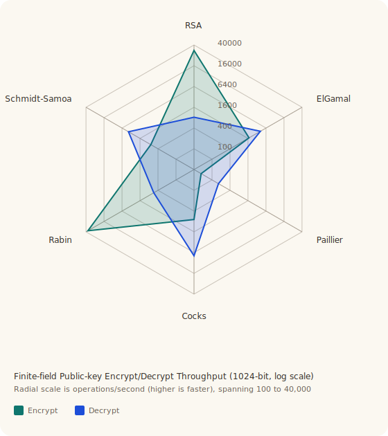

# ASYMMETRIC

This document covers the public-key half of the crate:

- bigint and number-theory support
- public-key primitives
- standards-based and crate-defined wrappers
- key serialization
- public-key latency measurements

## Arithmetic Foundation

The public-key layer is built on:

- `BigUint`
- `BigInt`
- `MontgomeryCtx`
- shared number-theory helpers in `src/public_key/primes.rs`

The in-tree bigint backend stores `u64` limbs in little-endian limb order and
uses Montgomery multiplication for repeated modular arithmetic under odd
moduli. That is the common case for every currently implemented public-key
scheme here.

The design goal is:

- keep the arithmetic visible and auditable
- keep the scheme logic close to the published arithmetic
- keep open the option of swapping the arithmetic backend later if larger-key
  performance demands it

The broader implementation policy matches the rest of the crate:

- pure idiomatic Rust
- no architecture intrinsics
- no C/FFI escape hatches
- minimal dependencies unless they clearly improve interoperability or
  maintainability

That is why the bigint and Montgomery code live in-tree, while XML parsing uses
`quick-xml` and RSA key persistence uses standard DER/PEM structures where that
buys real compatibility.

## Three-Level API

Every implemented public-key scheme follows the same layering:

1. Arithmetic maps such as `encrypt_raw` / `decrypt_raw`, which operate
   directly on the integer domain.
2. Typed wrappers such as `encrypt` / `decrypt`, which accept message bytes and
   return the scheme-native ciphertext representation.
3. Byte wrappers such as `encrypt_bytes` / `decrypt_bytes`, which serialize the
   ciphertext so the scheme can be used as a byte-to-byte API.

Level 3 is the normal entry point for callers who just want to encrypt or
decrypt byte strings. Level 2 exists for schemes such as `Paillier` and
`ElGamal`, where callers may want to work with the structured ciphertext form
directly. Level 1 remains useful for arithmetic tests and direct cross-checks.

## Public-Key Surface

Implemented schemes:

- `Rsa`
- `Dsa`
- `Cocks`
- `ElGamal`
- `Rabin`
- `Paillier`
- `SchmidtSamoa`

Wrapper layers:

- `RsaOaep<H>` for `RSAES-OAEP`
- `RsaPss<H>` for `RSASSA-PSS`

Every implemented scheme now has:

- explicit key construction from mathematical parameters
- built-in key generation
- key serialization
- byte-oriented encrypt/decrypt helpers where encryption is defined
- byte-oriented sign/verify helpers where signatures are defined

`RSA` has the richest standards surface because RFC 8017 defines both
encryption and signature encodings. `DSA` itself is the standard signature
construction, so it does not need an extra padding profile beyond the algorithm
defined in the Digital Signature Standard. The other schemes expose explicit
crate-defined message and serialization wrappers, which is the honest thing to
do because there is no equally universal RFC/NIST padding story for those
primitive forms.

## Serialization

### RSA

`RSA` uses real modern standards:

- public keys:
  - PKCS #1
  - SubjectPublicKeyInfo (SPKI)
- private keys:
  - PKCS #1
  - PKCS #8
- containers:
  - DER
  - PEM

RSA also has an optional XML export/import path purely for orthogonality and
debugging convenience; the canonical interoperable formats remain PKCS / X.509.

### Non-RSA Schemes

`Dsa`, `Cocks`, `ElGamal`, `Rabin`, `Paillier`, and `SchmidtSamoa` use crate-defined
formats:

- binary: DER `SEQUENCE` of positive `INTEGER`s
- text:
  - scheme-specific PEM labels
  - a simple fixed-schema XML form

This deliberately copies the structural simplicity of the RSA key material
without pretending that those schemes have standard OIDs or a real PKCS/X.509
profile.

## Scheme Notes

### RSA

Core arithmetic:

```math
c = m^e \bmod n,\qquad m = c^d \bmod n
```

with:

```math
n = pq,\qquad d \equiv e^{-1} \pmod{\lambda(n)}
```

The practical RSA layer is the most complete in the crate:

- standards-based OAEP encryption
- standards-based PSS signatures
- standard key serialization
- generated or imported keys

### ElGamal

Core arithmetic:

```math
\gamma = g^k \bmod p,\qquad \delta = m \cdot y^k \bmod p,\qquad y = g^a \bmod p
```

The key-generation path uses a prime-order subgroup construction instead of the
older safe-prime search. A safe prime is a modulus of the form `p = 2q + 1`
with `q` prime; it gives simple subgroup structure, but searching for those
moduli is much slower than generating `p = kq + 1` directly. The current
implementation keeps the subgroup structure explicit while avoiding that
pathological key-generation cost.

The public key stores the real ephemeral bound used for encryption, so the
random ephemeral exponent is sampled from the right range instead of from the
full `p - 1` interval. Generated keys use the actual subgroup order `q` for
that bound; explicitly constructed keys fall back to `p - 1` when the subgroup
order is not derivable from the supplied parameters.

### DSA

Reference: FIPS 186-5, Digital Signature Standard (see
`pubs/fips186-5.pdf` and the matching BibTeX entry in
the top-level references).

Core arithmetic:

```math
r = (g^k \bmod p) \bmod q,\qquad
s = k^{-1}(z + xr) \bmod q
```

with verification:

```math
w = s^{-1} \bmod q,\qquad
u_1 = zw \bmod q,\qquad
u_2 = rw \bmod q
```

and acceptance when:

```math
\bigl(g^{u_1} y^{u_2} \bmod p\bigr) \bmod q = r
```

The implementation reuses the same prime-order subgroup generation shape as
`ElGamal`: generated keys store `(p, q, g)` explicitly, and signatures sample
their per-message nonce from `[1, q)`. The digest representative is reduced to
the leftmost `N = \mathrm{bits}(q)` bits before signing and verification,
matching the Digital Signature Standard's treatment of hash outputs that are
wider than the subgroup order.

For generated keys, this crate uses

```math
N = \mathrm{clamp}(\lfloor L / 4 \rfloor, 16, 256)
```

for a modulus size `L = bits(p)`. That is not the exact FIPS menu of `(L, N)`
pairs (`(1024, 160)`, `(2048, 224)`, `(2048, 256)`, `(3072, 256)`), but it
keeps the subgroup order conservative for the representative benchmark sizes
used here while staying within the same finite-field `DSA` structure.

### Cocks

Core arithmetic:

```math
c = m^n \bmod n,\qquad n = pq,\qquad \pi \equiv p^{-1} \pmod{q - 1}
```

with the private recovery map:

```math
m = c^\pi \bmod q
```

This is here because it is historically important: Clifford Cocks proposed it
in 1973, five years before RSA. The scheme is unusual because the public
exponent is the modulus itself. The crate keeps that arithmetic intact and adds
the byte-level serialization layer on top instead of inventing a modernized
padding story that the literature does not standardize.

The private exponent is:

```math
\pi \equiv p^{-1} \pmod{q - 1}
```

and the key observation is the CRT reduction modulo `q`: when
`c = m^{pq} \bmod n`, raising `c` to `\pi` modulo `q` reduces the exponent
from `pq\pi` to `q`, so Fermat brings the result back to `m`.

### Rabin

Core arithmetic:

```math
c = m^2 \bmod n,\qquad n = pq
```

Decryption computes square roots modulo `p` and `q`, then recombines them with
the Chinese remainder theorem to recover the four square roots modulo `n`.
Because plain Rabin is ambiguous, this crate uses a tagged-message variant: the
tag is carried inside the encoded plaintext and is used to select the intended
root deterministically at decrypt time.

The implementation requires Blum primes:

```math
p \equiv q \equiv 3 \pmod 4
```

That condition makes square-root extraction cheap, because a square root of
`c` modulo `p` can be written directly as:

```math
c^{(p + 1)/4} \bmod p
```

and likewise modulo `q`, avoiding a heavier general-purpose square-root
algorithm during decryption.

Rabin is historically important because it is one of the earliest public-key
trapdoor constructions with a tight reduction story: in the plain setting,
inverting the squaring map modulo `n = pq` is essentially equivalent to
factoring `n`. The fixed disambiguation tag used here is what lets the code
identify the intended root among the four CRT roots and turn the raw squaring
trapdoor into a deterministic decryptor. That direct connection is part of why
the scheme still matters pedagogically even though modern deployments usually
prefer RSA.

### Paillier

Core arithmetic:

```math
c = \zeta^m r^n \bmod n^2
```

with decryption:

```math
m = L(c^\lambda \bmod n^2)\,\mu \bmod n,\qquad L(u) = \frac{u - 1}{n}
```

`Paillier` exposes both encryption/decryption and the natural homomorphic
operations:

- ciphertext rerandomization
- ciphertext multiplication modulo `n^2`, corresponding to plaintext addition

That homomorphic surface is a real part of the scheme, not an extra trick, so
it is intentionally part of the usable API.

That is also the reason to use `Paillier` at all: it is the cleanest additive
homomorphic primitive in this crate. If `c_1` encrypts `m_1` and `c_2`
encrypts `m_2`, then:

```math
c_1 c_2 \bmod n^2
```

decrypts to:

```math
m_1 + m_2 \pmod n
```

The wrapper keeps that property visible through
`PaillierPublicKey::add_ciphertexts(...)`, and `rerandomize(...)` preserves the
same plaintext while refreshing the random factor so identical messages do not
stay linkable across ciphertext refreshes.

### Schmidt-Samoa

Reference: Katja Schmidt-Samoa (2005); see `pubs/schmidt-samoa.pdf` and the
matching BibTeX entry in the repository references.

Core arithmetic:

```math
c = m^n \bmod n,\qquad n = p^2 q,\qquad \gamma = pq
```

with the private exponent chosen so that:

```math
d \equiv n^{-1} \pmod{\mathrm{lcm}(p - 1, q - 1)}
```

and decryption:

```math
m = c^d \bmod \gamma
```

The unusual choice `n = p^2 q` is the point of the construction: it gives the
scheme enough structure to choose `d = n^{-1} mod lcm(p-1, q-1)` and recover
the plaintext modulo `\gamma = pq`, rather than modulo the full public
modulus.

Like Cocks, Schmidt-Samoa uses the modulus itself as the public exponent. It
is mathematically neat and implemented faithfully here, but it does not have
the same standards ecosystem or deployment relevance as RSA.

## Byte-Oriented APIs

The public-key wrappers now distinguish clearly between:

- the arithmetic interfaces (`encrypt_raw`, `decrypt_raw`, typed ciphertexts)
- the usable byte-to-byte helpers

Examples:

- `CocksPublicKey::encrypt_bytes` / `CocksPrivateKey::decrypt_bytes`
- `DsaPrivateKey::sign_message_bytes::<H>` / `DsaPublicKey::verify_message_bytes::<H>`
- `ElGamalPublicKey::encrypt_bytes` / `ElGamalPrivateKey::decrypt_bytes`
- `PaillierPublicKey::encrypt_bytes` / `PaillierPrivateKey::decrypt_bytes`
- `RabinPublicKey::encrypt_bytes` / `RabinPrivateKey::decrypt_bytes`
- `SchmidtSamoaPublicKey::encrypt_bytes` / `SchmidtSamoaPrivateKey::decrypt_bytes`

For the schemes whose native ciphertext is a bigint or a pair of bigints, these
helpers serialize the ciphertext into the same crate-defined binary framing used
throughout the non-RSA key formats.

## Public-Key Performance

Public-key timing is measured by:

```text
cargo run --release --bin bench_public_key -- 1024
```

Add `--skip-elgamal` or `--skip-dsa` to trim the slower key-generation paths
when you only want the RSA / Paillier / deterministic-primitives timings.

Representative current 1024-bit latencies on this host:

| Operation | Latency |
|-----------|--------:|
| RSA-1024 keygen | `25.0 ms` |
| RSA-1024 OAEP encrypt | `0.071 ms` |
| RSA-1024 OAEP decrypt | `0.964 ms` |
| RSA-1024 PSS sign | `1.06 ms` |
| RSA-1024 PSS verify | `0.055 ms` |
| ElGamal-1024 keygen | `96.5 ms` |
| ElGamal-1024 encrypt | `0.389 ms` |
| ElGamal-1024 decrypt | `0.197 ms` |
| DSA-1024 keygen | `41.2 ms` |
| DSA-1024 sign | `0.331 ms` |
| DSA-1024 verify | `0.489 ms` |
| Paillier-1024 keygen | `13.7 ms` |
| Paillier-1024 encrypt | `6.47 ms` |
| Paillier-1024 decrypt | `2.26 ms` |
| Paillier-1024 rerandomize | `3.94 ms` |
| Paillier-1024 ciphertext add | `0.072 ms` |
| Cocks-1024 keygen | `9.91 ms` |
| Cocks-1024 encrypt | `0.782 ms` |
| Cocks-1024 decrypt | `0.147 ms` |
| Rabin-1024 keygen | `7.80 ms` |
| Rabin-1024 encrypt | `0.039 ms` |
| Rabin-1024 decrypt | `1.14 ms` |
| Schmidt-Samoa-1024 keygen | `6.05 ms` |
| Schmidt-Samoa-1024 encrypt | `0.671 ms` |
| Schmidt-Samoa-1024 decrypt | `0.228 ms` |

The table above is measured in milliseconds per operation. The radar chart
below uses the reciprocal view — operations per second on a log scale — so the
faster operations sit farther from the center.

The existing chart is the public-key encrypt/decrypt radar. Signature-only
schemes such as `DSA` stay in the table instead of the chart because they do
not have matching encrypt/decrypt operations to plot:



## Practical Guidance

- Use `RSA` when you need standards-backed encryption or signatures today.
- Use `DSA` when you need a standards-backed signature-only finite-field scheme.
- Use the other implemented schemes when you explicitly want those primitives
  and understand their wrapper model.
- Use `CtrDrbgAes256` (or another strong `Csprng`) for all randomized public-key
  operations.
- Keep an eye on 2048-bit and larger timings; the in-tree bigint backend is now
  respectable, but it is still an implementation detail that may be replaced by
  `num-bigint` if larger practical workloads demand it.

## References

The primary public-key papers and standards are stored in `pubs/`. The
top-level [README.md](README.md) remains the canonical BibTeX index.
