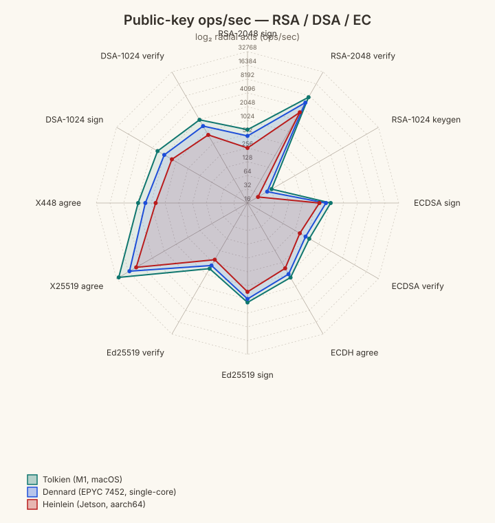
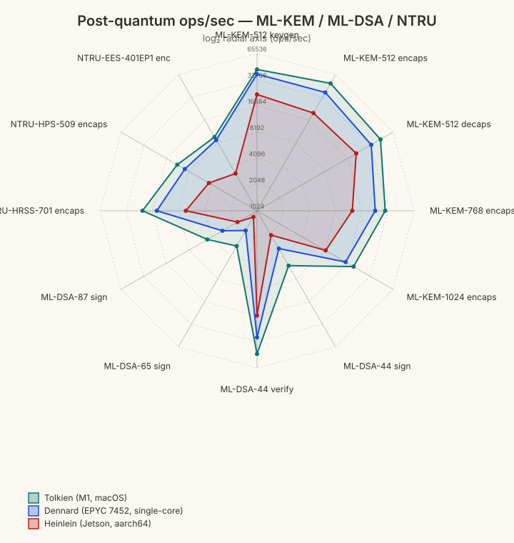

# ASYMMETRIC

## Arithmetic Foundation

The public-key layer is built on:

- `BigUint`
- `BigInt`
- `MontgomeryCtx`
- shared number-theory helpers in `src/public_key/primes.rs`

The in-tree bigint backend stores `u64` limbs in little-endian limb order and
uses Montgomery multiplication for repeated modular arithmetic under odd
moduli. That is the common case for every implemented public-key
scheme here.

Implementation references for multiplication-kernel upgrades are tracked in
`pubs/comba-1990-exponentiation-cryptosystems-on-the-ibm-pc.pdf` and
`pubs/karatsuba-ofman-1963-multiplication-of-multidigit-numbers-on-automata.pdf`.

The design goal is:

- keep the arithmetic visible and auditable
- keep the scheme logic close to the published arithmetic
- keep open the option of swapping the arithmetic backend later if larger-key
  performance demands it

The broader implementation policy matches the rest of the crate:

- pure idiomatic Rust
- no architecture intrinsics
- no C/FFI escape hatches
- minimal dependencies unless they clearly improve interoperability or
  maintainability

That is why the bigint and Montgomery code live in-tree, while XML parsing uses
`quick-xml` and RSA key persistence uses standard DER/PEM structures where that
buys real compatibility.

## Three-Level API

The public-key layer uses a common pattern, but it is not literally identical
across every scheme:

1. Arithmetic maps such as `encrypt_raw`, `encrypt_with_nonce`,
   `encrypt_point_with_nonce`, or `sign_digest_with_nonce`, which keep the underlying math
   explicit.
2. Typed wrappers such as `encrypt`, `decrypt`, `sign_message`, and
   `verify_message`, which work with the scheme's natural ciphertext or
   signature type.
3. Byte wrappers such as `encrypt_bytes`, `decrypt_bytes`,
   `verify_message_bytes`, standard compact wire encodings, and crate-defined
   key blobs.

Not every scheme exposes all three layers, and that is intentional:

- key-agreement schemes return shared-secret material, not ciphertexts
- signature schemes expose signing and verification rather than encryption
- hybrid schemes such as `ECIES` are naturally byte-oriented at the top layer

The consistency target for new APIs is:

- use `*_with_nonce` for deterministic or caller-supplied randomness entry points
- use `to_wire_bytes` / `from_wire_bytes` for compact standard encodings that
  omit curve or algorithm parameters
- use `to_key_blob` / `from_key_blob` for the crate-defined self-describing
  binary formats

Level 1 remains the right place for arithmetic tests and direct cross-checks.
Level 2 is the normal typed interface. Level 3 is the byte-oriented convenience
layer for schemes that naturally have one.

## Naming Conventions

Naming follows explicit intent throughout:

- Serialization distinguishes compact from self-describing formats:
  `to_key_blob` / `from_key_blob` for the crate-defined binary blob,
  `to_wire_bytes` / `from_wire_bytes` for compact standard encodings.
- Deterministic or caller-supplied randomness entry points use
  `sign_digest_with_nonce` rather than generic `sign_with_k`.
- Verification of precomputed digests uses `verify_digest_scalar`.
- DH agreement methods name the returned form explicitly:
  - finite-field DH: `agree_element`
  - short-Weierstrass ECDH: `agree_x_coordinate`
  - Edwards DH: `agree_compressed_point`

Public-key exports are grouped under `cryptography::vt` to make variable-time
behavior explicit at import sites.

## Public-Key Surface

### Integer and finite-field schemes

- `Rsa` — encryption and signatures
- `Dsa` — signatures (FIPS 186-5)
- `Cocks` — encryption (historical; 1973)
- `ElGamal` — encryption
- `Rabin` — encryption
- `Paillier` — additively homomorphic encryption
- `SchmidtSamoa` — encryption
- `Dh` — finite-field Diffie-Hellman key exchange

### Post-quantum lattice schemes

- `MlKem` (`ML-KEM-512/768/1024`) — key encapsulation mechanism
- `MlDsa` (`ML-DSA-44/65/87`) — digital signatures
- Details, usage notes, and PQ-specific benchmarks are documented in
  [POSTQUANTUM.md](POSTQUANTUM.md).

### Short-Weierstrass elliptic-curve schemes

- `Ecdh` — EC Diffie-Hellman key exchange (ANSI X9.63 / SEC 1)
- `Ecdsa` — EC Digital Signature Algorithm (FIPS 186-5)
- `EcElGamal` — EC-ElGamal encryption with additive homomorphism
- `Ecies` — Elliptic Curve Integrated Encryption Scheme (ephemeral ECDH + AES-256-GCM)

### Twisted Edwards schemes

- `EdwardsDh` — Edwards-curve Diffie-Hellman key agreement
- `EdDsa` — generic Edwards-curve Schnorr/EdDSA-style signatures
- `Ed25519` — RFC 8032 Edwards-curve signatures
- `EdwardsElGamal` — Edwards-curve ElGamal encryption

### Montgomery-curve ECDH (RFC 7748)

- `X25519` — Curve25519 ECDH, constant-time Montgomery ladder
- `X448` — Curve448 ECDH, constant-time Montgomery ladder

These two are the only public-key primitives in the crate that aim for
constant-time execution; see the [Curve25519 / Curve448 ECDH section
below](#curve25519--curve448-ecdh-rfc-7748) for details.

The Edwards arithmetic is generic over `TwistedEdwardsCurve`, but the only
built-in named Edwards domain currently shipped in-tree is `ed25519()`.

### Wrapper layers

- `RsaOaep<H>` for `RSAES-OAEP`
- `RsaPss<H>` for `RSASSA-PSS`

Every implemented scheme has:

- explicit key construction from mathematical parameters
- built-in key generation
- key serialization
- byte-oriented encrypt/decrypt helpers where encryption is defined
- byte-oriented sign/verify helpers where signatures are defined

`RSA` has the richest standards surface because RFC 8017 defines both
encryption and signature encodings. `DSA` and `ECDSA` are the standard
signature constructions; they do not need extra padding profiles. The other
schemes expose crate-defined message and serialization wrappers, which is the
honest thing to do because there is no equally universal RFC/NIST padding story
for those primitive forms.

## Serialization

### RSA

`RSA` uses real modern standards:

- public keys:
  - PKCS #1
  - SubjectPublicKeyInfo (SPKI)
- private keys:
  - PKCS #1
  - PKCS #8
- containers:
  - DER
  - PEM

RSA also has an optional XML export/import path purely for orthogonality and
debugging convenience; the canonical interoperable formats remain PKCS / X.509.

### Non-RSA Schemes

Most non-RSA key types use the crate-defined integer-sequence framing for
`to_key_blob()` / `from_key_blob()`. `Ed25519` is the main exception: its
canonical fixed-width forms are exposed as `to_raw_bytes()` /
`from_raw_bytes()` (32-byte compressed public key or 32-byte seed), matching
RFC 8032.

`Dsa`, `Cocks`, `ElGamal`, `Rabin`, `Paillier`, `SchmidtSamoa`, `Dh`,
`Ecdsa`, `EcElGamal`, `Ecies`, `Ecdh`, `EdwardsDh`, `EdwardsElGamal`,
`EdDsa`, and `Ed25519` use crate-defined formats:

- binary: DER `SEQUENCE` of positive `INTEGER`s
- text:
  - scheme-specific PEM labels
  - a simple fixed-schema XML form

This deliberately copies the structural simplicity of the RSA key material
without pretending that those schemes have standard OIDs or a real PKCS/X.509
profile.

The short-Weierstrass EC public key types (`EcdhPublicKey`, `EcdsaPublicKey`,
`EciesPublicKey`, `EcElGamalPublicKey`) encode the curve domain parameters
`(p, a, b, n, h, Gx, Gy)` alongside the public point `(Qx, Qy)`, so
deserialization can reconstruct the `CurveParams` without a separate OID lookup
or parameter database. The Edwards key types do the same job for
`TwistedEdwardsCurve`, carrying the Edwards parameters together with the
compressed public point.

## Scheme Notes

### Integer and finite-field schemes

#### RSA

Reference: PKCS #1 v2.2 (RFC 8017) for OAEP, PSS, and the conventional key
formats used by the interoperable RSA layer in this crate.

Core arithmetic:

```math
c = m^e \bmod n,\qquad m = c^d \bmod n
```

with:

```math
n = pq,\qquad d \equiv e^{-1} \pmod{\lambda(n)}
```

The default key-generation path deliberately chooses the standard sparse public
exponent:

```math
e = 65{,}537
```

That keeps the public operation cheap while preserving the conventional RSA
shape. The matching private exponent `d` is the full modular inverse modulo
`\lambda(n)`, so the raw private operation is much heavier than the raw public
operation.

The practical RSA layer is the most complete in the crate:

- standards-based OAEP encryption
- standards-based PSS signatures
- standard key serialization
- generated or imported keys

So RSA is the "real protocol" path in the integer family: the raw arithmetic is
still present, but the intended surface is padded OAEP/PSS rather than textbook
RSA on caller-supplied integers.

The serialization story is also distinct from the other public-key families.
RSA uses PKCS#1, PKCS#8, and SPKI-compatible encodings, so it interoperates
with external tooling instead of relying on the crate-defined integer-sequence
format used elsewhere.

One practical caveat matters for the benchmark tables: private operations use
CRT recombination ($d_P$, $d_Q$, $q_{\text{Inv}}$), which substantially reduces
`decrypt`/`sign` latency, but the public side remains much faster because
it uses the standard sparse $e = 65{,}537$.

#### ElGamal

Reference: Taher ElGamal, "A Public Key Cryptosystem and a Signature Scheme
Based on Discrete Logarithms" (1985); see `pubs/elgamal-1985.pdf`.

Core arithmetic:

```math
\gamma = g^k \bmod p,\qquad \delta = m \cdot y^k \bmod p,\qquad y = g^a \bmod p
```

The key-generation path uses a prime-order subgroup construction instead of the
older safe-prime search. A safe prime is a modulus of the form $p = 2q + 1$
with `q` prime; it gives simple subgroup structure, but searching for those
moduli is much slower than generating $p = kq + 1$ directly. The
implementation keeps the subgroup structure explicit while avoiding that
pathological key-generation cost.

The public key stores the real ephemeral bound used for encryption, so the
random ephemeral exponent is sampled from the right range instead of from the
full `p - 1` interval. Generated keys use the actual subgroup order `q` for
that bound; explicitly constructed keys fall back to `p - 1` when the subgroup
order is not derivable from the supplied parameters.

The API follows the same layered pattern as the EC and Edwards ElGamal wrappers:

- an explicit-nonce entry point for deterministic fixtures
- a randomized ciphertext layer over the raw group element
- byte helpers that frame the bigint ciphertext pair into the crate-defined
  binary format

So the finite-field ElGamal path is still useful for reproducible KATs and
in-repo byte-oriented tests even though its wire format is crate-specific.

This is still multiplicative ElGamal, not one of the additive homomorphic
variants. The native plaintext group law is multiplication modulo `p`; the byte
helpers are only a serialization layer over that arithmetic.

#### DSA

Reference: FIPS 186-5, Digital Signature Standard (see
`pubs/fips186-5.pdf` and the matching BibTeX entry in the top-level
references).

Core arithmetic:

```math
r = (g^k \bmod p) \bmod q,\qquad
s = k^{-1}(z + xr) \bmod q
```

with verification:

```math
w = s^{-1} \bmod q,\qquad
u_1 = zw \bmod q,\qquad
u_2 = rw \bmod q
```

and acceptance when:

```math
\bigl(g^{u_1} y^{u_2} \bmod p\bigr) \bmod q = r
```

The implementation reuses the same prime-order subgroup generation shape as
`ElGamal`: generated keys store `(p, q, g)` explicitly, and signatures sample
their per-message nonce from `[1, q)`. The digest representative is reduced to
the leftmost $N = \mathrm{bits}(q)$ bits before signing and verification,
matching the Digital Signature Standard's treatment of hash outputs that are
wider than the subgroup order.

For generated keys, the implementation uses:

```math
N = \mathrm{clamp}(\lfloor L / 4 \rfloor, 16, 256)
```

for a modulus size $L = \mathrm{bits}(p)$. That is not the exact FIPS menu of $(L, N)$
pairs (`(1024, 160)`, `(2048, 224)`, `(2048, 256)`, `(3072, 256)`), but it
keeps the subgroup order conservative for the representative benchmark sizes
used here while staying within the same finite-field `DSA` structure.

The public API is intentionally parallel to `ECDSA`:

- digest-level signing and verification for callers who already own the hash
- message-level helpers parameterized by a `Digest`
- an explicit-nonce signing entry point for deterministic tests and fixtures

The important distinction from `EdDsa` and `Ed25519` is that `DSA` signs a
digest representative `z`; it does not hash internally unless the caller uses
the message-level wrapper.

Like `ElGamal` and `Dh`, generated `DSA` keys carry the full subgroup domain
parameters `(p, q, g)` in the key object and in the crate-defined key blob.
That keeps key import self-contained instead of depending on an external
parameter registry.

#### Cocks

Reference: the historical Clifford Cocks construction; the implementation here
keeps the original arithmetic rather than wrapping it in a modern standards
profile.

Core arithmetic:

```math
c = m^n \bmod n,\qquad n = pq,\qquad \pi \equiv p^{-1} \pmod{q - 1}
```

with the private recovery map:

```math
m = c^\pi \bmod q
```

Cocks is historically important: Clifford Cocks proposed it in 1973, five
years before RSA. The scheme is unusual because the public exponent is the
modulus itself. The crate keeps that arithmetic intact and adds the byte-level
serialization layer on top instead of inventing a modernized padding story
that the literature does not standardize.

The private exponent is:

```math
\pi \equiv p^{-1} \pmod{q - 1}
```

and the key observation is the CRT reduction modulo $q$: when
$c = m^{pq} \bmod n$, raising $c$ to $\pi$ modulo $q$ reduces the exponent
from $pq\pi$ to $q$, so Fermat brings the result back to $m$.

From an API perspective, `Cocks` stays intentionally narrow:

- raw arithmetic on the integer plaintext representative
- byte helpers for the crate-defined framed encoding
- no attempt at standards-style padding or interoperable key containers

That restraint is deliberate. This is an educational historical primitive in
the repo, not a recommendation for modern deployment.

#### Rabin

Reference: the classic Rabin trapdoor permutation; the implementation keeps the
core squaring trapdoor visible and adds only the minimal disambiguation layer
needed for practical decryption.

Core arithmetic:

```math
c = m^2 \bmod n,\qquad n = pq
```

Decryption computes square roots modulo `p` and `q`, then recombines them with
the Chinese remainder theorem to recover the four square roots modulo `n`.
Because plain Rabin is ambiguous, the implementation uses a tagged-message
variant: the tag is carried inside the encoded plaintext and is used to select
the intended root deterministically at decrypt time.

The implementation requires Blum primes:

```math
p \equiv q \equiv 3 \pmod 4
```

That condition makes square-root extraction cheap, because a square root of
`c` modulo `p` can be written directly as:

```math
c^{(p + 1)/4} \bmod p
```

and likewise modulo `q`, avoiding a heavier general-purpose square-root
algorithm during decryption.

Rabin is historically important because it is one of the earliest public-key
trapdoor constructions with a tight reduction story: in the plain setting,
inverting the squaring map modulo $n = pq$ is essentially equivalent to
factoring $n$. The fixed disambiguation tag used here is what lets the code
identify the intended root among the four CRT roots and turn the raw squaring
trapdoor into a deterministic decryptor.

The API follows that same philosophy:

- raw encryption over the integer representative
- byte wrappers that carry the tagged plaintext encoding
- key generation that enforces the Blum-prime precondition directly

So the practical wrapper is small, but it is enough to make the square-root
ambiguity explicit and auditable rather than leaving that selection logic to
callers.

#### Paillier

Reference: Pascal Paillier, "Public-Key Cryptosystems Based on Composite
Degree Residuosity Classes" (1999); see `pubs/paillier-1999.pdf`.

Core arithmetic:

```math
c = \zeta^m r^n \bmod n^2
```

with decryption:

```math
m = L(c^\lambda \bmod n^2)\,\mu \bmod n,\qquad L(u) = \frac{u - 1}{n}
```

`Paillier` exposes both encryption/decryption and the natural homomorphic
operations:

- ciphertext rerandomization
- ciphertext multiplication modulo $n^2$, corresponding to plaintext addition

That homomorphic surface is a real part of the scheme, not an extra trick, so
it is intentionally part of the usable API.

If `c_1` encrypts `m_1` and `c_2` encrypts `m_2`, then:

```math
c_1 c_2 \bmod n^2
```

decrypts to:

```math
m_1 + m_2 \pmod n
```

The wrapper keeps that property visible through
`PaillierPublicKey::add_ciphertexts(...)`, and `rerandomize(...)` preserves the
same plaintext while refreshing the random factor so identical messages do not
stay linkable across ciphertext refreshes.

That is the intended way to read the API surface:

- the raw ciphertext type is still just the integer modulo $n^2$
- the byte helpers serialize that integer into a crate-defined framing
- the homomorphic operations are first-class because they are part of the
  reason to choose the scheme at all

Among the integer schemes, this is the clearest "use it for its special
algebra" path rather than for generic public-key encryption.

#### Schmidt-Samoa

Reference: Katja Schmidt-Samoa (2005); see `pubs/schmidt-samoa.pdf` and the
matching BibTeX entry in the repository references.

Core arithmetic:

```math
c = m^n \bmod n,\qquad n = p^2 q,\qquad \gamma = pq
```

with the private exponent chosen so that:

```math
d \equiv n^{-1} \pmod{\mathrm{lcm}(p - 1, q - 1)}
```

and decryption:

```math
m = c^d \bmod \gamma
```

The unusual choice $n = p^2 q$ is the point of the construction: it gives the
scheme enough structure to choose
$d \equiv n^{-1} \pmod{\mathrm{lcm}(p-1, q-1)}$ and recover the plaintext
modulo $\gamma = pq$, rather than modulo the full public
modulus.

Like Cocks, Schmidt-Samoa uses the modulus itself as the public exponent. It
is mathematically neat and implemented faithfully here, but it does not have
the same standards ecosystem or deployment relevance as RSA.

The wrapper therefore stays minimal:

- raw arithmetic for the underlying construction
- byte helpers for crate-local usability
- no attempt to present it as a standards-grade interoperable scheme

This keeps the scheme available for study and comparison without pretending it
belongs in the same operational category as the RSA layer.

#### Diffie-Hellman

Reference: the classic finite-field Diffie-Hellman model, with subgroup
validation handled in the same prime-order subgroup framework used for `DSA`
and `ElGamal`.

Core arithmetic:

```math
y = g^x \bmod p
```

with shared secret:

```math
s = y_{\mathrm{peer}}^x \bmod p
```

`DH` uses a prime-order subgroup construction identical to `DSA` and
`ElGamal`: a Sophie-Germain-style group with explicit subgroup order `q`. The
public key stores `(p, q, g, y)` so the receiver can validate that the peer's
contribution actually lies in the correct subgroup before computing the shared
secret. The validation check is:

```math
1 < y < p \qquad \text{and} \qquad y^q \equiv 1 \pmod{p}
```

`DhPrivateKey::agree` returns `None` when the peer key belongs to a different
group or fails the subgroup check. The raw shared secret is returned as a
`BigUint`; callers are expected to apply their own KDF before using it as
keying material.

That return shape is intentionally lower-level than the EC variants. `DH`
returns the shared group element itself, not a byte-oriented KDF input chosen
by the library. The crate leaves that derivation step to the caller rather than
quietly committing to a KDF policy here.

Like `DSA`, the key blobs carry `(p, q, g)` explicitly. That makes `DhParams`
and the generated keys self-contained and avoids any hidden dependency on an
external parameter database.

### Short-Weierstrass elliptic-curve schemes

#### ECDH

Reference: SEC 1 v2.0, SEC 2 v2.0, and NIST SP 800-56A Rev. 3 (these are
external standards; no local PDFs are checked into `pubs/`).

Shared secret:

```math
S = d \cdot Q_{\mathrm{peer}}, \qquad \text{secret} = S_x
```

`ECDH` follows SEC 1 v2.0: the shared secret is the x-coordinate of the point
product, zero-padded to the curve's coordinate length.
`EcdhPrivateKey::agree` returns `None` when the product is the point at
infinity.

`EcdhPublicKey` and `EcdhPrivateKey` carry the full `CurveParams` so both sides
can use any of the named curves (`p256`, `p384`, `p521`, `secp256k1`, etc.)
without a separate curve-identifier negotiation layer.

On the representation side, the short-Weierstrass public key types now expose
both of the forms the Edwards writeup already calls out:

- compact SEC 1 point encodings via `to_wire_bytes` / `from_wire_bytes`
- the crate-defined self-describing key blob that carries the full curve
  parameters

That split is deliberate. The compact form is what a peer would normally place
on the wire when the curve is already known; the self-describing blob is what
the repo uses when it wants a standalone serialized key without an external OID
or curve registry.

As with `DH`, `EcdhPrivateKey::agree` returns raw shared-secret material, not a
KDF output. The returned bytes are the padded x-coordinate and should be fed
through a KDF before use as a symmetric key.

#### ECIES

Reference: SEC 1 v2.0 and NIST SP 800-56A Rev. 3 for the EC key-establishment
model and point encodings (external standards; no local PDFs are checked into
`pubs/`).

`ECIES` is the standard way to encrypt arbitrary byte strings to a static EC
public key. It combines ephemeral ECDH with a symmetric encryption step, so the
per-message overhead is a single scalar multiplication by the sender and a
single scalar multiplication by the receiver.

**Encryption:**

1. Generate an ephemeral key pair $(k, R)$ where $R = k \cdot G$.
2. Compute the shared point $S = k \cdot Q$.
3. Derive symmetric key and nonce from $S_x$:

```math
\text{key}   = \mathrm{SHA\text{-}256}(\mathtt{0x01} \mathbin\| S_x)
\qquad
\text{nonce} = \mathrm{SHA\text{-}256}(\mathtt{0x02} \mathbin\| S_x)_{[0..12]}
```

4. Encrypt the message with AES-256-GCM, using $R_{\text{bytes}}$ as the
   additional authenticated data (AAD). The AAD binding prevents `R` from being
   silently swapped without triggering a tag failure.

**Wire format:**

```text
R_bytes  (1 + 2·coord_len bytes, SEC 1 uncompressed)
ciphertext  (same length as plaintext)
tag  (16 bytes, GCM authentication tag)
```

**Decryption:**

1. Parse `R_bytes` from the front of the ciphertext.
2. Compute $S = d \cdot R$.
3. Re-derive key and nonce from $S_x$.
4. AES-256-GCM decrypt; return `None` if the tag fails.

The GCM tag simultaneously authenticates the ciphertext and the ephemeral
public key, so no separate MAC layer is needed.

This makes `ECIES` the practical "encrypt arbitrary bytes to an EC key" path
in the short-Weierstrass family. Unlike `EC-ElGamal`, it does not try to expose
the group law of the plaintext space; it uses the EC operation only for key
establishment, then hands the real data path to AES-256-GCM.

The key objects follow the same representation pattern as `ECDH` and `ECDSA`:
they can be serialized either as compact SEC 1 points when the curve is known
out-of-band or as the crate-defined self-describing blob when the curve
parameters need to travel with the key.

#### EC-ElGamal

Reference: the ElGamal paper for the discrete-logarithm construction
(`pubs/elgamal-1985.pdf`); SEC 1 v2.0 and SEC 2 v2.0 for the elliptic-curve
group and point encodings (external standards; no local PDFs are checked into
`pubs/`).

EC-ElGamal has three distinct plaintext layers stacked on the same key pair.

**Point layer** — encrypt an arbitrary curve point `M`:

```math
(C_1, C_2) = (k \cdot G,\; M + k \cdot Q)
```

Decryption recovers `M` via:

```math
M = C_2 - d \cdot C_1
```

**Byte layer** — encrypt arbitrary bytes via Koblitz embedding: the message
bytes are padded and placed into an x-coordinate candidate; `decode_point` is
called with the `0x02` compressed prefix until a valid curve point is found.
The last byte of the padded x-coordinate is an iteration counter
$j \in [0, 255]$; the first byte of the decoded x-coordinate is stripped
during recovery, leaving the original message bytes. This approach works on
every named curve in this crate because all have $p \equiv 3 \pmod{4}$, which means the
compressed-point square root exists and the iteration succeeds quickly in
practice.

The message capacity per ciphertext is `coord_len - 1` bytes.

**Integer layer** — additively homomorphic encryption of a small integer `m`:

```math
\text{encrypt\_int}(m) = \text{encrypt\_point}(m \cdot G)
```

Homomorphic addition of two ciphertexts:

```math
(C_1 + C_1',\; C_2 + C_2') \;\xrightarrow{\text{decrypt}}\; (m_1 + m_2) \cdot G
```

The integer $m$ is recovered from $m \cdot G$ via baby-step giant-step
(BSGS) with $O\left(\sqrt{m_{\max}}\right)$ precomputation.

So `EC-ElGamal` is intentionally the arithmetic-rich counterpart to `ECIES`:

- point encryption for direct group-element work
- byte encryption for bounded arbitrary payloads via Koblitz embedding
- additive homomorphism on the integer layer

The practical constraint is capacity. Because the byte layer embeds the payload
into an x-coordinate candidate, each ciphertext can carry only `coord_len - 1`
bytes. That is why `ECIES` exists alongside it: `ECIES` is the general-purpose
byte-encryption path, while `EC-ElGamal` is the path that preserves the group
structure when that algebra matters.

As with the other short-Weierstrass public key types, the public key can be
serialized either as a compact SEC 1 point or as the crate-defined blob that
embeds the full curve parameters.

#### ECDSA

Reference: FIPS 186-5 (`pubs/fips186-5.pdf`); SEC 1 v2.0 and SEC 2 v2.0 for the
underlying elliptic-curve point encodings (external standards; no local PDFs are
checked into `pubs/`).

Core arithmetic (FIPS 186-5):

```math
r = (k \cdot G)_x \bmod n,\qquad
s = k^{-1}(z + rd) \bmod n
```

with verification:

```math
w = s^{-1} \bmod n,\qquad
u_1 = zw \bmod n,\qquad
u_2 = rw \bmod n
```

and acceptance when:

```math
(u_1 \cdot G + u_2 \cdot Q)_x \bmod n = r
```

The per-message nonce `k` is generated from the crate's `Csprng`. The digest
representative `z` is the leftmost `bits(n)` bits of the hash output, matching
the FIPS 186-5 truncation rule for hash functions wider than the group order.

The key types (`EcdsaPublicKey`, `EcdsaPrivateKey`) carry the full `CurveParams`
and work with any named curve.

The API mirrors the `DSA` surface closely:

- digest-level signing and verification
- message-level helpers parameterized by a `Digest`
- an explicit-nonce signing path for deterministic tests and vectors

So the short-Weierstrass and finite-field signature families line up on the
same caller model even though their underlying groups differ.

Like the other short-Weierstrass key types, `EcdsaPublicKey` supports both
compact SEC 1 point encodings and the self-describing crate-defined key blob.
That matches the Edwards writeup's clearer separation between "wire point" and
"standalone serialized key" forms.

The important practical caveat is the same one called out for the Edwards side:
the arithmetic is generic and variable-time. The implementation is correct and
well tested, but it is not a hardened constant-time signing engine.

### Twisted Edwards schemes

#### Edwards DH

Reference: NIST SP 800-56A Rev. 3 for the DH model (external standard) with
Edwards-group arithmetic and compressed-point conventions matching FIPS 186-5
(`pubs/fips186-5.pdf`).

`EdwardsDh` provides the same core operation on a twisted Edwards curve:

```math
S = d \cdot Q_{\mathrm{peer}}
```

The difference is the wire representation. `EdwardsDhPrivateKey::agree`
returns the compressed Edwards encoding of the shared point, so the output is a
canonical 32-byte value on the built-in Ed25519 curve instead of a bare
x-coordinate. That matches the way the Edwards side of the crate already treats
points as compressed byte strings.

The implementation is generic over `TwistedEdwardsCurve`, but the in-tree named
fixture and benchmark path today is the built-in `ed25519()` domain.

#### Edwards ElGamal

Reference: the ElGamal paper for the encryption law (`pubs/elgamal-1985.pdf`)
with Edwards-curve group and encoding choices matching the Ed25519 / EdDSA
side of the crate (`pubs/fips186-5.pdf`; SEC 2 v2.0 is an external standard
with no local PDF).

`EdwardsElGamal` mirrors the same ElGamal construction on a twisted Edwards
group:

```math
(C_1, C_2) = (k \cdot B,\; M + k \cdot Q)
```

with decryption:

```math
M = C_2 - d \cdot C_1
```

As with the short-Weierstrass variant, the module exposes:

- point encryption
- integer encryption via `m \cdot B`
- homomorphic ciphertext addition

The main distinction is representation: the Edwards wrapper uses compressed
Edwards point encodings throughout, which makes ciphertext serialization more
compact and keeps it aligned with the `Ed25519` / `EdDsa` side of the crate.

As with `EdwardsDh`, the machinery accepts any caller-supplied
`TwistedEdwardsCurve`, but the in-tree deterministic fixtures and benchmarks
currently target the built-in `ed25519()` domain.

#### Ed25519

Reference: FIPS 186-5 for EdDSA (`pubs/fips186-5.pdf`); SEC 2 v2.0 for the
underlying elliptic-curve parameter conventions is an external standard with
no local PDF.

`Ed25519` is the fixed-curve RFC 8032 signature construction built on the
Edwards arithmetic in this crate. Unlike the generic `EdDsa` layer, it follows
the standard seed-hash-and-clamp flow exactly:

```math
h = \mathrm{SHA\text{-}512}(\text{seed})
```

Clamp the lower 32 bytes of `h` to derive the secret scalar `a`, and use the
upper 32 bytes as the deterministic nonce prefix. Signing then computes:

```math
r = H(\text{prefix} \parallel M) \bmod n
```

```math
R = r \cdot B,\qquad
k = H(\mathrm{enc}(R) \parallel \mathrm{enc}(A) \parallel M) \bmod n
```

```math
S = r + ka \bmod n
```

The standard 64-byte signature is:

```math
\sigma = \mathrm{enc}(R) \parallel \mathrm{enc}_{\mathrm{LE}}(S)
```

Verification checks:

```math
S \cdot B = R + kA
```

The API exposes the real RFC shapes directly:

- private key: 32-byte seed
- public key: 32-byte compressed point
- signature: 64-byte `R || S`

So this is the standards-conformant Edwards path, while `EdDsa` remains the
more explicit curve-generic signature layer for callers who want direct scalar
control.

The test coverage for this module now includes the full RFC 8032 section 7.1
Ed25519 vector set, along with strict parsing and rejection checks for malformed
public keys and signatures.

### Curve25519 / Curve448 ECDH (RFC 7748)

Reference: RFC 7748, "Elliptic Curves for Security", §5 (X25519, X448) and
§5.2 (test vectors).

`X25519` and `X448` are the Montgomery-form ECDH primitives:

```math
\text{X25519}: \quad y^2 = x^3 + 486662\,x^2 + x \quad \text{over } \mathrm{GF}(2^{255} - 19)
```

```math
\text{X448}: \quad y^2 = x^3 + 156326\,x^2 + x \quad \text{over } \mathrm{GF}(2^{448} - 2^{224} - 1)
```

The crate ships these as a constant-time exception within `cryptography::vt`.
Unlike the rest of the public-key surface (which uses the variable-time
in-tree `BigUint`), X25519 and X448 use dedicated fixed-radix limb
representations:

- X25519: 5 limbs of radix $2^{51}$, two-pass carry reduction with the
  `2^{255} \equiv 19 \pmod p` wrap-around factor.
- X448: 8 limbs of radix $2^{56}$, two-pass carry reduction with the
  `2^{448} \equiv 2^{224} + 1 \pmod p` wrap-around factor.

In both cases the Montgomery ladder uses mask-driven `cswap` so the access
pattern depends on the loop index, not on the secret scalar bit. Field
multiply, square, conditional subtract, and final canonicalisation are
written without data-dependent branches or table lookups.

Scalar clamping follows RFC 7748 §5 exactly:

- X25519: `k[0] &= 248; k[31] &= 127; k[31] |= 64`
- X448: `k[0] &= 252; k[55] |= 128`

The encoded `u`-coordinate inputs likewise follow the spec:

- X25519: high bit of `u[31]` is masked off before decoding
- X448: full 448-bit `u`-coordinate, no masking

The shared-secret API (`agree`) returns `Option<[u8; N]>` and rejects the
all-zero output, as RFC 7748 §6 recommends for low-order point detection.
The raw `scalar_mult` function exposes the unconditional RFC 7748 mapping
(useful for KAT validation and protocol layers that prefer to do their own
low-order check).

Example (X25519):

```rust
use cryptography::CtrDrbgAes256;
use cryptography::vt::X25519;

let mut rng = CtrDrbgAes256::new(&[0x33u8; 48]);
let (pub_a, priv_a) = X25519::generate(&mut rng);
let (pub_b, priv_b) = X25519::generate(&mut rng);
let shared_a = priv_a.agree(&pub_b).expect("non-low-order");
let shared_b = priv_b.agree(&pub_a).expect("non-low-order");
assert_eq!(shared_a, shared_b);
```

Test coverage in `cargo test`:

- RFC 7748 §5.2 single-step vectors for X25519 and X448
- iterated tests at 1 and 1000 iterations (run by default)
- iterated tests at 1 000 000 iterations (gated `#[ignore]`; run with
  `cargo test --release -- --ignored rfc7748_section5_2_iter_1m`)
- ECDH symmetry round-trip (`A * (B * G) == B * (A * G)`)
- low-order rejection by `agree`
- field-arithmetic sanity (`x * x^{-1} = 1`)

## Byte-Oriented APIs

The public-key wrappers now distinguish clearly between:

- the arithmetic interfaces (`encrypt_raw`, `decrypt_raw`, typed ciphertexts)
- the usable byte-to-byte helpers

Examples:

- `CocksPublicKey::encrypt_bytes` / `CocksPrivateKey::decrypt_bytes`
- `DsaPrivateKey::sign_message_bytes::<H>` / `DsaPublicKey::verify_message_bytes::<H>`
- `EcElGamalPublicKey::encrypt` / `EcElGamalPrivateKey::decrypt` (Koblitz byte layer)
- `EciesPublicKey::encrypt` / `EciesPrivateKey::decrypt` (arbitrary-length bytes)
- `EcdsaPrivateKey::sign_message::<H>` / `EcdsaPublicKey::verify_message::<H>`
- `ElGamalPublicKey::encrypt_bytes` / `ElGamalPrivateKey::decrypt_bytes`
- `PaillierPublicKey::encrypt_bytes` / `PaillierPrivateKey::decrypt_bytes`
- `RabinPublicKey::encrypt_bytes` / `RabinPrivateKey::decrypt_bytes`
- `SchmidtSamoaPublicKey::encrypt_bytes` / `SchmidtSamoaPrivateKey::decrypt_bytes`

For the schemes whose native ciphertext is a bigint or a pair of bigints, these
helpers serialize the ciphertext into the same crate-defined binary framing used
throughout the non-RSA key formats.

## Public-Key Performance

Public-key timing is measured with [pilot-bench](https://github.com/darrelllong/pilot-bench)
driving `pilot_pk` through:

```text
bash scripts/bench_all_pk_full.sh
```

The publication-facing numbers below come from Pilot and report milliseconds
per operation, **90%** confidence-interval half-width, and rounds required to
hit the stop rule. The 2026-06-11 sweep was run with
`PILOT_PRESET=normal --confidence-level 0.90` (10% CI half-width target,
autocorrelation tolerance 0.2, ≥ 50 rounds minimum sample size) against
crate v0.7.0 (commit `1aae1df`). The tables below are parallel runs on:

- Apple M1 (`tolkien`, macOS)
- AMD EPYC 7452 (`dennard.soe.ucsc.edu`, single-core slice)
- NVIDIA Jetson (`heinlein.local`, aarch64)

For RSA specifically, the timing gap between `encrypt`/`verify` and
`decrypt`/`sign` is still expected: the private side now uses CRT, but the
public side continues to benefit from the sparse default exponent
$e = 65{,}537$.

### Finite-field public key (1024-bit)

| Operation | Tolkien (M1) ms/op | Tolkien (M1) ±CI (90%) | Tolkien (M1) Runs | Dennard (EPYC 7452) ms/op | Dennard (EPYC 7452) ±CI (90%) | Dennard (EPYC 7452) Runs | Heinlein (Jetson) ms/op | Heinlein (Jetson) ±CI (90%) | Heinlein (Jetson) Runs |
|---|---|---|---|---|---|---|---|---|---|
| rsa_keygen_1024 | 15.41 | ±0.03393 | 80 | 19.9 | ±0.08555 | 50 | 33.88 | ±0.2258 | 50 |
| rsa_encrypt_1024 | 0.04398 | ±9.542e-05 | 80 | 0.05575 | ±0.0004415 | 50 | 0.0877 | ±0.0001326 | 80 |
| rsa_decrypt_1024 | 0.2865 | ±0.00137 | 50 | 0.357 | ±0.001737 | 50 | 0.6029 | ±0.001441 | 54 |
| rsa_sign_1024 | 0.2888 | ±0.007068 | 50 | 0.3555 | ±0.001777 | 50 | 0.6034 | ±0.004429 | 110 |
| rsa_verify_1024 | 0.04397 | ±7.682e-05 | 269 | 0.05612 | ±0.0002976 | 50 | 0.08828 | ±0.0001398 | 50 |
| elgamal_keygen_1024 | 76.61 | ±3.39 | 88 | 100.8 | ±0.2103 | 50 | 184.3 | ±0.3292 | 50 |
| elgamal_encrypt_1024 | 0.3607 | ±0.003482 | 140 | 0.5063 | ±0.00188 | 50 | 0.9358 | ±0.002231 | 50 |
| elgamal_decrypt_1024 | 0.182 | ±0.001355 | 50 | 0.2556 | ±0.002695 | 230 | 0.4684 | ±0.001309 | 50 |
| dsa_keygen_1024 | 52.59 | ±0.3502 | 866 | 72.68 | ±0.3598 | 50 | 132.6 | ±0.1653 | 50 |
| dsa_sign_1024 | 0.3326 | ±0.002045 | 170 | 0.4909 | ±0.002043 | 50 | 0.7664 | ±0.001069 | 140 |
| dsa_verify_1024 | 0.4941 | ±0.005997 | 50 | 0.7115 | ±0.00235 | 50 | 1.19 | ±0.001214 | 50 |
| paillier_keygen_1024 | 16.93 | ±0.4835 | 50 | 21.81 | ±0.04013 | 110 | 37.31 | ±0.09352 | 50 |
| paillier_encrypt_1024 | 7.536 | ±0.1951 | 51 | 11.13 | ±0.01972 | 110 | 16.83 | ±0.02888 | 50 |
| paillier_decrypt_1024 | 2.526 | ±0.0772 | 110 | 3.451 | ±0.02079 | 50 | 6.756 | ±0.009089 | 50 |
| paillier_rerandomize_1024 | 4.605 | ±0.02404 | 110 | 6.839 | ±0.02438 | 204 | 10.88 | ±0.007022 | 50 |
| paillier_add_1024 | 0.01299 | ±9.32e-05 | 50 | 0.01774 | ±9.194e-05 | 50 | 0.03443 | ±0.0001233 | 50 |
| cocks_keygen_1024 | 13.05 | ±0.2719 | 50 | 16.37 | ±0.03085 | 50 | 28.01 | ±0.1047 | 50 |
| cocks_encrypt_1024 | 0.8327 | ±0.003166 | 290 | 1.182 | ±0.002528 | 53 | 2.109 | ±0.002534 | 51 |
| cocks_decrypt_1024 | 0.1513 | ±0.005984 | 50 | 0.182 | ±0.001162 | 140 | 0.3033 | ±0.0005293 | 53 |
| rabin_keygen_1024 | 18.76 | ±0.5245 | 50 | 23.82 | ±0.0671 | 50 | 40.07 | ±0.06199 | 54 |
| rabin_encrypt_1024 | 0.03731 | ±7.549e-05 | 170 | 0.04895 | ±0.0001563 | 50 | 0.07194 | ±0.000127 | 80 |
| rabin_decrypt_1024 | 0.2819 | ±0.001538 | 50 | 0.3511 | ±0.00125 | 82 | 0.5997 | ±0.001361 | 50 |
| schmidt_samoa_keygen_1024 | 6.729 | ±0.03425 | 110 | 7.975 | ±0.02795 | 50 | 12.99 | ±0.114 | 50 |
| schmidt_samoa_encrypt_1024 | 0.8208 | ±0.008108 | 50 | 1.145 | ±0.00264 | 50 | 2.067 | ±0.003364 | 55 |
| schmidt_samoa_decrypt_1024 | 0.2255 | ±0.00557 | 53 | 0.3262 | ±0.002045 | 110 | 0.5726 | ±0.001435 | 115 |

### RSA (2048-bit)

| Operation | Tolkien (M1) ms/op | Tolkien (M1) ±CI (90%) | Tolkien (M1) Runs | Dennard (EPYC 7452) ms/op | Dennard (EPYC 7452) ±CI (90%) | Dennard (EPYC 7452) Runs | Heinlein (Jetson) ms/op | Heinlein (Jetson) ±CI (90%) | Heinlein (Jetson) Runs |
|---|---|---|---|---|---|---|---|---|---|
| rsa_keygen_2048 | 254 | ±3.275 | 87 | 348.9 | ±0.5882 | 50 | 634.8 | ±0.5187 | 50 |
| rsa_encrypt_2048 | 0.134 | ±0.001233 | 50 | 0.1833 | ±0.000933 | 140 | 0.3194 | ±0.0002187 | 50 |
| rsa_decrypt_2048 | 1.547 | ±0.009052 | 140 | 2.148 | ±0.01567 | 80 | 3.921 | ±0.006826 | 50 |
| rsa_sign_2048 | 1.555 | ±0.0141 | 52 | 2.13 | ±0.008307 | 53 | 3.902 | ±0.004521 | 50 |
| rsa_verify_2048 | 0.133 | ±0.0004885 | 50 | 0.1822 | ±0.0006971 | 110 | 0.32 | ±0.0005687 | 85 |

### ECDSA / ECDH (P-256)

| Operation | Tolkien (M1) ms/op | Tolkien (M1) ±CI (90%) | Tolkien (M1) Runs | Dennard (EPYC 7452) ms/op | Dennard (EPYC 7452) ±CI (90%) | Dennard (EPYC 7452) Runs | Heinlein (Jetson) ms/op | Heinlein (Jetson) ±CI (90%) | Heinlein (Jetson) Runs |
|---|---|---|---|---|---|---|---|---|---|
| ecdsa_keygen | 0.8017 | ±0.001301 | 80 | 0.9807 | ±0.002465 | 80 | 1.385 | ±0.005446 | 50 |
| ecdsa_sign | 0.9418 | ±0.001527 | 51 | 1.198 | ±0.003238 | 50 | 1.666 | ±0.005926 | 170 |
| ecdsa_verify | 1.716 | ±0.06061 | 50 | 2.124 | ±0.004571 | 80 | 2.97 | ±0.005449 | 50 |
| ecdh_keygen | 0.8052 | ±0.003843 | 110 | 0.9817 | ±0.002259 | 52 | 1.385 | ±0.002536 | 140 |
| ecdh_agree | 0.8182 | ±0.004945 | 110 | 0.9956 | ±0.001941 | 55 | 1.404 | ±0.003535 | 50 |
| ecdh_serialize | 0.0001066 | ±2.348e-06 | 59 | 7.902e-05 | ±6.027e-06 | 50 | 0.0001935 | ±1.602e-05 | 5453 |

### ECIES / EC ElGamal (P-256)

| Operation | Tolkien (M1) ms/op | Tolkien (M1) ±CI (90%) | Tolkien (M1) Runs | Dennard (EPYC 7452) ms/op | Dennard (EPYC 7452) ±CI (90%) | Dennard (EPYC 7452) Runs | Heinlein (Jetson) ms/op | Heinlein (Jetson) ±CI (90%) | Heinlein (Jetson) Runs |
|---|---|---|---|---|---|---|---|---|---|
| ecies_keygen | 0.807 | ±0.005474 | 58 | 0.9798 | ±0.002046 | 80 | 1.383 | ±0.003585 | 50 |
| ecies_encrypt | 1.584 | ±0.0106 | 170 | 1.935 | ±0.00449 | 110 | 2.726 | ±0.003517 | 80 |
| ecies_decrypt | 0.7902 | ±0.002498 | 110 | 0.9651 | ±0.002338 | 50 | 1.374 | ±0.004269 | 50 |
| ec_elgamal_keygen | 0.8048 | ±0.006631 | 200 | 0.9807 | ±0.002022 | 83 | 1.383 | ±0.002287 | 80 |
| ec_elgamal_encrypt | 1.697 | ±0.008288 | 50 | 2.063 | ±0.006264 | 50 | 2.914 | ±0.004956 | 50 |
| ec_elgamal_decrypt | 0.8196 | ±0.001801 | 110 | 0.9947 | ±0.002085 | 52 | 1.42 | ±0.006162 | 50 |

### Ed25519 / Edwards DH / Edwards ElGamal

| Operation | Tolkien (M1) ms/op | Tolkien (M1) ±CI (90%) | Tolkien (M1) Runs | Dennard (EPYC 7452) ms/op | Dennard (EPYC 7452) ±CI (90%) | Dennard (EPYC 7452) Runs | Heinlein (Jetson) ms/op | Heinlein (Jetson) ±CI (90%) | Heinlein (Jetson) Runs |
|---|---|---|---|---|---|---|---|---|---|
| ed25519_keygen | 0.7972 | ±0.004956 | 50 | 0.9806 | ±0.002555 | 50 | 1.395 | ±0.002799 | 80 |
| ed25519_sign | 0.4173 | ±0.001633 | 200 | 0.4994 | ±0.001496 | 50 | 0.7129 | ±0.002602 | 50 |
| ed25519_verify | 1.373 | ±0.008821 | 320 | 1.649 | ±0.003059 | 50 | 2.309 | ±0.002986 | 50 |
| edwards_dh_keygen | 0.7866 | ±0.006858 | 80 | 0.9571 | ±0.001996 | 80 | 1.362 | ±0.002001 | 50 |
| edwards_dh_agree | 0.4047 | ±0.004463 | 141 | 0.4804 | ±0.000968 | 80 | 0.6853 | ±0.003272 | 50 |
| edwards_dh_serialize | 7.674e-05 | ±2.068e-06 | 50 | 5.63e-05 | ±3.284e-06 | 63 | 8.606e-05 | ±6.059e-06 | 26406 |
| edwards_elgamal_keygen | 0.7889 | ±0.008716 | 140 | 0.9579 | ±0.004229 | 50 | 1.362 | ±0.002431 | 80 |
| edwards_elgamal_encrypt | 0.9602 | ±0.01177 | 140 | 1.039 | ±0.002078 | 50 | 1.484 | ±0.004715 | 53 |
| edwards_elgamal_decrypt | 0.823 | ±0.01175 | 50 | 0.8866 | ±0.002209 | 50 | 1.288 | ±0.004933 | 80 |

### X25519 / X448 (RFC 7748)

| Operation | Tolkien (M1) ms/op | Tolkien (M1) ±CI (90%) | Tolkien (M1) Runs | Dennard (EPYC 7452) ms/op | Dennard (EPYC 7452) ±CI (90%) | Dennard (EPYC 7452) Runs | Heinlein (Jetson) ms/op | Heinlein (Jetson) ±CI (90%) | Heinlein (Jetson) Runs |
|---|---|---|---|---|---|---|---|---|---|
| x25519_keygen | 0.03604 | ±0.001126 | 140 | 0.06611 | ±0.000127 | 50 | 0.09801 | ±0.0008463 | 114 |
| x25519_agree | 0.03474 | ±0.0008076 | 410 | 0.06476 | ±0.0001436 | 140 | 0.09582 | ±0.0009545 | 50 |
| x25519_scalar_mult_base | 0.0385 | ±0.001985 | 834 | 0.06482 | ±0.0001382 | 80 | 0.09562 | ±0.001203 | 50 |
| x25519_scalar_mult | 0.03465 | ±0.0003797 | 1105 | 0.06478 | ±0.000105 | 80 | 0.09611 | ±0.001044 | 50 |
| x448_keygen | 0.2543 | ±0.007838 | 1940 | 0.3636 | ±0.0004389 | 59 | 0.6115 | ±0.004997 | 82 |
| x448_agree | 0.2522 | ±0.0108 | 200 | 0.3624 | ±0.002268 | 50 | 0.6086 | ±0.003368 | 119 |
| x448_scalar_mult_base | 0.2439 | ±0.006389 | 200 | 0.362 | ±0.0006251 | 50 | 0.6096 | ±0.00517 | 50 |
| x448_scalar_mult | 0.2426 | ±0.005196 | 88 | 0.3624 | ±0.0006805 | 89 | 0.61 | ±0.004709 | 50 |

### ML-KEM (FIPS 203)

| Operation | Tolkien (M1) ms/op | Tolkien (M1) ±CI (90%) | Tolkien (M1) Runs | Dennard (EPYC 7452) ms/op | Dennard (EPYC 7452) ±CI (90%) | Dennard (EPYC 7452) Runs | Heinlein (Jetson) ms/op | Heinlein (Jetson) ±CI (90%) | Heinlein (Jetson) Runs |
|---|---|---|---|---|---|---|---|---|---|
| mlkem512_keygen | 0.0232 | ±0.001917 | 204 | 0.02625 | ±0.001427 | 50 | 0.04501 | ±0.003714 | 7431 |
| mlkem512_encaps | 0.01991 | ±0.0001865 | 950 | 0.02631 | ±0.0001846 | 50 | 0.04929 | ±0.00411 | 6860 |
| mlkem512_decaps | 0.02236 | ±0.001313 | 54 | 0.02972 | ±0.0002383 | 146 | 0.04696 | ±0.003221 | 24920 |
| mlkem768_keygen | 0.03501 | ±0.0005 | 58 | 0.04287 | ±0.0003215 | 86 | 0.08338 | ±0.006911 | 7229 |
| mlkem768_encaps | 0.03278 | ±0.0004288 | 680 | 0.04264 | ±0.0002736 | 269 | 0.07825 | ±0.006517 | 7319 |
| mlkem768_decaps | 0.03685 | ±0.002925 | 50 | 0.04735 | ±0.0005021 | 140 | 0.08243 | ±0.006862 | 7735 |
| mlkem1024_keygen | 0.05438 | ±0.0005956 | 200 | 0.06723 | ±0.000553 | 110 | 0.1221 | ±0.008786 | 5360 |
| mlkem1024_encaps | 0.05093 | ±0.0007107 | 50 | 0.06504 | ±0.0004139 | 321 | 0.1197 | ±0.009962 | 9802 |
| mlkem1024_decaps | 0.05839 | ±0.004873 | 58 | 0.06992 | ±0.0005599 | 50 | 0.1257 | ±0.01048 | 8098 |

### ML-DSA (FIPS 204)

| Operation | Tolkien (M1) ms/op | Tolkien (M1) ±CI (90%) | Tolkien (M1) Runs | Dennard (EPYC 7452) ms/op | Dennard (EPYC 7452) ±CI (90%) | Dennard (EPYC 7452) Runs | Heinlein (Jetson) ms/op | Heinlein (Jetson) ±CI (90%) | Heinlein (Jetson) Runs |
|---|---|---|---|---|---|---|---|---|---|
| mldsa44_keygen | 0.08007 | ±0.001451 | 50 | 0.09249 | ±0.0006203 | 51 | 0.1715 | ±0.01414 | 1193 |
| mldsa44_sign | 0.1827 | ±0.0001737 | 380 | 0.3076 | ±0.001025 | 50 | 0.4643 | ±0.02961 | 80 |
| mldsa44_verify | 0.0221 | ±0.001814 | 1104 | 0.0343 | ±0.0003976 | 290 | 0.061 | ±0.005034 | 10492 |
| mldsa65_keygen | 0.173 | ±0.01275 | 110 | 0.166 | ±0.0008622 | 110 | 0.2937 | ±0.02395 | 146 |
| mldsa65_sign | 0.3319 | ±0.001631 | 110 | 0.5347 | ±0.001611 | 50 | 0.808 | ±0.05505 | 50 |
| mldsa65_verify | 0.03086 | ±0.001426 | 51 | 0.04925 | ±0.0005806 | 560 | 0.07582 | ±0.006299 | 26724 |
| mldsa87_keygen | 0.2403 | ±0.004249 | 682 | 0.2427 | ±0.001139 | 50 | 0.4167 | ±0.03345 | 80 |
| mldsa87_sign | 0.214 | ±0.002686 | 110 | 0.3393 | ±0.00139 | 50 | 0.5381 | ±0.04437 | 87 |
| mldsa87_verify | 0.04784 | ±0.0003287 | 50 | 0.07421 | ±0.0007654 | 50 | 0.1129 | ±0.007483 | 27380 |

### NTRU (NIST PQC round 3)

| Operation | Tolkien (M1) ms/op | Tolkien (M1) ±CI (90%) | Tolkien (M1) Runs | Dennard (EPYC 7452) ms/op | Dennard (EPYC 7452) ±CI (90%) | Dennard (EPYC 7452) Runs | Heinlein (Jetson) ms/op | Heinlein (Jetson) ±CI (90%) | Heinlein (Jetson) Runs |
|---|---|---|---|---|---|---|---|---|---|
| ntruhps509_keygen | 1.01 | ±0.03758 | 140 | 1.286 | ±0.01893 | 50 | 2.629 | ±0.02699 | 50 |
| ntruhps509_encaps | 0.08523 | ±0.003333 | 140 | 0.1075 | ±0.0007177 | 320 | 0.2244 | ±0.01842 | 59 |
| ntruhps509_decaps | 0.156 | ±0.01196 | 51 | 0.1556 | ±0.0008866 | 80 | 0.3515 | ±0.02485 | 50 |
| ntruhps677_keygen | 1.127 | ±0.01347 | 140 | 1.814 | ±0.01149 | 50 | 3.55 | ±0.0335 | 53 |
| ntruhps677_encaps | 0.1025 | ±0.003655 | 261 | 0.1354 | ±0.0007594 | 50 | 0.2614 | ±0.01821 | 80 |
| ntruhps677_decaps | 0.1153 | ±0.002463 | 89 | 0.1634 | ±0.0009009 | 50 | 0.3451 | ±0.02874 | 86 |
| ntruhps821_keygen | 2.478 | ±0.09013 | 50 | 2.854 | ±0.01281 | 56 | 5.789 | ±0.0654 | 50 |
| ntruhps821_encaps | 0.1631 | ±0.0006477 | 110 | 0.1955 | ±0.001349 | 52 | 0.3838 | ±0.02866 | 50 |
| ntruhps821_decaps | 0.2954 | ±0.001446 | 50 | 0.2797 | ±0.001448 | 50 | 0.5933 | ±0.04776 | 50 |
| ntruhrss701_keygen | 1.189 | ±0.03097 | 50 | 1.853 | ±0.04173 | 50 | 3.965 | ±0.03582 | 83 |
| ntruhrss701_encaps | 0.04695 | ±0.0008647 | 80 | 0.06868 | ±0.001824 | 50 | 0.1479 | ±0.009721 | 80 |
| ntruhrss701_decaps | 0.1205 | ±0.002692 | 110 | 0.17 | ±0.0009 | 57 | 0.3736 | ±0.01242 | 51 |

### NTRUEncrypt (IEEE Std 1363.1-2008)

| Operation | Tolkien (M1) ms/op | Tolkien (M1) ±CI (90%) | Tolkien (M1) Runs | Dennard (EPYC 7452) ms/op | Dennard (EPYC 7452) ±CI (90%) | Dennard (EPYC 7452) Runs | Heinlein (Jetson) ms/op | Heinlein (Jetson) ±CI (90%) | Heinlein (Jetson) Runs |
|---|---|---|---|---|---|---|---|---|---|
| ntruees401ep1_keygen | 0.7687 | ±0.004918 | 320 | 0.9514 | ±0.003785 | 50 | 1.904 | ±0.1461 | 53 |
| ntruees401ep1_encrypt | 0.1026 | ±0.001495 | 440 | 0.1126 | ±0.001077 | 59 | 0.3134 | ±0.02604 | 269 |
| ntruees401ep1_decrypt | 0.1517 | ±0.00516 | 80 | 0.1591 | ±0.001426 | 56 | 0.482 | ±0.03502 | 50 |
| ntruees443ep1_keygen | 0.7239 | ±0.005272 | 140 | 0.8582 | ±0.002657 | 80 | 1.705 | ±0.0488 | 50 |
| ntruees443ep1_encrypt | 0.042 | ±0.0008745 | 50 | 0.04503 | ±0.0004905 | 50 | 0.09918 | ±0.006305 | 32600 |
| ntruees443ep1_decrypt | 0.04088 | ±0.0005983 | 50 | 0.05064 | ±0.0005347 | 80 | 0.138 | ±0.01099 | 2780 |
| ntruees449ep1_keygen | 0.912 | ±0.008829 | 110 | 1.13 | ±0.00451 | 200 | 2.36 | ±0.1519 | 50 |
| ntruees449ep1_encrypt | 0.1418 | ±0.001775 | 50 | 0.1588 | ±0.004572 | 50 | 0.4487 | ±0.03735 | 50 |
| ntruees449ep1_decrypt | 0.1787 | ±0.005028 | 110 | 0.2007 | ±0.001411 | 115 | 0.6183 | ±0.04357 | 88 |
| ntruees541ep1_keygen | 0.709 | ±0.00574 | 416 | 1.05 | ±0.007288 | 55 | 2.016 | ±0.1354 | 50 |
| ntruees541ep1_encrypt | 0.07116 | ±0.0007611 | 147 | 0.07689 | ±0.0008017 | 52 | 0.2005 | ±0.01662 | 7258 |
| ntruees541ep1_decrypt | 0.08589 | ±0.0009115 | 110 | 0.1045 | ±0.0009226 | 50 | 0.3106 | ±0.02562 | 172 |
| ntruees677ep1_keygen | 1.152 | ±0.00981 | 51 | 1.608 | ±0.007254 | 50 | 3.182 | ±0.07315 | 80 |
| ntruees677ep1_encrypt | 0.1742 | ±0.001373 | 50 | 0.2054 | ±0.004011 | 80 | 0.5881 | ±0.03067 | 50 |
| ntruees677ep1_decrypt | 0.2705 | ±0.002719 | 560 | 0.3249 | ±0.001881 | 50 | 1.047 | ±0.08623 | 50 |
| ntruees1087ep1_keygen | 1.8 | ±0.01178 | 170 | 2.661 | ±0.00826 | 54 | 4.91 | ±0.08407 | 81 |
| ntruees1087ep1_encrypt | 0.1417 | ±0.008618 | 140 | 0.1562 | ±0.001484 | 140 | 0.4486 | ±0.03395 | 50 |
| ntruees1087ep1_decrypt | 0.1856 | ±0.002178 | 50 | 0.2263 | ±0.001669 | 114 | 0.7641 | ±0.05133 | 50 |
| ntruees1087ep2_keygen | 1.9 | ±0.04097 | 50 | 2.788 | ±0.01074 | 140 | 5.184 | ±0.2943 | 50 |
| ntruees1087ep2_encrypt | 0.2161 | ±0.003448 | 80 | 0.2495 | ±0.002322 | 50 | 0.7646 | ±0.02878 | 112 |
| ntruees1087ep2_decrypt | 0.3254 | ±0.001143 | 320 | 0.3941 | ±0.002412 | 80 | 1.388 | ±0.1139 | 55 |
| ntruees1171ep1_keygen | 2.046 | ±0.007211 | 53 | 2.991 | ±0.01417 | 50 | 6.048 | ±0.4397 | 50 |
| ntruees1171ep1_encrypt | 0.2074 | ±0.001882 | 53 | 0.2388 | ±0.002055 | 80 | 0.7332 | ±0.05119 | 50 |
| ntruees1171ep1_decrypt | 0.3097 | ±0.0002768 | 170 | 0.3776 | ±0.002803 | 85 | 1.308 | ±0.09014 | 50 |
| ntruees1499ep1_keygen | 3.604 | ±0.2413 | 50 | 4.35 | ±0.01322 | 85 | 9.092 | ±0.1852 | 110 |
| ntruees1499ep1_encrypt | 0.2132 | ±0.001169 | 89 | 0.2484 | ±0.002014 | 170 | 0.7275 | ±0.05999 | 59 |
| ntruees1499ep1_decrypt | 0.3157 | ±0.02472 | 50 | 0.3927 | ±0.01566 | 50 | 1.24 | ±0.03257 | 50 |

Cross-platform summary Kiviat diagrams (radar charts; log-radial ops/sec
axis, outer ring = faster):





The integer-arithmetic chart above plots ops/sec for the mixed integer-based
public-key schemes (RSA, DSA, ECDSA, ECDH, Ed25519, X25519, X448).
Signature-only and rerandomization/addition rows stay in the tables because
they do not have matching encrypt/decrypt axes.

The post-quantum chart blends representative axes from ML-KEM, ML-DSA, and
NTRU. Per-scheme breakdown radars live in
[POSTQUANTUM.md](POSTQUANTUM.md).

## Practical Guidance

- Use `RSA` when you need standards-backed encryption or signatures.
- Use `DSA`, `ECDSA`, or `Ed25519` when you need a standards-backed digital signature.
- Use `ECIES` when you need public-key encryption over an elliptic curve.
- Use `ECDH` or `DH` when you need key agreement without a full encryption layer.
- Use the other implemented schemes when you explicitly want those primitives
  and understand their wrapper model.
- Use `CtrDrbgAes256` (or another strong `Csprng`) for all randomized public-key
  operations.
- Keep an eye on 2048-bit and larger timings; the in-tree bigint backend is
  respectable but not a tuned industrial multiprecision library. The crate-wide
  policy is to keep the arithmetic kernels pure Rust and in-tree.

## References

The primary public-key papers and standards are stored in `pubs/`. The BibTeX
index is in [README.md](README.md).
