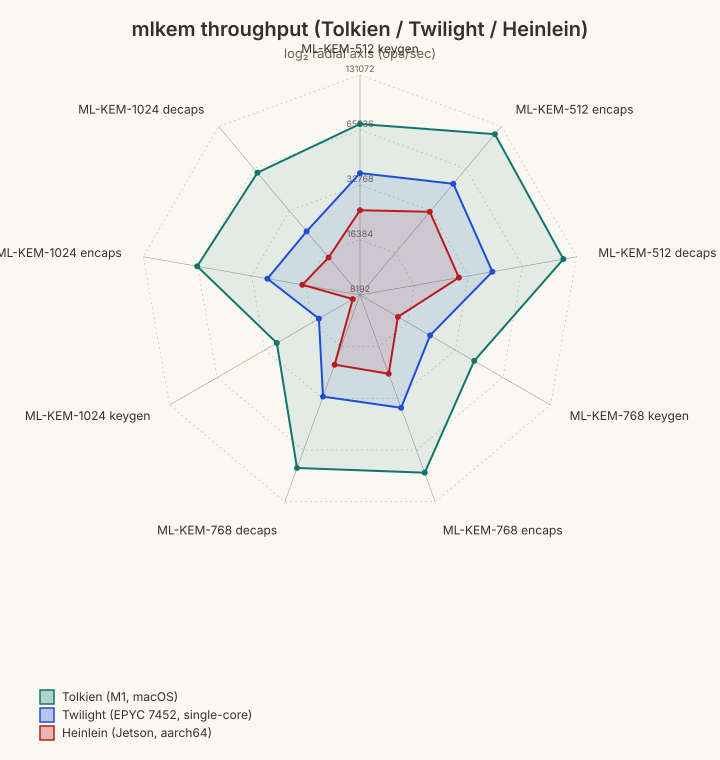
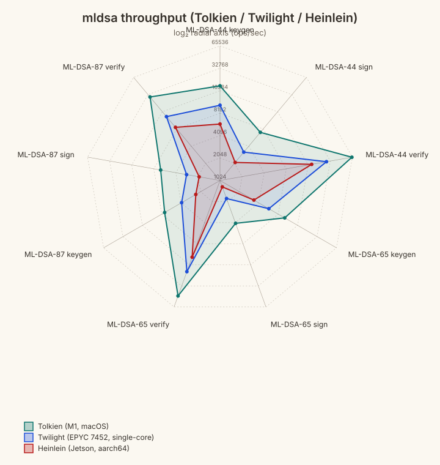
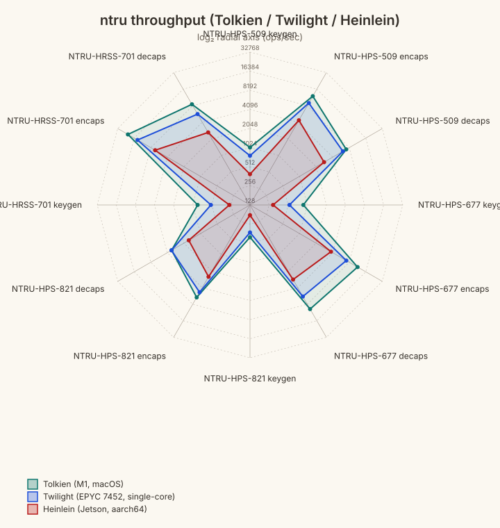

# POSTQUANTUM

## Scope

This document covers the post-quantum lattice implementations in this repo:

- `MlKem` (`ML-KEM-512/768/1024`) for key encapsulation (FIPS 203)
- `MlDsa` (`ML-DSA-44/65/87`) for signatures (FIPS 204)
- `NtruHps509`, `NtruHps677`, `NtruHps821`, `NtruHrss701` for NIST PQC round-3
  NTRU CCA-secure key encapsulation
- `NtruEes401Ep1` … `NtruEes1499Ep1` (nine parameter sets) for the IEEE
  Std 1363.1-2008 NTRUEncrypt SVES-3 public-key encryption scheme

The implementations are pure Rust in-tree arithmetic (no C/FFI in production
paths). Differential testing is supported through committed KAT files
(NTRU round-3) and through reference C trees that test scaffolding fetches on
demand into a gitignored `third_party/` directory (ML-KEM, ML-DSA); the
reference trees themselves are not vendored in the repository.

## Foundations

This code sits on the worst-case/average-case lattice line of work started by:

- Miklos Ajtai (1996): worst-case to average-case reductions for lattice problems
- Ajtai and Dwork (1997): one of the first lattice-based public-key cryptosystems

That lineage is the conceptual backbone for modern constructions such as
module-LWE and module-SIS used by ML-KEM and ML-DSA.

## What Is Implemented

### ML-KEM (FIPS 203)

- Parameter sets: 512, 768, 1024
- APIs:
  - `MlKem::keygen`, `MlKem::keygen_from_seed`
  - `MlKem::encaps`, `MlKem::encaps_with_randomness`
  - `MlKem::decaps`
- Types:
  - `MlKemPublicKey`, `MlKemPrivateKey`, `MlKemCiphertext`, `MlKemSharedSecret`

### ML-DSA (FIPS 204)

- Parameter sets: 44, 65, 87
- APIs:
  - `MlDsa::keygen`, `MlDsa::keygen_from_seed`
  - `MlDsa::sign`, `MlDsa::sign_with_randomness`,
    `MlDsa::sign_with_randomness_and_context`
  - `MlDsa::verify`, `MlDsa::verify_with_context`
- Types:
  - `MlDsaPublicKey`, `MlDsaPrivateKey`, `MlDsaSignature`

### NTRU (NIST PQC round 3, 2020-10-16 submission)

- Parameter sets:
  - `NtruHps509` (`ntruhps2048509`, NIST level 1)
  - `NtruHps677` (`ntruhps2048677`, NIST level 3)
  - `NtruHps821` (`ntruhps4096821`, NIST level 5)
  - `NtruHrss701` (`ntruhrss701`, NIST level 1)
- APIs (each `Ntru*` namespace):
  - `keygen`, `encaps`, `decaps`
- Types (per parameter set):
  - `Ntru*PublicKey`, `Ntru*PrivateKey`, `Ntru*Ciphertext`, `Ntru*SharedSecret`

NTRU here is a faithful Rust port of the official round-3 reference C
distributed in `NIST-PQ-Submission-NTRU-20201016.tar.gz` from `ntru.org`. Each
parameter set is validated byte-for-byte against the `count = 0` entry of the
shipped `PQCkemKAT_*.rsp` known-answer file. The four KAT files are checked
into the repository at `kat/ntruhps509.rsp`, `kat/ntruhps677.rsp`,
`kat/ntruhps821.rsp`, and `kat/ntruhrss701.rsp`, and each NTRU module
references its KAT through a relative path (e.g. `kat_path = "../../kat/ntruhps509.rsp"`).

### NTRUEncrypt (IEEE Std 1363.1-2008)

- Parameter sets (each a distinct type; OIDs follow IEEE 1363.1 Annex A):
  - `NtruEes401Ep1`  (112-bit security)
  - `NtruEes443Ep1`  (128-bit security)
  - `NtruEes449Ep1`  (128-bit security)
  - `NtruEes541Ep1`  (112-bit security)
  - `NtruEes677Ep1`  (192-bit security)
  - `NtruEes1087Ep1` (192-bit security)
  - `NtruEes1087Ep2` (256-bit security)
  - `NtruEes1171Ep1` (256-bit security)
  - `NtruEes1499Ep1` (256-bit security)
- APIs (each `NtruEes*Ep*` type):
  - `keygen(rng) -> (pk, sk)`
  - `encrypt(pk, msg, rng) -> Result<ct, NtruEesError>`
    (`MessageTooLong` if `msg.len() > MAX_MESSAGE_BYTES`)
  - `decrypt(sk, ct) -> Result<Vec<u8>, NtruEesError>`
  - associated constant `MAX_MESSAGE_BYTES` per parameter set
- Types (per parameter set):
  - `NtruEes*Ep*PublicKey`, `NtruEes*Ep*PrivateKey`, `NtruEes*Ep*Ciphertext`
- Shared error: `NtruEesError`

NTRUEncrypt is a public-key *encryption* scheme (not a KEM); the ciphertext
carries the message bytes directly under SVES-3 padding rather than a derived
shared secret. Validation is via byte-format regression digests: one
`regression_digest = "..."` constant is pinned in each per-set file
(`src/public_key/ntru_ees<param>ep<rev>.rs`) and the matching
`byte_format_regression_digest` test is generated by the `define_ees_set!`
macro in `src/public_key/ntru_ees_core.rs`. Each digest covers `(pk, sk, ct)`
under a fixed DRBG seed and a fixed plaintext, and the constants themselves
are produced by the `ees_regression_gen` binary; any silent change in
wire-format byte order or padding fails the test.

## Why This Design

- **In-tree arithmetic**: keeps the math auditable and lets us tune performance
  directly in Rust.
- **Strict wire parsing**: malformed encodings should fail at parse time rather
  than leak into later call sites.
- **Deterministic test entry points**: ML-KEM and ML-DSA expose explicit
  seed/randomness APIs (`keygen_from_seed`, `encaps_with_randomness`,
  `sign_with_randomness[_and_context]`) for KATs and differential tests. NTRU
  and NTRUEncrypt route their KAT and regression tests through a deterministic
  CSPRNG (`CtrDrbgAes256` seeded with the KAT's seed bytes) passed into the
  standard `keygen` / `encaps` / `encrypt` entry points.
- **`cryptography::vt` namespace**: side-channel characteristics are explicit at
  import sites.

## Serialization

The PQ schemes use a `to_wire_bytes` / `from_wire_bytes` pair on every public
key, private key, and ciphertext type — these emit the compact byte layouts
specified by FIPS 203 / FIPS 204 (for ML-KEM and ML-DSA) and by the round-3
NTRU and IEEE 1363.1 specifications (for NTRU and NTRUEncrypt). ML-KEM and
ML-DSA additionally expose a self-describing `to_key_blob` / `from_key_blob`
pair on key types, which prepends the parameter set so the parser can recover
it without an out-of-band hint. NTRU and NTRUEncrypt do not have a key-blob
form: their parameter set is bound to the type itself (e.g. `NtruHps509PrivateKey`)
and the wire layout is the only encoding.

## Theory of Operation

### ML-KEM (FIPS 203)

At a high level:

1. `keygen` samples a public matrix seed and secret short vectors, then derives
   `(pk, sk)` where `sk` includes auxiliary values required for CCA security.
2. `encaps` samples ephemeral randomness, derives `(ciphertext, shared_secret)`
   against a recipient `pk`.
3. `decaps` recomputes and validates the encapsulation relation and returns the
   same `shared_secret` as the encapsulator (or an implicit-rejection value for
   malformed ciphertexts).

Operationally, treat the returned shared secret as KDF input, not as a final
application key.

### ML-DSA (FIPS 204)

At a high level:

1. `keygen` expands a deterministic seed into matrix and short vectors, then
   packs `(pk, sk)` with the hash/transcript material required by verification.
2. `sign` computes a Fiat-Shamir challenge over message transcript data and
   uses rejection sampling until the signature bounds are satisfied.
3. `verify` reconstructs the challenge transcript from `(pk, message,
   signature)` and accepts iff it matches.

The optional context is part of the signed transcript and must match exactly at
verification time.

### NTRU (NIST PQC round 3)

At a high level (HPS variants):

1. `keygen` samples a trinary $f$ (IID-uniform) and a trinary $g$ of fixed
   weight $q/8 - 2$, computes $f^{-1} \bmod 3$ and $(g\cdot f)^{-1} \bmod q$,
   and derives the public polynomial
   $h = g \cdot (g\cdot f)^{-1} \cdot g \bmod (q, x^N - 1)$. The private
   key bundles $f$, $f^{-1} \bmod 3$, $h^{-1} \in S_q$, and a 32-byte PRF
   key for implicit rejection.
2. `encaps` samples $(r, m)$ (IID for $r$, fixed-weight for $m$), derives
   the shared secret
   `K = SHA3-256(pack3(r) ‖ pack3(m))`, lifts
   $r$ into $\mathbb{Z}_q$, and emits the ciphertext
   $c = r\cdot h + \text{lift}(m)$ packed sum-zero.
3. `decaps` recovers $(r, m)$ via the trapdoor $(f, f^{-1}_3, h^{-1})$,
   re-validates $r$ (and for HPS, the weight constraint on $m$), and returns
   `K = SHA3-256(pack3(r) ‖ pack3(m))` on
   success or `K = SHA3-256(prf ‖ c)` on any
   consistency failure (implicit rejection).

HRSS-701 differs from the HPS sets in four places: $f$ and $g$ come from the
`sample_iid_plus` distribution (each polynomial $v$ is sampled IID-uniform
mod 3 and then post-conditioned by conditionally negating its even-indexed
coefficients to enforce $\langle x\cdot v, v \rangle \geq 0$), the keygen
uses $g \gets 3\cdot(x - 1)\cdot g$ instead of $g \gets 3\cdot g$, the
message-space check on $m$ is dropped, and the encryption `lift` is the
more elaborate $a / (x - 1) \bmod (3, \Phi_n)$ operator rather than the
bare $\mathbb{Z}_3 \to \mathbb{Z}_q$ map.

### NTRUEncrypt (IEEE Std 1363.1-2008)

At a high level (SVES-3, the only padding mode this crate implements):

1. `keygen` samples a small trinary $t$ (the trapdoor — dense for eight
   parameter sets, product form for `EES443EP1`) and an independent
   fixed-weight trinary $g$ (with $dg$ coefficients equal to $+1$ and $dg$
   equal to $-1$, the IEEE 1363.1 fixed-$\pm 1$-count convention also used
   for $df$). It materializes $f = 1 + 3\cdot t$ over
   $R_q = \mathbb{Z}_q[x] / (x^N - 1)$, retries until $f$ is invertible
   there, and publishes the public polynomial
   $h = 3\cdot g\cdot f^{-1} \bmod q$. The private key stores only $t$,
   packed alongside the public bytes; the dense $f$ is never written down
   outside keygen, and decrypt instead exploits the identity
   $f\cdot e = e + 3\cdot t\cdot e \bmod q$ via direct multiplication by
   $t$ (see step 3). The sampled $g$ is discarded — it is not needed by
   `decrypt`.
2. `encrypt(pk, msg)` rejects inputs longer than `MAX_MESSAGE_BYTES` up
   front with `NtruEesError::MessageTooLong`. It then samples `db_bytes`
   random bytes $b$ and assembles the SVES-3 plaintext buffer
   `m = b ‖ m_len ‖ msg ‖ zero-padding`,
   lifts it into trinary $R/(3, x^N - 1)$ via `sves_from_bytes` to obtain
   $\text{mtrin}$. An IGF transcript over
   `(oid ‖ msg ‖ b ‖ htrunc)`
   then samples the *blinding* polynomial $r$ (trinary for the eight
   dense-trapdoor sets, product form for `EES443EP1`, mirroring the
   trapdoor structure), and the encrypter computes
   $\text{bigr} = r\cdot h \bmod q$ followed by a trinary mask
   $\text{mask} = \text{MGF}(\text{bigr})$. Let
   $\text{mplus} = (\text{mtrin} + \text{mask}) \bmod 3$. The encrypter
   checks $\text{mplus}$ against the SVES-3 representative-weight
   constraint; on failure it resamples $b$ and retries. On success the
   ciphertext is
   `e = bigr + signed_lift(mplus) mod q`, where
   `signed_lift` maps trits {0, 1, 2} to {0, 1, q - 1}.
3. `decrypt(sk, e)` uses the trapdoor $t$ to recover the trinary plaintext
   directly: it computes $e + 3\cdot t\cdot e \bmod q$, reduces mod 3 to
   get the trinary $\text{ci} = \text{mplus}$, and recovers
   `bigr = e - signed_lift(ci) mod q` so the same
   `MGF` call yields the same $\text{mask}$. Subtracting $\text{mask}$ and
   converting back via `sves_to_bytes` yields the candidate $m$ buffer.
   The decrypter then runs the SVES-3 *re-encryption check*, which
   accumulates a single retcode flag from three independent conditions:
   (i) $\text{ci}$ satisfies the SVES-3 representative-weight constraint
   (the same check `encrypt` ran before emitting the ciphertext); (ii) the
   recovered zero-padding is all zero; (iii) replaying the IGF transcript
   `(oid ‖ recovered_msg ‖ recovered_b ‖ htrunc)`
   to regenerate $r'$ reproduces the original $\text{bigr}$ (i.e.
   $r'\cdot h \bmod q = \text{bigr}$). Any failure returns
   `NtruEesError::InvalidCiphertext`; `MessageTooLong` is produced only by
   `encrypt`.

Of the nine parameter sets in this crate, only `EES443EP1` carries the
trapdoor $t$ in product form $t = t_1 \cdot t_2 + t_3$. Each $t_i$ is a
sparse trinary polynomial with $df_i$ coefficients equal to $+1$ and $df_i$
equal to $-1$ — following IEEE 1363.1's $df$ convention, so total nonzeros
per factor are $2\cdot df_i$ — with $df_1, df_2, df_3 = 9, 8, 5$. The other
eight sets carry a single dense trinary $t$ with $df$ coefficients equal
to $+1$ and $df$ equal to $-1$. The product form makes each $t\cdot e$
multiplication during `decrypt` reduce to three sparse convolutions plus
an addition, which is why the `EES443EP1` row is disproportionately fast
in the benchmark table below.

## Working Examples

Each example below is exercised end-to-end by
`tests/manual_examples.rs::manual_postquantum_examples` (same call shape and
roundtrip assertions; the test uses its own DRBG seed rather than the per-block
seed in each snippet).

### ML-KEM end-to-end + wire/blob roundtrips

```rust
use cryptography::vt::{
    MlKem, MlKemParameterSet, MlKemPrivateKey, MlKemPublicKey,
};
use cryptography::CtrDrbgAes256;

let mut rng = CtrDrbgAes256::new(&[0x11u8; 48]);

let (pk, sk) = MlKem::keygen(MlKemParameterSet::MlKem768, &mut rng).expect("keygen");
let (ct, ss_sender) = MlKem::encaps(&pk, &mut rng).expect("encaps");
let ss_receiver = MlKem::decaps(&sk, &ct).expect("decaps");
assert_eq!(ss_sender.to_wire_bytes(), ss_receiver.to_wire_bytes());

let pk_wire = pk.to_wire_bytes();
let pk_round = MlKemPublicKey::from_wire_bytes(MlKemParameterSet::MlKem768, &pk_wire).expect("pk");
assert_eq!(pk_round, pk);

let sk_blob = sk.to_key_blob();
let sk_round = MlKemPrivateKey::from_key_blob(&sk_blob).expect("sk");
assert_eq!(sk_round, sk);
```

### ML-DSA sign/verify + context + signature wire roundtrip

```rust
use cryptography::vt::{
    MlDsa, MlDsaParameterSet, MlDsaSignature,
};
use cryptography::CtrDrbgAes256;

let mut rng = CtrDrbgAes256::new(&[0x22u8; 48]);
let (pk, sk) = MlDsa::keygen(MlDsaParameterSet::MlDsa65, &mut rng).expect("keygen");

let sig = MlDsa::sign(&sk, b"release manifest", &mut rng).expect("sign");
assert!(MlDsa::verify(&pk, b"release manifest", &sig));
assert!(!MlDsa::verify(&pk, b"tampered", &sig));

let ctx = b"bundle:v1";
let rnd = [0x5Cu8; 32];
let sig_ctx = MlDsa::sign_with_randomness_and_context(&sk, b"payload", &rnd, ctx).expect("sign");
assert!(MlDsa::verify_with_context(&pk, b"payload", &sig_ctx, ctx));
assert!(!MlDsa::verify_with_context(&pk, b"payload", &sig_ctx, b"bundle:v2"));

let sig_wire = sig.to_wire_bytes();
let sig_round =
    MlDsaSignature::from_wire_bytes(MlDsaParameterSet::MlDsa65, &sig_wire).expect("sig");
assert!(MlDsa::verify(&pk, b"release manifest", &sig_round));
```

### NTRU end-to-end + wire roundtrip

```rust
use cryptography::vt::{NtruHps509, NtruHps509Ciphertext, NtruHps509PublicKey};
use cryptography::CtrDrbgAes256;

let mut rng = CtrDrbgAes256::new(&[11u8; 48]);

let (pk, sk) = NtruHps509::keygen(&mut rng);
let (ct, ss_sender) = NtruHps509::encaps(&pk, &mut rng);
let ss_receiver = NtruHps509::decaps(&sk, &ct);
assert_eq!(ss_sender.as_bytes(), ss_receiver.as_bytes());

let pk_round = NtruHps509PublicKey::from_wire_bytes(&pk.to_wire_bytes()).expect("pk");
let ct_round = NtruHps509Ciphertext::from_wire_bytes(&ct.to_wire_bytes()).expect("ct");
assert_eq!(pk_round, pk);
assert_eq!(ct_round, ct);
```

The other parameter sets (`NtruHps677`, `NtruHps821`, `NtruHrss701`) expose
identical `keygen`, `encaps`, `decaps` shapes; only the byte sizes change.

### NTRUEncrypt encrypt/decrypt + wire roundtrip

```rust
use cryptography::vt::{
    NtruEes443Ep1, NtruEes443Ep1Ciphertext, NtruEes443Ep1PublicKey, NtruEesError,
};
use cryptography::CtrDrbgAes256;

let mut rng = CtrDrbgAes256::new(&[0x44u8; 48]);

let (pk, sk) = NtruEes443Ep1::keygen(&mut rng);

let msg: &[u8] = b"public-key encryption, not a KEM";
assert!(msg.len() <= NtruEes443Ep1::MAX_MESSAGE_BYTES);

let ct = NtruEes443Ep1::encrypt(&pk, msg, &mut rng).expect("encrypt");
let pt = NtruEes443Ep1::decrypt(&sk, &ct).expect("decrypt");
assert_eq!(pt, msg);

let pk_round =
    NtruEes443Ep1PublicKey::from_wire_bytes(&pk.to_wire_bytes()).expect("pk");
let ct_round =
    NtruEes443Ep1Ciphertext::from_wire_bytes(&ct.to_wire_bytes()).expect("ct");
assert_eq!(pk_round, pk);
assert_eq!(ct_round, ct);

let too_big = vec![0u8; NtruEes443Ep1::MAX_MESSAGE_BYTES + 1];
let err = NtruEes443Ep1::encrypt(&pk, &too_big, &mut rng).unwrap_err();
assert_eq!(err, NtruEesError::MessageTooLong);
```

The other eight parameter sets (`NtruEes401Ep1`, `NtruEes449Ep1`,
`NtruEes541Ep1`, `NtruEes677Ep1`, `NtruEes1087Ep1`, `NtruEes1087Ep2`,
`NtruEes1171Ep1`, `NtruEes1499Ep1`) expose identical `keygen` / `encrypt` /
`decrypt` shapes; the byte sizes and `MAX_MESSAGE_BYTES` differ per set.

## Parameter Comparison

### ML-KEM: Security vs. Cost

**Key and ciphertext sizes (bytes; FIPS 203 §7)**

| Parameter | Security | Public Key | Private Key | Ciphertext | Shared Secret |
|---|:---:|---:|---:|---:|---:|
| ML-KEM-512  | NIST 1 |   800 | 1 632 |   768 | 32 |
| ML-KEM-768  | NIST 3 | 1 184 | 2 400 | 1 088 | 32 |
| ML-KEM-1024 | NIST 5 | 1 568 | 3 168 | 1 568 | 32 |

**Throughput across parameter sets and platforms** — each axis is an operation
(keygen / encaps / decaps) for one parameter set; outer ring = faster. ±90%
CI half-widths are in the benchmark tables below.



### ML-DSA: Security vs. Cost

**Key and signature sizes (bytes; FIPS 204 §7)**

| Parameter | Security | Public Key | Private Key | Signature |
|---|:---:|---:|---:|---:|
| ML-DSA-44 | NIST 2 | 1 312 | 2 528 | 2 420 |
| ML-DSA-65 | NIST 3 | 1 952 | 4 000 | 3 309 |
| ML-DSA-87 | NIST 5 | 2 592 | 4 864 | 4 627 |

**Throughput across parameter sets and platforms** — each axis is an operation
(keygen / sign / verify) for one parameter set; outer ring = faster. ±90%
CI half-widths are in the benchmark tables below.



### NTRU: Security vs. Cost

**Key and ciphertext sizes (bytes; round-3 submission Table 2.1)**

| Parameter | Security | Public Key | Private Key | Ciphertext | Shared Secret |
|---|:---:|---:|---:|---:|---:|
| NtruHps509  | NIST 1 |   699 |   935 |   699 | 32 |
| NtruHrss701 | NIST 1 | 1 138 | 1 450 | 1 138 | 32 |
| NtruHps677  | NIST 3 |   930 | 1 234 |   930 | 32 |
| NtruHps821  | NIST 5 | 1 230 | 1 590 | 1 230 | 32 |

**Throughput across parameter sets and platforms** — each axis is an operation
(keygen / encaps / decaps) for one parameter set; outer ring = faster. ±90%
CI half-widths are in the benchmark tables below.



### NTRUEncrypt (IEEE 1363.1): Security vs. Cost

**Key, ciphertext, and message sizes (bytes; IEEE Std 1363.1-2008, Annex A
parameter tables)**

| Parameter | Security | Public Key | Private Key | Ciphertext | Max Message |
|---|:---:|---:|---:|---:|---:|
| EES401EP1  | 112-bit |   552 |   653 |   552 |  60 |
| EES443EP1  | 128-bit |   610 |   660 |   610 |  65 |
| EES449EP1  | 128-bit |   618 |   731 |   618 |  67 |
| EES541EP1  | 112-bit |   744 |   880 |   744 |  86 |
| EES677EP1  | 192-bit |   931 | 1 101 |   931 | 101 |
| EES1087EP1 | 192-bit | 1 495 | 1 767 | 1 495 | 178 |
| EES1087EP2 | 256-bit | 1 495 | 1 767 | 1 495 | 170 |
| EES1171EP1 | 256-bit | 1 611 | 1 904 | 1 611 | 186 |
| EES1499EP1 | 256-bit | 2 062 | 2 437 | 2 062 | 247 |

The private-key length is `PRIVATE_KEY_BYTES + PUBLIC_KEY_BYTES`: this
crate stores the trinary trapdoor $t$ (compactly packed) alongside the
public key, because SVES-3 decryption needs the public key for the
re-encryption check that distinguishes legitimate ciphertexts from
forgeries. Max-message bytes are computed as
$\lfloor N/2 \rfloor \cdot 3 / 8 - 1 - db/8$ (the integer-arithmetic form
used directly in `ntru_ees_core.rs::EesParams::max_message_bytes`). This
form coincides with the closed form $\lfloor 3N/16 \rfloor - 1 - db/8$ for
seven of the nine parameter sets in this crate; for `EES443EP1` ($N = 443$)
and `EES1499EP1` ($N = 1499$) the integer form is one less than the closed
form, because the floor in $\lfloor N/2 \rfloor$ is taken before the
multiplication by 3 — so 65 vs 66 and 247 vs 248 respectively. The values
reported in the table above are the integer form (i.e. what
`MAX_MESSAGE_BYTES` returns at runtime).

### Cross-scheme comparison at NIST Level 3 / 192-bit security

| Metric | ML-KEM-768 | ML-DSA-65 | NTRU-HPS-677 | NTRUEncrypt EES677EP1 |
|---|---:|---:|---:|---:|
| Function | KEM | Signature | KEM | PKE |
| Quoted security | NIST 3 | NIST 3 | NIST 3 | 192-bit |
| Public key (bytes) | 1 184 | 1 952 | 930 | 931 |
| Private key (bytes) | 2 400 | 4 000 | 1 234 | 1 101 |
| Payload (bytes) | 1 088 CT + 32 SS | 3 309 sig | 930 CT + 32 SS | 931 CT (≤ 101 B msg) |
| Keygen Tolkien (ms/op) | 0.02318 | 0.09676 | 1.128 | 1.126 |
| Primary op Tolkien (ms/op) | 0.01126 encaps | 0.2387 sign | 0.08611 encaps | 0.174 encrypt |
| Secondary op Tolkien (ms/op) | 0.012 decaps | 0.02192 verify | 0.09966 decaps | 0.267 decrypt |

90% CI half-widths for each entry are in the per-scheme benchmark tables
below. The four schemes are not interchangeable — KEM, signature, and
public-key encryption serve different functional roles — but several
qualitative observations are visible directly in the table at this
security tier:

- ML-DSA signing is ~10× slower than ML-KEM encapsulation due to the
  rejection-sampling loop; ML-DSA verification comes in slightly below ML-KEM
  decapsulation on Tolkien (0.031 ms vs 0.037 ms). Rejection-sampling variance
  also shows up as *non-monotone* absolute sign timing across ML-DSA parameter
  sets — see the "Benchmark Discussion" notes below.
- The two NTRU-family schemes carry the smallest public keys at this tier
  (≈930 bytes), but pay an order of magnitude more per keygen than ML-KEM
  (≈1.1 ms vs 0.035 ms) because the polynomial inversion in $R_q$ does not
  benefit from an NTT.
- NTRUEncrypt encrypt/decrypt at this tier are roughly 2× the cost of
  NTRU-HPS-677 encaps/decaps; the SVES-3 re-encryption check inside
  `decrypt` accounts for the bulk of the gap.

## Benchmarks

Measured with [pilot-bench](https://github.com/darrelllong/pilot-bench) via:

```text
bash scripts/bench_all_pk_full.sh
```

Numbers below are `ms/op`, with **90%** CI half-width and rounds run. The
2026-08-11 sweep was driven with `PILOT_PRESET=normal PILOT_CONFIDENCE_LEVEL=0.90`
(10% CI half-width target, autocorrelation tolerance 0.2, ≥ 50 rounds minimum
sample size) against commit `e7e4825`; the exact invocations
are recorded in
[`bench/sweep-2026-08-11/README.md`](bench/sweep-2026-08-11/README.md), which
is the canonical record of what each host actually ran. Note that
`scripts/bench_all_pk_full.sh` defaults `PILOT_PRESET=quick`, so a re-run
without overriding the env var would not reproduce these numbers. The tables
below are parallel runs on:

- Apple M1 (`tolkien`, macOS)
- AMD EPYC 7452 (`twilight.soe.ucsc.edu`, single-core slice; same silicon as June's `dennard`)
- NVIDIA Jetson (`heinlein.local`, aarch64)

### ML-KEM (FIPS 203)

| Operation | Tolkien (M1) ms/op | Tolkien (M1) ±CI (90%) | Tolkien (M1) Runs | Twilight (EPYC 7452) ms/op | Twilight (EPYC 7452) ±CI (90%) | Twilight (EPYC 7452) Runs | Heinlein (Jetson) ms/op | Heinlein (Jetson) ±CI (90%) | Heinlein (Jetson) Runs |
|---|---|---|---|---|---|---|---|---|---|
| mlkem512_keygen | 0.01414 | ±2.029e-05 | 80 | 0.02626 | ±0.0002278 | 54 | 0.04194 | ±0.003268 | 831 |
| mlkem512_encaps | 0.00867 | ±7.29e-06 | 86 | 0.0196 | ±0.0002527 | 57 | 0.03105 | ±0.002565 | 565 |
| mlkem512_decaps | 0.009044 | ±9.17e-06 | 50 | 0.02242 | ±0.0001954 | 112 | 0.03444 | ±0.002122 | 1190 |
| mlkem768_keygen | 0.02318 | ±2.805e-05 | 170 | 0.04404 | ±0.0004195 | 50 | 0.07032 | ±0.00586 | 717 |
| mlkem768_encaps | 0.01126 | ±1.085e-05 | 140 | 0.02688 | ±0.0003154 | 50 | 0.04245 | ±0.003537 | 1469 |
| mlkem768_decaps | 0.012 | ±1.403e-05 | 260 | 0.03127 | ±0.0002772 | 80 | 0.04795 | ±0.004002 | 839 |
| mlkem1024_keygen | 0.03638 | ±5.638e-05 | 82 | 0.06712 | ±0.0007828 | 50 | 0.11 | ±0.008793 | 320 |
| mlkem1024_encaps | 0.01519 | ±2.392e-05 | 50 | 0.03732 | ±0.0004799 | 82 | 0.05832 | ±0.004074 | 560 |
| mlkem1024_decaps | 0.01632 | ±1.882e-05 | 171 | 0.04288 | ±0.0003611 | 50 | 0.06589 | ±0.00413 | 835 |

### ML-DSA (FIPS 204)

| Operation | Tolkien (M1) ms/op | Tolkien (M1) ±CI (90%) | Tolkien (M1) Runs | Twilight (EPYC 7452) ms/op | Twilight (EPYC 7452) ±CI (90%) | Twilight (EPYC 7452) Runs | Heinlein (Jetson) ms/op | Heinlein (Jetson) ±CI (90%) | Heinlein (Jetson) Runs |
|---|---|---|---|---|---|---|---|---|---|
| mldsa44_keygen | 0.05243 | ±7.969e-05 | 110 | 0.0954 | ±0.0005087 | 52 | 0.1705 | ±0.01357 | 80 |
| mldsa44_sign | 0.14 | ±6.97e-05 | 50 | 0.3109 | ±0.001191 | 80 | 0.471 | ±0.034 | 50 |
| mldsa44_verify | 0.01552 | ±1.605e-05 | 80 | 0.03446 | ±0.0003605 | 50 | 0.05488 | ±0.004006 | 530 |
| mldsa65_keygen | 0.09676 | ±0.0001117 | 118 | 0.1706 | ±0.0009733 | 50 | 0.291 | ±0.02428 | 59 |
| mldsa65_sign | 0.2387 | ±6.914e-05 | 80 | 0.5395 | ±0.001742 | 50 | 0.7905 | ±0.03576 | 50 |
| mldsa65_verify | 0.02192 | ±1.633e-05 | 82 | 0.04874 | ±0.0005093 | 110 | 0.07849 | ±0.006465 | 263 |
| mldsa87_keygen | 0.1352 | ±0.0001214 | 50 | 0.2482 | ±0.001166 | 170 | 0.4118 | ±0.03407 | 55 |
| mldsa87_sign | 0.1514 | ±7.512e-05 | 80 | 0.3418 | ±0.001506 | 50 | 0.5075 | ±0.02972 | 50 |
| mldsa87_verify | 0.03367 | ±2.656e-05 | 53 | 0.07422 | ±0.0007261 | 50 | 0.1144 | ±0.004208 | 260 |

### NTRU (NIST PQC round 3)

| Operation | Tolkien (M1) ms/op | Tolkien (M1) ±CI (90%) | Tolkien (M1) Runs | Twilight (EPYC 7452) ms/op | Twilight (EPYC 7452) ±CI (90%) | Twilight (EPYC 7452) Runs | Heinlein (Jetson) ms/op | Heinlein (Jetson) ±CI (90%) | Heinlein (Jetson) Runs |
|---|---|---|---|---|---|---|---|---|---|
| ntruhps509_keygen | 0.9711 | ±0.001772 | 81 | 1.308 | ±0.004394 | 80 | 2.56 | ±0.03695 | 50 |
| ntruhps509_encaps | 0.0818 | ±0.0001429 | 81 | 0.1094 | ±0.0006578 | 80 | 0.2252 | ±0.01171 | 50 |
| ntruhps509_decaps | 0.1382 | ±0.0003768 | 50 | 0.1592 | ±0.000874 | 50 | 0.3502 | ±0.005051 | 80 |
| ntruhps677_keygen | 1.128 | ±0.04444 | 50 | 1.865 | ±0.004605 | 50 | 3.382 | ±0.03239 | 110 |
| ntruhps677_encaps | 0.08611 | ±0.002355 | 50 | 0.1381 | ±0.0008496 | 80 | 0.2623 | ±0.003471 | 50 |
| ntruhps677_decaps | 0.09966 | ±0.003664 | 50 | 0.1686 | ±0.002402 | 82 | 0.3432 | ±0.02239 | 50 |
| ntruhps821_keygen | 2.42 | ±0.004594 | 59 | 2.883 | ±0.005111 | 50 | 5.398 | ±0.08901 | 54 |
| ntruhps821_encaps | 0.1623 | ±0.0004615 | 50 | 0.2015 | ±0.001515 | 50 | 0.3856 | ±0.02795 | 50 |
| ntruhps821_decaps | 0.292 | ±0.000697 | 50 | 0.2903 | ±0.001444 | 116 | 0.599 | ±0.04948 | 50 |
| ntruhrss701_keygen | 1.167 | ±0.03213 | 50 | 1.89 | ±0.003288 | 50 | 3.698 | ±0.04872 | 80 |
| ntruhrss701_encaps | 0.04679 | ±0.002884 | 50 | 0.06998 | ±0.0007069 | 140 | 0.1468 | ±0.00231 | 50 |
| ntruhrss701_decaps | 0.1152 | ±0.007519 | 80 | 0.1738 | ±0.0008715 | 50 | 0.3748 | ±0.004132 | 50 |

### NTRUEncrypt (IEEE Std 1363.1-2008)

| Operation | Tolkien (M1) ms/op | Tolkien (M1) ±CI (90%) | Tolkien (M1) Runs | Twilight (EPYC 7452) ms/op | Twilight (EPYC 7452) ±CI (90%) | Twilight (EPYC 7452) Runs | Heinlein (Jetson) ms/op | Heinlein (Jetson) ±CI (90%) | Heinlein (Jetson) Runs |
|---|---|---|---|---|---|---|---|---|---|
| ntruees401ep1_keygen | 0.7537 | ±0.000746 | 80 | 0.9664 | ±0.01377 | 50 | 1.831 | ±0.04926 | 110 |
| ntruees401ep1_encrypt | 0.09678 | ±8.825e-05 | 86 | 0.1106 | ±0.001106 | 113 | 0.2963 | ±0.02016 | 50 |
| ntruees401ep1_decrypt | 0.1333 | ±0.0001171 | 50 | 0.1615 | ±0.008727 | 50 | 0.4827 | ±0.03273 | 80 |
| ntruees443ep1_keygen | 0.7005 | ±0.0008643 | 50 | 0.8692 | ±0.002609 | 50 | 1.712 | ±0.02397 | 80 |
| ntruees443ep1_encrypt | 0.04115 | ±3.726e-05 | 87 | 0.04498 | ±0.0004609 | 170 | 0.1017 | ±0.007294 | 140 |
| ntruees443ep1_decrypt | 0.04026 | ±5.079e-05 | 50 | 0.04995 | ±0.000548 | 50 | 0.1371 | ±0.0113 | 116 |
| ntruees449ep1_keygen | 0.8905 | ±0.001233 | 171 | 1.13 | ±0.004091 | 50 | 2.184 | ±0.05105 | 50 |
| ntruees449ep1_encrypt | 0.1358 | ±0.0001282 | 230 | 0.1556 | ±0.001178 | 170 | 0.4387 | ±0.02869 | 50 |
| ntruees449ep1_decrypt | 0.1658 | ±0.0002389 | 50 | 0.1974 | ±0.001387 | 50 | 0.6227 | ±0.05111 | 53 |
| ntruees541ep1_keygen | 0.6922 | ±0.001709 | 50 | 1.058 | ±0.004782 | 80 | 1.962 | ±0.1165 | 50 |
| ntruees541ep1_encrypt | 0.0697 | ±6.839e-05 | 50 | 0.07611 | ±0.0008384 | 51 | 0.1971 | ±0.01619 | 83 |
| ntruees541ep1_decrypt | 0.0839 | ±5.857e-05 | 140 | 0.1028 | ±0.004942 | 80 | 0.3105 | ±0.02535 | 80 |
| ntruees677ep1_keygen | 1.126 | ±0.02177 | 50 | 1.621 | ±0.005894 | 114 | 3.337 | ±0.2777 | 53 |
| ntruees677ep1_encrypt | 0.174 | ±0.0002022 | 50 | 0.2017 | ±0.001649 | 81 | 0.5875 | ±0.02286 | 50 |
| ntruees677ep1_decrypt | 0.267 | ±9.053e-05 | 50 | 0.3252 | ±0.002043 | 140 | 1.023 | ±0.01056 | 80 |
| ntruees1087ep1_keygen | 1.788 | ±0.02263 | 50 | 2.687 | ±0.006388 | 50 | 5.066 | ±0.1294 | 50 |
| ntruees1087ep1_encrypt | 0.138 | ±0.0002103 | 50 | 0.1564 | ±0.001568 | 110 | 0.4467 | ±0.005431 | 50 |
| ntruees1087ep1_decrypt | 0.1845 | ±0.0001204 | 50 | 0.2307 | ±0.001816 | 80 | 0.7537 | ±0.01328 | 80 |
| ntruees1087ep2_keygen | 1.888 | ±0.02881 | 83 | 2.812 | ±0.009131 | 80 | 5.416 | ±0.2621 | 50 |
| ntruees1087ep2_encrypt | 0.2139 | ±0.0002769 | 50 | 0.2483 | ±0.002281 | 84 | 0.7621 | ±0.009195 | 50 |
| ntruees1087ep2_decrypt | 0.3237 | ±0.0001201 | 174 | 0.4009 | ±0.002749 | 50 | 1.37 | ±0.01687 | 52 |
| ntruees1171ep1_keygen | 2.07 | ±0.04132 | 80 | 3.015 | ±0.01813 | 110 | 6.106 | ±0.4724 | 50 |
| ntruees1171ep1_encrypt | 0.2066 | ±0.00017 | 80 | 0.2412 | ±0.002981 | 140 | 0.7426 | ±0.04789 | 50 |
| ntruees1171ep1_decrypt | 0.3095 | ±0.0001289 | 54 | 0.3806 | ±0.003106 | 170 | 1.289 | ±0.02434 | 50 |
| ntruees1499ep1_keygen | 3.17 | ±0.06417 | 50 | 4.374 | ±0.01748 | 50 | 9.638 | ±0.1622 | 290 |
| ntruees1499ep1_encrypt | 0.2129 | ±0.0001693 | 111 | 0.2413 | ±0.002655 | 53 | 0.7198 | ±0.01159 | 51 |
| ntruees1499ep1_decrypt | 0.3038 | ±0.0007624 | 530 | 0.3775 | ±0.003951 | 50 | 1.27 | ±0.01801 | 80 |

## Benchmark Discussion

- `ML-KEM` scales roughly with parameter size and is stable across runs; CIs
  are tight on Tolkien and Twilight, while Heinlein needs thousands of rounds
  to converge on its noisier silicon but still meets the 10% target.
- `ML-DSA` verify is consistently cheaper than sign at each level, as expected.
- `ML-DSA` signing variance is driven by rejection behavior in the signer loop.
  In the 2026-08-11 sweep this manifests as *non-monotone absolute timings
  across parameter sets* — `mldsa65_sign` lands at 0.332 ms on Tolkien while
  `mldsa87_sign` lands at 0.214 ms — even though the per-iteration cost
  grows monotonically with parameter size. The CI on each individual
  measurement is tight (≤ 1.3% half-width on Tolkien), but a tight CI of the
  mean only constrains within-run variance, not across-seed reproducibility:
  the cross-level ordering is plausibly explained by the rejection-loop
  count distribution differing across parameter sets for these particular
  inputs, but ruling out a slow-tail draw on the smaller `mldsa65_sign` sample
  would require a multi-seed reproduction.
- `NTRU` keygen costs are dominated by the polynomial inversion in $R_q$
  (Hensel lift over the variable-time $\mathbb{F}_2[x]$ Euclidean inverse). Keygen is
  the slowest operation on every parameter set; on Tolkien the keygen-vs-other
  ratios span 6.5× (HPS-509 keygen / HPS-509 decaps) up to 25.3× (HRSS-701
  keygen / HRSS-701 encaps).
- `NTRU-HRSS-701` encaps is the cheapest of the NTRU-family encapsulations
  on Tolkien (≈0.047 ms), because HRSS encryption is a single
  trinary-by-dense convolution (the Karatsuba split amortizes well for
  sparse trinary inputs). It is still slower than ML-KEM encaps at
  comparable security on Tolkien — ML-KEM-512 lands at ≈0.020 ms and
  ML-KEM-768 at ≈0.033 ms, with only ML-KEM-1024 (≈0.051 ms) costing
  more — because the NTT-friendly ring used by ML-KEM
  remains a structural advantage that dense-trinary convolution cannot
  close. `EES443EP1` encrypt/decrypt are even cheaper than HRSS-701 encaps
  on Tolkien (≈0.042 ms encrypt, ≈0.041 ms decrypt vs ≈0.047 ms for HRSS
  encaps) because `EES443EP1` is the one product-form parameter set in this
  crate: both the trapdoor $t = t_1 \cdot t_2 + t_3$ and the encrypt-side
  blinding $r = r_1 \cdot r_2 + r_3$ use the IEEE 1363.1 nonzero counts
  $df_1, df_2, df_3 = 9, 8, 5$ (each factor has $df_i$ coefficients equal
  to $+1$ and $df_i$ equal to $-1$), so each $r\cdot h$ (in encrypt) and
  each $t\cdot e$ (in decrypt) reduces to three very sparse convolutions
  plus an addition.
- `NTRU-HPS` and `NTRUEncrypt-EES` show the gap with NTT-friendly rings
  clearly: ML-KEM-512 keygen is ~44× faster than NTRU-HPS-509 keygen on
  Tolkien (0.023 ms vs 1.01 ms). The polynomial rings here are
  $\mathbb{Z}_q[x] / (x^N - 1)$ with prime $N$, which do not admit a direct
  radix-2 NTT; an in-tree two-prime Montgomery NTT at the smallest
  power-of-two length covering all parameter sets
  ($M = 2048 \geq 2 \cdot 821 - 1$) was prototyped and discarded — at
  $N \leq 821$ the length-2048 transform overhead exceeds Karatsuba's
  $O(N^{\log_2 3})$ cost. A right-sized per-$N$ NTT, Bluestein, or
  Rader-style decomposition would close more of the gap; the AVX2 reference
  C avoids the question by going to assembly.

Reference baselines (vendored C code) are available through:

- `scripts/bench_mlkem_ref.sh`
- `scripts/bench_mldsa_ref.sh`

These are for cross-checking and performance calibration, not for production
integration.

## Validation

- Full crate tests (`cargo test`) include ML-KEM, ML-DSA, NTRU, and
  NTRUEncrypt roundtrip/tamper checks.
- Differential tests compare against first-vector outputs from reference
  implementations (fetched on demand into `third_party/`, which is gitignored).
- NTRU additionally validates byte-for-byte against the `count = 0` entry of
  the official NIST PQC round-3 KAT files for each parameter set, checked
  into the repository at `kat/ntruhps509.rsp`, `kat/ntruhps677.rsp`,
  `kat/ntruhps821.rsp`, and `kat/ntruhrss701.rsp`.
- NTRUEncrypt parameter sets are guarded by `byte_format_regression_digest`
  tests generated by the `define_ees_set!` macro in `ntru_ees_core.rs`. Each
  per-set file (`src/public_key/ntru_ees<param>ep<rev>.rs`) carries a
  `regression_digest = "..."` constant; the macro-generated test re-derives
  `(pk, sk, ct)` from a fixed DRBG seed and a fixed plaintext, hashes the
  wire bytes with SHA-256, and asserts equality against that constant. The
  digests themselves are produced by the `ees_regression_gen` binary at the
  time each parameter set is added.

## References

Primary standards PDFs are stored in `pubs/`. The canonical BibTeX entries are
in [README.md](README.md).

- Miklos Ajtai, "Generating Hard Instances of Lattice Problems (Extended
  Abstract)," *Proceedings of the Twenty-Eighth Annual ACM Symposium on Theory
  of Computing (STOC '96)*, pp. 99-108, 1996.
  DOI: [10.1145/237814.237838](https://doi.org/10.1145/237814.237838)
- Miklos Ajtai and Cynthia Dwork, "A Public-Key Cryptosystem with
  Worst-Case/Average-Case Equivalence," *Proceedings of the Twenty-Ninth
  Annual ACM Symposium on Theory of Computing (STOC '97)*, pp. 284-293, 1997.
  DOI: [10.1145/258533.258604](https://doi.org/10.1145/258533.258604)
- National Institute of Standards and Technology, *Module-Lattice-Based
  Key-Encapsulation Mechanism Standard (FIPS 203)*, 2024.
  DOI: [10.6028/NIST.FIPS.203](https://doi.org/10.6028/NIST.FIPS.203)
  (local copy: `pubs/fips203-ml-kem.pdf`)
- National Institute of Standards and Technology, *Module-Lattice-Based Digital
  Signature Standard (FIPS 204)*, 2024.
  DOI: [10.6028/NIST.FIPS.204](https://doi.org/10.6028/NIST.FIPS.204)
  (local copy: `pubs/fips204-ml-dsa.pdf`)
- Cong Chen, Oussama Danba, Jeffrey Hoffstein, Andreas Hülsing, Joost Rijneveld,
  John M. Schanck, Peter Schwabe, William Whyte, Zhenfei Zhang, Tsunekazu Saito,
  Takashi Yamakawa, and Keita Xagawa, *NTRU — Algorithm Specifications and
  Supporting Documentation* (round-3 NIST PQC submission), 2020-10-16.
  Submission package archived at
  [`ntru.org/release/NIST-PQ-Submission-NTRU-20201016.tar.gz`](https://ntru.org/release/NIST-PQ-Submission-NTRU-20201016.tar.gz);
  this crate's NTRU implementations are direct ports of that package's
  reference C and validate against its KAT files.
- IEEE Standards Association, *IEEE Standard Specification for Public Key
  Cryptographic Techniques Based on Hard Problems over Lattices*, IEEE Std
  1363.1-2008, 2008-08-29.
  DOI: [10.1109/IEEESTD.2009.4800404](https://doi.org/10.1109/IEEESTD.2009.4800404)
  (the EES parameter sets, max-message formula, and SVES-3 padding scheme used
  by this crate's NTRUEncrypt implementations all come from this standard).
- Reference code (for differential testing / benchmark calibration) is
  fetched on demand into a gitignored `third_party/` directory by
  `scripts/fetch_mlkem_refs.sh` and `scripts/fetch_mldsa_refs.sh`. The
  trees are not vendored in the repository.
