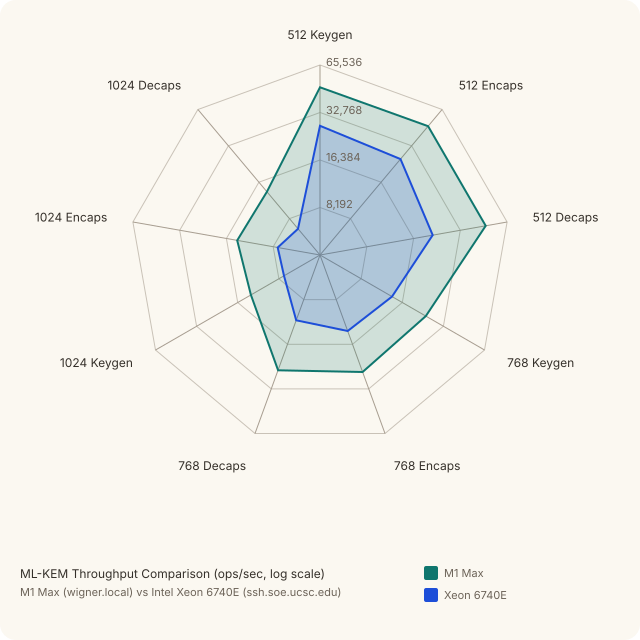

# POSTQUANTUM

## Scope

This document covers the post-quantum lattice implementations in this repo:

- `MlKem` (`ML-KEM-512/768/1024`) for key encapsulation (FIPS 203)
- `MlDsa` (`ML-DSA-44/65/87`) for signatures (FIPS 204)
- `NtruHps509`, `NtruHps677`, `NtruHps821`, `NtruHrss701` for NIST PQC round-3
  NTRU CCA-secure key encapsulation

The implementations are pure Rust in-tree arithmetic (no C/FFI in production paths),
with differential testing against vendored reference code.

## Foundations

This code sits on the worst-case/average-case lattice line of work started by:

- Miklos Ajtai (1996): worst-case to average-case reductions for lattice problems
- Ajtai and Dwork (1997): one of the first lattice-based public-key cryptosystems

That lineage is the conceptual backbone for modern constructions such as
module-LWE and module-SIS used by ML-KEM and ML-DSA.

## What Is Implemented

### ML-KEM (FIPS 203)

- Parameter sets: 512, 768, 1024
- APIs:
  - `MlKem::keygen`, `MlKem::keygen_from_seed`
  - `MlKem::encaps`, `MlKem::encaps_with_randomness`
  - `MlKem::decaps`
- Types:
  - `MlKemPublicKey`, `MlKemPrivateKey`, `MlKemCiphertext`, `MlKemSharedSecret`

### ML-DSA (FIPS 204)

- Parameter sets: 44, 65, 87
- APIs:
  - `MlDsa::keygen`, `MlDsa::keygen_from_seed`
  - `MlDsa::sign`, `MlDsa::sign_with_randomness`,
    `MlDsa::sign_with_randomness_and_context`
  - `MlDsa::verify`, `MlDsa::verify_with_context`
- Types:
  - `MlDsaPublicKey`, `MlDsaPrivateKey`, `MlDsaSignature`

### NTRU (NIST PQC round 3, 2020-10-16 submission)

- Parameter sets:
  - `NtruHps509` (`ntruhps2048509`, NIST level 1)
  - `NtruHps677` (`ntruhps2048677`, NIST level 3)
  - `NtruHps821` (`ntruhps4096821`, NIST level 5)
  - `NtruHrss701` (`ntruhrss701`, NIST level 1)
- APIs (each `Ntru*` namespace):
  - `keygen`, `encaps`, `decaps`
- Types (per parameter set):
  - `Ntru*PublicKey`, `Ntru*PrivateKey`, `Ntru*Ciphertext`, `Ntru*SharedSecret`

NTRU here is a faithful Rust port of the official round-3 reference C
distributed in `NIST-PQ-Submission-NTRU-20201016.tar.gz` from `ntru.org`. Each
parameter set is validated byte-for-byte against the `count = 0` entry of the
shipped `PQCkemKAT_*.rsp` known-answer file (`PQCkemKAT_935.rsp` for HPS-509,
`PQCkemKAT_1234.rsp` for HPS-677, `PQCkemKAT_1590.rsp` for HPS-821, and
`PQCkemKAT_1450.rsp` for HRSS-701). The vendored hex sidecars next to each
module's source are the public KAT bytes, not derived data.

## Why This Design

- **In-tree arithmetic**: keeps the math auditable and lets us tune performance
  directly in Rust.
- **Strict wire parsing**: malformed encodings should fail at parse time rather
  than leak into later call sites.
- **Deterministic test entry points**: explicit seed/randomness APIs are present
  for KATs, differential tests, and reproducible benchmarking.
- **`cryptography::vt` namespace**: side-channel characteristics are explicit at
  import sites.

## Serialization

Both PQ schemes separate compact payloads from self-describing blobs:

- compact: `to_wire_bytes` / `from_wire_bytes`
- self-describing: `to_key_blob` / `from_key_blob`

This keeps wire-format usage explicit while preserving one portable crate-native
blob format for storage and fixtures.

## Theory of Operation

### ML-KEM (FIPS 203)

At a high level:

1. `keygen` samples a public matrix seed and secret short vectors, then derives
   `(pk, sk)` where `sk` includes auxiliary values required for CCA security.
2. `encaps` samples ephemeral randomness, derives `(ciphertext, shared_secret)`
   against a recipient `pk`.
3. `decaps` recomputes and validates the encapsulation relation and returns the
   same `shared_secret` as the encapsulator (or an implicit-rejection value for
   malformed ciphertexts).

Operationally, treat the returned shared secret as KDF input, not as a final
application key.

### ML-DSA (FIPS 204)

At a high level:

1. `keygen` expands a deterministic seed into matrix and short vectors, then
   packs `(pk, sk)` with the hash/transcript material required by verification.
2. `sign` computes a Fiat-Shamir challenge over message transcript data and
   uses rejection sampling until the signature bounds are satisfied.
3. `verify` reconstructs the challenge transcript from `(pk, message,
   signature)` and accepts iff it matches.

The optional context is part of the signed transcript and must match exactly at
verification time.

### NTRU (NIST PQC round 3)

At a high level (HPS variants):

1. `keygen` samples a trinary `f` (IID-uniform) and a trinary `g` of fixed
   weight `q/8 - 2`, computes `f^{-1} mod 3` and `(g·f)^{-1} mod q`, and
   derives the public polynomial `h = g · (g·f)^{-1} · g  mod (q, x^N - 1)`.
   The private key bundles `f`, `f^{-1} mod 3`, `h^{-1} in S_q`, and a 32-byte
   PRF key for implicit rejection.
2. `encaps` samples `(r, m)` (IID for `r`, fixed-weight for `m`), derives the
   shared secret `K = SHA3-256(pack3(r) || pack3(m))`, lifts `r` into `Z_q`,
   and emits the ciphertext `c = r·h + lift(m)` packed sum-zero.
3. `decaps` recovers `(r, m)` via the trapdoor `(f, f^{-1}_3, h^{-1})`,
   re-validates `r` (and for HPS, the weight constraint on `m`), and returns
   `K = SHA3-256(pack3(r) || pack3(m))` on success or
   `K = SHA3-256(prf || c)` on any consistency failure (implicit rejection).

HRSS-701 differs from the HPS sets in three places: `f` and `g` come from the
`sample_iid_plus` distribution (post-conditioned to satisfy `<x·r, r> ≥ 0`),
the keygen uses `g ← 3·(x − 1)·g` instead of `g ← 3·g`, the message-space
check on `m` is dropped, and the encryption `lift` is the more elaborate
`a / (x − 1) mod (3, Φ_n)` operator rather than the bare `Z_3 → Z_q` map.

## Working Examples

These examples are executable and mirrored by
`tests/manual_examples.rs::manual_postquantum_examples`.

### ML-KEM end-to-end + wire/blob roundtrips

```rust
use cryptography::vt::{
    MlKem, MlKemParameterSet, MlKemPrivateKey, MlKemPublicKey,
};
use cryptography::CtrDrbgAes256;

let mut rng = CtrDrbgAes256::new(&[0x11u8; 48]);

let (pk, sk) = MlKem::keygen(MlKemParameterSet::MlKem768, &mut rng).expect("keygen");
let (ct, ss_sender) = MlKem::encaps(&pk, &mut rng).expect("encaps");
let ss_receiver = MlKem::decaps(&sk, &ct).expect("decaps");
assert_eq!(ss_sender.to_wire_bytes(), ss_receiver.to_wire_bytes());

let pk_wire = pk.to_wire_bytes();
let pk_round = MlKemPublicKey::from_wire_bytes(MlKemParameterSet::MlKem768, &pk_wire).expect("pk");
assert_eq!(pk_round, pk);

let sk_blob = sk.to_key_blob();
let sk_round = MlKemPrivateKey::from_key_blob(&sk_blob).expect("sk");
assert_eq!(sk_round, sk);
```

### ML-DSA sign/verify + context + signature wire roundtrip

```rust
use cryptography::vt::{
    MlDsa, MlDsaParameterSet, MlDsaSignature,
};
use cryptography::CtrDrbgAes256;

let mut rng = CtrDrbgAes256::new(&[0x22u8; 48]);
let (pk, sk) = MlDsa::keygen(MlDsaParameterSet::MlDsa65, &mut rng).expect("keygen");

let sig = MlDsa::sign(&sk, b"release manifest", &mut rng).expect("sign");
assert!(MlDsa::verify(&pk, b"release manifest", &sig));
assert!(!MlDsa::verify(&pk, b"tampered", &sig));

let ctx = b"bundle:v1";
let rnd = [0x5Cu8; 32];
let sig_ctx = MlDsa::sign_with_randomness_and_context(&sk, b"payload", &rnd, ctx).expect("sign");
assert!(MlDsa::verify_with_context(&pk, b"payload", &sig_ctx, ctx));
assert!(!MlDsa::verify_with_context(&pk, b"payload", &sig_ctx, b"bundle:v2"));

let sig_wire = sig.to_wire_bytes();
let sig_round =
    MlDsaSignature::from_wire_bytes(MlDsaParameterSet::MlDsa65, &sig_wire).expect("sig");
assert!(MlDsa::verify(&pk, b"release manifest", &sig_round));
```

### NTRU end-to-end + wire roundtrip

```rust
use cryptography::vt::{NtruHps509, NtruHps509Ciphertext, NtruHps509PublicKey};
use cryptography::CtrDrbgAes256;

let mut rng = CtrDrbgAes256::new(&[11u8; 48]);

let (pk, sk) = NtruHps509::keygen(&mut rng);
let (ct, ss_sender) = NtruHps509::encaps(&pk, &mut rng);
let ss_receiver = NtruHps509::decaps(&sk, &ct);
assert_eq!(ss_sender.as_bytes(), ss_receiver.as_bytes());

let pk_round = NtruHps509PublicKey::from_wire_bytes(&pk.to_wire_bytes()).expect("pk");
let ct_round = NtruHps509Ciphertext::from_wire_bytes(&ct.to_wire_bytes()).expect("ct");
assert_eq!(pk_round, pk);
assert_eq!(ct_round, ct);
```

The other parameter sets (`NtruHps677`, `NtruHps821`, `NtruHrss701`) expose
identical `keygen`, `encaps`, `decaps` shapes; only the byte sizes change.

## Parameter Comparison

### ML-KEM: Security vs. Cost

**Key and ciphertext sizes (bytes; FIPS 203 §7)**

| Parameter | Security | Public Key | Private Key | Ciphertext | Shared Secret |
|---|:---:|---:|---:|---:|---:|
| ML-KEM-512  | NIST 1 |   800 | 1 632 |   768 | 32 |
| ML-KEM-768  | NIST 3 | 1 184 | 2 400 | 1 088 | 32 |
| ML-KEM-1024 | NIST 5 | 1 568 | 3 168 | 1 568 | 32 |

**Throughput across parameter sets and platforms** — each axis is an operation
(keygen / encaps / decaps) for one parameter set; outer ring = faster. ±95% CI
half-widths are in the benchmark tables below.



### ML-DSA: Security vs. Cost

**Key and signature sizes (bytes; FIPS 204 §7)**

| Parameter | Security | Public Key | Private Key | Signature |
|---|:---:|---:|---:|---:|
| ML-DSA-44 | NIST 2 | 1 312 | 2 528 | 2 420 |
| ML-DSA-65 | NIST 3 | 1 952 | 4 000 | 3 309 |
| ML-DSA-87 | NIST 5 | 2 592 | 4 864 | 4 627 |

**Throughput across parameter sets and platforms** — each axis is an operation
(keygen / sign / verify) for one parameter set; outer ring = faster.


### NTRU: Security vs. Cost

**Key and ciphertext sizes (bytes; round-3 submission Table 2.1)**

| Parameter | Security | Public Key | Private Key | Ciphertext | Shared Secret |
|---|:---:|---:|---:|---:|---:|
| NtruHps509  | NIST 1 |   699 |   935 |   699 | 32 |
| NtruHrss701 | NIST 1 | 1 138 | 1 450 | 1 138 | 32 |
| NtruHps677  | NIST 3 |   930 | 1 234 |   930 | 32 |
| NtruHps821  | NIST 5 | 1 230 | 1 590 | 1 230 | 32 |

### Cross-scheme comparison at NIST Level 3

| Metric | ML-KEM-768 | ML-DSA-65 |
|---|---:|---:|
| Public key (bytes) | 1 184 | 1 952 |
| Private key (bytes) | 2 400 | 4 000 |
| Payload (bytes) | 1 088 CT + 32 SS | 3 309 sig |
| Keygen M1 (ms/op ± CI) | 0.03204 ± 0.000047 | 0.1379 ± 0.000273 |
| Primary op M1 (ms/op ± CI) | 0.03123 ± 0.000030 encaps | 0.3587 ± 0.056070 sign |
| Secondary op M1 (ms/op ± CI) | 0.03189 ± 0.000216 decaps | 0.1214 ± 0.001442 verify |

ML-DSA signing is ~10× slower than ML-KEM encapsulation at Level 3 due to the
rejection-sampling loop; verification is closer to ML-KEM decaps speed. The wide CI
on ML-DSA-65 sign (±15.6%) reflects rejection-sampling variance, not measurement
noise.

## Benchmarks

Measured with [pilot-bench](https://github.com/ascar-io/pilot-bench) via:

```text
bash scripts/bench_all_pk_full.sh
```

Numbers below are `ms/op`, with 95% CI half-width and rounds run.

- Apple M1 Max (`wigner.local`)
- AMD EPYC 7452 (`moore.soe.ucsc.edu`, single-core slice)

### ML-KEM (Kyber)

| Operation | M1 Max ms/op | M1 Max ± CI | M1 Max Runs | EPYC 7452 ms/op | EPYC 7452 ± CI | EPYC 7452 Runs |
|---|---:|---:|---:|---:|---:|---:|
| mlkem512_keygen | 0.01947 | ±2.831e-05 | 90 | 0.02968 | ±9.867e-05 | 31 |
| mlkem512_encaps | 0.01937 | ±0.0001085 | 61 | 0.03102 | ±0.0001033 | 60 |
| mlkem512_decaps | 0.01935 | ±5.455e-05 | 137 | 0.03489 | ±0.0002393 | 60 |
| mlkem768_keygen | 0.03204 | ±4.69e-05 | 74 | 0.04913 | ±0.000296 | 30 |
| mlkem768_encaps | 0.03123 | ±3.038e-05 | 162 | 0.05036 | ±0.001314 | 30 |
| mlkem768_decaps | 0.03189 | ±0.000216 | 150 | 0.05708 | ±0.003447 | 40 |
| mlkem1024_keygen | 0.05098 | ±0.0001014 | 240 | 0.07745 | ±0.0002653 | 30 |
| mlkem1024_encaps | 0.04864 | ±4.308e-05 | 120 | 0.07629 | ±0.0002343 | 30 |
| mlkem1024_decaps | 0.04946 | ±5.068e-05 | 30 | 0.08396 | ±0.0001918 | 30 |

### ML-DSA (Dilithium)

| Operation | M1 Max ms/op | M1 Max ± CI | M1 Max Runs | EPYC 7452 ms/op | EPYC 7452 ± CI | EPYC 7452 Runs |
|---|---:|---:|---:|---:|---:|---:|
| mldsa44_keygen | 0.07784 | ±0.002088 | 60 | 0.1142 | ±0.0002587 | 60 |
| mldsa44_sign | 0.2071 | ±0.0006633 | 350 | 0.4592 | ±0.0006615 | 41 |
| mldsa44_verify | 0.07184 | ±0.000123 | 152 | 0.119 | ±0.00325 | 30 |
| mldsa65_keygen | 0.1379 | ±0.0002734 | 157 | 0.2068 | ±0.001588 | 30 |
| mldsa65_sign | 0.3587 | ±0.05607 | 30 | 0.7465 | ±0.001896 | 37 |
| mldsa65_verify | 0.1214 | ±0.001442 | 181 | 0.1893 | ±0.000978 | 30 |
| mldsa87_keygen | 0.2101 | ±0.0001558 | 65 | 0.3138 | ±0.009709 | 30 |
| mldsa87_sign | 0.4731 | ±0.001884 | 156 | 1.019 | ±0.00348 | 30 |
| mldsa87_verify | 0.207 | ±0.0003116 | 151 | 0.3107 | ±0.001124 | 40 |

### NTRU (NIST PQC round 3)

| Operation | M1 Max ms/op | M1 Max ± CI | M1 Max Runs | EPYC 7452 ms/op | EPYC 7452 ± CI | EPYC 7452 Runs |
|---|---:|---:|---:|---:|---:|---:|
| ntruhps509_keygen   | 0.9587  | ±0.007179  |  60 | 1.264  | ±0.00275   |  30 |
| ntruhps509_encaps   | 0.07949 | ±0.000565  |  30 | 0.1064 | ±0.0003404 |  90 |
| ntruhps509_decaps   | 0.1355  | ±0.003243  |  34 | 0.152  | ±0.0004813 |  42 |
| ntruhps677_keygen   | 1.073   | ±0.009453  | 102 | 1.769  | ±0.004486  |  44 |
| ntruhps677_encaps   | 0.08488 | ±0.0007114 |  94 | 0.135  | ±0.0004764 |  49 |
| ntruhps677_decaps   | 0.1006  | ±0.002053  |  43 | 0.1537 | ±0.001519  |  30 |
| ntruhps821_keygen   | 2.288   | ±0.003679  | 120 | 2.864  | ±0.1528    |  30 |
| ntruhps821_encaps   | 0.159   | ±0.0006922 |  38 | 0.1969 | ±0.0004668 |  30 |
| ntruhps821_decaps   | 0.2871  | ±0.001907  |  35 | 0.2822 | ±0.001327  |  30 |
| ntruhrss701_keygen  | 1.198   | ±0.03817   |  90 | 1.843  | ±0.0879    |  30 |
| ntruhrss701_encaps  | 0.04527 | ±0.0007903 |  53 | 0.06832 | ±0.001074 |  39 |
| ntruhrss701_decaps  | 0.1123  | ±0.003495  |  30 | 0.1693 | ±0.001493  |  30 |

### NTRUEncrypt (IEEE Std 1363.1-2008)

| Operation | M1 Max ms/op | M1 Max ± CI | M1 Max Runs | EPYC 7452 ms/op | EPYC 7452 ± CI | EPYC 7452 Runs |
|---|---:|---:|---:|---:|---:|---:|
| ntruees401ep1_keygen  | 0.7387  | ±0.004256  |  90 | 0.9273 | ±0.001791  |  37 |
| ntruees401ep1_encrypt | 0.09144 | ±0.0003451 | 128 | 0.09403 | ±0.0005089 | 30 |
| ntruees401ep1_decrypt | 0.1281  | ±0.0002626 |  51 | 0.1447 | ±0.0007402 |  98 |
| ntruees449ep1_keygen  | 0.8699  | ±0.002396  |  90 | 1.105  | ±0.001782  |  66 |
| ntruees449ep1_encrypt | 0.1267  | ±0.0001983 |  80 | 0.1342 | ±0.0004829 |  30 |
| ntruees449ep1_decrypt | 0.1583  | ±0.0002213 |  57 | 0.1859 | ±0.01549   |  66 |
| ntruees541ep1_keygen  | 3.943   | ±0.001493  |  62 | 6.611  | ±0.03802   |  30 |
| ntruees541ep1_encrypt | 0.0634  | ±0.0002309 |  60 | 0.1025 | ±0.001393  |  30 |
| ntruees541ep1_decrypt | 0.08225 | ±0.001326  |  30 | 0.1611 | ±0.003461  |  30 |
| ntruees677ep1_keygen  | 1.105   | ±0.007408  | 120 | 1.585  | ±0.01588   |  32 |
| ntruees677ep1_encrypt | 0.1629  | ±0.0003894 |  83 | 0.1774 | ±0.0005738 |  39 |
| ntruees677ep1_decrypt | 0.2565  | ±0.0001352 |  60 | 0.3007 | ±0.0005775 | 180 |
| ntruees1087ep2_keygen  | 1.775  | ±0.003781  |  60 | 3.817  | ±0.09981   |  30 |
| ntruees1087ep2_encrypt | 0.2016 | ±0.0006128 |  30 | 0.3872 | ±0.04044   |  30 |
| ntruees1087ep2_decrypt | 0.3114 | ±0.0002275 | 150 | 0.6716 | ±0.01087   |  38 |

## Benchmark Discussion

- `ML-KEM` scales roughly with parameter size and is stable across runs; CIs are
  tight on both hosts.
- `ML-DSA` verify is consistently cheaper than sign at each level, as expected.
- `ML-DSA` signing variance is driven by rejection behavior in the signer loop;
  this is visible in the wider CI for `mldsa65_sign` on M1.
- `NTRU` keygen costs are dominated by the polynomial inversion in `R_q`
  (Hensel lift over the variable-time `F_2[x]` Euclidean inverse). Keygen is
  the slowest operation on every parameter set, by 5–25× over encaps/decaps.
- `NTRU-HRSS-701` encaps is the cheapest post-quantum encapsulation in the
  table — at 0.045 ms on M1 it beats every ML-KEM size, because the HRSS
  encryption is a single trinary-by-dense convolution (the Karatsuba split
  amortizes well for sparse trinary inputs).
- `NTRU-HPS` and `NTRUEncrypt-EES` show the gap with NTT-friendly rings
  clearly: ML-KEM-512 keygen is ~50× faster than NTRU-HPS-509 keygen on the
  same host. The polynomial rings here are `Z_q[x] / (x^N − 1)` with prime
  `N`, which do not admit a direct radix-2 NTT; an in-tree two-prime
  Montgomery NTT at the smallest power-of-two length covering all
  parameter sets (`M = 2048 ≥ 2 · 821 − 1`) was prototyped and discarded —
  at `N ≤ 821` the length-2048 transform overhead exceeds Karatsuba's
  `O(N^{log_2 3})` cost. A right-sized per-`N` NTT, Bluestein, or
  Rader-style decomposition would close more of the gap; the AVX2
  reference C avoids the question by going to assembly.

Reference baselines (vendored C code) are available through:

- `scripts/bench_mlkem_ref.sh`
- `scripts/bench_mldsa_ref.sh`

These are for cross-checking and performance calibration, not for production
integration.

## Validation

- Full crate tests (`cargo test`) include ML-KEM, ML-DSA, and NTRU
  roundtrip/tamper checks.
- Differential tests compare against first-vector outputs from vendored
  reference implementations.
- NTRU additionally validates byte-for-byte against the `count = 0` entry of
  the official NIST PQC round-3 KAT files for each parameter set
  (`PQCkemKAT_935.rsp`, `PQCkemKAT_1234.rsp`, `PQCkemKAT_1590.rsp`,
  `PQCkemKAT_1450.rsp`).

## References

Primary standards PDFs are stored in `pubs/`. The canonical BibTeX entries are
in [README.md](README.md).

- Miklos Ajtai, "Generating Hard Instances of Lattice Problems (Extended
  Abstract)," *Proceedings of the Twenty-Eighth Annual ACM Symposium on Theory
  of Computing (STOC '96)*, pp. 99-108, 1996.
  DOI: [10.1145/237814.237838](https://doi.org/10.1145/237814.237838)
- Miklos Ajtai and Cynthia Dwork, "A Public-Key Cryptosystem with
  Worst-Case/Average-Case Equivalence," *Proceedings of the Twenty-Ninth
  Annual ACM Symposium on Theory of Computing (STOC '97)*, pp. 284-293, 1997.
  DOI: [10.1145/258533.258604](https://doi.org/10.1145/258533.258604)
- National Institute of Standards and Technology, *Module-Lattice-Based
  Key-Encapsulation Mechanism Standard (FIPS 203)*, 2024.
  DOI: [10.6028/NIST.FIPS.203](https://doi.org/10.6028/NIST.FIPS.203)
  (local copy: `pubs/fips203-ml-kem.pdf`)
- National Institute of Standards and Technology, *Module-Lattice-Based Digital
  Signature Standard (FIPS 204)*, 2024.
  DOI: [10.6028/NIST.FIPS.204](https://doi.org/10.6028/NIST.FIPS.204)
  (local copy: `pubs/fips204-ml-dsa.pdf`)
- Cong Chen, Oussama Danba, Jeffrey Hoffstein, Andreas Hülsing, Joost Rijneveld,
  John M. Schanck, Peter Schwabe, William Whyte, Zhenfei Zhang, Tsunekazu Saito,
  Takashi Yamakawa, and Keita Xagawa, *NTRU — Algorithm Specifications and
  Supporting Documentation* (round-3 NIST PQC submission), 2020-10-16.
  Submission package archived at
  [`ntru.org/release/NIST-PQ-Submission-NTRU-20201016.tar.gz`](https://ntru.org/release/NIST-PQ-Submission-NTRU-20201016.tar.gz);
  this crate's NTRU implementations are direct ports of that package's
  reference C and validate against its KAT files.
- Reference code (for differential testing / benchmark calibration) is
  fetched on demand into a gitignored `third_party/` directory by
  `scripts/fetch_mlkem_refs.sh` and `scripts/fetch_mldsa_refs.sh`. The
  trees are not vendored in the repository.
