# Symmetric-Cipher Randomness Report

Generated 2026-04-28 21:47:14 PDT by `scripts/cipher_randomness.R`.
Toolchain: R 4.5.0, randtoolbox 2.0.5, tseries 0.10.61.

**Plaintext.** Project Gutenberg #100 — *The Complete Works of William Shakespeare* (5,638,483 bytes; MD5 `02f80fa7827df3210e62ffd5ed7e5b42`; byte-entropy 4.888720 bits/byte).

**Caveat.** Passing this battery is **necessary** for a usable symmetric primitive but is **not sufficient** for cryptographic security; the battery rules out gross statistical defects in the keystream, not key-recovery, distinguishing-attack, or related-key resistance.

**Entropy precision.** Sample entropy on a finite byte stream cannot equal the ideal $8$ bits exactly. The maximum-likelihood plug-in estimator has expected bias $-(K-1)/(2 n \ln 2)$ bits for $K$ bins and $n$ samples; with $K = 256$ and $n =$ 5,638,483, that bound is approximately $3.26 \times 10^{-5}$ bits, and the Miller-Madow correction subtracts a finite-sample estimate of the same form. Multinomial sampling noise contributes a further $O(1/\sqrt{n})$ fluctuation. Below, byte-entropy values are printed to six decimals so this irreducible deviation from $8.0$ is visible.

**Method.** Each cipher encrypts the full plaintext under a fresh OS-random key.
Block ciphers run in CTR mode with a random IV; stream ciphers run in their native keystream mode.
Ciphertext is sliced into chunks of 8, 16, and 32 bytes; each chunk is mapped to a Uniform(0,1)
candidate by interpreting its leading at-most-8 bytes as a big-endian fraction.

**Battery.**
0. Shannon entropy of the raw byte stream (ideal: 8.000 bits/byte).
1. Shannon entropy of the chunk values binned into 256 cells (per chunk size; ideal: 8.000 bits).
2. First ten raw moments (deviation from Uniform(0,1) ideals $1/(k+1)$).
3. FFT power spectrum: peak/mean ratio, plus a KS test of the normalised periodogram against $\mathrm{Exp}(1)$ (= flat spectrum under $H_0$).
4. Kolmogorov-Smirnov test against Uniform(0,1).
5. `randtoolbox::gap.test` (gaps between recurrences in $[0, 0.5]$).
6. `randtoolbox::freq.test` on the chunk values binned into 16 cells.
7. `randtoolbox::order.test` on tuples of size 4 (data truncated to a multiple of 4).
8. Wald-Wolfowitz runs test on the bit stream (`tseries::runs.test`).

**Decision rule.** A cipher fails the battery if at least $3$ of (a) p-values fall below $\alpha = 0.001$, or (b) entropy estimates deviate from the ideal $8.0$ bits by more than $0.001$ bits.

## Definitions

Let $b_0, b_1, \ldots, b_{L-1}$ be the ciphertext byte stream of length $L$
and let $u_0, u_1, \ldots, u_{k-1}$ be the per-chunk Uniform(0,1) candidates,
one per $N$-byte chunk, computed as

$$
u_j = \sum_{i=0}^{\min(N,8)-1} \frac{b_{jN+i}}{256^{i+1}}.
$$

Under $H_0$, the $u_j$ are independent and identically distributed Uniform(0,1).

| Symbol | Definition |
|--------|------------|
| $L$ | ciphertext length in bytes (= length of plaintext, since CTR/keystream is length-preserving). |
| $N$ | chunk size in bytes (8, 16, or 32). |
| $k = \lfloor L/N \rfloor$ | number of samples for chunk size $N$. |
| $u_j$ | the $j$-th chunk's leading at-most-8-byte big-endian fraction, in $[0,1)$. |
| $\alpha = 0.001$ | per-test rejection threshold. |
| $\mathrm{tol} = 0.001$ | per-entropy rejection threshold (bits/sample). |
| $p$ | classical p-value $\Pr(T \ge T_\mathrm{obs} \mid H_0)$; small $p$ rejects $H_0$. |
| $H$ | Shannon entropy in bits, with the Miller-Madow finite-sample correction; ideal $= 8.0000$ for 256 equally likely symbols. |
| `byte H` | $H$ of the per-byte distribution over the full ciphertext. |
| `chunk H` | $H$ of the chunk values $u$ binned into 256 equal-width cells. |
| $m_k$ | the $k$-th raw sample moment, $m_k = \frac{1}{n}\sum_{j} u_j^k$. |
| ideal $k$ | $E[U^k] = 1/(k+1)$ for $U \sim \mathrm{Uniform}(0,1)$. |
| `dev` | absolute deviation $\lvert m_k - 1/(k+1) \rvert$ (smaller is better). |
| `FFT peak/mean` | Fisher's g (un-normalised): $\max_f \lvert U_f \rvert^2 / \overline{\lvert U_f \rvert^2}$ over non-DC bins of the centered FFT. |
| `FFT spectrum KS (vs flat)` | KS p-value testing the normalised periodogram against $\mathrm{Exp}(1)$ (the white-noise null). |
| `KS vs Uniform(0,1)` | Kolmogorov-Smirnov p-value testing $u$ against $\mathrm{Uniform}(0,1)$. |
| `gap.test` | randtoolbox gaps-between-recurrences test on $u$ (default lower $=0$, upper $=0.5$). |
| `freq.test` | randtoolbox frequency $\chi^2$ on $u$ binned into 16 cells. |
| `order.test` | randtoolbox order-pattern test on disjoint 4-tuples of $u$ (data truncated to a multiple of 4). |
| `runs.test` | Wald-Wolfowitz two-level runs test on the bit stream above/below $0.5$. |
| `rejects/total` | number of p-values below $\alpha$ (plus entropy misses) over the total test count. |
| `min p` | smallest p-value across the cipher's full battery. |

## Summary

| cipher | token | byte H (bits) | $8 - H$ (bits) | rejects/total | min p | verdict |
|--------|-------|---------------|----------------|---------------|-------|---------|
| AES-128 | `aes128` | 8.000006 | -5.94e-06 | 0/22 | 0.064 | PASS |
| AES-192 | `aes192` | 7.999996 | 4.10e-06 | 0/22 | 0.062 | PASS |
| AES-256 | `aes256` | 8.000004 | -3.94e-06 | 0/22 | 0.180 | PASS |
| Camellia-128 | `camellia128` | 7.999995 | 4.72e-06 | 0/22 | 0.044 | PASS |
| Camellia-192 | `camellia192` | 8.000001 | -6.27e-07 | 1/22 | 2.9e-04 | PASS |
| Camellia-256 | `camellia256` | 8.000003 | -3.32e-06 | 0/22 | 0.122 | PASS |
| CAST-128 | `cast128` | 7.999999 | 5.59e-07 | 0/22 | 0.003 | PASS |
| DES | `des` | 7.999997 | 2.62e-06 | 0/22 | 0.230 | PASS |
| 3DES | `3des` | 8.000001 | -1.11e-06 | 0/22 | 0.143 | PASS |
| Kuznyechik | `grasshopper` | 8.000003 | -2.56e-06 | 0/22 | 0.054 | PASS |
| Magma | `magma` | 8.000003 | -2.52e-06 | 0/22 | 0.042 | PASS |
| PRESENT-80 | `present80` | 7.999999 | 5.86e-07 | 1/22 | 3.4e-05 | PASS |
| PRESENT-128 | `present128` | 7.999996 | 4.27e-06 | 0/22 | 0.060 | PASS |
| SEED | `seed` | 8.000001 | -5.05e-07 | 1/22 | <1e-12 | PASS |
| Serpent-128 | `serpent128` | 8.000000 | -4.09e-07 | 0/22 | 0.013 | PASS |
| Serpent-192 | `serpent192` | 8.000000 | 2.12e-07 | 0/22 | 0.033 | PASS |
| Serpent-256 | `serpent256` | 8.000004 | -3.86e-06 | 0/22 | 0.042 | PASS |
| SM4 | `sm4` | 7.999998 | 2.03e-06 | 0/22 | 0.205 | PASS |
| Twofish-128 | `twofish128` | 8.000002 | -1.79e-06 | 2/22 | 2.3e-06 | PASS |
| Twofish-256 | `twofish256` | 7.999997 | 3.14e-06 | 0/22 | 0.049 | PASS |
| Simon32/64 | `simon32_64` | 8.000003 | -3.45e-06 | 0/22 | 0.003 | PASS |
| Simon64/128 | `simon64_128` | 8.000005 | -4.55e-06 | 0/22 | 0.007 | PASS |
| Simon128/128 | `simon128_128` | 7.999995 | 5.14e-06 | 0/22 | 0.014 | PASS |
| Simon128/256 | `simon128_256` | 7.999997 | 2.74e-06 | 0/22 | 0.007 | PASS |
| Speck32/64 | `speck32_64` | 7.999997 | 3.26e-06 | 0/22 | 0.168 | PASS |
| Speck64/128 | `speck64_128` | 7.999994 | 5.93e-06 | 0/22 | 0.011 | PASS |
| Speck128/128 | `speck128_128` | 8.000003 | -2.99e-06 | 0/22 | 0.073 | PASS |
| Speck128/256 | `speck128_256` | 8.000000 | 3.23e-08 | 0/22 | 0.326 | PASS |
| ChaCha20 | `chacha20` | 7.999998 | 1.88e-06 | 0/22 | 0.146 | PASS |
| XChaCha20 | `xchacha20` | 8.000001 | -1.41e-06 | 0/22 | 0.067 | PASS |
| Salsa20 | `salsa20` | 7.999998 | 2.08e-06 | 0/22 | 0.026 | PASS |
| Rabbit | `rabbit` | 8.000003 | -2.77e-06 | 0/22 | 0.042 | PASS |
| ZUC-128 | `zuc128` | 8.000000 | 3.35e-07 | 0/22 | 0.206 | PASS |
| SNOW 3G | `snow3g` | 7.999998 | 1.86e-06 | 0/22 | 0.026 | PASS |

**All ciphers passed the battery.**

## Per-cipher detail

### AES-128 (`aes128`)

Verdict: PASS &mdash; 0 test rejection(s) at $\alpha = 0.001$, 0 entropy miss(es) at $\mathrm{tol} = 0.001$ (total 0 / 22).

Byte-stream Shannon entropy: **8.000006 bits/byte** (ideal: $8$; signed deviation $H - 8 = 5.94 \times 10^{-6}$ bits).

**8-byte chunks** (704,810 samples; chunk-entropy 8.000053 bits; signed deviation $H - 8 = 5.34 \times 10^{-5}$ bits)

Moments (sample, ideal, dev):

| $k$ | sample $m_k$ | ideal $1/(k+1)$ | dev |
|-----|--------------|-----------------|-----|
| 1 | 0.500010 | 0.500000 | 9.71e-06 |
| 2 | 0.333487 | 0.333333 | 1.54e-04 |
| 3 | 0.250226 | 0.250000 | 2.26e-04 |
| 4 | 0.200249 | 0.200000 | 2.49e-04 |
| 5 | 0.166914 | 0.166667 | 2.48e-04 |
| 6 | 0.143093 | 0.142857 | 2.36e-04 |
| 7 | 0.125220 | 0.125000 | 2.20e-04 |
| 8 | 0.111314 | 0.111111 | 2.03e-04 |
| 9 | 0.100186 | 0.100000 | 1.86e-04 |
| 10 | 0.091079 | 0.090909 | 1.70e-04 |

Tests:

| test | p |
|------|---|
| FFT peak/mean | 13.52 |
| FFT spectrum KS (vs flat) | 0.673 |
| KS vs Uniform(0,1) | 0.697 |
| randtoolbox gap.test | 0.285 |
| randtoolbox freq.test (16 bins) | 0.441 |
| randtoolbox order.test (d=4) | 0.333 |
| tseries runs.test (bits) | 0.277 |

**16-byte chunks** (352,405 samples; chunk-entropy 8.000018 bits; signed deviation $H - 8 = 1.77 \times 10^{-5}$ bits)

Moments (sample, ideal, dev):

| $k$ | sample $m_k$ | ideal $1/(k+1)$ | dev |
|-----|--------------|-----------------|-----|
| 1 | 0.499489 | 0.500000 | 5.11e-04 |
| 2 | 0.333112 | 0.333333 | 2.21e-04 |
| 3 | 0.249976 | 0.250000 | 2.44e-05 |
| 4 | 0.200088 | 0.200000 | 8.81e-05 |
| 5 | 0.166819 | 0.166667 | 1.52e-04 |
| 6 | 0.143047 | 0.142857 | 1.90e-04 |
| 7 | 0.125212 | 0.125000 | 2.12e-04 |
| 8 | 0.111336 | 0.111111 | 2.25e-04 |
| 9 | 0.100233 | 0.100000 | 2.33e-04 |
| 10 | 0.091147 | 0.090909 | 2.38e-04 |

Tests:

| test | p |
|------|---|
| FFT peak/mean | 12.26 |
| FFT spectrum KS (vs flat) | 0.285 |
| KS vs Uniform(0,1) | 0.256 |
| randtoolbox gap.test | 0.524 |
| randtoolbox freq.test (16 bins) | 0.439 |
| randtoolbox order.test (d=4) | 0.258 |
| tseries runs.test (bits) | 0.277 |

**32-byte chunks** (176,202 samples; chunk-entropy 7.999995 bits; signed deviation $H - 8 = -4.67 \times 10^{-6}$ bits)

Moments (sample, ideal, dev):

| $k$ | sample $m_k$ | ideal $1/(k+1)$ | dev |
|-----|--------------|-----------------|-----|
| 1 | 0.500199 | 0.500000 | 1.99e-04 |
| 2 | 0.333704 | 0.333333 | 3.71e-04 |
| 3 | 0.250431 | 0.250000 | 4.31e-04 |
| 4 | 0.200440 | 0.200000 | 4.40e-04 |
| 5 | 0.167095 | 0.166667 | 4.28e-04 |
| 6 | 0.143265 | 0.142857 | 4.08e-04 |
| 7 | 0.125387 | 0.125000 | 3.87e-04 |
| 8 | 0.111477 | 0.111111 | 3.66e-04 |
| 9 | 0.100347 | 0.100000 | 3.47e-04 |
| 10 | 0.091240 | 0.090909 | 3.31e-04 |

Tests:

| test | p |
|------|---|
| FFT peak/mean | 11.29 |
| FFT spectrum KS (vs flat) | 0.845 |
| KS vs Uniform(0,1) | 0.590 |
| randtoolbox gap.test | 0.064 |
| randtoolbox freq.test (16 bins) | 0.432 |
| randtoolbox order.test (d=4) | 0.273 |
| tseries runs.test (bits) | 0.277 |

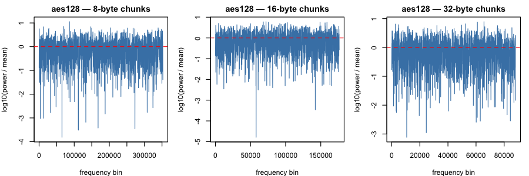

### AES-192 (`aes192`)

Verdict: PASS &mdash; 0 test rejection(s) at $\alpha = 0.001$, 0 entropy miss(es) at $\mathrm{tol} = 0.001$ (total 0 / 22).

Byte-stream Shannon entropy: **7.999996 bits/byte** (ideal: $8$; signed deviation $H - 8 = -4.10 \times 10^{-6}$ bits).

**8-byte chunks** (704,810 samples; chunk-entropy 7.999963 bits; signed deviation $H - 8 = -3.67 \times 10^{-5}$ bits)

Moments (sample, ideal, dev):

| $k$ | sample $m_k$ | ideal $1/(k+1)$ | dev |
|-----|--------------|-----------------|-----|
| 1 | 0.499875 | 0.500000 | 1.25e-04 |
| 2 | 0.333268 | 0.333333 | 6.56e-05 |
| 3 | 0.249994 | 0.250000 | 5.85e-06 |
| 4 | 0.200036 | 0.200000 | 3.59e-05 |
| 5 | 0.166733 | 0.166667 | 6.66e-05 |
| 6 | 0.142949 | 0.142857 | 9.19e-05 |
| 7 | 0.125114 | 0.125000 | 1.14e-04 |
| 8 | 0.111246 | 0.111111 | 1.35e-04 |
| 9 | 0.100154 | 0.100000 | 1.54e-04 |
| 10 | 0.091080 | 0.090909 | 1.71e-04 |

Tests:

| test | p |
|------|---|
| FFT peak/mean | 11.70 |
| FFT spectrum KS (vs flat) | 0.922 |
| KS vs Uniform(0,1) | 0.291 |
| randtoolbox gap.test | 0.080 |
| randtoolbox freq.test (16 bins) | 0.062 |
| randtoolbox order.test (d=4) | 0.834 |
| tseries runs.test (bits) | 0.909 |

**16-byte chunks** (352,405 samples; chunk-entropy 7.999953 bits; signed deviation $H - 8 = -4.74 \times 10^{-5}$ bits)

Moments (sample, ideal, dev):

| $k$ | sample $m_k$ | ideal $1/(k+1)$ | dev |
|-----|--------------|-----------------|-----|
| 1 | 0.499716 | 0.500000 | 2.84e-04 |
| 2 | 0.333138 | 0.333333 | 1.96e-04 |
| 3 | 0.249904 | 0.250000 | 9.56e-05 |
| 4 | 0.199982 | 0.200000 | 1.79e-05 |
| 5 | 0.166711 | 0.166667 | 4.46e-05 |
| 6 | 0.142955 | 0.142857 | 9.80e-05 |
| 7 | 0.125145 | 0.125000 | 1.45e-04 |
| 8 | 0.111298 | 0.111111 | 1.87e-04 |
| 9 | 0.100224 | 0.100000 | 2.24e-04 |
| 10 | 0.091166 | 0.090909 | 2.57e-04 |

Tests:

| test | p |
|------|---|
| FFT peak/mean | 12.36 |
| FFT spectrum KS (vs flat) | 0.699 |
| KS vs Uniform(0,1) | 0.518 |
| randtoolbox gap.test | 0.952 |
| randtoolbox freq.test (16 bins) | 0.387 |
| randtoolbox order.test (d=4) | 0.423 |
| tseries runs.test (bits) | 0.909 |

**32-byte chunks** (176,202 samples; chunk-entropy 7.999985 bits; signed deviation $H - 8 = -1.46 \times 10^{-5}$ bits)

Moments (sample, ideal, dev):

| $k$ | sample $m_k$ | ideal $1/(k+1)$ | dev |
|-----|--------------|-----------------|-----|
| 1 | 0.500003 | 0.500000 | 2.53e-06 |
| 2 | 0.333369 | 0.333333 | 3.58e-05 |
| 3 | 0.250060 | 0.250000 | 6.01e-05 |
| 4 | 0.200062 | 0.200000 | 6.24e-05 |
| 5 | 0.166722 | 0.166667 | 5.52e-05 |
| 6 | 0.142904 | 0.142857 | 4.66e-05 |
| 7 | 0.125040 | 0.125000 | 4.00e-05 |
| 8 | 0.111147 | 0.111111 | 3.60e-05 |
| 9 | 0.100034 | 0.100000 | 3.43e-05 |
| 10 | 0.090944 | 0.090909 | 3.45e-05 |

Tests:

| test | p |
|------|---|
| FFT peak/mean | 14.28 |
| FFT spectrum KS (vs flat) | 0.907 |
| KS vs Uniform(0,1) | 0.896 |
| randtoolbox gap.test | 0.887 |
| randtoolbox freq.test (16 bins) | 0.907 |
| randtoolbox order.test (d=4) | 0.677 |
| tseries runs.test (bits) | 0.909 |

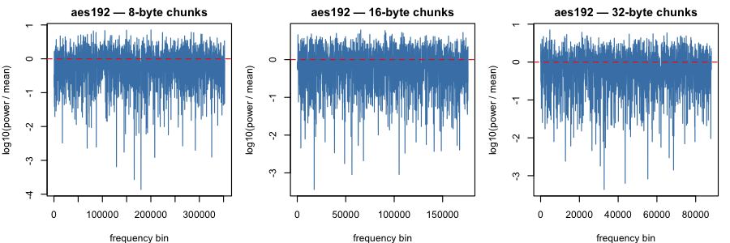

### AES-256 (`aes256`)

Verdict: PASS &mdash; 0 test rejection(s) at $\alpha = 0.001$, 0 entropy miss(es) at $\mathrm{tol} = 0.001$ (total 0 / 22).

Byte-stream Shannon entropy: **8.000004 bits/byte** (ideal: $8$; signed deviation $H - 8 = 3.94 \times 10^{-6}$ bits).

**8-byte chunks** (704,810 samples; chunk-entropy 7.999984 bits; signed deviation $H - 8 = -1.59 \times 10^{-5}$ bits)

Moments (sample, ideal, dev):

| $k$ | sample $m_k$ | ideal $1/(k+1)$ | dev |
|-----|--------------|-----------------|-----|
| 1 | 0.499946 | 0.500000 | 5.39e-05 |
| 2 | 0.333320 | 0.333333 | 1.35e-05 |
| 3 | 0.250010 | 0.250000 | 9.94e-06 |
| 4 | 0.200023 | 0.200000 | 2.25e-05 |
| 5 | 0.166695 | 0.166667 | 2.86e-05 |
| 6 | 0.142888 | 0.142857 | 3.09e-05 |
| 7 | 0.125031 | 0.125000 | 3.10e-05 |
| 8 | 0.111141 | 0.111111 | 2.99e-05 |
| 9 | 0.100028 | 0.100000 | 2.80e-05 |
| 10 | 0.090935 | 0.090909 | 2.56e-05 |

Tests:

| test | p |
|------|---|
| FFT peak/mean | 11.55 |
| FFT spectrum KS (vs flat) | 0.713 |
| KS vs Uniform(0,1) | 0.964 |
| randtoolbox gap.test | 0.180 |
| randtoolbox freq.test (16 bins) | 0.355 |
| randtoolbox order.test (d=4) | 0.972 |
| tseries runs.test (bits) | 0.927 |

**16-byte chunks** (352,405 samples; chunk-entropy 7.999982 bits; signed deviation $H - 8 = -1.85 \times 10^{-5}$ bits)

Moments (sample, ideal, dev):

| $k$ | sample $m_k$ | ideal $1/(k+1)$ | dev |
|-----|--------------|-----------------|-----|
| 1 | 0.499811 | 0.500000 | 1.89e-04 |
| 2 | 0.333309 | 0.333333 | 2.42e-05 |
| 3 | 0.250115 | 0.250000 | 1.15e-04 |
| 4 | 0.200217 | 0.200000 | 2.17e-04 |
| 5 | 0.166954 | 0.166667 | 2.88e-04 |
| 6 | 0.143192 | 0.142857 | 3.35e-04 |
| 7 | 0.125366 | 0.125000 | 3.66e-04 |
| 8 | 0.111496 | 0.111111 | 3.85e-04 |
| 9 | 0.100396 | 0.100000 | 3.96e-04 |
| 10 | 0.091310 | 0.090909 | 4.01e-04 |

Tests:

| test | p |
|------|---|
| FFT peak/mean | 12.88 |
| FFT spectrum KS (vs flat) | 0.755 |
| KS vs Uniform(0,1) | 0.564 |
| randtoolbox gap.test | 0.205 |
| randtoolbox freq.test (16 bins) | 0.494 |
| randtoolbox order.test (d=4) | 0.598 |
| tseries runs.test (bits) | 0.927 |

**32-byte chunks** (176,202 samples; chunk-entropy 8.000009 bits; signed deviation $H - 8 = 8.60 \times 10^{-6}$ bits)

Moments (sample, ideal, dev):

| $k$ | sample $m_k$ | ideal $1/(k+1)$ | dev |
|-----|--------------|-----------------|-----|
| 1 | 0.499074 | 0.500000 | 9.26e-04 |
| 2 | 0.332636 | 0.333333 | 6.97e-04 |
| 3 | 0.249568 | 0.250000 | 4.32e-04 |
| 4 | 0.199783 | 0.200000 | 2.17e-04 |
| 5 | 0.166611 | 0.166667 | 5.52e-05 |
| 6 | 0.142922 | 0.142857 | 6.52e-05 |
| 7 | 0.125155 | 0.125000 | 1.55e-04 |
| 8 | 0.111332 | 0.111111 | 2.21e-04 |
| 9 | 0.100271 | 0.100000 | 2.71e-04 |
| 10 | 0.091216 | 0.090909 | 3.07e-04 |

Tests:

| test | p |
|------|---|
| FFT peak/mean | 11.85 |
| FFT spectrum KS (vs flat) | 0.975 |
| KS vs Uniform(0,1) | 0.213 |
| randtoolbox gap.test | 0.474 |
| randtoolbox freq.test (16 bins) | 0.354 |
| randtoolbox order.test (d=4) | 0.285 |
| tseries runs.test (bits) | 0.927 |

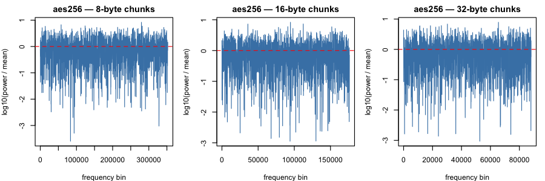

### Camellia-128 (`camellia128`)

Verdict: PASS &mdash; 0 test rejection(s) at $\alpha = 0.001$, 0 entropy miss(es) at $\mathrm{tol} = 0.001$ (total 0 / 22).

Byte-stream Shannon entropy: **7.999995 bits/byte** (ideal: $8$; signed deviation $H - 8 = -4.72 \times 10^{-6}$ bits).

**8-byte chunks** (704,810 samples; chunk-entropy 7.999992 bits; signed deviation $H - 8 = -8.44 \times 10^{-6}$ bits)

Moments (sample, ideal, dev):

| $k$ | sample $m_k$ | ideal $1/(k+1)$ | dev |
|-----|--------------|-----------------|-----|
| 1 | 0.500265 | 0.500000 | 2.65e-04 |
| 2 | 0.333603 | 0.333333 | 2.70e-04 |
| 3 | 0.250282 | 0.250000 | 2.82e-04 |
| 4 | 0.200290 | 0.200000 | 2.90e-04 |
| 5 | 0.166958 | 0.166667 | 2.91e-04 |
| 6 | 0.143143 | 0.142857 | 2.86e-04 |
| 7 | 0.125276 | 0.125000 | 2.76e-04 |
| 8 | 0.111375 | 0.111111 | 2.64e-04 |
| 9 | 0.100252 | 0.100000 | 2.52e-04 |
| 10 | 0.091148 | 0.090909 | 2.39e-04 |

Tests:

| test | p |
|------|---|
| FFT peak/mean | 14.68 |
| FFT spectrum KS (vs flat) | 0.930 |
| KS vs Uniform(0,1) | 0.389 |
| randtoolbox gap.test | 0.125 |
| randtoolbox freq.test (16 bins) | 0.044 |
| randtoolbox order.test (d=4) | 0.592 |
| tseries runs.test (bits) | 0.387 |

**16-byte chunks** (352,405 samples; chunk-entropy 8.000005 bits; signed deviation $H - 8 = 5.13 \times 10^{-6}$ bits)

Moments (sample, ideal, dev):

| $k$ | sample $m_k$ | ideal $1/(k+1)$ | dev |
|-----|--------------|-----------------|-----|
| 1 | 0.499940 | 0.500000 | 5.98e-05 |
| 2 | 0.333154 | 0.333333 | 1.80e-04 |
| 3 | 0.249798 | 0.250000 | 2.02e-04 |
| 4 | 0.199817 | 0.200000 | 1.83e-04 |
| 5 | 0.166515 | 0.166667 | 1.51e-04 |
| 6 | 0.142740 | 0.142857 | 1.18e-04 |
| 7 | 0.124914 | 0.125000 | 8.57e-05 |
| 8 | 0.111054 | 0.111111 | 5.72e-05 |
| 9 | 0.099968 | 0.100000 | 3.22e-05 |
| 10 | 0.090899 | 0.090909 | 1.04e-05 |

Tests:

| test | p |
|------|---|
| FFT peak/mean | 12.13 |
| FFT spectrum KS (vs flat) | 0.221 |
| KS vs Uniform(0,1) | 0.590 |
| randtoolbox gap.test | 0.090 |
| randtoolbox freq.test (16 bins) | 0.159 |
| randtoolbox order.test (d=4) | 0.814 |
| tseries runs.test (bits) | 0.387 |

**32-byte chunks** (176,202 samples; chunk-entropy 7.999971 bits; signed deviation $H - 8 = -2.89 \times 10^{-5}$ bits)

Moments (sample, ideal, dev):

| $k$ | sample $m_k$ | ideal $1/(k+1)$ | dev |
|-----|--------------|-----------------|-----|
| 1 | 0.499999 | 0.500000 | 1.24e-06 |
| 2 | 0.333229 | 0.333333 | 1.04e-04 |
| 3 | 0.249838 | 0.250000 | 1.62e-04 |
| 4 | 0.199819 | 0.200000 | 1.81e-04 |
| 5 | 0.166486 | 0.166667 | 1.81e-04 |
| 6 | 0.142685 | 0.142857 | 1.72e-04 |
| 7 | 0.124841 | 0.125000 | 1.59e-04 |
| 8 | 0.110967 | 0.111111 | 1.44e-04 |
| 9 | 0.099871 | 0.100000 | 1.29e-04 |
| 10 | 0.090795 | 0.090909 | 1.14e-04 |

Tests:

| test | p |
|------|---|
| FFT peak/mean | 10.88 |
| FFT spectrum KS (vs flat) | 0.274 |
| KS vs Uniform(0,1) | 0.619 |
| randtoolbox gap.test | 0.260 |
| randtoolbox freq.test (16 bins) | 0.632 |
| randtoolbox order.test (d=4) | 0.349 |
| tseries runs.test (bits) | 0.387 |

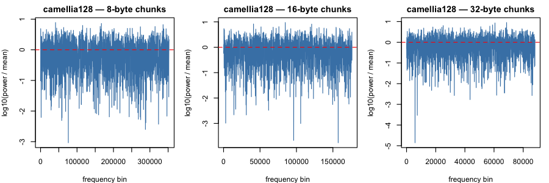

### Camellia-192 (`camellia192`)

Verdict: PASS &mdash; 1 test rejection(s) at $\alpha = 0.001$, 0 entropy miss(es) at $\mathrm{tol} = 0.001$ (total 1 / 22).

Byte-stream Shannon entropy: **8.000001 bits/byte** (ideal: $8$; signed deviation $H - 8 = 6.27 \times 10^{-7}$ bits).

**8-byte chunks** (704,810 samples; chunk-entropy 7.999991 bits; signed deviation $H - 8 = -8.57 \times 10^{-6}$ bits)

Moments (sample, ideal, dev):

| $k$ | sample $m_k$ | ideal $1/(k+1)$ | dev |
|-----|--------------|-----------------|-----|
| 1 | 0.499700 | 0.500000 | 3.00e-04 |
| 2 | 0.332877 | 0.333333 | 4.56e-04 |
| 3 | 0.249522 | 0.250000 | 4.78e-04 |
| 4 | 0.199547 | 0.200000 | 4.53e-04 |
| 5 | 0.166253 | 0.166667 | 4.14e-04 |
| 6 | 0.142482 | 0.142857 | 3.75e-04 |
| 7 | 0.124662 | 0.125000 | 3.38e-04 |
| 8 | 0.110806 | 0.111111 | 3.05e-04 |
| 9 | 0.099723 | 0.100000 | 2.77e-04 |
| 10 | 0.090658 | 0.090909 | 2.51e-04 |

Tests:

| test | p |
|------|---|
| FFT peak/mean | 13.11 |
| FFT spectrum KS (vs flat) | 0.746 |
| KS vs Uniform(0,1) | 0.244 |
| randtoolbox gap.test | 0.283 |
| randtoolbox freq.test (16 bins) | 0.526 |
| randtoolbox order.test (d=4) | 0.134 |
| tseries runs.test (bits) | 0.152 |

**16-byte chunks** (352,405 samples; chunk-entropy 7.999981 bits; signed deviation $H - 8 = -1.87 \times 10^{-5}$ bits)

Moments (sample, ideal, dev):

| $k$ | sample $m_k$ | ideal $1/(k+1)$ | dev |
|-----|--------------|-----------------|-----|
| 1 | 0.499589 | 0.500000 | 4.11e-04 |
| 2 | 0.332671 | 0.333333 | 6.62e-04 |
| 3 | 0.249307 | 0.250000 | 6.93e-04 |
| 4 | 0.199349 | 0.200000 | 6.51e-04 |
| 5 | 0.166077 | 0.166667 | 5.90e-04 |
| 6 | 0.142329 | 0.142857 | 5.28e-04 |
| 7 | 0.124528 | 0.125000 | 4.72e-04 |
| 8 | 0.110688 | 0.111111 | 4.23e-04 |
| 9 | 0.099619 | 0.100000 | 3.81e-04 |
| 10 | 0.090565 | 0.090909 | 3.45e-04 |

Tests:

| test | p |
|------|---|
| FFT peak/mean | 13.45 |
| FFT spectrum KS (vs flat) | 0.789 |
| KS vs Uniform(0,1) | 0.206 |
| randtoolbox gap.test | 0.418 |
| randtoolbox freq.test (16 bins) | 0.175 |
| randtoolbox order.test (d=4) | 0.151 |
| tseries runs.test (bits) | 0.152 |

**32-byte chunks** (176,202 samples; chunk-entropy 8.000020 bits; signed deviation $H - 8 = 1.99 \times 10^{-5}$ bits)

Moments (sample, ideal, dev):

| $k$ | sample $m_k$ | ideal $1/(k+1)$ | dev |
|-----|--------------|-----------------|-----|
| 1 | 0.499462 | 0.500000 | 5.38e-04 |
| 2 | 0.332473 | 0.333333 | 8.60e-04 |
| 3 | 0.249064 | 0.250000 | 9.36e-04 |
| 4 | 0.199078 | 0.200000 | 9.22e-04 |
| 5 | 0.165791 | 0.166667 | 8.76e-04 |
| 6 | 0.142037 | 0.142857 | 8.20e-04 |
| 7 | 0.124237 | 0.125000 | 7.63e-04 |
| 8 | 0.110402 | 0.111111 | 7.09e-04 |
| 9 | 0.099339 | 0.100000 | 6.61e-04 |
| 10 | 0.090292 | 0.090909 | 6.17e-04 |

Tests:

| test | p |
|------|---|
| FFT peak/mean | 12.84 |
| FFT spectrum KS (vs flat) | 0.644 |
| KS vs Uniform(0,1) | 0.265 |
| randtoolbox gap.test | 2.9e-04 |
| randtoolbox freq.test (16 bins) | 0.435 |
| randtoolbox order.test (d=4) | 0.655 |
| tseries runs.test (bits) | 0.152 |

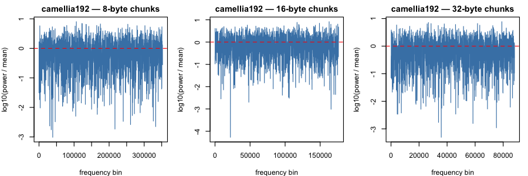

### Camellia-256 (`camellia256`)

Verdict: PASS &mdash; 0 test rejection(s) at $\alpha = 0.001$, 0 entropy miss(es) at $\mathrm{tol} = 0.001$ (total 0 / 22).

Byte-stream Shannon entropy: **8.000003 bits/byte** (ideal: $8$; signed deviation $H - 8 = 3.32 \times 10^{-6}$ bits).

**8-byte chunks** (704,810 samples; chunk-entropy 8.000011 bits; signed deviation $H - 8 = 1.10 \times 10^{-5}$ bits)

Moments (sample, ideal, dev):

| $k$ | sample $m_k$ | ideal $1/(k+1)$ | dev |
|-----|--------------|-----------------|-----|
| 1 | 0.499685 | 0.500000 | 3.15e-04 |
| 2 | 0.333019 | 0.333333 | 3.14e-04 |
| 3 | 0.249692 | 0.250000 | 3.08e-04 |
| 4 | 0.199699 | 0.200000 | 3.01e-04 |
| 5 | 0.166376 | 0.166667 | 2.91e-04 |
| 6 | 0.142580 | 0.142857 | 2.77e-04 |
| 7 | 0.124739 | 0.125000 | 2.61e-04 |
| 8 | 0.110867 | 0.111111 | 2.44e-04 |
| 9 | 0.099772 | 0.100000 | 2.28e-04 |
| 10 | 0.090697 | 0.090909 | 2.12e-04 |

Tests:

| test | p |
|------|---|
| FFT peak/mean | 11.90 |
| FFT spectrum KS (vs flat) | 0.395 |
| KS vs Uniform(0,1) | 0.649 |
| randtoolbox gap.test | 0.236 |
| randtoolbox freq.test (16 bins) | 0.577 |
| randtoolbox order.test (d=4) | 0.703 |
| tseries runs.test (bits) | 0.230 |

**16-byte chunks** (352,405 samples; chunk-entropy 8.000035 bits; signed deviation $H - 8 = 3.45 \times 10^{-5}$ bits)

Moments (sample, ideal, dev):

| $k$ | sample $m_k$ | ideal $1/(k+1)$ | dev |
|-----|--------------|-----------------|-----|
| 1 | 0.499302 | 0.500000 | 6.98e-04 |
| 2 | 0.332555 | 0.333333 | 7.78e-04 |
| 3 | 0.249204 | 0.250000 | 7.96e-04 |
| 4 | 0.199204 | 0.200000 | 7.96e-04 |
| 5 | 0.165884 | 0.166667 | 7.82e-04 |
| 6 | 0.142096 | 0.142857 | 7.61e-04 |
| 7 | 0.124265 | 0.125000 | 7.35e-04 |
| 8 | 0.110403 | 0.111111 | 7.08e-04 |
| 9 | 0.099318 | 0.100000 | 6.82e-04 |
| 10 | 0.090253 | 0.090909 | 6.56e-04 |

Tests:

| test | p |
|------|---|
| FFT peak/mean | 12.06 |
| FFT spectrum KS (vs flat) | 0.512 |
| KS vs Uniform(0,1) | 0.308 |
| randtoolbox gap.test | 0.122 |
| randtoolbox freq.test (16 bins) | 0.816 |
| randtoolbox order.test (d=4) | 0.373 |
| tseries runs.test (bits) | 0.230 |

**32-byte chunks** (176,202 samples; chunk-entropy 8.000072 bits; signed deviation $H - 8 = 7.17 \times 10^{-5}$ bits)

Moments (sample, ideal, dev):

| $k$ | sample $m_k$ | ideal $1/(k+1)$ | dev |
|-----|--------------|-----------------|-----|
| 1 | 0.499336 | 0.500000 | 6.64e-04 |
| 2 | 0.332645 | 0.333333 | 6.88e-04 |
| 3 | 0.249224 | 0.250000 | 7.76e-04 |
| 4 | 0.199140 | 0.200000 | 8.60e-04 |
| 5 | 0.165747 | 0.166667 | 9.20e-04 |
| 6 | 0.141900 | 0.142857 | 9.57e-04 |
| 7 | 0.124022 | 0.125000 | 9.78e-04 |
| 8 | 0.110124 | 0.111111 | 9.87e-04 |
| 9 | 0.099012 | 0.100000 | 9.88e-04 |
| 10 | 0.089924 | 0.090909 | 9.85e-04 |

Tests:

| test | p |
|------|---|
| FFT peak/mean | 12.65 |
| FFT spectrum KS (vs flat) | 0.163 |
| KS vs Uniform(0,1) | 0.367 |
| randtoolbox gap.test | 0.728 |
| randtoolbox freq.test (16 bins) | 0.175 |
| randtoolbox order.test (d=4) | 0.453 |
| tseries runs.test (bits) | 0.230 |

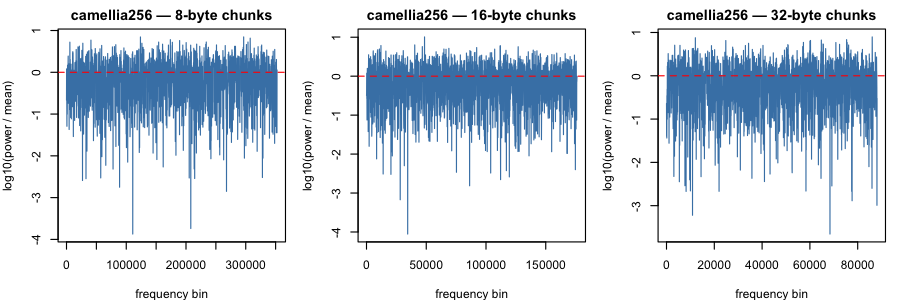

### CAST-128 (`cast128`)

Verdict: PASS &mdash; 0 test rejection(s) at $\alpha = 0.001$, 0 entropy miss(es) at $\mathrm{tol} = 0.001$ (total 0 / 22).

Byte-stream Shannon entropy: **7.999999 bits/byte** (ideal: $8$; signed deviation $H - 8 = -5.59 \times 10^{-7}$ bits).

**8-byte chunks** (704,810 samples; chunk-entropy 8.000020 bits; signed deviation $H - 8 = 1.99 \times 10^{-5}$ bits)

Moments (sample, ideal, dev):

| $k$ | sample $m_k$ | ideal $1/(k+1)$ | dev |
|-----|--------------|-----------------|-----|
| 1 | 0.499999 | 0.500000 | 1.37e-06 |
| 2 | 0.333413 | 0.333333 | 7.96e-05 |
| 3 | 0.250128 | 0.250000 | 1.28e-04 |
| 4 | 0.200156 | 0.200000 | 1.56e-04 |
| 5 | 0.166839 | 0.166667 | 1.72e-04 |
| 6 | 0.143039 | 0.142857 | 1.82e-04 |
| 7 | 0.125187 | 0.125000 | 1.87e-04 |
| 8 | 0.111301 | 0.111111 | 1.90e-04 |
| 9 | 0.100191 | 0.100000 | 1.91e-04 |
| 10 | 0.091099 | 0.090909 | 1.90e-04 |

Tests:

| test | p |
|------|---|
| FFT peak/mean | 13.25 |
| FFT spectrum KS (vs flat) | 0.190 |
| KS vs Uniform(0,1) | 0.984 |
| randtoolbox gap.test | 0.930 |
| randtoolbox freq.test (16 bins) | 0.873 |
| randtoolbox order.test (d=4) | 0.806 |
| tseries runs.test (bits) | 0.176 |

**16-byte chunks** (352,405 samples; chunk-entropy 8.000050 bits; signed deviation $H - 8 = 5.01 \times 10^{-5}$ bits)

Moments (sample, ideal, dev):

| $k$ | sample $m_k$ | ideal $1/(k+1)$ | dev |
|-----|--------------|-----------------|-----|
| 1 | 0.500325 | 0.500000 | 3.25e-04 |
| 2 | 0.333648 | 0.333333 | 3.14e-04 |
| 3 | 0.250317 | 0.250000 | 3.17e-04 |
| 4 | 0.200323 | 0.200000 | 3.23e-04 |
| 5 | 0.166993 | 0.166667 | 3.26e-04 |
| 6 | 0.143181 | 0.142857 | 3.24e-04 |
| 7 | 0.125317 | 0.125000 | 3.17e-04 |
| 8 | 0.111418 | 0.111111 | 3.07e-04 |
| 9 | 0.100295 | 0.100000 | 2.95e-04 |
| 10 | 0.091190 | 0.090909 | 2.81e-04 |

Tests:

| test | p |
|------|---|
| FFT peak/mean | 13.62 |
| FFT spectrum KS (vs flat) | 0.931 |
| KS vs Uniform(0,1) | 0.867 |
| randtoolbox gap.test | 0.863 |
| randtoolbox freq.test (16 bins) | 0.818 |
| randtoolbox order.test (d=4) | 0.790 |
| tseries runs.test (bits) | 0.176 |

**32-byte chunks** (176,202 samples; chunk-entropy 8.000028 bits; signed deviation $H - 8 = 2.77 \times 10^{-5}$ bits)

Moments (sample, ideal, dev):

| $k$ | sample $m_k$ | ideal $1/(k+1)$ | dev |
|-----|--------------|-----------------|-----|
| 1 | 0.500073 | 0.500000 | 7.29e-05 |
| 2 | 0.333347 | 0.333333 | 1.38e-05 |
| 3 | 0.250019 | 0.250000 | 1.92e-05 |
| 4 | 0.200040 | 0.200000 | 4.05e-05 |
| 5 | 0.166723 | 0.166667 | 5.68e-05 |
| 6 | 0.142920 | 0.142857 | 6.32e-05 |
| 7 | 0.125061 | 0.125000 | 6.09e-05 |
| 8 | 0.111163 | 0.111111 | 5.21e-05 |
| 9 | 0.100039 | 0.100000 | 3.94e-05 |
| 10 | 0.090934 | 0.090909 | 2.45e-05 |

Tests:

| test | p |
|------|---|
| FFT peak/mean | 10.67 |
| FFT spectrum KS (vs flat) | 0.836 |
| KS vs Uniform(0,1) | 0.881 |
| randtoolbox gap.test | 0.003 |
| randtoolbox freq.test (16 bins) | 0.561 |
| randtoolbox order.test (d=4) | 0.406 |
| tseries runs.test (bits) | 0.176 |

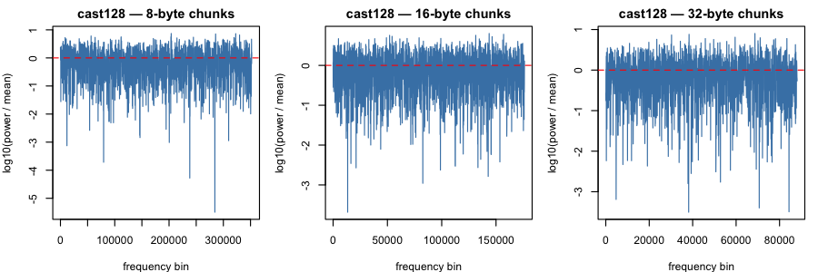

### DES (`des`)

Verdict: PASS &mdash; 0 test rejection(s) at $\alpha = 0.001$, 0 entropy miss(es) at $\mathrm{tol} = 0.001$ (total 0 / 22).

Byte-stream Shannon entropy: **7.999997 bits/byte** (ideal: $8$; signed deviation $H - 8 = -2.62 \times 10^{-6}$ bits).

**8-byte chunks** (704,810 samples; chunk-entropy 8.000000 bits; signed deviation $H - 8 = -3.97 \times 10^{-7}$ bits)

Moments (sample, ideal, dev):

| $k$ | sample $m_k$ | ideal $1/(k+1)$ | dev |
|-----|--------------|-----------------|-----|
| 1 | 0.499965 | 0.500000 | 3.47e-05 |
| 2 | 0.333230 | 0.333333 | 1.03e-04 |
| 3 | 0.249903 | 0.250000 | 9.65e-05 |
| 4 | 0.199934 | 0.200000 | 6.64e-05 |
| 5 | 0.166634 | 0.166667 | 3.23e-05 |
| 6 | 0.142856 | 0.142857 | 1.05e-06 |
| 7 | 0.125025 | 0.125000 | 2.52e-05 |
| 8 | 0.111157 | 0.111111 | 4.63e-05 |
| 9 | 0.100063 | 0.100000 | 6.29e-05 |
| 10 | 0.090985 | 0.090909 | 7.58e-05 |

Tests:

| test | p |
|------|---|
| FFT peak/mean | 15.47 |
| FFT spectrum KS (vs flat) | 0.952 |
| KS vs Uniform(0,1) | 0.360 |
| randtoolbox gap.test | 0.275 |
| randtoolbox freq.test (16 bins) | 0.523 |
| randtoolbox order.test (d=4) | 0.406 |
| tseries runs.test (bits) | 0.952 |

**16-byte chunks** (352,405 samples; chunk-entropy 7.999996 bits; signed deviation $H - 8 = -4.29 \times 10^{-6}$ bits)

Moments (sample, ideal, dev):

| $k$ | sample $m_k$ | ideal $1/(k+1)$ | dev |
|-----|--------------|-----------------|-----|
| 1 | 0.499934 | 0.500000 | 6.64e-05 |
| 2 | 0.333247 | 0.333333 | 8.68e-05 |
| 3 | 0.249955 | 0.250000 | 4.54e-05 |
| 4 | 0.200001 | 0.200000 | 7.43e-07 |
| 5 | 0.166705 | 0.166667 | 3.82e-05 |
| 6 | 0.142923 | 0.142857 | 6.61e-05 |
| 7 | 0.125086 | 0.125000 | 8.59e-05 |
| 8 | 0.111211 | 0.111111 | 9.96e-05 |
| 9 | 0.100109 | 0.100000 | 1.09e-04 |
| 10 | 0.091024 | 0.090909 | 1.15e-04 |

Tests:

| test | p |
|------|---|
| FFT peak/mean | 14.19 |
| FFT spectrum KS (vs flat) | 0.905 |
| KS vs Uniform(0,1) | 0.844 |
| randtoolbox gap.test | 0.394 |
| randtoolbox freq.test (16 bins) | 0.988 |
| randtoolbox order.test (d=4) | 0.240 |
| tseries runs.test (bits) | 0.952 |

**32-byte chunks** (176,202 samples; chunk-entropy 7.999994 bits; signed deviation $H - 8 = -6.33 \times 10^{-6}$ bits)

Moments (sample, ideal, dev):

| $k$ | sample $m_k$ | ideal $1/(k+1)$ | dev |
|-----|--------------|-----------------|-----|
| 1 | 0.500113 | 0.500000 | 1.13e-04 |
| 2 | 0.333256 | 0.333333 | 7.70e-05 |
| 3 | 0.249877 | 0.250000 | 1.23e-04 |
| 4 | 0.199880 | 0.200000 | 1.20e-04 |
| 5 | 0.166561 | 0.166667 | 1.05e-04 |
| 6 | 0.142764 | 0.142857 | 9.27e-05 |
| 7 | 0.124915 | 0.125000 | 8.50e-05 |
| 8 | 0.111029 | 0.111111 | 8.19e-05 |
| 9 | 0.099917 | 0.100000 | 8.26e-05 |
| 10 | 0.090823 | 0.090909 | 8.59e-05 |

Tests:

| test | p |
|------|---|
| FFT peak/mean | 12.07 |
| FFT spectrum KS (vs flat) | 0.464 |
| KS vs Uniform(0,1) | 0.746 |
| randtoolbox gap.test | 0.916 |
| randtoolbox freq.test (16 bins) | 0.927 |
| randtoolbox order.test (d=4) | 0.230 |
| tseries runs.test (bits) | 0.952 |

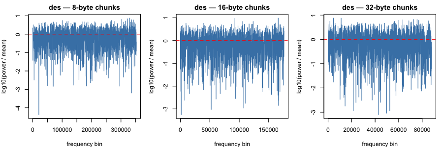

### 3DES (`3des`)

Verdict: PASS &mdash; 0 test rejection(s) at $\alpha = 0.001$, 0 entropy miss(es) at $\mathrm{tol} = 0.001$ (total 0 / 22).

Byte-stream Shannon entropy: **8.000001 bits/byte** (ideal: $8$; signed deviation $H - 8 = 1.11 \times 10^{-6}$ bits).

**8-byte chunks** (704,810 samples; chunk-entropy 8.000006 bits; signed deviation $H - 8 = 5.80 \times 10^{-6}$ bits)

Moments (sample, ideal, dev):

| $k$ | sample $m_k$ | ideal $1/(k+1)$ | dev |
|-----|--------------|-----------------|-----|
| 1 | 0.500598 | 0.500000 | 5.98e-04 |
| 2 | 0.334015 | 0.333333 | 6.81e-04 |
| 3 | 0.250664 | 0.250000 | 6.64e-04 |
| 4 | 0.200627 | 0.200000 | 6.27e-04 |
| 5 | 0.167255 | 0.166667 | 5.88e-04 |
| 6 | 0.143409 | 0.142857 | 5.52e-04 |
| 7 | 0.125519 | 0.125000 | 5.19e-04 |
| 8 | 0.111599 | 0.111111 | 4.88e-04 |
| 9 | 0.100460 | 0.100000 | 4.60e-04 |
| 10 | 0.091344 | 0.090909 | 4.35e-04 |

Tests:

| test | p |
|------|---|
| FFT peak/mean | 12.46 |
| FFT spectrum KS (vs flat) | 0.662 |
| KS vs Uniform(0,1) | 0.228 |
| randtoolbox gap.test | 0.378 |
| randtoolbox freq.test (16 bins) | 0.465 |
| randtoolbox order.test (d=4) | 0.655 |
| tseries runs.test (bits) | 0.143 |

**16-byte chunks** (352,405 samples; chunk-entropy 7.999982 bits; signed deviation $H - 8 = -1.81 \times 10^{-5}$ bits)

Moments (sample, ideal, dev):

| $k$ | sample $m_k$ | ideal $1/(k+1)$ | dev |
|-----|--------------|-----------------|-----|
| 1 | 0.500112 | 0.500000 | 1.12e-04 |
| 2 | 0.333550 | 0.333333 | 2.17e-04 |
| 3 | 0.250243 | 0.250000 | 2.43e-04 |
| 4 | 0.200245 | 0.200000 | 2.45e-04 |
| 5 | 0.166907 | 0.166667 | 2.41e-04 |
| 6 | 0.143093 | 0.142857 | 2.36e-04 |
| 7 | 0.125231 | 0.125000 | 2.31e-04 |
| 8 | 0.111337 | 0.111111 | 2.26e-04 |
| 9 | 0.100221 | 0.100000 | 2.21e-04 |
| 10 | 0.091123 | 0.090909 | 2.14e-04 |

Tests:

| test | p |
|------|---|
| FFT peak/mean | 11.02 |
| FFT spectrum KS (vs flat) | 0.874 |
| KS vs Uniform(0,1) | 0.952 |
| randtoolbox gap.test | 0.611 |
| randtoolbox freq.test (16 bins) | 0.727 |
| randtoolbox order.test (d=4) | 0.806 |
| tseries runs.test (bits) | 0.143 |

**32-byte chunks** (176,202 samples; chunk-entropy 7.999975 bits; signed deviation $H - 8 = -2.50 \times 10^{-5}$ bits)

Moments (sample, ideal, dev):

| $k$ | sample $m_k$ | ideal $1/(k+1)$ | dev |
|-----|--------------|-----------------|-----|
| 1 | 0.499348 | 0.500000 | 6.52e-04 |
| 2 | 0.332700 | 0.333333 | 6.34e-04 |
| 3 | 0.249409 | 0.250000 | 5.91e-04 |
| 4 | 0.199439 | 0.200000 | 5.61e-04 |
| 5 | 0.166128 | 0.166667 | 5.38e-04 |
| 6 | 0.142336 | 0.142857 | 5.21e-04 |
| 7 | 0.124495 | 0.125000 | 5.05e-04 |
| 8 | 0.110619 | 0.111111 | 4.92e-04 |
| 9 | 0.099520 | 0.100000 | 4.80e-04 |
| 10 | 0.090441 | 0.090909 | 4.68e-04 |

Tests:

| test | p |
|------|---|
| FFT peak/mean | 12.04 |
| FFT spectrum KS (vs flat) | 0.900 |
| KS vs Uniform(0,1) | 0.739 |
| randtoolbox gap.test | 0.551 |
| randtoolbox freq.test (16 bins) | 0.914 |
| randtoolbox order.test (d=4) | 0.493 |
| tseries runs.test (bits) | 0.143 |

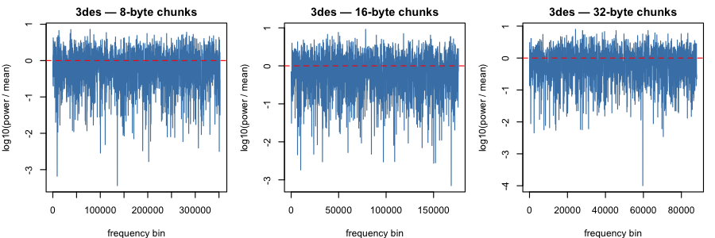

### Kuznyechik (`grasshopper`)

Verdict: PASS &mdash; 0 test rejection(s) at $\alpha = 0.001$, 0 entropy miss(es) at $\mathrm{tol} = 0.001$ (total 0 / 22).

Byte-stream Shannon entropy: **8.000003 bits/byte** (ideal: $8$; signed deviation $H - 8 = 2.56 \times 10^{-6}$ bits).

**8-byte chunks** (704,810 samples; chunk-entropy 7.999985 bits; signed deviation $H - 8 = -1.54 \times 10^{-5}$ bits)

Moments (sample, ideal, dev):

| $k$ | sample $m_k$ | ideal $1/(k+1)$ | dev |
|-----|--------------|-----------------|-----|
| 1 | 0.500213 | 0.500000 | 2.13e-04 |
| 2 | 0.333580 | 0.333333 | 2.47e-04 |
| 3 | 0.250218 | 0.250000 | 2.18e-04 |
| 4 | 0.200174 | 0.200000 | 1.74e-04 |
| 5 | 0.166797 | 0.166667 | 1.31e-04 |
| 6 | 0.142950 | 0.142857 | 9.32e-05 |
| 7 | 0.125062 | 0.125000 | 6.17e-05 |
| 8 | 0.111147 | 0.111111 | 3.59e-05 |
| 9 | 0.100015 | 0.100000 | 1.50e-05 |
| 10 | 0.090907 | 0.090909 | 1.80e-06 |

Tests:

| test | p |
|------|---|
| FFT peak/mean | 12.73 |
| FFT spectrum KS (vs flat) | 0.334 |
| KS vs Uniform(0,1) | 0.460 |
| randtoolbox gap.test | 0.239 |
| randtoolbox freq.test (16 bins) | 0.157 |
| randtoolbox order.test (d=4) | 0.418 |
| tseries runs.test (bits) | 0.249 |

**16-byte chunks** (352,405 samples; chunk-entropy 8.000038 bits; signed deviation $H - 8 = 3.81 \times 10^{-5}$ bits)

Moments (sample, ideal, dev):

| $k$ | sample $m_k$ | ideal $1/(k+1)$ | dev |
|-----|--------------|-----------------|-----|
| 1 | 0.499702 | 0.500000 | 2.98e-04 |
| 2 | 0.333085 | 0.333333 | 2.48e-04 |
| 3 | 0.249788 | 0.250000 | 2.12e-04 |
| 4 | 0.199809 | 0.200000 | 1.91e-04 |
| 5 | 0.166490 | 0.166667 | 1.77e-04 |
| 6 | 0.142692 | 0.142857 | 1.65e-04 |
| 7 | 0.124844 | 0.125000 | 1.56e-04 |
| 8 | 0.110964 | 0.111111 | 1.47e-04 |
| 9 | 0.099860 | 0.100000 | 1.40e-04 |
| 10 | 0.090777 | 0.090909 | 1.32e-04 |

Tests:

| test | p |
|------|---|
| FFT peak/mean | 13.43 |
| FFT spectrum KS (vs flat) | 0.401 |
| KS vs Uniform(0,1) | 0.866 |
| randtoolbox gap.test | 0.854 |
| randtoolbox freq.test (16 bins) | 0.557 |
| randtoolbox order.test (d=4) | 0.240 |
| tseries runs.test (bits) | 0.249 |

**32-byte chunks** (176,202 samples; chunk-entropy 8.000040 bits; signed deviation $H - 8 = 3.96 \times 10^{-5}$ bits)

Moments (sample, ideal, dev):

| $k$ | sample $m_k$ | ideal $1/(k+1)$ | dev |
|-----|--------------|-----------------|-----|
| 1 | 0.499393 | 0.500000 | 6.07e-04 |
| 2 | 0.332628 | 0.333333 | 7.05e-04 |
| 3 | 0.249340 | 0.250000 | 6.60e-04 |
| 4 | 0.199409 | 0.200000 | 5.91e-04 |
| 5 | 0.166142 | 0.166667 | 5.25e-04 |
| 6 | 0.142388 | 0.142857 | 4.69e-04 |
| 7 | 0.124577 | 0.125000 | 4.23e-04 |
| 8 | 0.110724 | 0.111111 | 3.87e-04 |
| 9 | 0.099641 | 0.100000 | 3.59e-04 |
| 10 | 0.090573 | 0.090909 | 3.36e-04 |

Tests:

| test | p |
|------|---|
| FFT peak/mean | 11.55 |
| FFT spectrum KS (vs flat) | 0.771 |
| KS vs Uniform(0,1) | 0.440 |
| randtoolbox gap.test | 0.253 |
| randtoolbox freq.test (16 bins) | 0.097 |
| randtoolbox order.test (d=4) | 0.054 |
| tseries runs.test (bits) | 0.249 |

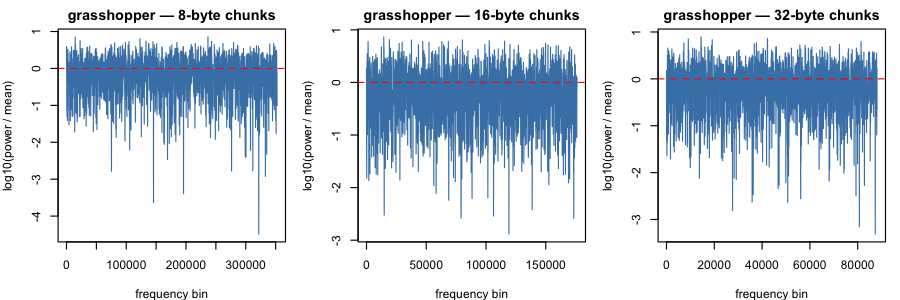

### Magma (`magma`)

Verdict: PASS &mdash; 0 test rejection(s) at $\alpha = 0.001$, 0 entropy miss(es) at $\mathrm{tol} = 0.001$ (total 0 / 22).

Byte-stream Shannon entropy: **8.000003 bits/byte** (ideal: $8$; signed deviation $H - 8 = 2.52 \times 10^{-6}$ bits).

**8-byte chunks** (704,810 samples; chunk-entropy 8.000012 bits; signed deviation $H - 8 = 1.19 \times 10^{-5}$ bits)

Moments (sample, ideal, dev):

| $k$ | sample $m_k$ | ideal $1/(k+1)$ | dev |
|-----|--------------|-----------------|-----|
| 1 | 0.500033 | 0.500000 | 3.31e-05 |
| 2 | 0.333359 | 0.333333 | 2.59e-05 |
| 3 | 0.250037 | 0.250000 | 3.70e-05 |
| 4 | 0.200055 | 0.200000 | 5.46e-05 |
| 5 | 0.166737 | 0.166667 | 7.06e-05 |
| 6 | 0.142940 | 0.142857 | 8.30e-05 |
| 7 | 0.125092 | 0.125000 | 9.17e-05 |
| 8 | 0.111208 | 0.111111 | 9.71e-05 |
| 9 | 0.100100 | 0.100000 | 9.99e-05 |
| 10 | 0.091010 | 0.090909 | 1.01e-04 |

Tests:

| test | p |
|------|---|
| FFT peak/mean | 14.75 |
| FFT spectrum KS (vs flat) | 0.068 |
| KS vs Uniform(0,1) | 0.914 |
| randtoolbox gap.test | 0.260 |
| randtoolbox freq.test (16 bins) | 0.791 |
| randtoolbox order.test (d=4) | 0.805 |
| tseries runs.test (bits) | 0.597 |

**16-byte chunks** (352,405 samples; chunk-entropy 7.999988 bits; signed deviation $H - 8 = -1.20 \times 10^{-5}$ bits)

Moments (sample, ideal, dev):

| $k$ | sample $m_k$ | ideal $1/(k+1)$ | dev |
|-----|--------------|-----------------|-----|
| 1 | 0.499882 | 0.500000 | 1.18e-04 |
| 2 | 0.333242 | 0.333333 | 9.13e-05 |
| 3 | 0.249961 | 0.250000 | 3.87e-05 |
| 4 | 0.200016 | 0.200000 | 1.60e-05 |
| 5 | 0.166729 | 0.166667 | 6.25e-05 |
| 6 | 0.142955 | 0.142857 | 9.83e-05 |
| 7 | 0.125124 | 0.125000 | 1.24e-04 |
| 8 | 0.111253 | 0.111111 | 1.41e-04 |
| 9 | 0.100152 | 0.100000 | 1.52e-04 |
| 10 | 0.091067 | 0.090909 | 1.58e-04 |

Tests:

| test | p |
|------|---|
| FFT peak/mean | 12.57 |
| FFT spectrum KS (vs flat) | 0.446 |
| KS vs Uniform(0,1) | 0.845 |
| randtoolbox gap.test | 0.861 |
| randtoolbox freq.test (16 bins) | 0.878 |
| randtoolbox order.test (d=4) | 0.858 |
| tseries runs.test (bits) | 0.597 |

**32-byte chunks** (176,202 samples; chunk-entropy 7.999987 bits; signed deviation $H - 8 = -1.33 \times 10^{-5}$ bits)

Moments (sample, ideal, dev):

| $k$ | sample $m_k$ | ideal $1/(k+1)$ | dev |
|-----|--------------|-----------------|-----|
| 1 | 0.499129 | 0.500000 | 8.71e-04 |
| 2 | 0.332282 | 0.333333 | 1.05e-03 |
| 3 | 0.249002 | 0.250000 | 9.98e-04 |
| 4 | 0.199115 | 0.200000 | 8.85e-04 |
| 5 | 0.165899 | 0.166667 | 7.68e-04 |
| 6 | 0.142191 | 0.142857 | 6.66e-04 |
| 7 | 0.124418 | 0.125000 | 5.82e-04 |
| 8 | 0.110598 | 0.111111 | 5.13e-04 |
| 9 | 0.099542 | 0.100000 | 4.58e-04 |
| 10 | 0.090496 | 0.090909 | 4.13e-04 |

Tests:

| test | p |
|------|---|
| FFT peak/mean | 13.65 |
| FFT spectrum KS (vs flat) | 0.582 |
| KS vs Uniform(0,1) | 0.042 |
| randtoolbox gap.test | 0.875 |
| randtoolbox freq.test (16 bins) | 0.286 |
| randtoolbox order.test (d=4) | 0.409 |
| tseries runs.test (bits) | 0.597 |

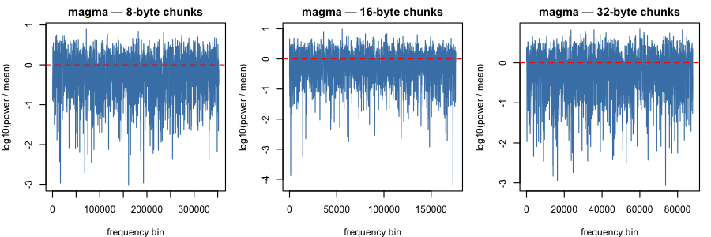

### PRESENT-80 (`present80`)

Verdict: PASS &mdash; 1 test rejection(s) at $\alpha = 0.001$, 0 entropy miss(es) at $\mathrm{tol} = 0.001$ (total 1 / 22).

Byte-stream Shannon entropy: **7.999999 bits/byte** (ideal: $8$; signed deviation $H - 8 = -5.86 \times 10^{-7}$ bits).

**8-byte chunks** (704,810 samples; chunk-entropy 8.000017 bits; signed deviation $H - 8 = 1.69 \times 10^{-5}$ bits)

Moments (sample, ideal, dev):

| $k$ | sample $m_k$ | ideal $1/(k+1)$ | dev |
|-----|--------------|-----------------|-----|
| 1 | 0.499844 | 0.500000 | 1.56e-04 |
| 2 | 0.333388 | 0.333333 | 5.46e-05 |
| 3 | 0.250152 | 0.250000 | 1.52e-04 |
| 4 | 0.200181 | 0.200000 | 1.81e-04 |
| 5 | 0.166846 | 0.166667 | 1.79e-04 |
| 6 | 0.143021 | 0.142857 | 1.64e-04 |
| 7 | 0.125144 | 0.125000 | 1.44e-04 |
| 8 | 0.111235 | 0.111111 | 1.24e-04 |
| 9 | 0.100105 | 0.100000 | 1.05e-04 |
| 10 | 0.090996 | 0.090909 | 8.71e-05 |

Tests:

| test | p |
|------|---|
| FFT peak/mean | 12.50 |
| FFT spectrum KS (vs flat) | 0.978 |
| KS vs Uniform(0,1) | 0.396 |
| randtoolbox gap.test | 3.4e-05 |
| randtoolbox freq.test (16 bins) | 0.313 |
| randtoolbox order.test (d=4) | 0.123 |
| tseries runs.test (bits) | 0.216 |

**16-byte chunks** (352,405 samples; chunk-entropy 8.000017 bits; signed deviation $H - 8 = 1.69 \times 10^{-5}$ bits)

Moments (sample, ideal, dev):

| $k$ | sample $m_k$ | ideal $1/(k+1)$ | dev |
|-----|--------------|-----------------|-----|
| 1 | 0.500301 | 0.500000 | 3.01e-04 |
| 2 | 0.333931 | 0.333333 | 5.98e-04 |
| 3 | 0.250694 | 0.250000 | 6.94e-04 |
| 4 | 0.200697 | 0.200000 | 6.97e-04 |
| 5 | 0.167329 | 0.166667 | 6.62e-04 |
| 6 | 0.143472 | 0.142857 | 6.15e-04 |
| 7 | 0.125565 | 0.125000 | 5.65e-04 |
| 8 | 0.111628 | 0.111111 | 5.17e-04 |
| 9 | 0.100472 | 0.100000 | 4.72e-04 |
| 10 | 0.091341 | 0.090909 | 4.32e-04 |

Tests:

| test | p |
|------|---|
| FFT peak/mean | 13.11 |
| FFT spectrum KS (vs flat) | 0.696 |
| KS vs Uniform(0,1) | 0.208 |
| randtoolbox gap.test | 0.598 |
| randtoolbox freq.test (16 bins) | 0.405 |
| randtoolbox order.test (d=4) | 0.806 |
| tseries runs.test (bits) | 0.216 |

**32-byte chunks** (176,202 samples; chunk-entropy 7.999740 bits; signed deviation $H - 8 = -2.60 \times 10^{-4}$ bits)

Moments (sample, ideal, dev):

| $k$ | sample $m_k$ | ideal $1/(k+1)$ | dev |
|-----|--------------|-----------------|-----|
| 1 | 0.499856 | 0.500000 | 1.44e-04 |
| 2 | 0.333570 | 0.333333 | 2.37e-04 |
| 3 | 0.250353 | 0.250000 | 3.53e-04 |
| 4 | 0.200346 | 0.200000 | 3.46e-04 |
| 5 | 0.166964 | 0.166667 | 2.97e-04 |
| 6 | 0.143097 | 0.142857 | 2.40e-04 |
| 7 | 0.125185 | 0.125000 | 1.85e-04 |
| 8 | 0.111249 | 0.111111 | 1.38e-04 |
| 9 | 0.100098 | 0.100000 | 9.84e-05 |
| 10 | 0.090975 | 0.090909 | 6.55e-05 |

Tests:

| test | p |
|------|---|
| FFT peak/mean | 10.55 |
| FFT spectrum KS (vs flat) | 0.523 |
| KS vs Uniform(0,1) | 0.272 |
| randtoolbox gap.test | 0.758 |
| randtoolbox freq.test (16 bins) | 0.050 |
| randtoolbox order.test (d=4) | 0.740 |
| tseries runs.test (bits) | 0.216 |

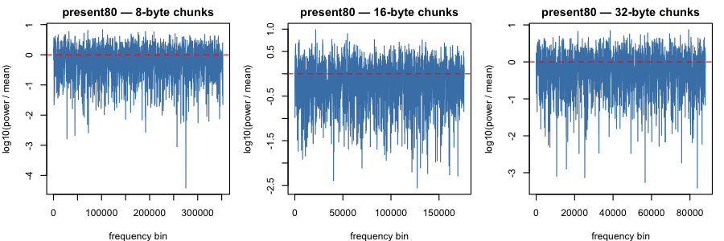

### PRESENT-128 (`present128`)

Verdict: PASS &mdash; 0 test rejection(s) at $\alpha = 0.001$, 0 entropy miss(es) at $\mathrm{tol} = 0.001$ (total 0 / 22).

Byte-stream Shannon entropy: **7.999996 bits/byte** (ideal: $8$; signed deviation $H - 8 = -4.27 \times 10^{-6}$ bits).

**8-byte chunks** (704,810 samples; chunk-entropy 7.999981 bits; signed deviation $H - 8 = -1.89 \times 10^{-5}$ bits)

Moments (sample, ideal, dev):

| $k$ | sample $m_k$ | ideal $1/(k+1)$ | dev |
|-----|--------------|-----------------|-----|
| 1 | 0.500199 | 0.500000 | 1.99e-04 |
| 2 | 0.333438 | 0.333333 | 1.04e-04 |
| 3 | 0.250009 | 0.250000 | 8.98e-06 |
| 4 | 0.199944 | 0.200000 | 5.60e-05 |
| 5 | 0.166570 | 0.166667 | 9.65e-05 |
| 6 | 0.142736 | 0.142857 | 1.21e-04 |
| 7 | 0.124864 | 0.125000 | 1.36e-04 |
| 8 | 0.110967 | 0.111111 | 1.44e-04 |
| 9 | 0.099851 | 0.100000 | 1.49e-04 |
| 10 | 0.090757 | 0.090909 | 1.52e-04 |

Tests:

| test | p |
|------|---|
| FFT peak/mean | 14.58 |
| FFT spectrum KS (vs flat) | 0.969 |
| KS vs Uniform(0,1) | 0.251 |
| randtoolbox gap.test | 0.748 |
| randtoolbox freq.test (16 bins) | 0.060 |
| randtoolbox order.test (d=4) | 0.064 |
| tseries runs.test (bits) | 0.650 |

**16-byte chunks** (352,405 samples; chunk-entropy 7.999978 bits; signed deviation $H - 8 = -2.24 \times 10^{-5}$ bits)

Moments (sample, ideal, dev):

| $k$ | sample $m_k$ | ideal $1/(k+1)$ | dev |
|-----|--------------|-----------------|-----|
| 1 | 0.500450 | 0.500000 | 4.50e-04 |
| 2 | 0.333630 | 0.333333 | 2.96e-04 |
| 3 | 0.250135 | 0.250000 | 1.35e-04 |
| 4 | 0.200020 | 0.200000 | 2.03e-05 |
| 5 | 0.166610 | 0.166667 | 5.69e-05 |
| 6 | 0.142748 | 0.142857 | 1.09e-04 |
| 7 | 0.124856 | 0.125000 | 1.44e-04 |
| 8 | 0.110942 | 0.111111 | 1.69e-04 |
| 9 | 0.099814 | 0.100000 | 1.86e-04 |
| 10 | 0.090711 | 0.090909 | 1.98e-04 |

Tests:

| test | p |
|------|---|
| FFT peak/mean | 12.42 |
| FFT spectrum KS (vs flat) | 0.263 |
| KS vs Uniform(0,1) | 0.087 |
| randtoolbox gap.test | 0.983 |
| randtoolbox freq.test (16 bins) | 0.195 |
| randtoolbox order.test (d=4) | 0.399 |
| tseries runs.test (bits) | 0.650 |

**32-byte chunks** (176,202 samples; chunk-entropy 7.999917 bits; signed deviation $H - 8 = -8.33 \times 10^{-5}$ bits)

Moments (sample, ideal, dev):

| $k$ | sample $m_k$ | ideal $1/(k+1)$ | dev |
|-----|--------------|-----------------|-----|
| 1 | 0.500347 | 0.500000 | 3.47e-04 |
| 2 | 0.333562 | 0.333333 | 2.29e-04 |
| 3 | 0.250087 | 0.250000 | 8.71e-05 |
| 4 | 0.199985 | 0.200000 | 1.54e-05 |
| 5 | 0.166584 | 0.166667 | 8.25e-05 |
| 6 | 0.142733 | 0.142857 | 1.25e-04 |
| 7 | 0.124850 | 0.125000 | 1.50e-04 |
| 8 | 0.110947 | 0.111111 | 1.64e-04 |
| 9 | 0.099829 | 0.100000 | 1.71e-04 |
| 10 | 0.090736 | 0.090909 | 1.73e-04 |

Tests:

| test | p |
|------|---|
| FFT peak/mean | 12.70 |
| FFT spectrum KS (vs flat) | 0.684 |
| KS vs Uniform(0,1) | 0.636 |
| randtoolbox gap.test | 0.241 |
| randtoolbox freq.test (16 bins) | 0.201 |
| randtoolbox order.test (d=4) | 0.544 |
| tseries runs.test (bits) | 0.650 |

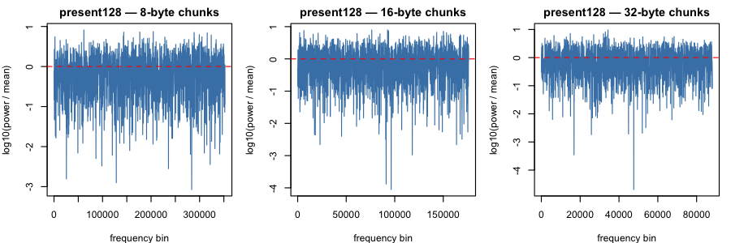

### SEED (`seed`)

Verdict: PASS &mdash; 1 test rejection(s) at $\alpha = 0.001$, 0 entropy miss(es) at $\mathrm{tol} = 0.001$ (total 1 / 22).

Byte-stream Shannon entropy: **8.000001 bits/byte** (ideal: $8$; signed deviation $H - 8 = 5.05 \times 10^{-7}$ bits).

**8-byte chunks** (704,810 samples; chunk-entropy 8.000006 bits; signed deviation $H - 8 = 5.66 \times 10^{-6}$ bits)

Moments (sample, ideal, dev):

| $k$ | sample $m_k$ | ideal $1/(k+1)$ | dev |
|-----|--------------|-----------------|-----|
| 1 | 0.500462 | 0.500000 | 4.62e-04 |
| 2 | 0.333770 | 0.333333 | 4.37e-04 |
| 3 | 0.250344 | 0.250000 | 3.44e-04 |
| 4 | 0.200257 | 0.200000 | 2.57e-04 |
| 5 | 0.166852 | 0.166667 | 1.86e-04 |
| 6 | 0.142987 | 0.142857 | 1.30e-04 |
| 7 | 0.125086 | 0.125000 | 8.61e-05 |
| 8 | 0.111163 | 0.111111 | 5.21e-05 |
| 9 | 0.100026 | 0.100000 | 2.56e-05 |
| 10 | 0.090914 | 0.090909 | 5.20e-06 |

Tests:

| test | p |
|------|---|
| FFT peak/mean | 12.47 |
| FFT spectrum KS (vs flat) | 0.450 |
| KS vs Uniform(0,1) | 0.278 |
| randtoolbox gap.test | 0.419 |
| randtoolbox freq.test (16 bins) | 0.278 |
| randtoolbox order.test (d=4) | 0.334 |
| tseries runs.test (bits) | 0.822 |

**16-byte chunks** (352,405 samples; chunk-entropy 8.000051 bits; signed deviation $H - 8 = 5.15 \times 10^{-5}$ bits)

Moments (sample, ideal, dev):

| $k$ | sample $m_k$ | ideal $1/(k+1)$ | dev |
|-----|--------------|-----------------|-----|
| 1 | 0.500250 | 0.500000 | 2.50e-04 |
| 2 | 0.333585 | 0.333333 | 2.52e-04 |
| 3 | 0.250197 | 0.250000 | 1.97e-04 |
| 4 | 0.200146 | 0.200000 | 1.46e-04 |
| 5 | 0.166775 | 0.166667 | 1.08e-04 |
| 6 | 0.142940 | 0.142857 | 8.24e-05 |
| 7 | 0.125065 | 0.125000 | 6.54e-05 |
| 8 | 0.111166 | 0.111111 | 5.45e-05 |
| 9 | 0.100048 | 0.100000 | 4.76e-05 |
| 10 | 0.090953 | 0.090909 | 4.37e-05 |

Tests:

| test | p |
|------|---|
| FFT peak/mean | 15.09 |
| FFT spectrum KS (vs flat) | 0.536 |
| KS vs Uniform(0,1) | 0.725 |
| randtoolbox gap.test | <1e-12 |
| randtoolbox freq.test (16 bins) | 0.776 |
| randtoolbox order.test (d=4) | 0.050 |
| tseries runs.test (bits) | 0.822 |

**32-byte chunks** (176,202 samples; chunk-entropy 8.000020 bits; signed deviation $H - 8 = 1.97 \times 10^{-5}$ bits)

Moments (sample, ideal, dev):

| $k$ | sample $m_k$ | ideal $1/(k+1)$ | dev |
|-----|--------------|-----------------|-----|
| 1 | 0.500269 | 0.500000 | 2.69e-04 |
| 2 | 0.333574 | 0.333333 | 2.40e-04 |
| 3 | 0.250174 | 0.250000 | 1.74e-04 |
| 4 | 0.200115 | 0.200000 | 1.15e-04 |
| 5 | 0.166737 | 0.166667 | 7.03e-05 |
| 6 | 0.142896 | 0.142857 | 3.93e-05 |
| 7 | 0.125019 | 0.125000 | 1.88e-05 |
| 8 | 0.111117 | 0.111111 | 6.07e-06 |
| 9 | 0.099999 | 0.100000 | 1.02e-06 |
| 10 | 0.090905 | 0.090909 | 4.02e-06 |

Tests:

| test | p |
|------|---|
| FFT peak/mean | 13.04 |
| FFT spectrum KS (vs flat) | 0.902 |
| KS vs Uniform(0,1) | 0.755 |
| randtoolbox gap.test | 0.638 |
| randtoolbox freq.test (16 bins) | 0.466 |
| randtoolbox order.test (d=4) | 0.616 |
| tseries runs.test (bits) | 0.822 |

### Serpent-128 (`serpent128`)

Verdict: PASS &mdash; 0 test rejection(s) at $\alpha = 0.001$, 0 entropy miss(es) at $\mathrm{tol} = 0.001$ (total 0 / 22).

Byte-stream Shannon entropy: **8.000000 bits/byte** (ideal: $8$; signed deviation $H - 8 = 4.09 \times 10^{-7}$ bits).

**8-byte chunks** (704,810 samples; chunk-entropy 8.000004 bits; signed deviation $H - 8 = 3.92 \times 10^{-6}$ bits)

Moments (sample, ideal, dev):

| $k$ | sample $m_k$ | ideal $1/(k+1)$ | dev |
|-----|--------------|-----------------|-----|
| 1 | 0.499545 | 0.500000 | 4.55e-04 |
| 2 | 0.332810 | 0.333333 | 5.23e-04 |
| 3 | 0.249486 | 0.250000 | 5.14e-04 |
| 4 | 0.199523 | 0.200000 | 4.77e-04 |
| 5 | 0.166233 | 0.166667 | 4.33e-04 |
| 6 | 0.142465 | 0.142857 | 3.92e-04 |
| 7 | 0.124645 | 0.125000 | 3.55e-04 |
| 8 | 0.110787 | 0.111111 | 3.24e-04 |
| 9 | 0.099701 | 0.100000 | 2.99e-04 |
| 10 | 0.090632 | 0.090909 | 2.77e-04 |

Tests:

| test | p |
|------|---|
| FFT peak/mean | 13.78 |
| FFT spectrum KS (vs flat) | 0.724 |
| KS vs Uniform(0,1) | 0.125 |
| randtoolbox gap.test | 0.554 |
| randtoolbox freq.test (16 bins) | 0.352 |
| randtoolbox order.test (d=4) | 0.527 |
| tseries runs.test (bits) | 0.496 |

**16-byte chunks** (352,405 samples; chunk-entropy 8.000026 bits; signed deviation $H - 8 = 2.59 \times 10^{-5}$ bits)

Moments (sample, ideal, dev):

| $k$ | sample $m_k$ | ideal $1/(k+1)$ | dev |
|-----|--------------|-----------------|-----|
| 1 | 0.499195 | 0.500000 | 8.05e-04 |
| 2 | 0.332382 | 0.333333 | 9.52e-04 |
| 3 | 0.249078 | 0.250000 | 9.22e-04 |
| 4 | 0.199156 | 0.200000 | 8.44e-04 |
| 5 | 0.165907 | 0.166667 | 7.60e-04 |
| 6 | 0.142173 | 0.142857 | 6.85e-04 |
| 7 | 0.124380 | 0.125000 | 6.20e-04 |
| 8 | 0.110545 | 0.111111 | 5.66e-04 |
| 9 | 0.099480 | 0.100000 | 5.20e-04 |
| 10 | 0.090428 | 0.090909 | 4.81e-04 |

Tests:

| test | p |
|------|---|
| FFT peak/mean | 12.52 |
| FFT spectrum KS (vs flat) | 0.785 |
| KS vs Uniform(0,1) | 0.033 |
| randtoolbox gap.test | 0.723 |
| randtoolbox freq.test (16 bins) | 0.215 |
| randtoolbox order.test (d=4) | 0.556 |
| tseries runs.test (bits) | 0.496 |

**32-byte chunks** (176,202 samples; chunk-entropy 8.000041 bits; signed deviation $H - 8 = 4.15 \times 10^{-5}$ bits)

Moments (sample, ideal, dev):

| $k$ | sample $m_k$ | ideal $1/(k+1)$ | dev |
|-----|--------------|-----------------|-----|
| 1 | 0.499072 | 0.500000 | 9.28e-04 |
| 2 | 0.332158 | 0.333333 | 1.18e-03 |
| 3 | 0.248758 | 0.250000 | 1.24e-03 |
| 4 | 0.198762 | 0.200000 | 1.24e-03 |
| 5 | 0.165455 | 0.166667 | 1.21e-03 |
| 6 | 0.141674 | 0.142857 | 1.18e-03 |
| 7 | 0.123845 | 0.125000 | 1.16e-03 |
| 8 | 0.109981 | 0.111111 | 1.13e-03 |
| 9 | 0.098892 | 0.100000 | 1.11e-03 |
| 10 | 0.089822 | 0.090909 | 1.09e-03 |

Tests:

| test | p |
|------|---|
| FFT peak/mean | 12.75 |
| FFT spectrum KS (vs flat) | 0.971 |
| KS vs Uniform(0,1) | 0.161 |
| randtoolbox gap.test | 0.815 |
| randtoolbox freq.test (16 bins) | 0.013 |
| randtoolbox order.test (d=4) | 0.526 |
| tseries runs.test (bits) | 0.496 |

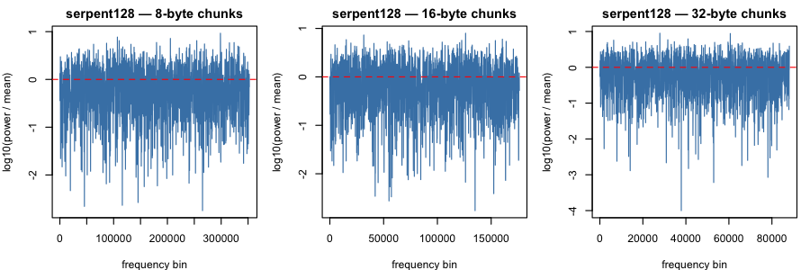

### Serpent-192 (`serpent192`)

Verdict: PASS &mdash; 0 test rejection(s) at $\alpha = 0.001$, 0 entropy miss(es) at $\mathrm{tol} = 0.001$ (total 0 / 22).

Byte-stream Shannon entropy: **8.000000 bits/byte** (ideal: $8$; signed deviation $H - 8 = -2.12 \times 10^{-7}$ bits).

**8-byte chunks** (704,810 samples; chunk-entropy 7.999996 bits; signed deviation $H - 8 = -4.12 \times 10^{-6}$ bits)

Moments (sample, ideal, dev):

| $k$ | sample $m_k$ | ideal $1/(k+1)$ | dev |
|-----|--------------|-----------------|-----|
| 1 | 0.500615 | 0.500000 | 6.15e-04 |
| 2 | 0.334018 | 0.333333 | 6.85e-04 |
| 3 | 0.250620 | 0.250000 | 6.20e-04 |
| 4 | 0.200540 | 0.200000 | 5.40e-04 |
| 5 | 0.167139 | 0.166667 | 4.72e-04 |
| 6 | 0.143276 | 0.142857 | 4.18e-04 |
| 7 | 0.125377 | 0.125000 | 3.77e-04 |
| 8 | 0.111456 | 0.111111 | 3.44e-04 |
| 9 | 0.100319 | 0.100000 | 3.19e-04 |
| 10 | 0.091207 | 0.090909 | 2.98e-04 |

Tests:

| test | p |
|------|---|
| FFT peak/mean | 13.89 |
| FFT spectrum KS (vs flat) | 0.059 |
| KS vs Uniform(0,1) | 0.033 |
| randtoolbox gap.test | 0.098 |
| randtoolbox freq.test (16 bins) | 0.329 |
| randtoolbox order.test (d=4) | 0.770 |
| tseries runs.test (bits) | 0.199 |

**16-byte chunks** (352,405 samples; chunk-entropy 8.000021 bits; signed deviation $H - 8 = 2.06 \times 10^{-5}$ bits)

Moments (sample, ideal, dev):

| $k$ | sample $m_k$ | ideal $1/(k+1)$ | dev |
|-----|--------------|-----------------|-----|
| 1 | 0.500970 | 0.500000 | 9.70e-04 |
| 2 | 0.334304 | 0.333333 | 9.71e-04 |
| 3 | 0.250869 | 0.250000 | 8.69e-04 |
| 4 | 0.200773 | 0.200000 | 7.73e-04 |
| 5 | 0.167364 | 0.166667 | 6.97e-04 |
| 6 | 0.143495 | 0.142857 | 6.38e-04 |
| 7 | 0.125590 | 0.125000 | 5.90e-04 |
| 8 | 0.111662 | 0.111111 | 5.51e-04 |
| 9 | 0.100518 | 0.100000 | 5.18e-04 |
| 10 | 0.091399 | 0.090909 | 4.90e-04 |

Tests:

| test | p |
|------|---|
| FFT peak/mean | 14.25 |
| FFT spectrum KS (vs flat) | 0.512 |
| KS vs Uniform(0,1) | 0.054 |
| randtoolbox gap.test | 0.100 |
| randtoolbox freq.test (16 bins) | 0.560 |
| randtoolbox order.test (d=4) | 0.753 |
| tseries runs.test (bits) | 0.199 |

**32-byte chunks** (176,202 samples; chunk-entropy 7.999976 bits; signed deviation $H - 8 = -2.45 \times 10^{-5}$ bits)

Moments (sample, ideal, dev):

| $k$ | sample $m_k$ | ideal $1/(k+1)$ | dev |
|-----|--------------|-----------------|-----|
| 1 | 0.501262 | 0.500000 | 1.26e-03 |
| 2 | 0.334760 | 0.333333 | 1.43e-03 |
| 3 | 0.251417 | 0.250000 | 1.42e-03 |
| 4 | 0.201371 | 0.200000 | 1.37e-03 |
| 5 | 0.167983 | 0.166667 | 1.32e-03 |
| 6 | 0.144118 | 0.142857 | 1.26e-03 |
| 7 | 0.126208 | 0.125000 | 1.21e-03 |
| 8 | 0.112268 | 0.111111 | 1.16e-03 |
| 9 | 0.101109 | 0.100000 | 1.11e-03 |
| 10 | 0.091973 | 0.090909 | 1.06e-03 |

Tests:

| test | p |
|------|---|
| FFT peak/mean | 12.80 |
| FFT spectrum KS (vs flat) | 0.420 |
| KS vs Uniform(0,1) | 0.186 |
| randtoolbox gap.test | 0.793 |
| randtoolbox freq.test (16 bins) | 0.608 |
| randtoolbox order.test (d=4) | 0.774 |
| tseries runs.test (bits) | 0.199 |

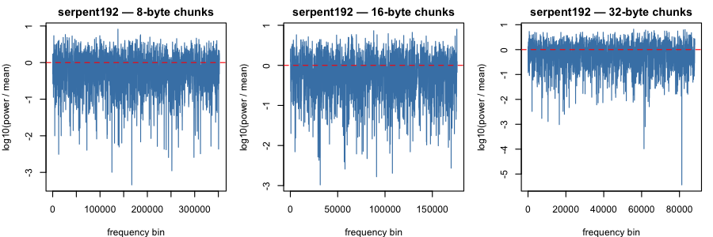

### Serpent-256 (`serpent256`)

Verdict: PASS &mdash; 0 test rejection(s) at $\alpha = 0.001$, 0 entropy miss(es) at $\mathrm{tol} = 0.001$ (total 0 / 22).

Byte-stream Shannon entropy: **8.000004 bits/byte** (ideal: $8$; signed deviation $H - 8 = 3.86 \times 10^{-6}$ bits).

**8-byte chunks** (704,810 samples; chunk-entropy 8.000010 bits; signed deviation $H - 8 = 1.04 \times 10^{-5}$ bits)

Moments (sample, ideal, dev):

| $k$ | sample $m_k$ | ideal $1/(k+1)$ | dev |
|-----|--------------|-----------------|-----|
| 1 | 0.500162 | 0.500000 | 1.62e-04 |
| 2 | 0.333511 | 0.333333 | 1.77e-04 |
| 3 | 0.250179 | 0.250000 | 1.79e-04 |
| 4 | 0.200177 | 0.200000 | 1.77e-04 |
| 5 | 0.166841 | 0.166667 | 1.74e-04 |
| 6 | 0.143028 | 0.142857 | 1.70e-04 |
| 7 | 0.125167 | 0.125000 | 1.67e-04 |
| 8 | 0.111274 | 0.111111 | 1.63e-04 |
| 9 | 0.100159 | 0.100000 | 1.59e-04 |
| 10 | 0.091064 | 0.090909 | 1.55e-04 |

Tests:

| test | p |
|------|---|
| FFT peak/mean | 12.39 |
| FFT spectrum KS (vs flat) | 0.410 |
| KS vs Uniform(0,1) | 0.870 |
| randtoolbox gap.test | 0.045 |
| randtoolbox freq.test (16 bins) | 0.961 |
| randtoolbox order.test (d=4) | 0.858 |
| tseries runs.test (bits) | 0.202 |

**16-byte chunks** (352,405 samples; chunk-entropy 8.000038 bits; signed deviation $H - 8 = 3.84 \times 10^{-5}$ bits)

Moments (sample, ideal, dev):

| $k$ | sample $m_k$ | ideal $1/(k+1)$ | dev |
|-----|--------------|-----------------|-----|
| 1 | 0.500336 | 0.500000 | 3.36e-04 |
| 2 | 0.333510 | 0.333333 | 1.76e-04 |
| 3 | 0.250062 | 0.250000 | 6.22e-05 |
| 4 | 0.200001 | 0.200000 | 1.26e-06 |
| 5 | 0.166637 | 0.166667 | 2.96e-05 |
| 6 | 0.142812 | 0.142857 | 4.48e-05 |
| 7 | 0.124948 | 0.125000 | 5.15e-05 |
| 8 | 0.111058 | 0.111111 | 5.36e-05 |
| 9 | 0.099947 | 0.100000 | 5.29e-05 |
| 10 | 0.090859 | 0.090909 | 5.06e-05 |

Tests:

| test | p |
|------|---|
| FFT peak/mean | 11.19 |
| FFT spectrum KS (vs flat) | 0.124 |
| KS vs Uniform(0,1) | 0.351 |
| randtoolbox gap.test | 0.042 |
| randtoolbox freq.test (16 bins) | 0.894 |
| randtoolbox order.test (d=4) | 0.811 |
| tseries runs.test (bits) | 0.202 |

**32-byte chunks** (176,202 samples; chunk-entropy 7.999975 bits; signed deviation $H - 8 = -2.55 \times 10^{-5}$ bits)

Moments (sample, ideal, dev):

| $k$ | sample $m_k$ | ideal $1/(k+1)$ | dev |
|-----|--------------|-----------------|-----|
| 1 | 0.501028 | 0.500000 | 1.03e-03 |
| 2 | 0.333886 | 0.333333 | 5.52e-04 |
| 3 | 0.250222 | 0.250000 | 2.22e-04 |
| 4 | 0.200038 | 0.200000 | 3.83e-05 |
| 5 | 0.166605 | 0.166667 | 6.12e-05 |
| 6 | 0.142743 | 0.142857 | 1.14e-04 |
| 7 | 0.124859 | 0.125000 | 1.41e-04 |
| 8 | 0.110958 | 0.111111 | 1.54e-04 |
| 9 | 0.099843 | 0.100000 | 1.57e-04 |
| 10 | 0.090753 | 0.090909 | 1.56e-04 |

Tests:

| test | p |
|------|---|
| FFT peak/mean | 11.60 |
| FFT spectrum KS (vs flat) | 0.556 |
| KS vs Uniform(0,1) | 0.095 |
| randtoolbox gap.test | 0.672 |
| randtoolbox freq.test (16 bins) | 0.313 |
| randtoolbox order.test (d=4) | 0.806 |
| tseries runs.test (bits) | 0.202 |

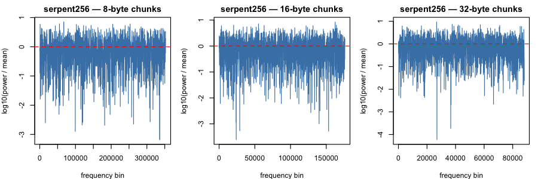

### SM4 (`sm4`)

Verdict: PASS &mdash; 0 test rejection(s) at $\alpha = 0.001$, 0 entropy miss(es) at $\mathrm{tol} = 0.001$ (total 0 / 22).

Byte-stream Shannon entropy: **7.999998 bits/byte** (ideal: $8$; signed deviation $H - 8 = -2.03 \times 10^{-6}$ bits).

**8-byte chunks** (704,810 samples; chunk-entropy 7.999987 bits; signed deviation $H - 8 = -1.29 \times 10^{-5}$ bits)

Moments (sample, ideal, dev):

| $k$ | sample $m_k$ | ideal $1/(k+1)$ | dev |
|-----|--------------|-----------------|-----|
| 1 | 0.499928 | 0.500000 | 7.16e-05 |
| 2 | 0.333411 | 0.333333 | 7.81e-05 |
| 3 | 0.250141 | 0.250000 | 1.41e-04 |
| 4 | 0.200161 | 0.200000 | 1.61e-04 |
| 5 | 0.166831 | 0.166667 | 1.65e-04 |
| 6 | 0.143019 | 0.142857 | 1.62e-04 |
| 7 | 0.125157 | 0.125000 | 1.57e-04 |
| 8 | 0.111262 | 0.111111 | 1.51e-04 |
| 9 | 0.100145 | 0.100000 | 1.45e-04 |
| 10 | 0.091048 | 0.090909 | 1.39e-04 |

Tests:

| test | p |
|------|---|
| FFT peak/mean | 14.04 |
| FFT spectrum KS (vs flat) | 0.772 |
| KS vs Uniform(0,1) | 0.613 |
| randtoolbox gap.test | 0.609 |
| randtoolbox freq.test (16 bins) | 0.419 |
| randtoolbox order.test (d=4) | 0.725 |
| tseries runs.test (bits) | 0.325 |

**16-byte chunks** (352,405 samples; chunk-entropy 7.999913 bits; signed deviation $H - 8 = -8.75 \times 10^{-5}$ bits)

Moments (sample, ideal, dev):

| $k$ | sample $m_k$ | ideal $1/(k+1)$ | dev |
|-----|--------------|-----------------|-----|
| 1 | 0.500273 | 0.500000 | 2.73e-04 |
| 2 | 0.333656 | 0.333333 | 3.22e-04 |
| 3 | 0.250326 | 0.250000 | 3.26e-04 |
| 4 | 0.200324 | 0.200000 | 3.24e-04 |
| 5 | 0.166990 | 0.166667 | 3.23e-04 |
| 6 | 0.143181 | 0.142857 | 3.23e-04 |
| 7 | 0.125325 | 0.125000 | 3.25e-04 |
| 8 | 0.111437 | 0.111111 | 3.25e-04 |
| 9 | 0.100326 | 0.100000 | 3.26e-04 |
| 10 | 0.091234 | 0.090909 | 3.25e-04 |

Tests:

| test | p |
|------|---|
| FFT peak/mean | 11.44 |
| FFT spectrum KS (vs flat) | 0.992 |
| KS vs Uniform(0,1) | 0.509 |
| randtoolbox gap.test | 0.882 |
| randtoolbox freq.test (16 bins) | 0.231 |
| randtoolbox order.test (d=4) | 0.877 |
| tseries runs.test (bits) | 0.325 |

**32-byte chunks** (176,202 samples; chunk-entropy 7.999930 bits; signed deviation $H - 8 = -6.98 \times 10^{-5}$ bits)

Moments (sample, ideal, dev):

| $k$ | sample $m_k$ | ideal $1/(k+1)$ | dev |
|-----|--------------|-----------------|-----|
| 1 | 0.499810 | 0.500000 | 1.90e-04 |
| 2 | 0.333149 | 0.333333 | 1.84e-04 |
| 3 | 0.249851 | 0.250000 | 1.49e-04 |
| 4 | 0.199904 | 0.200000 | 9.57e-05 |
| 5 | 0.166625 | 0.166667 | 4.17e-05 |
| 6 | 0.142862 | 0.142857 | 4.99e-06 |
| 7 | 0.125042 | 0.125000 | 4.20e-05 |
| 8 | 0.111181 | 0.111111 | 6.98e-05 |
| 9 | 0.100090 | 0.100000 | 8.96e-05 |
| 10 | 0.091012 | 0.090909 | 1.03e-04 |

Tests:

| test | p |
|------|---|
| FFT peak/mean | 11.63 |
| FFT spectrum KS (vs flat) | 0.250 |
| KS vs Uniform(0,1) | 0.409 |
| randtoolbox gap.test | 0.629 |
| randtoolbox freq.test (16 bins) | 0.205 |
| randtoolbox order.test (d=4) | 0.686 |
| tseries runs.test (bits) | 0.325 |

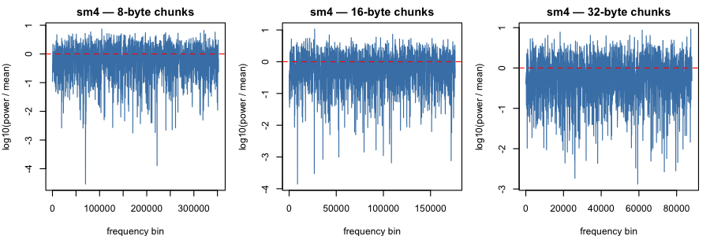

### Twofish-128 (`twofish128`)

Verdict: PASS &mdash; 2 test rejection(s) at $\alpha = 0.001$, 0 entropy miss(es) at $\mathrm{tol} = 0.001$ (total 2 / 22).

Byte-stream Shannon entropy: **8.000002 bits/byte** (ideal: $8$; signed deviation $H - 8 = 1.79 \times 10^{-6}$ bits).

**8-byte chunks** (704,810 samples; chunk-entropy 8.000002 bits; signed deviation $H - 8 = 2.33 \times 10^{-6}$ bits)

Moments (sample, ideal, dev):

| $k$ | sample $m_k$ | ideal $1/(k+1)$ | dev |
|-----|--------------|-----------------|-----|
| 1 | 0.500259 | 0.500000 | 2.59e-04 |
| 2 | 0.333518 | 0.333333 | 1.85e-04 |
| 3 | 0.250147 | 0.250000 | 1.47e-04 |
| 4 | 0.200115 | 0.200000 | 1.15e-04 |
| 5 | 0.166754 | 0.166667 | 8.73e-05 |
| 6 | 0.142920 | 0.142857 | 6.31e-05 |
| 7 | 0.125043 | 0.125000 | 4.30e-05 |
| 8 | 0.111138 | 0.111111 | 2.69e-05 |
| 9 | 0.100014 | 0.100000 | 1.40e-05 |
| 10 | 0.090913 | 0.090909 | 3.73e-06 |

Tests:

| test | p |
|------|---|
| FFT peak/mean | 16.65 |
| FFT spectrum KS (vs flat) | 0.694 |
| KS vs Uniform(0,1) | 0.244 |
| randtoolbox gap.test | 2.8e-05 |
| randtoolbox freq.test (16 bins) | 0.014 |
| randtoolbox order.test (d=4) | 0.373 |
| tseries runs.test (bits) | 0.011 |

**16-byte chunks** (352,405 samples; chunk-entropy 7.999935 bits; signed deviation $H - 8 = -6.48 \times 10^{-5}$ bits)

Moments (sample, ideal, dev):

| $k$ | sample $m_k$ | ideal $1/(k+1)$ | dev |
|-----|--------------|-----------------|-----|
| 1 | 0.500929 | 0.500000 | 9.29e-04 |
| 2 | 0.334291 | 0.333333 | 9.57e-04 |
| 3 | 0.250914 | 0.250000 | 9.14e-04 |
| 4 | 0.200845 | 0.200000 | 8.45e-04 |
| 5 | 0.167435 | 0.166667 | 7.69e-04 |
| 6 | 0.143553 | 0.142857 | 6.96e-04 |
| 7 | 0.125629 | 0.125000 | 6.29e-04 |
| 8 | 0.111681 | 0.111111 | 5.69e-04 |
| 9 | 0.100517 | 0.100000 | 5.17e-04 |
| 10 | 0.091380 | 0.090909 | 4.71e-04 |

Tests:

| test | p |
|------|---|
| FFT peak/mean | 13.59 |
| FFT spectrum KS (vs flat) | 0.842 |
| KS vs Uniform(0,1) | 0.078 |
| randtoolbox gap.test | 2.3e-06 |
| randtoolbox freq.test (16 bins) | 0.100 |
| randtoolbox order.test (d=4) | 0.061 |
| tseries runs.test (bits) | 0.011 |

**32-byte chunks** (176,202 samples; chunk-entropy 7.999950 bits; signed deviation $H - 8 = -5.03 \times 10^{-5}$ bits)

Moments (sample, ideal, dev):

| $k$ | sample $m_k$ | ideal $1/(k+1)$ | dev |
|-----|--------------|-----------------|-----|
| 1 | 0.500860 | 0.500000 | 8.60e-04 |
| 2 | 0.334097 | 0.333333 | 7.63e-04 |
| 3 | 0.250661 | 0.250000 | 6.61e-04 |
| 4 | 0.200575 | 0.200000 | 5.75e-04 |
| 5 | 0.167172 | 0.166667 | 5.06e-04 |
| 6 | 0.143308 | 0.142857 | 4.50e-04 |
| 7 | 0.125406 | 0.125000 | 4.06e-04 |
| 8 | 0.111481 | 0.111111 | 3.70e-04 |
| 9 | 0.100340 | 0.100000 | 3.40e-04 |
| 10 | 0.091223 | 0.090909 | 3.14e-04 |

Tests:

| test | p |
|------|---|
| FFT peak/mean | 11.59 |
| FFT spectrum KS (vs flat) | 0.709 |
| KS vs Uniform(0,1) | 0.600 |
| randtoolbox gap.test | 0.907 |
| randtoolbox freq.test (16 bins) | 0.638 |
| randtoolbox order.test (d=4) | 0.795 |
| tseries runs.test (bits) | 0.011 |

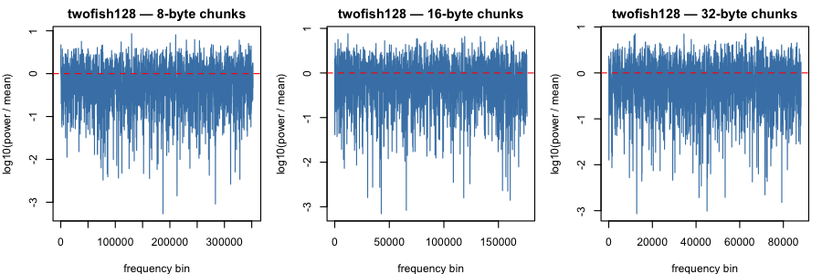

### Twofish-256 (`twofish256`)

Verdict: PASS &mdash; 0 test rejection(s) at $\alpha = 0.001$, 0 entropy miss(es) at $\mathrm{tol} = 0.001$ (total 0 / 22).

Byte-stream Shannon entropy: **7.999997 bits/byte** (ideal: $8$; signed deviation $H - 8 = -3.14 \times 10^{-6}$ bits).

**8-byte chunks** (704,810 samples; chunk-entropy 8.000017 bits; signed deviation $H - 8 = 1.71 \times 10^{-5}$ bits)

Moments (sample, ideal, dev):

| $k$ | sample $m_k$ | ideal $1/(k+1)$ | dev |
|-----|--------------|-----------------|-----|
| 1 | 0.499984 | 0.500000 | 1.62e-05 |
| 2 | 0.333333 | 0.333333 | 7.00e-07 |
| 3 | 0.249998 | 0.250000 | 2.10e-06 |
| 4 | 0.199998 | 0.200000 | 2.17e-06 |
| 5 | 0.166668 | 0.166667 | 1.49e-06 |
| 6 | 0.142864 | 0.142857 | 6.94e-06 |
| 7 | 0.125012 | 0.125000 | 1.24e-05 |
| 8 | 0.111128 | 0.111111 | 1.68e-05 |
| 9 | 0.100020 | 0.100000 | 1.99e-05 |
| 10 | 0.090931 | 0.090909 | 2.16e-05 |

Tests:

| test | p |
|------|---|
| FFT peak/mean | 13.12 |
| FFT spectrum KS (vs flat) | 0.946 |
| KS vs Uniform(0,1) | 0.926 |
| randtoolbox gap.test | 0.981 |
| randtoolbox freq.test (16 bins) | 0.923 |
| randtoolbox order.test (d=4) | 0.656 |
| tseries runs.test (bits) | 0.049 |

**16-byte chunks** (352,405 samples; chunk-entropy 8.000005 bits; signed deviation $H - 8 = 5.21 \times 10^{-6}$ bits)

Moments (sample, ideal, dev):

| $k$ | sample $m_k$ | ideal $1/(k+1)$ | dev |
|-----|--------------|-----------------|-----|
| 1 | 0.500106 | 0.500000 | 1.06e-04 |
| 2 | 0.333485 | 0.333333 | 1.51e-04 |
| 3 | 0.250144 | 0.250000 | 1.44e-04 |
| 4 | 0.200124 | 0.200000 | 1.24e-04 |
| 5 | 0.166773 | 0.166667 | 1.06e-04 |
| 6 | 0.142949 | 0.142857 | 9.23e-05 |
| 7 | 0.125082 | 0.125000 | 8.21e-05 |
| 8 | 0.111185 | 0.111111 | 7.42e-05 |
| 9 | 0.100068 | 0.100000 | 6.77e-05 |
| 10 | 0.090971 | 0.090909 | 6.20e-05 |

Tests:

| test | p |
|------|---|
| FFT peak/mean | 12.35 |
| FFT spectrum KS (vs flat) | 0.859 |
| KS vs Uniform(0,1) | 0.634 |
| randtoolbox gap.test | 0.970 |
| randtoolbox freq.test (16 bins) | 0.918 |
| randtoolbox order.test (d=4) | 0.494 |
| tseries runs.test (bits) | 0.049 |

**32-byte chunks** (176,202 samples; chunk-entropy 8.000019 bits; signed deviation $H - 8 = 1.86 \times 10^{-5}$ bits)

Moments (sample, ideal, dev):

| $k$ | sample $m_k$ | ideal $1/(k+1)$ | dev |
|-----|--------------|-----------------|-----|
| 1 | 0.499878 | 0.500000 | 1.22e-04 |
| 2 | 0.333195 | 0.333333 | 1.38e-04 |
| 3 | 0.249872 | 0.250000 | 1.28e-04 |
| 4 | 0.199885 | 0.200000 | 1.15e-04 |
| 5 | 0.166567 | 0.166667 | 9.98e-05 |
| 6 | 0.142775 | 0.142857 | 8.26e-05 |
| 7 | 0.124935 | 0.125000 | 6.49e-05 |
| 8 | 0.111063 | 0.111111 | 4.79e-05 |
| 9 | 0.099968 | 0.100000 | 3.25e-05 |
| 10 | 0.090890 | 0.090909 | 1.90e-05 |

Tests:

| test | p |
|------|---|
| FFT peak/mean | 10.84 |
| FFT spectrum KS (vs flat) | 0.258 |
| KS vs Uniform(0,1) | 0.911 |
| randtoolbox gap.test | 0.549 |
| randtoolbox freq.test (16 bins) | 0.939 |
| randtoolbox order.test (d=4) | 0.088 |
| tseries runs.test (bits) | 0.049 |

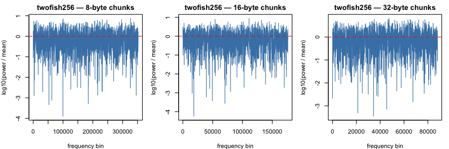

### Simon32/64 (`simon32_64`)

Verdict: PASS &mdash; 0 test rejection(s) at $\alpha = 0.001$, 0 entropy miss(es) at $\mathrm{tol} = 0.001$ (total 0 / 22).

Byte-stream Shannon entropy: **8.000003 bits/byte** (ideal: $8$; signed deviation $H - 8 = 3.45 \times 10^{-6}$ bits).

**8-byte chunks** (704,810 samples; chunk-entropy 8.000033 bits; signed deviation $H - 8 = 3.31 \times 10^{-5}$ bits)

Moments (sample, ideal, dev):

| $k$ | sample $m_k$ | ideal $1/(k+1)$ | dev |
|-----|--------------|-----------------|-----|
| 1 | 0.499622 | 0.500000 | 3.78e-04 |
| 2 | 0.333004 | 0.333333 | 3.30e-04 |
| 3 | 0.249723 | 0.250000 | 2.77e-04 |
| 4 | 0.199767 | 0.200000 | 2.33e-04 |
| 5 | 0.166472 | 0.166667 | 1.95e-04 |
| 6 | 0.142696 | 0.142857 | 1.61e-04 |
| 7 | 0.124869 | 0.125000 | 1.31e-04 |
| 8 | 0.111007 | 0.111111 | 1.04e-04 |
| 9 | 0.099919 | 0.100000 | 8.15e-05 |
| 10 | 0.090848 | 0.090909 | 6.16e-05 |

Tests:

| test | p |
|------|---|
| FFT peak/mean | 13.22 |
| FFT spectrum KS (vs flat) | 0.131 |
| KS vs Uniform(0,1) | 0.632 |
| randtoolbox gap.test | 0.980 |
| randtoolbox freq.test (16 bins) | 0.512 |
| randtoolbox order.test (d=4) | 0.712 |
| tseries runs.test (bits) | 0.406 |

**16-byte chunks** (352,405 samples; chunk-entropy 8.000086 bits; signed deviation $H - 8 = 8.64 \times 10^{-5}$ bits)

Moments (sample, ideal, dev):

| $k$ | sample $m_k$ | ideal $1/(k+1)$ | dev |
|-----|--------------|-----------------|-----|
| 1 | 0.498971 | 0.500000 | 1.03e-03 |
| 2 | 0.332356 | 0.333333 | 9.77e-04 |
| 3 | 0.249132 | 0.250000 | 8.68e-04 |
| 4 | 0.199242 | 0.200000 | 7.58e-04 |
| 5 | 0.166010 | 0.166667 | 6.57e-04 |
| 6 | 0.142290 | 0.142857 | 5.68e-04 |
| 7 | 0.124510 | 0.125000 | 4.90e-04 |
| 8 | 0.110686 | 0.111111 | 4.25e-04 |
| 9 | 0.099630 | 0.100000 | 3.70e-04 |
| 10 | 0.090586 | 0.090909 | 3.23e-04 |

Tests:

| test | p |
|------|---|
| FFT peak/mean | 12.88 |
| FFT spectrum KS (vs flat) | 0.138 |
| KS vs Uniform(0,1) | 0.125 |
| randtoolbox gap.test | 0.271 |
| randtoolbox freq.test (16 bins) | 0.546 |
| randtoolbox order.test (d=4) | 0.661 |
| tseries runs.test (bits) | 0.406 |

**32-byte chunks** (176,202 samples; chunk-entropy 8.000182 bits; signed deviation $H - 8 = 1.82 \times 10^{-4}$ bits)

Moments (sample, ideal, dev):

| $k$ | sample $m_k$ | ideal $1/(k+1)$ | dev |
|-----|--------------|-----------------|-----|
| 1 | 0.499806 | 0.500000 | 1.94e-04 |
| 2 | 0.333298 | 0.333333 | 3.52e-05 |
| 3 | 0.250069 | 0.250000 | 6.86e-05 |
| 4 | 0.200139 | 0.200000 | 1.39e-04 |
| 5 | 0.166863 | 0.166667 | 1.96e-04 |
| 6 | 0.143102 | 0.142857 | 2.45e-04 |
| 7 | 0.125287 | 0.125000 | 2.87e-04 |
| 8 | 0.111434 | 0.111111 | 3.23e-04 |
| 9 | 0.100353 | 0.100000 | 3.53e-04 |
| 10 | 0.091286 | 0.090909 | 3.77e-04 |

Tests:

| test | p |
|------|---|
| FFT peak/mean | 11.06 |
| FFT spectrum KS (vs flat) | 0.835 |
| KS vs Uniform(0,1) | 0.892 |
| randtoolbox gap.test | 0.003 |
| randtoolbox freq.test (16 bins) | 0.554 |
| randtoolbox order.test (d=4) | 0.566 |
| tseries runs.test (bits) | 0.406 |

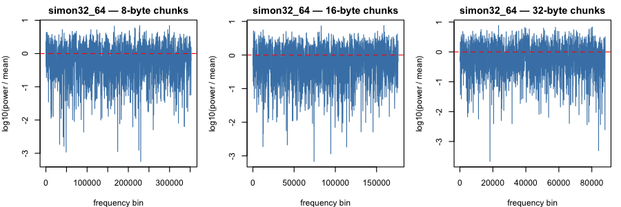

### Simon64/128 (`simon64_128`)

Verdict: PASS &mdash; 0 test rejection(s) at $\alpha = 0.001$, 0 entropy miss(es) at $\mathrm{tol} = 0.001$ (total 0 / 22).

Byte-stream Shannon entropy: **8.000005 bits/byte** (ideal: $8$; signed deviation $H - 8 = 4.55 \times 10^{-6}$ bits).

**8-byte chunks** (704,810 samples; chunk-entropy 7.999985 bits; signed deviation $H - 8 = -1.50 \times 10^{-5}$ bits)

Moments (sample, ideal, dev):

| $k$ | sample $m_k$ | ideal $1/(k+1)$ | dev |
|-----|--------------|-----------------|-----|
| 1 | 0.500733 | 0.500000 | 7.33e-04 |
| 2 | 0.333953 | 0.333333 | 6.20e-04 |
| 3 | 0.250487 | 0.250000 | 4.87e-04 |
| 4 | 0.200394 | 0.200000 | 3.94e-04 |
| 5 | 0.166999 | 0.166667 | 3.33e-04 |
| 6 | 0.143147 | 0.142857 | 2.90e-04 |
| 7 | 0.125259 | 0.125000 | 2.59e-04 |
| 8 | 0.111347 | 0.111111 | 2.36e-04 |
| 9 | 0.100218 | 0.100000 | 2.18e-04 |
| 10 | 0.091111 | 0.090909 | 2.02e-04 |

Tests:

| test | p |
|------|---|
| FFT peak/mean | 15.15 |
| FFT spectrum KS (vs flat) | 0.979 |
| KS vs Uniform(0,1) | 0.014 |
| randtoolbox gap.test | 0.344 |
| randtoolbox freq.test (16 bins) | 0.105 |
| randtoolbox order.test (d=4) | 0.783 |
| tseries runs.test (bits) | 0.552 |

**16-byte chunks** (352,405 samples; chunk-entropy 7.999907 bits; signed deviation $H - 8 = -9.34 \times 10^{-5}$ bits)

Moments (sample, ideal, dev):

| $k$ | sample $m_k$ | ideal $1/(k+1)$ | dev |
|-----|--------------|-----------------|-----|
| 1 | 0.501173 | 0.500000 | 1.17e-03 |
| 2 | 0.334568 | 0.333333 | 1.23e-03 |
| 3 | 0.251120 | 0.250000 | 1.12e-03 |
| 4 | 0.200995 | 0.200000 | 9.95e-04 |
| 5 | 0.167557 | 0.166667 | 8.90e-04 |
| 6 | 0.143663 | 0.142857 | 8.06e-04 |
| 7 | 0.125737 | 0.125000 | 7.37e-04 |
| 8 | 0.111791 | 0.111111 | 6.80e-04 |
| 9 | 0.100632 | 0.100000 | 6.32e-04 |
| 10 | 0.091499 | 0.090909 | 5.90e-04 |

Tests:

| test | p |
|------|---|
| FFT peak/mean | 11.48 |
| FFT spectrum KS (vs flat) | 0.602 |
| KS vs Uniform(0,1) | 0.007 |
| randtoolbox gap.test | 0.571 |
| randtoolbox freq.test (16 bins) | 0.288 |
| randtoolbox order.test (d=4) | 0.578 |
| tseries runs.test (bits) | 0.552 |

**32-byte chunks** (176,202 samples; chunk-entropy 7.999888 bits; signed deviation $H - 8 = -1.12 \times 10^{-4}$ bits)

Moments (sample, ideal, dev):

| $k$ | sample $m_k$ | ideal $1/(k+1)$ | dev |
|-----|--------------|-----------------|-----|
| 1 | 0.500368 | 0.500000 | 3.68e-04 |
| 2 | 0.333679 | 0.333333 | 3.46e-04 |
| 3 | 0.250265 | 0.250000 | 2.65e-04 |
| 4 | 0.200202 | 0.200000 | 2.02e-04 |
| 5 | 0.166832 | 0.166667 | 1.65e-04 |
| 6 | 0.143003 | 0.142857 | 1.46e-04 |
| 7 | 0.125137 | 0.125000 | 1.37e-04 |
| 8 | 0.111244 | 0.111111 | 1.33e-04 |
| 9 | 0.100132 | 0.100000 | 1.32e-04 |
| 10 | 0.091042 | 0.090909 | 1.33e-04 |

Tests:

| test | p |
|------|---|
| FFT peak/mean | 11.55 |
| FFT spectrum KS (vs flat) | 0.652 |
| KS vs Uniform(0,1) | 0.440 |
| randtoolbox gap.test | 0.047 |
| randtoolbox freq.test (16 bins) | 0.607 |
| randtoolbox order.test (d=4) | 0.211 |
| tseries runs.test (bits) | 0.552 |

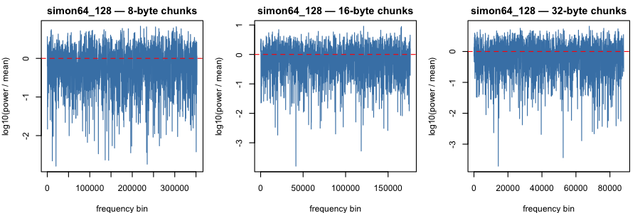

### Simon128/128 (`simon128_128`)

Verdict: PASS &mdash; 0 test rejection(s) at $\alpha = 0.001$, 0 entropy miss(es) at $\mathrm{tol} = 0.001$ (total 0 / 22).

Byte-stream Shannon entropy: **7.999995 bits/byte** (ideal: $8$; signed deviation $H - 8 = -5.14 \times 10^{-6}$ bits).

**8-byte chunks** (704,810 samples; chunk-entropy 8.000022 bits; signed deviation $H - 8 = 2.18 \times 10^{-5}$ bits)

Moments (sample, ideal, dev):

| $k$ | sample $m_k$ | ideal $1/(k+1)$ | dev |
|-----|--------------|-----------------|-----|
| 1 | 0.499937 | 0.500000 | 6.32e-05 |
| 2 | 0.333289 | 0.333333 | 4.44e-05 |
| 3 | 0.249961 | 0.250000 | 3.92e-05 |
| 4 | 0.199972 | 0.200000 | 2.82e-05 |
| 5 | 0.166654 | 0.166667 | 1.29e-05 |
| 6 | 0.142861 | 0.142857 | 3.53e-06 |
| 7 | 0.125019 | 0.125000 | 1.90e-05 |
| 8 | 0.111144 | 0.111111 | 3.27e-05 |
| 9 | 0.100044 | 0.100000 | 4.45e-05 |
| 10 | 0.090963 | 0.090909 | 5.43e-05 |

Tests:

| test | p |
|------|---|
| FFT peak/mean | 11.89 |
| FFT spectrum KS (vs flat) | 0.646 |
| KS vs Uniform(0,1) | 0.992 |
| randtoolbox gap.test | 0.579 |
| randtoolbox freq.test (16 bins) | 0.876 |
| randtoolbox order.test (d=4) | 0.014 |
| tseries runs.test (bits) | 0.670 |

**16-byte chunks** (352,405 samples; chunk-entropy 8.000101 bits; signed deviation $H - 8 = 1.01 \times 10^{-4}$ bits)

Moments (sample, ideal, dev):

| $k$ | sample $m_k$ | ideal $1/(k+1)$ | dev |
|-----|--------------|-----------------|-----|
| 1 | 0.499789 | 0.500000 | 2.11e-04 |
| 2 | 0.333054 | 0.333333 | 2.79e-04 |
| 3 | 0.249717 | 0.250000 | 2.83e-04 |
| 4 | 0.199737 | 0.200000 | 2.63e-04 |
| 5 | 0.166430 | 0.166667 | 2.37e-04 |
| 6 | 0.142647 | 0.142857 | 2.10e-04 |
| 7 | 0.124815 | 0.125000 | 1.85e-04 |
| 8 | 0.110949 | 0.111111 | 1.62e-04 |
| 9 | 0.099858 | 0.100000 | 1.42e-04 |
| 10 | 0.090785 | 0.090909 | 1.24e-04 |

Tests:

| test | p |
|------|---|
| FFT peak/mean | 13.84 |
| FFT spectrum KS (vs flat) | 0.538 |
| KS vs Uniform(0,1) | 0.963 |
| randtoolbox gap.test | 0.148 |
| randtoolbox freq.test (16 bins) | 0.952 |
| randtoolbox order.test (d=4) | 0.047 |
| tseries runs.test (bits) | 0.670 |

**32-byte chunks** (176,202 samples; chunk-entropy 8.000016 bits; signed deviation $H - 8 = 1.58 \times 10^{-5}$ bits)

Moments (sample, ideal, dev):

| $k$ | sample $m_k$ | ideal $1/(k+1)$ | dev |
|-----|--------------|-----------------|-----|
| 1 | 0.500393 | 0.500000 | 3.93e-04 |
| 2 | 0.333737 | 0.333333 | 4.04e-04 |
| 3 | 0.250399 | 0.250000 | 3.99e-04 |
| 4 | 0.200380 | 0.200000 | 3.80e-04 |
| 5 | 0.167018 | 0.166667 | 3.51e-04 |
| 6 | 0.143174 | 0.142857 | 3.17e-04 |
| 7 | 0.125283 | 0.125000 | 2.83e-04 |
| 8 | 0.111361 | 0.111111 | 2.50e-04 |
| 9 | 0.100220 | 0.100000 | 2.20e-04 |
| 10 | 0.091103 | 0.090909 | 1.93e-04 |

Tests:

| test | p |
|------|---|
| FFT peak/mean | 13.42 |
| FFT spectrum KS (vs flat) | 0.686 |
| KS vs Uniform(0,1) | 0.781 |
| randtoolbox gap.test | 0.964 |
| randtoolbox freq.test (16 bins) | 0.862 |
| randtoolbox order.test (d=4) | 0.458 |
| tseries runs.test (bits) | 0.670 |

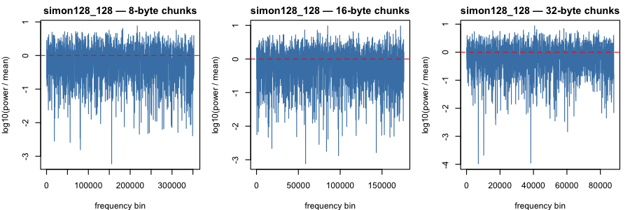

### Simon128/256 (`simon128_256`)

Verdict: PASS &mdash; 0 test rejection(s) at $\alpha = 0.001$, 0 entropy miss(es) at $\mathrm{tol} = 0.001$ (total 0 / 22).

Byte-stream Shannon entropy: **7.999997 bits/byte** (ideal: $8$; signed deviation $H - 8 = -2.74 \times 10^{-6}$ bits).

**8-byte chunks** (704,810 samples; chunk-entropy 7.999981 bits; signed deviation $H - 8 = -1.90 \times 10^{-5}$ bits)

Moments (sample, ideal, dev):

| $k$ | sample $m_k$ | ideal $1/(k+1)$ | dev |
|-----|--------------|-----------------|-----|
| 1 | 0.499554 | 0.500000 | 4.46e-04 |
| 2 | 0.332767 | 0.333333 | 5.67e-04 |
| 3 | 0.249392 | 0.250000 | 6.08e-04 |
| 4 | 0.199384 | 0.200000 | 6.16e-04 |
| 5 | 0.166058 | 0.166667 | 6.09e-04 |
| 6 | 0.142262 | 0.142857 | 5.95e-04 |
| 7 | 0.124422 | 0.125000 | 5.78e-04 |
| 8 | 0.110553 | 0.111111 | 5.58e-04 |
| 9 | 0.099462 | 0.100000 | 5.38e-04 |
| 10 | 0.090391 | 0.090909 | 5.18e-04 |

Tests:

| test | p |
|------|---|
| FFT peak/mean | 11.63 |
| FFT spectrum KS (vs flat) | 0.397 |
| KS vs Uniform(0,1) | 0.312 |
| randtoolbox gap.test | 0.007 |
| randtoolbox freq.test (16 bins) | 0.271 |
| randtoolbox order.test (d=4) | 0.869 |
| tseries runs.test (bits) | 0.608 |

**16-byte chunks** (352,405 samples; chunk-entropy 8.000025 bits; signed deviation $H - 8 = 2.52 \times 10^{-5}$ bits)

Moments (sample, ideal, dev):

| $k$ | sample $m_k$ | ideal $1/(k+1)$ | dev |
|-----|--------------|-----------------|-----|
| 1 | 0.499361 | 0.500000 | 6.39e-04 |
| 2 | 0.332524 | 0.333333 | 8.10e-04 |
| 3 | 0.249122 | 0.250000 | 8.78e-04 |
| 4 | 0.199102 | 0.200000 | 8.98e-04 |
| 5 | 0.165772 | 0.166667 | 8.94e-04 |
| 6 | 0.141978 | 0.142857 | 8.80e-04 |
| 7 | 0.124141 | 0.125000 | 8.59e-04 |
| 8 | 0.110275 | 0.111111 | 8.36e-04 |
| 9 | 0.099189 | 0.100000 | 8.11e-04 |
| 10 | 0.090123 | 0.090909 | 7.86e-04 |

Tests:

| test | p |
|------|---|
| FFT peak/mean | 11.28 |
| FFT spectrum KS (vs flat) | 0.982 |
| KS vs Uniform(0,1) | 0.363 |
| randtoolbox gap.test | 0.478 |
| randtoolbox freq.test (16 bins) | 0.558 |
| randtoolbox order.test (d=4) | 0.626 |
| tseries runs.test (bits) | 0.608 |

**32-byte chunks** (176,202 samples; chunk-entropy 7.999938 bits; signed deviation $H - 8 = -6.17 \times 10^{-5}$ bits)

Moments (sample, ideal, dev):

| $k$ | sample $m_k$ | ideal $1/(k+1)$ | dev |
|-----|--------------|-----------------|-----|
| 1 | 0.499509 | 0.500000 | 4.91e-04 |
| 2 | 0.332627 | 0.333333 | 7.06e-04 |
| 3 | 0.249198 | 0.250000 | 8.02e-04 |
| 4 | 0.199164 | 0.200000 | 8.36e-04 |
| 5 | 0.165828 | 0.166667 | 8.38e-04 |
| 6 | 0.142033 | 0.142857 | 8.24e-04 |
| 7 | 0.124200 | 0.125000 | 8.00e-04 |
| 8 | 0.110338 | 0.111111 | 7.73e-04 |
| 9 | 0.099256 | 0.100000 | 7.44e-04 |
| 10 | 0.090194 | 0.090909 | 7.15e-04 |

Tests:

| test | p |
|------|---|
| FFT peak/mean | 11.79 |
| FFT spectrum KS (vs flat) | 0.380 |
| KS vs Uniform(0,1) | 0.695 |
| randtoolbox gap.test | 0.898 |
| randtoolbox freq.test (16 bins) | 0.977 |
| randtoolbox order.test (d=4) | 0.653 |
| tseries runs.test (bits) | 0.608 |

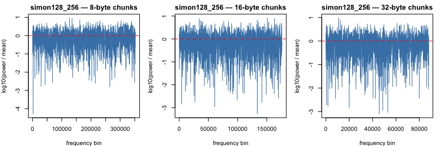

### Speck32/64 (`speck32_64`)

Verdict: PASS &mdash; 0 test rejection(s) at $\alpha = 0.001$, 0 entropy miss(es) at $\mathrm{tol} = 0.001$ (total 0 / 22).

Byte-stream Shannon entropy: **7.999997 bits/byte** (ideal: $8$; signed deviation $H - 8 = -3.26 \times 10^{-6}$ bits).

**8-byte chunks** (704,810 samples; chunk-entropy 7.999970 bits; signed deviation $H - 8 = -2.98 \times 10^{-5}$ bits)

Moments (sample, ideal, dev):

| $k$ | sample $m_k$ | ideal $1/(k+1)$ | dev |
|-----|--------------|-----------------|-----|
| 1 | 0.499844 | 0.500000 | 1.56e-04 |
| 2 | 0.333122 | 0.333333 | 2.11e-04 |
| 3 | 0.249779 | 0.250000 | 2.21e-04 |
| 4 | 0.199791 | 0.200000 | 2.09e-04 |
| 5 | 0.166480 | 0.166667 | 1.87e-04 |
| 6 | 0.142696 | 0.142857 | 1.62e-04 |
| 7 | 0.124864 | 0.125000 | 1.36e-04 |
| 8 | 0.110999 | 0.111111 | 1.12e-04 |
| 9 | 0.099910 | 0.100000 | 9.02e-05 |
| 10 | 0.090839 | 0.090909 | 7.03e-05 |

Tests:

| test | p |
|------|---|
| FFT peak/mean | 11.57 |
| FFT spectrum KS (vs flat) | 0.679 |
| KS vs Uniform(0,1) | 0.501 |
| randtoolbox gap.test | 0.227 |
| randtoolbox freq.test (16 bins) | 0.168 |
| randtoolbox order.test (d=4) | 0.282 |
| tseries runs.test (bits) | 0.559 |

**16-byte chunks** (352,405 samples; chunk-entropy 7.999971 bits; signed deviation $H - 8 = -2.86 \times 10^{-5}$ bits)

Moments (sample, ideal, dev):

| $k$ | sample $m_k$ | ideal $1/(k+1)$ | dev |
|-----|--------------|-----------------|-----|
| 1 | 0.499715 | 0.500000 | 2.85e-04 |
| 2 | 0.332938 | 0.333333 | 3.95e-04 |
| 3 | 0.249583 | 0.250000 | 4.17e-04 |
| 4 | 0.199596 | 0.200000 | 4.04e-04 |
| 5 | 0.166289 | 0.166667 | 3.77e-04 |
| 6 | 0.142510 | 0.142857 | 3.48e-04 |
| 7 | 0.124682 | 0.125000 | 3.18e-04 |
| 8 | 0.110820 | 0.111111 | 2.91e-04 |
| 9 | 0.099733 | 0.100000 | 2.67e-04 |
| 10 | 0.090663 | 0.090909 | 2.46e-04 |

Tests:

| test | p |
|------|---|
| FFT peak/mean | 12.21 |
| FFT spectrum KS (vs flat) | 0.846 |
| KS vs Uniform(0,1) | 0.715 |
| randtoolbox gap.test | 0.719 |
| randtoolbox freq.test (16 bins) | 0.733 |
| randtoolbox order.test (d=4) | 0.335 |
| tseries runs.test (bits) | 0.559 |

**32-byte chunks** (176,202 samples; chunk-entropy 7.999967 bits; signed deviation $H - 8 = -3.31 \times 10^{-5}$ bits)

Moments (sample, ideal, dev):

| $k$ | sample $m_k$ | ideal $1/(k+1)$ | dev |
|-----|--------------|-----------------|-----|
| 1 | 0.499176 | 0.500000 | 8.24e-04 |
| 2 | 0.332431 | 0.333333 | 9.02e-04 |
| 3 | 0.249151 | 0.250000 | 8.49e-04 |
| 4 | 0.199243 | 0.200000 | 7.57e-04 |
| 5 | 0.166006 | 0.166667 | 6.61e-04 |
| 6 | 0.142283 | 0.142857 | 5.74e-04 |
| 7 | 0.124500 | 0.125000 | 5.00e-04 |
| 8 | 0.110673 | 0.111111 | 4.38e-04 |
| 9 | 0.099612 | 0.100000 | 3.88e-04 |
| 10 | 0.090562 | 0.090909 | 3.47e-04 |

Tests:

| test | p |
|------|---|
| FFT peak/mean | 10.28 |
| FFT spectrum KS (vs flat) | 0.428 |
| KS vs Uniform(0,1) | 0.198 |
| randtoolbox gap.test | 0.549 |
| randtoolbox freq.test (16 bins) | 0.422 |
| randtoolbox order.test (d=4) | 0.877 |
| tseries runs.test (bits) | 0.559 |

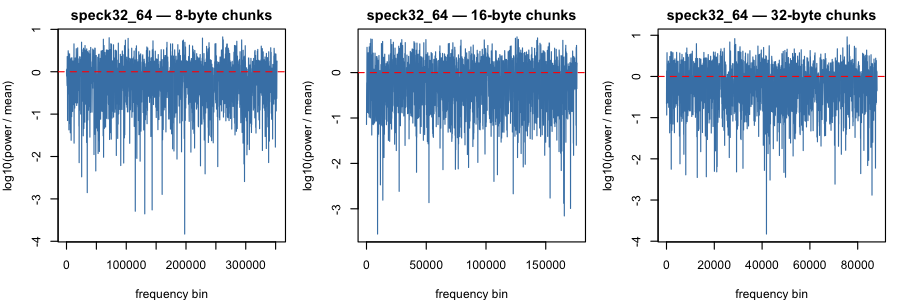

### Speck64/128 (`speck64_128`)

Verdict: PASS &mdash; 0 test rejection(s) at $\alpha = 0.001$, 0 entropy miss(es) at $\mathrm{tol} = 0.001$ (total 0 / 22).

Byte-stream Shannon entropy: **7.999994 bits/byte** (ideal: $8$; signed deviation $H - 8 = -5.93 \times 10^{-6}$ bits).

**8-byte chunks** (704,810 samples; chunk-entropy 8.000004 bits; signed deviation $H - 8 = 3.62 \times 10^{-6}$ bits)

Moments (sample, ideal, dev):

| $k$ | sample $m_k$ | ideal $1/(k+1)$ | dev |
|-----|--------------|-----------------|-----|
| 1 | 0.500098 | 0.500000 | 9.78e-05 |
| 2 | 0.333411 | 0.333333 | 7.72e-05 |
| 3 | 0.250074 | 0.250000 | 7.38e-05 |
| 4 | 0.200073 | 0.200000 | 7.29e-05 |
| 5 | 0.166736 | 0.166667 | 6.92e-05 |
| 6 | 0.142919 | 0.142857 | 6.23e-05 |
| 7 | 0.125053 | 0.125000 | 5.29e-05 |
| 8 | 0.111153 | 0.111111 | 4.16e-05 |
| 9 | 0.100029 | 0.100000 | 2.92e-05 |
| 10 | 0.090925 | 0.090909 | 1.62e-05 |

Tests:

| test | p |
|------|---|
| FFT peak/mean | 14.60 |
| FFT spectrum KS (vs flat) | 0.739 |
| KS vs Uniform(0,1) | 0.915 |
| randtoolbox gap.test | 0.011 |
| randtoolbox freq.test (16 bins) | 0.211 |
| randtoolbox order.test (d=4) | 0.992 |
| tseries runs.test (bits) | 0.097 |

**16-byte chunks** (352,405 samples; chunk-entropy 8.000045 bits; signed deviation $H - 8 = 4.53 \times 10^{-5}$ bits)

Moments (sample, ideal, dev):

| $k$ | sample $m_k$ | ideal $1/(k+1)$ | dev |
|-----|--------------|-----------------|-----|
| 1 | 0.500142 | 0.500000 | 1.42e-04 |
| 2 | 0.333413 | 0.333333 | 7.93e-05 |
| 3 | 0.250035 | 0.250000 | 3.52e-05 |
| 4 | 0.200013 | 0.200000 | 1.25e-05 |
| 5 | 0.166668 | 0.166667 | 1.09e-06 |
| 6 | 0.142852 | 0.142857 | 5.00e-06 |
| 7 | 0.124991 | 0.125000 | 8.73e-06 |
| 8 | 0.111100 | 0.111111 | 1.16e-05 |
| 9 | 0.099986 | 0.100000 | 1.43e-05 |
| 10 | 0.090892 | 0.090909 | 1.72e-05 |

Tests:

| test | p |
|------|---|
| FFT peak/mean | 14.14 |
| FFT spectrum KS (vs flat) | 0.936 |
| KS vs Uniform(0,1) | 0.670 |
| randtoolbox gap.test | 0.623 |
| randtoolbox freq.test (16 bins) | 0.424 |
| randtoolbox order.test (d=4) | 0.977 |
| tseries runs.test (bits) | 0.097 |

**32-byte chunks** (176,202 samples; chunk-entropy 7.999969 bits; signed deviation $H - 8 = -3.11 \times 10^{-5}$ bits)

Moments (sample, ideal, dev):

| $k$ | sample $m_k$ | ideal $1/(k+1)$ | dev |
|-----|--------------|-----------------|-----|
| 1 | 0.500382 | 0.500000 | 3.82e-04 |
| 2 | 0.333577 | 0.333333 | 2.44e-04 |
| 3 | 0.250167 | 0.250000 | 1.67e-04 |
| 4 | 0.200122 | 0.200000 | 1.22e-04 |
| 5 | 0.166758 | 0.166667 | 9.16e-05 |
| 6 | 0.142927 | 0.142857 | 6.95e-05 |
| 7 | 0.125052 | 0.125000 | 5.17e-05 |
| 8 | 0.111147 | 0.111111 | 3.64e-05 |
| 9 | 0.100022 | 0.100000 | 2.23e-05 |
| 10 | 0.090918 | 0.090909 | 8.95e-06 |

Tests:

| test | p |
|------|---|
| FFT peak/mean | 10.63 |
| FFT spectrum KS (vs flat) | 0.826 |
| KS vs Uniform(0,1) | 0.778 |
| randtoolbox gap.test | 0.387 |
| randtoolbox freq.test (16 bins) | 0.159 |
| randtoolbox order.test (d=4) | 0.999 |
| tseries runs.test (bits) | 0.097 |

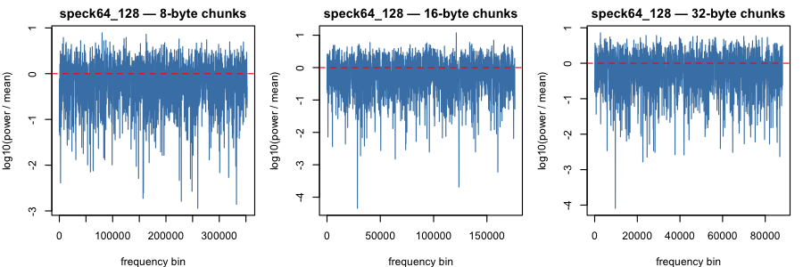

### Speck128/128 (`speck128_128`)

Verdict: PASS &mdash; 0 test rejection(s) at $\alpha = 0.001$, 0 entropy miss(es) at $\mathrm{tol} = 0.001$ (total 0 / 22).

Byte-stream Shannon entropy: **8.000003 bits/byte** (ideal: $8$; signed deviation $H - 8 = 2.99 \times 10^{-6}$ bits).

**8-byte chunks** (704,810 samples; chunk-entropy 7.999994 bits; signed deviation $H - 8 = -5.80 \times 10^{-6}$ bits)

Moments (sample, ideal, dev):

| $k$ | sample $m_k$ | ideal $1/(k+1)$ | dev |
|-----|--------------|-----------------|-----|
| 1 | 0.500301 | 0.500000 | 3.01e-04 |
| 2 | 0.333738 | 0.333333 | 4.05e-04 |
| 3 | 0.250413 | 0.250000 | 4.13e-04 |
| 4 | 0.200391 | 0.200000 | 3.91e-04 |
| 5 | 0.167026 | 0.166667 | 3.59e-04 |
| 6 | 0.143184 | 0.142857 | 3.26e-04 |
| 7 | 0.125295 | 0.125000 | 2.95e-04 |
| 8 | 0.111378 | 0.111111 | 2.67e-04 |
| 9 | 0.100241 | 0.100000 | 2.41e-04 |
| 10 | 0.091127 | 0.090909 | 2.18e-04 |

Tests:

| test | p |
|------|---|
| FFT peak/mean | 13.02 |
| FFT spectrum KS (vs flat) | 0.954 |
| KS vs Uniform(0,1) | 0.361 |
| randtoolbox gap.test | 0.624 |
| randtoolbox freq.test (16 bins) | 0.456 |
| randtoolbox order.test (d=4) | 0.733 |
| tseries runs.test (bits) | 0.665 |

**16-byte chunks** (352,405 samples; chunk-entropy 7.999984 bits; signed deviation $H - 8 = -1.59 \times 10^{-5}$ bits)

Moments (sample, ideal, dev):

| $k$ | sample $m_k$ | ideal $1/(k+1)$ | dev |
|-----|--------------|-----------------|-----|
| 1 | 0.500177 | 0.500000 | 1.77e-04 |
| 2 | 0.333792 | 0.333333 | 4.59e-04 |
| 3 | 0.250545 | 0.250000 | 5.45e-04 |
| 4 | 0.200550 | 0.200000 | 5.50e-04 |
| 5 | 0.167190 | 0.166667 | 5.24e-04 |
| 6 | 0.143344 | 0.142857 | 4.86e-04 |
| 7 | 0.125446 | 0.125000 | 4.46e-04 |
| 8 | 0.111518 | 0.111111 | 4.07e-04 |
| 9 | 0.100370 | 0.100000 | 3.70e-04 |
| 10 | 0.091244 | 0.090909 | 3.35e-04 |

Tests:

| test | p |
|------|---|
| FFT peak/mean | 11.36 |
| FFT spectrum KS (vs flat) | 0.958 |
| KS vs Uniform(0,1) | 0.399 |
| randtoolbox gap.test | 0.989 |
| randtoolbox freq.test (16 bins) | 0.766 |
| randtoolbox order.test (d=4) | 0.113 |
| tseries runs.test (bits) | 0.665 |

**32-byte chunks** (176,202 samples; chunk-entropy 7.999913 bits; signed deviation $H - 8 = -8.74 \times 10^{-5}$ bits)

Moments (sample, ideal, dev):

| $k$ | sample $m_k$ | ideal $1/(k+1)$ | dev |
|-----|--------------|-----------------|-----|
| 1 | 0.499923 | 0.500000 | 7.67e-05 |
| 2 | 0.333496 | 0.333333 | 1.63e-04 |
| 3 | 0.250225 | 0.250000 | 2.25e-04 |
| 4 | 0.200216 | 0.200000 | 2.16e-04 |
| 5 | 0.166850 | 0.166667 | 1.83e-04 |
| 6 | 0.143000 | 0.142857 | 1.43e-04 |
| 7 | 0.125100 | 0.125000 | 1.00e-04 |
| 8 | 0.111170 | 0.111111 | 5.90e-05 |
| 9 | 0.100019 | 0.100000 | 1.93e-05 |
| 10 | 0.090891 | 0.090909 | 1.80e-05 |

Tests:

| test | p |
|------|---|
| FFT peak/mean | 11.58 |
| FFT spectrum KS (vs flat) | 0.852 |
| KS vs Uniform(0,1) | 0.598 |
| randtoolbox gap.test | 0.695 |
| randtoolbox freq.test (16 bins) | 0.802 |
| randtoolbox order.test (d=4) | 0.073 |
| tseries runs.test (bits) | 0.665 |

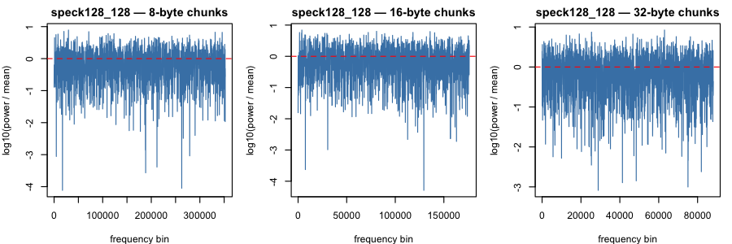

### Speck128/256 (`speck128_256`)

Verdict: PASS &mdash; 0 test rejection(s) at $\alpha = 0.001$, 0 entropy miss(es) at $\mathrm{tol} = 0.001$ (total 0 / 22).

Byte-stream Shannon entropy: **8.000000 bits/byte** (ideal: $8$; signed deviation $H - 8 = -3.23 \times 10^{-8}$ bits).

**8-byte chunks** (704,810 samples; chunk-entropy 8.000016 bits; signed deviation $H - 8 = 1.63 \times 10^{-5}$ bits)

Moments (sample, ideal, dev):

| $k$ | sample $m_k$ | ideal $1/(k+1)$ | dev |
|-----|--------------|-----------------|-----|
| 1 | 0.500083 | 0.500000 | 8.30e-05 |
| 2 | 0.333399 | 0.333333 | 6.53e-05 |
| 3 | 0.250046 | 0.250000 | 4.61e-05 |
| 4 | 0.200028 | 0.200000 | 2.83e-05 |
| 5 | 0.166677 | 0.166667 | 1.01e-05 |
| 6 | 0.142850 | 0.142857 | 7.55e-06 |
| 7 | 0.124976 | 0.125000 | 2.37e-05 |
| 8 | 0.111073 | 0.111111 | 3.78e-05 |
| 9 | 0.099950 | 0.100000 | 4.98e-05 |
| 10 | 0.090849 | 0.090909 | 5.98e-05 |

Tests:

| test | p |
|------|---|
| FFT peak/mean | 13.54 |
| FFT spectrum KS (vs flat) | 0.801 |
| KS vs Uniform(0,1) | 0.988 |
| randtoolbox gap.test | 0.875 |
| randtoolbox freq.test (16 bins) | 0.831 |
| randtoolbox order.test (d=4) | 0.738 |
| tseries runs.test (bits) | 0.948 |

**16-byte chunks** (352,405 samples; chunk-entropy 8.000038 bits; signed deviation $H - 8 = 3.81 \times 10^{-5}$ bits)

Moments (sample, ideal, dev):

| $k$ | sample $m_k$ | ideal $1/(k+1)$ | dev |
|-----|--------------|-----------------|-----|
| 1 | 0.500388 | 0.500000 | 3.88e-04 |
| 2 | 0.333795 | 0.333333 | 4.61e-04 |
| 3 | 0.250455 | 0.250000 | 4.55e-04 |
| 4 | 0.200421 | 0.200000 | 4.21e-04 |
| 5 | 0.167047 | 0.166667 | 3.81e-04 |
| 6 | 0.143200 | 0.142857 | 3.42e-04 |
| 7 | 0.125309 | 0.125000 | 3.09e-04 |
| 8 | 0.111391 | 0.111111 | 2.80e-04 |
| 9 | 0.100256 | 0.100000 | 2.56e-04 |
| 10 | 0.091145 | 0.090909 | 2.36e-04 |

Tests:

| test | p |
|------|---|
| FFT peak/mean | 16.01 |
| FFT spectrum KS (vs flat) | 0.359 |
| KS vs Uniform(0,1) | 0.441 |
| randtoolbox gap.test | 0.821 |
| randtoolbox freq.test (16 bins) | 0.665 |
| randtoolbox order.test (d=4) | 0.326 |
| tseries runs.test (bits) | 0.948 |

**32-byte chunks** (176,202 samples; chunk-entropy 7.999983 bits; signed deviation $H - 8 = -1.74 \times 10^{-5}$ bits)

Moments (sample, ideal, dev):

| $k$ | sample $m_k$ | ideal $1/(k+1)$ | dev |
|-----|--------------|-----------------|-----|
| 1 | 0.500389 | 0.500000 | 3.89e-04 |
| 2 | 0.333626 | 0.333333 | 2.93e-04 |
| 3 | 0.250179 | 0.250000 | 1.79e-04 |
| 4 | 0.200084 | 0.200000 | 8.37e-05 |
| 5 | 0.166677 | 0.166667 | 1.06e-05 |
| 6 | 0.142815 | 0.142857 | 4.21e-05 |
| 7 | 0.124922 | 0.125000 | 7.83e-05 |
| 8 | 0.111009 | 0.111111 | 1.02e-04 |
| 9 | 0.099884 | 0.100000 | 1.16e-04 |
| 10 | 0.090786 | 0.090909 | 1.23e-04 |

Tests:

| test | p |
|------|---|
| FFT peak/mean | 13.10 |
| FFT spectrum KS (vs flat) | 0.729 |
| KS vs Uniform(0,1) | 0.584 |
| randtoolbox gap.test | 0.515 |
| randtoolbox freq.test (16 bins) | 0.479 |
| randtoolbox order.test (d=4) | 0.693 |
| tseries runs.test (bits) | 0.948 |

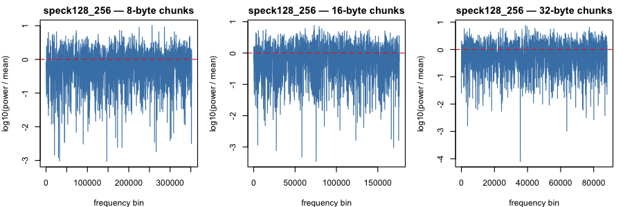

### ChaCha20 (`chacha20`)

Verdict: PASS &mdash; 0 test rejection(s) at $\alpha = 0.001$, 0 entropy miss(es) at $\mathrm{tol} = 0.001$ (total 0 / 22).

Byte-stream Shannon entropy: **7.999998 bits/byte** (ideal: $8$; signed deviation $H - 8 = -1.88 \times 10^{-6}$ bits).

**8-byte chunks** (704,810 samples; chunk-entropy 7.999991 bits; signed deviation $H - 8 = -9.39 \times 10^{-6}$ bits)

Moments (sample, ideal, dev):

| $k$ | sample $m_k$ | ideal $1/(k+1)$ | dev |
|-----|--------------|-----------------|-----|
| 1 | 0.500021 | 0.500000 | 2.08e-05 |
| 2 | 0.333323 | 0.333333 | 1.08e-05 |
| 3 | 0.249928 | 0.250000 | 7.17e-05 |
| 4 | 0.199884 | 0.200000 | 1.16e-04 |
| 5 | 0.166524 | 0.166667 | 1.43e-04 |
| 6 | 0.142702 | 0.142857 | 1.55e-04 |
| 7 | 0.124841 | 0.125000 | 1.59e-04 |
| 8 | 0.110953 | 0.111111 | 1.58e-04 |
| 9 | 0.099847 | 0.100000 | 1.53e-04 |
| 10 | 0.090763 | 0.090909 | 1.46e-04 |

Tests:

| test | p |
|------|---|
| FFT peak/mean | 15.04 |
| FFT spectrum KS (vs flat) | 0.647 |
| KS vs Uniform(0,1) | 0.683 |
| randtoolbox gap.test | 0.146 |
| randtoolbox freq.test (16 bins) | 0.638 |
| randtoolbox order.test (d=4) | 0.464 |
| tseries runs.test (bits) | 0.307 |

**16-byte chunks** (352,405 samples; chunk-entropy 7.999985 bits; signed deviation $H - 8 = -1.45 \times 10^{-5}$ bits)

Moments (sample, ideal, dev):

| $k$ | sample $m_k$ | ideal $1/(k+1)$ | dev |
|-----|--------------|-----------------|-----|
| 1 | 0.499238 | 0.500000 | 7.62e-04 |
| 2 | 0.332505 | 0.333333 | 8.28e-04 |
| 3 | 0.249144 | 0.250000 | 8.56e-04 |
| 4 | 0.199142 | 0.200000 | 8.58e-04 |
| 5 | 0.165822 | 0.166667 | 8.44e-04 |
| 6 | 0.142034 | 0.142857 | 8.23e-04 |
| 7 | 0.124201 | 0.125000 | 7.99e-04 |
| 8 | 0.110337 | 0.111111 | 7.74e-04 |
| 9 | 0.099250 | 0.100000 | 7.50e-04 |
| 10 | 0.090183 | 0.090909 | 7.26e-04 |

Tests:

| test | p |
|------|---|
| FFT peak/mean | 11.38 |
| FFT spectrum KS (vs flat) | 0.995 |
| KS vs Uniform(0,1) | 0.294 |
| randtoolbox gap.test | 0.531 |
| randtoolbox freq.test (16 bins) | 0.609 |
| randtoolbox order.test (d=4) | 0.806 |
| tseries runs.test (bits) | 0.307 |

**32-byte chunks** (176,202 samples; chunk-entropy 8.000084 bits; signed deviation $H - 8 = 8.42 \times 10^{-5}$ bits)

Moments (sample, ideal, dev):

| $k$ | sample $m_k$ | ideal $1/(k+1)$ | dev |
|-----|--------------|-----------------|-----|
| 1 | 0.499368 | 0.500000 | 6.32e-04 |
| 2 | 0.332660 | 0.333333 | 6.73e-04 |
| 3 | 0.249274 | 0.250000 | 7.26e-04 |
| 4 | 0.199234 | 0.200000 | 7.66e-04 |
| 5 | 0.165873 | 0.166667 | 7.94e-04 |
| 6 | 0.142045 | 0.142857 | 8.12e-04 |
| 7 | 0.124177 | 0.125000 | 8.23e-04 |
| 8 | 0.110282 | 0.111111 | 8.29e-04 |
| 9 | 0.099170 | 0.100000 | 8.30e-04 |
| 10 | 0.090081 | 0.090909 | 8.28e-04 |

Tests:

| test | p |
|------|---|
| FFT peak/mean | 11.50 |
| FFT spectrum KS (vs flat) | 0.311 |
| KS vs Uniform(0,1) | 0.578 |
| randtoolbox gap.test | 0.380 |
| randtoolbox freq.test (16 bins) | 0.554 |
| randtoolbox order.test (d=4) | 0.528 |
| tseries runs.test (bits) | 0.307 |

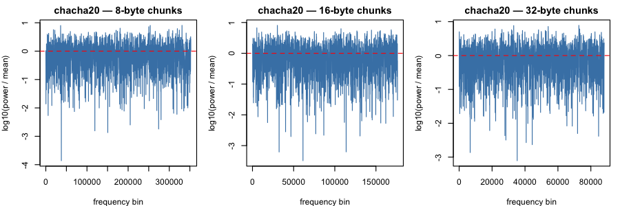

### XChaCha20 (`xchacha20`)

Verdict: PASS &mdash; 0 test rejection(s) at $\alpha = 0.001$, 0 entropy miss(es) at $\mathrm{tol} = 0.001$ (total 0 / 22).

Byte-stream Shannon entropy: **8.000001 bits/byte** (ideal: $8$; signed deviation $H - 8 = 1.41 \times 10^{-6}$ bits).

**8-byte chunks** (704,810 samples; chunk-entropy 8.000000 bits; signed deviation $H - 8 = 1.05 \times 10^{-7}$ bits)

Moments (sample, ideal, dev):

| $k$ | sample $m_k$ | ideal $1/(k+1)$ | dev |
|-----|--------------|-----------------|-----|
| 1 | 0.500499 | 0.500000 | 4.99e-04 |
| 2 | 0.333960 | 0.333333 | 6.26e-04 |
| 3 | 0.250644 | 0.250000 | 6.44e-04 |
| 4 | 0.200629 | 0.200000 | 6.29e-04 |
| 5 | 0.167270 | 0.166667 | 6.03e-04 |
| 6 | 0.143432 | 0.142857 | 5.75e-04 |
| 7 | 0.125548 | 0.125000 | 5.48e-04 |
| 8 | 0.111632 | 0.111111 | 5.21e-04 |
| 9 | 0.100496 | 0.100000 | 4.96e-04 |
| 10 | 0.091382 | 0.090909 | 4.73e-04 |

Tests:

| test | p |
|------|---|
| FFT peak/mean | 13.00 |
| FFT spectrum KS (vs flat) | 0.964 |
| KS vs Uniform(0,1) | 0.393 |
| randtoolbox gap.test | 0.902 |
| randtoolbox freq.test (16 bins) | 0.953 |
| randtoolbox order.test (d=4) | 0.496 |
| tseries runs.test (bits) | 0.131 |

**16-byte chunks** (352,405 samples; chunk-entropy 8.000031 bits; signed deviation $H - 8 = 3.06 \times 10^{-5}$ bits)

Moments (sample, ideal, dev):

| $k$ | sample $m_k$ | ideal $1/(k+1)$ | dev |
|-----|--------------|-----------------|-----|
| 1 | 0.500888 | 0.500000 | 8.88e-04 |
| 2 | 0.334235 | 0.333333 | 9.01e-04 |
| 3 | 0.250802 | 0.250000 | 8.02e-04 |
| 4 | 0.200711 | 0.200000 | 7.11e-04 |
| 5 | 0.167305 | 0.166667 | 6.38e-04 |
| 6 | 0.143436 | 0.142857 | 5.79e-04 |
| 7 | 0.125529 | 0.125000 | 5.29e-04 |
| 8 | 0.111597 | 0.111111 | 4.86e-04 |
| 9 | 0.100447 | 0.100000 | 4.47e-04 |
| 10 | 0.091321 | 0.090909 | 4.12e-04 |

Tests:

| test | p |
|------|---|
| FFT peak/mean | 14.41 |
| FFT spectrum KS (vs flat) | 0.522 |
| KS vs Uniform(0,1) | 0.174 |
| randtoolbox gap.test | 0.262 |
| randtoolbox freq.test (16 bins) | 0.552 |
| randtoolbox order.test (d=4) | 0.159 |
| tseries runs.test (bits) | 0.131 |

**32-byte chunks** (176,202 samples; chunk-entropy 8.000032 bits; signed deviation $H - 8 = 3.19 \times 10^{-5}$ bits)

Moments (sample, ideal, dev):

| $k$ | sample $m_k$ | ideal $1/(k+1)$ | dev |
|-----|--------------|-----------------|-----|
| 1 | 0.501019 | 0.500000 | 1.02e-03 |
| 2 | 0.334202 | 0.333333 | 8.69e-04 |
| 3 | 0.250630 | 0.250000 | 6.30e-04 |
| 4 | 0.200450 | 0.200000 | 4.50e-04 |
| 5 | 0.166991 | 0.166667 | 3.24e-04 |
| 6 | 0.143091 | 0.142857 | 2.34e-04 |
| 7 | 0.125166 | 0.125000 | 1.66e-04 |
| 8 | 0.111225 | 0.111111 | 1.14e-04 |
| 9 | 0.100072 | 0.100000 | 7.20e-05 |
| 10 | 0.090946 | 0.090909 | 3.72e-05 |

Tests:

| test | p |
|------|---|
| FFT peak/mean | 11.98 |
| FFT spectrum KS (vs flat) | 0.224 |
| KS vs Uniform(0,1) | 0.067 |
| randtoolbox gap.test | 0.217 |
| randtoolbox freq.test (16 bins) | 0.333 |
| randtoolbox order.test (d=4) | 0.548 |
| tseries runs.test (bits) | 0.131 |

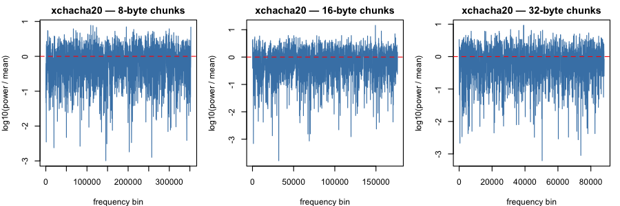

### Salsa20 (`salsa20`)

Verdict: PASS &mdash; 0 test rejection(s) at $\alpha = 0.001$, 0 entropy miss(es) at $\mathrm{tol} = 0.001$ (total 0 / 22).

Byte-stream Shannon entropy: **7.999998 bits/byte** (ideal: $8$; signed deviation $H - 8 = -2.08 \times 10^{-6}$ bits).

**8-byte chunks** (704,810 samples; chunk-entropy 7.999969 bits; signed deviation $H - 8 = -3.06 \times 10^{-5}$ bits)

Moments (sample, ideal, dev):

| $k$ | sample $m_k$ | ideal $1/(k+1)$ | dev |
|-----|--------------|-----------------|-----|
| 1 | 0.500350 | 0.500000 | 3.50e-04 |
| 2 | 0.333802 | 0.333333 | 4.69e-04 |
| 3 | 0.250480 | 0.250000 | 4.80e-04 |
| 4 | 0.200464 | 0.200000 | 4.64e-04 |
| 5 | 0.167109 | 0.166667 | 4.43e-04 |
| 6 | 0.143279 | 0.142857 | 4.22e-04 |
| 7 | 0.125403 | 0.125000 | 4.03e-04 |
| 8 | 0.111498 | 0.111111 | 3.87e-04 |
| 9 | 0.100372 | 0.100000 | 3.72e-04 |
| 10 | 0.091268 | 0.090909 | 3.59e-04 |

Tests:

| test | p |
|------|---|
| FFT peak/mean | 12.31 |
| FFT spectrum KS (vs flat) | 0.575 |
| KS vs Uniform(0,1) | 0.252 |
| randtoolbox gap.test | 0.551 |
| randtoolbox freq.test (16 bins) | 0.145 |
| randtoolbox order.test (d=4) | 0.742 |
| tseries runs.test (bits) | 0.737 |

**16-byte chunks** (352,405 samples; chunk-entropy 7.999973 bits; signed deviation $H - 8 = -2.67 \times 10^{-5}$ bits)

Moments (sample, ideal, dev):

| $k$ | sample $m_k$ | ideal $1/(k+1)$ | dev |
|-----|--------------|-----------------|-----|
| 1 | 0.500373 | 0.500000 | 3.73e-04 |
| 2 | 0.333913 | 0.333333 | 5.80e-04 |
| 3 | 0.250652 | 0.250000 | 6.52e-04 |
| 4 | 0.200677 | 0.200000 | 6.77e-04 |
| 5 | 0.167351 | 0.166667 | 6.85e-04 |
| 6 | 0.143542 | 0.142857 | 6.84e-04 |
| 7 | 0.125680 | 0.125000 | 6.80e-04 |
| 8 | 0.111784 | 0.111111 | 6.73e-04 |
| 9 | 0.100664 | 0.100000 | 6.64e-04 |
| 10 | 0.091562 | 0.090909 | 6.53e-04 |

Tests:

| test | p |
|------|---|
| FFT peak/mean | 12.50 |
| FFT spectrum KS (vs flat) | 0.764 |
| KS vs Uniform(0,1) | 0.536 |
| randtoolbox gap.test | 0.904 |
| randtoolbox freq.test (16 bins) | 0.655 |
| randtoolbox order.test (d=4) | 0.879 |
| tseries runs.test (bits) | 0.737 |

**32-byte chunks** (176,202 samples; chunk-entropy 7.999912 bits; signed deviation $H - 8 = -8.85 \times 10^{-5}$ bits)

Moments (sample, ideal, dev):

| $k$ | sample $m_k$ | ideal $1/(k+1)$ | dev |
|-----|--------------|-----------------|-----|
| 1 | 0.500264 | 0.500000 | 2.64e-04 |
| 2 | 0.333805 | 0.333333 | 4.71e-04 |
| 3 | 0.250549 | 0.250000 | 5.49e-04 |
| 4 | 0.200576 | 0.200000 | 5.76e-04 |
| 5 | 0.167251 | 0.166667 | 5.84e-04 |
| 6 | 0.143442 | 0.142857 | 5.85e-04 |
| 7 | 0.125583 | 0.125000 | 5.83e-04 |
| 8 | 0.111691 | 0.111111 | 5.80e-04 |
| 9 | 0.100577 | 0.100000 | 5.77e-04 |
| 10 | 0.091482 | 0.090909 | 5.73e-04 |

Tests:

| test | p |
|------|---|
| FFT peak/mean | 10.36 |
| FFT spectrum KS (vs flat) | 0.931 |
| KS vs Uniform(0,1) | 0.809 |
| randtoolbox gap.test | 0.481 |
| randtoolbox freq.test (16 bins) | 0.747 |
| randtoolbox order.test (d=4) | 0.026 |
| tseries runs.test (bits) | 0.737 |

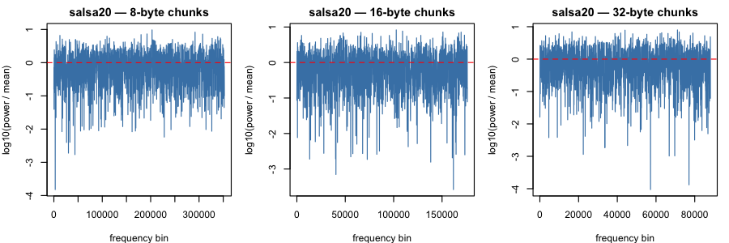

### Rabbit (`rabbit`)

Verdict: PASS &mdash; 0 test rejection(s) at $\alpha = 0.001$, 0 entropy miss(es) at $\mathrm{tol} = 0.001$ (total 0 / 22).

Byte-stream Shannon entropy: **8.000003 bits/byte** (ideal: $8$; signed deviation $H - 8 = 2.77 \times 10^{-6}$ bits).

**8-byte chunks** (704,810 samples; chunk-entropy 8.000015 bits; signed deviation $H - 8 = 1.49 \times 10^{-5}$ bits)

Moments (sample, ideal, dev):

| $k$ | sample $m_k$ | ideal $1/(k+1)$ | dev |
|-----|--------------|-----------------|-----|
| 1 | 0.500063 | 0.500000 | 6.34e-05 |
| 2 | 0.333484 | 0.333333 | 1.50e-04 |
| 3 | 0.250182 | 0.250000 | 1.82e-04 |
| 4 | 0.200191 | 0.200000 | 1.91e-04 |
| 5 | 0.166856 | 0.166667 | 1.89e-04 |
| 6 | 0.143039 | 0.142857 | 1.82e-04 |
| 7 | 0.125171 | 0.125000 | 1.71e-04 |
| 8 | 0.111270 | 0.111111 | 1.59e-04 |
| 9 | 0.100145 | 0.100000 | 1.45e-04 |
| 10 | 0.091041 | 0.090909 | 1.32e-04 |

Tests:

| test | p |
|------|---|
| FFT peak/mean | 13.39 |
| FFT spectrum KS (vs flat) | 0.882 |
| KS vs Uniform(0,1) | 0.864 |
| randtoolbox gap.test | 0.925 |
| randtoolbox freq.test (16 bins) | 0.886 |
| randtoolbox order.test (d=4) | 0.500 |
| tseries runs.test (bits) | 0.362 |

**16-byte chunks** (352,405 samples; chunk-entropy 8.000080 bits; signed deviation $H - 8 = 7.95 \times 10^{-5}$ bits)

Moments (sample, ideal, dev):

| $k$ | sample $m_k$ | ideal $1/(k+1)$ | dev |
|-----|--------------|-----------------|-----|
| 1 | 0.500147 | 0.500000 | 1.47e-04 |
| 2 | 0.333485 | 0.333333 | 1.51e-04 |
| 3 | 0.250123 | 0.250000 | 1.23e-04 |
| 4 | 0.200092 | 0.200000 | 9.24e-05 |
| 5 | 0.166732 | 0.166667 | 6.51e-05 |
| 6 | 0.142899 | 0.142857 | 4.18e-05 |
| 7 | 0.125022 | 0.125000 | 2.15e-05 |
| 8 | 0.111115 | 0.111111 | 3.86e-06 |
| 9 | 0.099988 | 0.100000 | 1.17e-05 |
| 10 | 0.090884 | 0.090909 | 2.54e-05 |

Tests:

| test | p |
|------|---|
| FFT peak/mean | 12.77 |
| FFT spectrum KS (vs flat) | 0.955 |
| KS vs Uniform(0,1) | 0.683 |
| randtoolbox gap.test | 0.253 |
| randtoolbox freq.test (16 bins) | 0.763 |
| randtoolbox order.test (d=4) | 0.375 |
| tseries runs.test (bits) | 0.362 |

**32-byte chunks** (176,202 samples; chunk-entropy 8.000147 bits; signed deviation $H - 8 = 1.47 \times 10^{-4}$ bits)

Moments (sample, ideal, dev):

| $k$ | sample $m_k$ | ideal $1/(k+1)$ | dev |
|-----|--------------|-----------------|-----|
| 1 | 0.499309 | 0.500000 | 6.91e-04 |
| 2 | 0.332646 | 0.333333 | 6.87e-04 |
| 3 | 0.249358 | 0.250000 | 6.42e-04 |
| 4 | 0.199405 | 0.200000 | 5.95e-04 |
| 5 | 0.166116 | 0.166667 | 5.51e-04 |
| 6 | 0.142344 | 0.142857 | 5.13e-04 |
| 7 | 0.124520 | 0.125000 | 4.80e-04 |
| 8 | 0.110659 | 0.111111 | 4.52e-04 |
| 9 | 0.099572 | 0.100000 | 4.28e-04 |
| 10 | 0.090502 | 0.090909 | 4.07e-04 |

Tests:

| test | p |
|------|---|
| FFT peak/mean | 13.19 |
| FFT spectrum KS (vs flat) | 0.588 |
| KS vs Uniform(0,1) | 0.722 |
| randtoolbox gap.test | 0.103 |
| randtoolbox freq.test (16 bins) | 0.990 |
| randtoolbox order.test (d=4) | 0.042 |
| tseries runs.test (bits) | 0.362 |

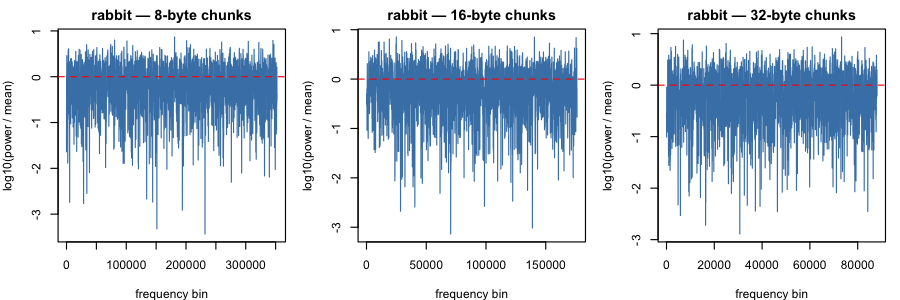

### ZUC-128 (`zuc128`)

Verdict: PASS &mdash; 0 test rejection(s) at $\alpha = 0.001$, 0 entropy miss(es) at $\mathrm{tol} = 0.001$ (total 0 / 22).

Byte-stream Shannon entropy: **8.000000 bits/byte** (ideal: $8$; signed deviation $H - 8 = -3.35 \times 10^{-7}$ bits).

**8-byte chunks** (704,810 samples; chunk-entropy 8.000034 bits; signed deviation $H - 8 = 3.39 \times 10^{-5}$ bits)

Moments (sample, ideal, dev):

| $k$ | sample $m_k$ | ideal $1/(k+1)$ | dev |
|-----|--------------|-----------------|-----|
| 1 | 0.499683 | 0.500000 | 3.17e-04 |
| 2 | 0.332831 | 0.333333 | 5.02e-04 |
| 3 | 0.249447 | 0.250000 | 5.53e-04 |
| 4 | 0.199450 | 0.200000 | 5.50e-04 |
| 5 | 0.166140 | 0.166667 | 5.27e-04 |
| 6 | 0.142360 | 0.142857 | 4.97e-04 |
| 7 | 0.124533 | 0.125000 | 4.67e-04 |
| 8 | 0.110672 | 0.111111 | 4.39e-04 |
| 9 | 0.099588 | 0.100000 | 4.12e-04 |
| 10 | 0.090521 | 0.090909 | 3.88e-04 |

Tests:

| test | p |
|------|---|
| FFT peak/mean | 13.75 |
| FFT spectrum KS (vs flat) | 0.926 |
| KS vs Uniform(0,1) | 0.317 |
| randtoolbox gap.test | 0.775 |
| randtoolbox freq.test (16 bins) | 0.894 |
| randtoolbox order.test (d=4) | 0.840 |
| tseries runs.test (bits) | 0.237 |

**16-byte chunks** (352,405 samples; chunk-entropy 8.000072 bits; signed deviation $H - 8 = 7.16 \times 10^{-5}$ bits)

Moments (sample, ideal, dev):

| $k$ | sample $m_k$ | ideal $1/(k+1)$ | dev |
|-----|--------------|-----------------|-----|
| 1 | 0.500003 | 0.500000 | 2.75e-06 |
| 2 | 0.333128 | 0.333333 | 2.06e-04 |
| 3 | 0.249706 | 0.250000 | 2.94e-04 |
| 4 | 0.199672 | 0.200000 | 3.28e-04 |
| 5 | 0.166326 | 0.166667 | 3.41e-04 |
| 6 | 0.142512 | 0.142857 | 3.45e-04 |
| 7 | 0.124654 | 0.125000 | 3.46e-04 |
| 8 | 0.110766 | 0.111111 | 3.45e-04 |
| 9 | 0.099657 | 0.100000 | 3.43e-04 |
| 10 | 0.090569 | 0.090909 | 3.40e-04 |

Tests:

| test | p |
|------|---|
| FFT peak/mean | 10.62 |
| FFT spectrum KS (vs flat) | 0.331 |
| KS vs Uniform(0,1) | 0.657 |
| randtoolbox gap.test | 0.973 |
| randtoolbox freq.test (16 bins) | 0.762 |
| randtoolbox order.test (d=4) | 0.329 |
| tseries runs.test (bits) | 0.237 |

**32-byte chunks** (176,202 samples; chunk-entropy 8.000113 bits; signed deviation $H - 8 = 1.13 \times 10^{-4}$ bits)

Moments (sample, ideal, dev):

| $k$ | sample $m_k$ | ideal $1/(k+1)$ | dev |
|-----|--------------|-----------------|-----|
| 1 | 0.499681 | 0.500000 | 3.19e-04 |
| 2 | 0.332849 | 0.333333 | 4.84e-04 |
| 3 | 0.249520 | 0.250000 | 4.80e-04 |
| 4 | 0.199575 | 0.200000 | 4.25e-04 |
| 5 | 0.166303 | 0.166667 | 3.64e-04 |
| 6 | 0.142547 | 0.142857 | 3.10e-04 |
| 7 | 0.124733 | 0.125000 | 2.67e-04 |
| 8 | 0.110878 | 0.111111 | 2.33e-04 |
| 9 | 0.099793 | 0.100000 | 2.07e-04 |
| 10 | 0.090723 | 0.090909 | 1.86e-04 |

Tests:

| test | p |
|------|---|
| FFT peak/mean | 12.83 |
| FFT spectrum KS (vs flat) | 0.899 |
| KS vs Uniform(0,1) | 0.557 |
| randtoolbox gap.test | 0.206 |
| randtoolbox freq.test (16 bins) | 0.932 |
| randtoolbox order.test (d=4) | 0.587 |
| tseries runs.test (bits) | 0.237 |

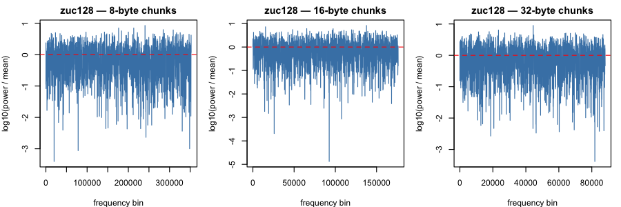

### SNOW 3G (`snow3g`)

Verdict: PASS &mdash; 0 test rejection(s) at $\alpha = 0.001$, 0 entropy miss(es) at $\mathrm{tol} = 0.001$ (total 0 / 22).

Byte-stream Shannon entropy: **7.999998 bits/byte** (ideal: $8$; signed deviation $H - 8 = -1.86 \times 10^{-6}$ bits).

**8-byte chunks** (704,810 samples; chunk-entropy 8.000010 bits; signed deviation $H - 8 = 9.71 \times 10^{-6}$ bits)

Moments (sample, ideal, dev):

| $k$ | sample $m_k$ | ideal $1/(k+1)$ | dev |
|-----|--------------|-----------------|-----|
| 1 | 0.500373 | 0.500000 | 3.73e-04 |
| 2 | 0.333647 | 0.333333 | 3.14e-04 |
| 3 | 0.250251 | 0.250000 | 2.51e-04 |
| 4 | 0.200199 | 0.200000 | 1.99e-04 |
| 5 | 0.166824 | 0.166667 | 1.57e-04 |
| 6 | 0.142981 | 0.142857 | 1.24e-04 |
| 7 | 0.125097 | 0.125000 | 9.73e-05 |
| 8 | 0.111187 | 0.111111 | 7.64e-05 |
| 9 | 0.100060 | 0.100000 | 5.98e-05 |
| 10 | 0.090956 | 0.090909 | 4.69e-05 |

Tests:

| test | p |
|------|---|
| FFT peak/mean | 12.43 |
| FFT spectrum KS (vs flat) | 0.782 |
| KS vs Uniform(0,1) | 0.572 |
| randtoolbox gap.test | 0.866 |
| randtoolbox freq.test (16 bins) | 0.425 |
| randtoolbox order.test (d=4) | 0.036 |
| tseries runs.test (bits) | 0.186 |

**16-byte chunks** (352,405 samples; chunk-entropy 8.000048 bits; signed deviation $H - 8 = 4.77 \times 10^{-5}$ bits)

Moments (sample, ideal, dev):

| $k$ | sample $m_k$ | ideal $1/(k+1)$ | dev |
|-----|--------------|-----------------|-----|
| 1 | 0.500318 | 0.500000 | 3.18e-04 |
| 2 | 0.333518 | 0.333333 | 1.85e-04 |
| 3 | 0.250067 | 0.250000 | 6.72e-05 |
| 4 | 0.199987 | 0.200000 | 1.28e-05 |
| 5 | 0.166602 | 0.166667 | 6.46e-05 |
| 6 | 0.142760 | 0.142857 | 9.76e-05 |
| 7 | 0.124882 | 0.125000 | 1.18e-04 |
| 8 | 0.110982 | 0.111111 | 1.29e-04 |
| 9 | 0.099866 | 0.100000 | 1.34e-04 |
| 10 | 0.090775 | 0.090909 | 1.34e-04 |

Tests:

| test | p |
|------|---|
| FFT peak/mean | 13.77 |
| FFT spectrum KS (vs flat) | 0.225 |
| KS vs Uniform(0,1) | 0.432 |
| randtoolbox gap.test | 0.775 |
| randtoolbox freq.test (16 bins) | 0.739 |
| randtoolbox order.test (d=4) | 0.651 |
| tseries runs.test (bits) | 0.186 |

**32-byte chunks** (176,202 samples; chunk-entropy 8.000050 bits; signed deviation $H - 8 = 4.98 \times 10^{-5}$ bits)

Moments (sample, ideal, dev):

| $k$ | sample $m_k$ | ideal $1/(k+1)$ | dev |
|-----|--------------|-----------------|-----|
| 1 | 0.500721 | 0.500000 | 7.21e-04 |
| 2 | 0.333873 | 0.333333 | 5.40e-04 |
| 3 | 0.250351 | 0.250000 | 3.51e-04 |
| 4 | 0.200235 | 0.200000 | 2.35e-04 |
| 5 | 0.166839 | 0.166667 | 1.72e-04 |
| 6 | 0.142999 | 0.142857 | 1.41e-04 |
| 7 | 0.125128 | 0.125000 | 1.28e-04 |
| 8 | 0.111235 | 0.111111 | 1.24e-04 |
| 9 | 0.100124 | 0.100000 | 1.24e-04 |
| 10 | 0.091036 | 0.090909 | 1.27e-04 |

Tests:

| test | p |
|------|---|
| FFT peak/mean | 12.07 |
| FFT spectrum KS (vs flat) | 0.549 |
| KS vs Uniform(0,1) | 0.111 |
| randtoolbox gap.test | 0.261 |
| randtoolbox freq.test (16 bins) | 0.908 |
| randtoolbox order.test (d=4) | 0.026 |
| tseries runs.test (bits) | 0.186 |

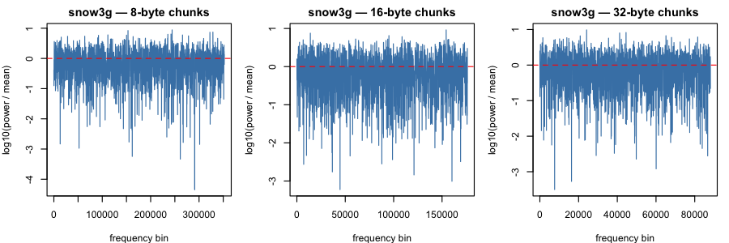

