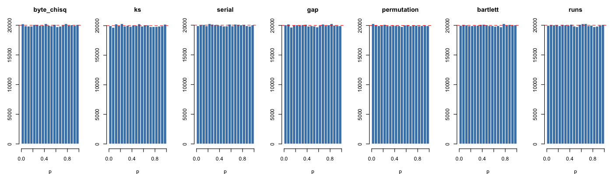

# Symmetric-Cipher Randomness Report

Generated 2026-09-15 21:41:05 PDT by `scripts/cipher_randomness.R` (battery version 4).
Toolchain: R version 4.2.0 (2022-04-22), base packages only.

**Plaintext.** Project Gutenberg #100 — *The Complete Works of William Shakespeare* (5,638,480 bytes; MD5 `662d6a49b9f224dc5dae2d885733e70d`; byte-entropy 4.888696 bits/byte).

**Caveat.** Passing this battery is **necessary** for a usable symmetric primitive but is **not sufficient** for cryptographic security; the battery rules out gross statistical defects in the keystream, not key-recovery, distinguishing-attack, or related-key resistance.

**Method.** Each cipher encrypts the full plaintext under a fresh OS-random key.
Block ciphers run in CTR mode with a random IV; stream ciphers run in their native keystream mode.
The ciphertext is read three ways: as $L$ bytes, as $8L$ bits, and as $k = \lfloor L / 8 \rfloor$ = 704,810 values $u_j \in [0, 1)$, one per 8-byte chunk taken as a big-endian fraction (a double keeps the top 53 bits).

**Battery.** $m = 7$ tests, each with a parameter-free null distribution:

1. Byte-frequency $\chi^2$ over the 256 byte values of all $L$ bytes (Knuth, *TAOCP* Vol. 2, §3.3.2 A).
2. Kolmogorov-Smirnov test of $u$ against Uniform(0,1).
3. Serial test on disjoint pairs $(u_{2j}, u_{2j+1})$ in $16 \times 16$ cells (Knuth §3.3.2 B).
4. Gap test on $[0, 1/2)$ with the tail pooled so every expected count is at least 50 (Knuth §3.3.2 D).
5. Permutation test on disjoint 4-tuples, 24 orderings (Knuth §3.3.2 F).
6. Bartlett's cumulative periodogram test for a flat spectrum, on the leading 703,125 values of $u$ (the largest 5-smooth length, so the FFT is $O(n \log n)$).
7. Wald-Wolfowitz runs test on the full bit stream.

**Decision rule.** A cipher fails when any of its $m = 7$ p-values falls below $\alpha / m = 1.43 \times 10^{-4}$ (Bonferroni), which bounds the probability that a good cipher fails at $\alpha = 0.001$.  The `p < α` column counts the p-values below $\alpha$, which a good cipher shows at a rate of about $m \alpha = 0.007$ per battery.  The calibration section reports the rates the battery attains on streams that are random by construction.

**Entropy.** The plug-in byte entropy $H$ never exceeds $8$ bits; to second order $8 - H = \chi^2 / (2 L \ln 2)$ with $\chi^2$ the byte-frequency statistic, so under a uniform source $8 - H$ has mean $(K - 1) / (2 L \ln 2) = 3.26 \times 10^{-5}$ bits and standard deviation $\sqrt{2 (K - 1)} / (2 L \ln 2) = 2.89 \times 10^{-6}$ bits ($K = 256$, $L =$ 5,638,480).  Test 1 is therefore the calibrated form of the entropy check; $H$ is printed to six decimals as a description.

## Definitions

Let $b_0, b_1, \ldots, b_{L-1}$ be the ciphertext bytes and
$u_j = \sum_{i=0}^{7} b_{8j+i} \, 256^{-(i+1)}$ the chunk values; under $H_0$ the $u_j$ are independent Uniform(0,1).

| Symbol | Definition |
|--------|------------|
| $L$ | ciphertext length in bytes (equal to the plaintext length; CTR and keystream modes preserve length). |
| $k$ | number of chunk values, $\lfloor L / 8 \rfloor$. |
| $\alpha = 0.001$ | family-wise error bound per cipher; each test rejects at $\alpha / m = 1.43 \times 10^{-4}$. |
| $p$ | classical p-value $\Pr(T \ge T_\mathrm{obs} \mid H_0)$; small $p$ rejects $H_0$. |
| $H$ | plug-in Shannon entropy of the byte distribution, in bits. |
| $m_k$ | the $k$-th raw sample moment of $u$; ideal $E[U^k] = 1/(k+1)$. |
| Fisher's $g$ | peak over mean of the periodogram at the non-zero Fourier frequencies. |
| `byte χ²` | byte frequency $\chi^2$ (256 cells): $\sum_v (c_v - L/256)^2 / (L/256)$ on the byte counts $c_v$, 255 degrees of freedom. |
| `KS` | Kolmogorov-Smirnov distance between the empirical distribution of $u$ and Uniform(0,1). |
| `serial` | $\chi^2$ with 255 degrees of freedom on the $16 \times 16$ cell counts of the pairs $(\lfloor 16 u_{2j} \rfloor, \lfloor 16 u_{2j+1} \rfloor)$. |
| `gap` | gap lengths for $u \in [0, 1/2)$, lengths $0, \ldots, t-1$ separate and $\ge t$ pooled with every expected count at least 50, $\chi^2$ with $t$ degrees of freedom. |
| `permutation` | $\chi^2$ with 23 degrees of freedom on the 24 orderings of the disjoint 4-tuples of $u$. |
| `Bartlett` | with $I_j$ the periodogram at Fourier frequency $j$ and $q = \lfloor (n-1)/2 \rfloor$, the KS distance of $C_i = \sum_{j \le i} I_j / \sum_{j \le q} I_j$, $i < q$, from Uniform(0,1). |
| `runs` | number of runs in the $8L$-bit stream against its Wald-Wolfowitz mean and variance, two-sided normal. |
| `p < α` | number of the $m$ p-values below $\alpha$. |
| `min p` | smallest of the $m$ p-values. |

## Summary

| cipher | token | $H$ (bits) | $8 - H$ (bits) | Fisher's $g$ | `p < α` | min p | verdict |
|--------|-------|------------|----------------|--------------|---------|-------|---------|
| AES-128 | `aes128` | 7.999967 | $3.30 \times 10^{-5}$ | 12.9 | 0 | 0.156 | PASS |
| AES-192 | `aes192` | 7.999969 | $3.12 \times 10^{-5}$ | 11.6 | 0 | 0.031 | PASS |
| AES-256 | `aes256` | 7.999973 | $2.67 \times 10^{-5}$ | 13.5 | 0 | 0.184 | PASS |
| Camellia-128 | `camellia128` | 7.999969 | $3.08 \times 10^{-5}$ | 12.6 | 0 | 0.212 | PASS |
| Camellia-192 | `camellia192` | 7.999964 | $3.61 \times 10^{-5}$ | 12.0 | 0 | 0.039 | PASS |
| Camellia-256 | `camellia256` | 7.999963 | $3.72 \times 10^{-5}$ | 12.9 | 0 | 0.060 | PASS |
| CAST-128 | `cast128` | 7.999968 | $3.23 \times 10^{-5}$ | 13.8 | 0 | 0.286 | PASS |
| DES | `des` | 7.999964 | $3.58 \times 10^{-5}$ | 11.9 | 0 | 0.140 | PASS |
| 3DES | `3des` | 7.999972 | $2.78 \times 10^{-5}$ | 14.8 | 0 | 0.074 | PASS |
| Kuznyechik | `grasshopper` | 7.999971 | $2.91 \times 10^{-5}$ | 12.6 | 0 | 0.434 | PASS |
| Magma | `magma` | 7.999964 | $3.59 \times 10^{-5}$ | 15.1 | 0 | 0.133 | PASS |
| PRESENT-80 | `present80` | 7.999971 | $2.93 \times 10^{-5}$ | 13.7 | 0 | 0.012 | PASS |
| PRESENT-128 | `present128` | 7.999965 | $3.49 \times 10^{-5}$ | 13.0 | 0 | 0.190 | PASS |
| SEED | `seed` | 7.999964 | $3.62 \times 10^{-5}$ | 15.9 | 0 | 0.037 | PASS |
| Serpent-128 | `serpent128` | 7.999966 | $3.35 \times 10^{-5}$ | 13.1 | 0 | 0.115 | PASS |
| Serpent-192 | `serpent192` | 7.999970 | $3.03 \times 10^{-5}$ | 11.6 | 0 | 0.253 | PASS |
| Serpent-256 | `serpent256` | 7.999974 | $2.63 \times 10^{-5}$ | 12.7 | 0 | 0.087 | PASS |
| SM4 | `sm4` | 7.999970 | $3.01 \times 10^{-5}$ | 14.1 | 0 | 0.036 | PASS |
| Twofish-128 | `twofish128` | 7.999967 | $3.28 \times 10^{-5}$ | 13.6 | 0 | 0.366 | PASS |
| Twofish-256 | `twofish256` | 7.999971 | $2.86 \times 10^{-5}$ | 14.7 | 0 | 0.062 | PASS |
| Simon32/64 | `simon32_64` | 7.999966 | $3.35 \times 10^{-5}$ | 13.7 | 0 | 0.004 | PASS |
| Simon64/128 | `simon64_128` | 7.999966 | $3.38 \times 10^{-5}$ | 15.6 | 0 | 0.270 | PASS |
| Simon128/128 | `simon128_128` | 7.999970 | $3.04 \times 10^{-5}$ | 15.9 | 0 | 0.253 | PASS |
| Simon128/256 | `simon128_256` | 7.999970 | $3.03 \times 10^{-5}$ | 13.4 | 0 | 0.042 | PASS |
| Speck32/64 | `speck32_64` | 7.999967 | $3.26 \times 10^{-5}$ | 12.2 | 0 | 0.067 | PASS |
| Speck64/128 | `speck64_128` | 7.999961 | $3.93 \times 10^{-5}$ | 12.3 | 0 | 0.014 | PASS |
| Speck128/128 | `speck128_128` | 7.999971 | $2.95 \times 10^{-5}$ | 12.8 | 0 | 0.224 | PASS |
| Speck128/256 | `speck128_256` | 7.999971 | $2.87 \times 10^{-5}$ | 14.0 | 0 | 0.358 | PASS |
| ChaCha20 | `chacha20` | 7.999967 | $3.28 \times 10^{-5}$ | 13.8 | 0 | 0.059 | PASS |
| XChaCha20 | `xchacha20` | 7.999967 | $3.28 \times 10^{-5}$ | 13.9 | 0 | 0.031 | PASS |
| Salsa20 | `salsa20` | 7.999963 | $3.70 \times 10^{-5}$ | 11.6 | 0 | 0.068 | PASS |
| Rabbit | `rabbit` | 7.999970 | $3.02 \times 10^{-5}$ | 11.9 | 0 | 0.243 | PASS |
| ZUC-128 | `zuc128` | 7.999968 | $3.18 \times 10^{-5}$ | 16.0 | 0 | 0.314 | PASS |
| SNOW 3G | `snow3g` | 7.999963 | $3.67 \times 10^{-5}$ | 14.5 | 0 | 0.082 | PASS |

**All 34 ciphers pass the battery.**

## Per-cipher detail

### AES-128 (`aes128`)

Verdict: PASS &mdash; min p = 0.156 against $\alpha / m = 1.43 \times 10^{-4}$; 0 of 7 p-values below $\alpha = 0.001$.

Byte entropy $H = 7.999967$ bits ($8 - H = 3.30 \times 10^{-5}$); 704,810 chunk values; Fisher's $g = 12.94$.

| test | p |
|------|---|
| byte frequency $\chi^2$ (256 cells) | 0.434 |
| KS vs Uniform(0,1) | 0.267 |
| serial test (pairs, $16 \times 16$ cells) | 0.256 |
| gap test (Knuth, $[0, 1/2)$) | 0.231 |
| permutation test ($d = 4$) | 0.420 |
| cumulative periodogram (Bartlett) | 0.366 |
| runs test (bit stream) | 0.156 |

Moments of $u$ (sample, ideal, deviation):

| $k$ | $m_k$ | $1/(k+1)$ | dev |
|-----|-------|-----------|-----|
| 1 | 0.500335 | 0.500000 | 3.35e-04 |
| 2 | 0.333685 | 0.333333 | 3.51e-04 |
| 3 | 0.250314 | 0.250000 | 3.14e-04 |
| 4 | 0.200265 | 0.200000 | 2.65e-04 |
| 5 | 0.166885 | 0.166667 | 2.18e-04 |
| 6 | 0.143036 | 0.142857 | 1.79e-04 |
| 7 | 0.125146 | 0.125000 | 1.46e-04 |
| 8 | 0.111230 | 0.111111 | 1.19e-04 |
| 9 | 0.100097 | 0.100000 | 9.66e-05 |
| 10 | 0.090987 | 0.090909 | 7.76e-05 |

### AES-192 (`aes192`)

Verdict: PASS &mdash; min p = 0.031 against $\alpha / m = 1.43 \times 10^{-4}$; 0 of 7 p-values below $\alpha = 0.001$.

Byte entropy $H = 7.999969$ bits ($8 - H = 3.12 \times 10^{-5}$); 704,810 chunk values; Fisher's $g = 11.56$.

| test | p |
|------|---|
| byte frequency $\chi^2$ (256 cells) | 0.681 |
| KS vs Uniform(0,1) | 0.808 |
| serial test (pairs, $16 \times 16$ cells) | 0.257 |
| gap test (Knuth, $[0, 1/2)$) | 0.485 |
| permutation test ($d = 4$) | 0.031 |
| cumulative periodogram (Bartlett) | 0.204 |
| runs test (bit stream) | 0.408 |

Moments of $u$ (sample, ideal, deviation):

| $k$ | $m_k$ | $1/(k+1)$ | dev |
|-----|-------|-----------|-----|
| 1 | 0.499802 | 0.500000 | 1.98e-04 |
| 2 | 0.333024 | 0.333333 | 3.10e-04 |
| 3 | 0.249644 | 0.250000 | 3.56e-04 |
| 4 | 0.199626 | 0.200000 | 3.74e-04 |
| 5 | 0.166284 | 0.166667 | 3.82e-04 |
| 6 | 0.142471 | 0.142857 | 3.86e-04 |
| 7 | 0.124611 | 0.125000 | 3.89e-04 |
| 8 | 0.110721 | 0.111111 | 3.90e-04 |
| 9 | 0.099609 | 0.100000 | 3.91e-04 |
| 10 | 0.090518 | 0.090909 | 3.91e-04 |

### AES-256 (`aes256`)

Verdict: PASS &mdash; min p = 0.184 against $\alpha / m = 1.43 \times 10^{-4}$; 0 of 7 p-values below $\alpha = 0.001$.

Byte entropy $H = 7.999973$ bits ($8 - H = 2.67 \times 10^{-5}$); 704,810 chunk values; Fisher's $g = 13.49$.

| test | p |
|------|---|
| byte frequency $\chi^2$ (256 cells) | 0.984 |
| KS vs Uniform(0,1) | 0.941 |
| serial test (pairs, $16 \times 16$ cells) | 0.839 |
| gap test (Knuth, $[0, 1/2)$) | 0.286 |
| permutation test ($d = 4$) | 0.433 |
| cumulative periodogram (Bartlett) | 0.184 |
| runs test (bit stream) | 0.997 |

Moments of $u$ (sample, ideal, deviation):

| $k$ | $m_k$ | $1/(k+1)$ | dev |
|-----|-------|-----------|-----|
| 1 | 0.499913 | 0.500000 | 8.74e-05 |
| 2 | 0.333268 | 0.333333 | 6.56e-05 |
| 3 | 0.249960 | 0.250000 | 3.98e-05 |
| 4 | 0.199982 | 0.200000 | 1.82e-05 |
| 5 | 0.166666 | 0.166667 | 9.33e-07 |
| 6 | 0.142870 | 0.142857 | 1.31e-05 |
| 7 | 0.125025 | 0.125000 | 2.46e-05 |
| 8 | 0.111145 | 0.111111 | 3.41e-05 |
| 9 | 0.100042 | 0.100000 | 4.18e-05 |
| 10 | 0.090957 | 0.090909 | 4.79e-05 |

### Camellia-128 (`camellia128`)

Verdict: PASS &mdash; min p = 0.212 against $\alpha / m = 1.43 \times 10^{-4}$; 0 of 7 p-values below $\alpha = 0.001$.

Byte entropy $H = 7.999969$ bits ($8 - H = 3.08 \times 10^{-5}$); 704,810 chunk values; Fisher's $g = 12.64$.

| test | p |
|------|---|
| byte frequency $\chi^2$ (256 cells) | 0.727 |
| KS vs Uniform(0,1) | 0.808 |
| serial test (pairs, $16 \times 16$ cells) | 0.717 |
| gap test (Knuth, $[0, 1/2)$) | 0.982 |
| permutation test ($d = 4$) | 0.246 |
| cumulative periodogram (Bartlett) | 0.288 |
| runs test (bit stream) | 0.212 |

Moments of $u$ (sample, ideal, deviation):

| $k$ | $m_k$ | $1/(k+1)$ | dev |
|-----|-------|-----------|-----|
| 1 | 0.500170 | 0.500000 | 1.70e-04 |
| 2 | 0.333528 | 0.333333 | 1.95e-04 |
| 3 | 0.250238 | 0.250000 | 2.38e-04 |
| 4 | 0.200277 | 0.200000 | 2.77e-04 |
| 5 | 0.166973 | 0.166667 | 3.07e-04 |
| 6 | 0.143184 | 0.142857 | 3.27e-04 |
| 7 | 0.125340 | 0.125000 | 3.40e-04 |
| 8 | 0.111459 | 0.111111 | 3.48e-04 |
| 9 | 0.100353 | 0.100000 | 3.53e-04 |
| 10 | 0.091265 | 0.090909 | 3.56e-04 |

### Camellia-192 (`camellia192`)

Verdict: PASS &mdash; min p = 0.039 against $\alpha / m = 1.43 \times 10^{-4}$; 0 of 7 p-values below $\alpha = 0.001$.

Byte entropy $H = 7.999964$ bits ($8 - H = 3.61 \times 10^{-5}$); 704,810 chunk values; Fisher's $g = 12.00$.

| test | p |
|------|---|
| byte frequency $\chi^2$ (256 cells) | 0.117 |
| KS vs Uniform(0,1) | 0.102 |
| serial test (pairs, $16 \times 16$ cells) | 0.423 |
| gap test (Knuth, $[0, 1/2)$) | 0.627 |
| permutation test ($d = 4$) | 0.039 |
| cumulative periodogram (Bartlett) | 0.435 |
| runs test (bit stream) | 0.349 |

Moments of $u$ (sample, ideal, deviation):

| $k$ | $m_k$ | $1/(k+1)$ | dev |
|-----|-------|-----------|-----|
| 1 | 0.499267 | 0.500000 | 7.33e-04 |
| 2 | 0.332572 | 0.333333 | 7.61e-04 |
| 3 | 0.249292 | 0.250000 | 7.08e-04 |
| 4 | 0.199354 | 0.200000 | 6.46e-04 |
| 5 | 0.166078 | 0.166667 | 5.89e-04 |
| 6 | 0.142317 | 0.142857 | 5.40e-04 |
| 7 | 0.124502 | 0.125000 | 4.98e-04 |
| 8 | 0.110649 | 0.111111 | 4.62e-04 |
| 9 | 0.099569 | 0.100000 | 4.31e-04 |
| 10 | 0.090505 | 0.090909 | 4.04e-04 |

### Camellia-256 (`camellia256`)

Verdict: PASS &mdash; min p = 0.060 against $\alpha / m = 1.43 \times 10^{-4}$; 0 of 7 p-values below $\alpha = 0.001$.

Byte entropy $H = 7.999963$ bits ($8 - H = 3.72 \times 10^{-5}$); 704,810 chunk values; Fisher's $g = 12.93$.

| test | p |
|------|---|
| byte frequency $\chi^2$ (256 cells) | 0.060 |
| KS vs Uniform(0,1) | 0.197 |
| serial test (pairs, $16 \times 16$ cells) | 0.615 |
| gap test (Knuth, $[0, 1/2)$) | 0.730 |
| permutation test ($d = 4$) | 0.806 |
| cumulative periodogram (Bartlett) | 0.117 |
| runs test (bit stream) | 0.569 |

Moments of $u$ (sample, ideal, deviation):

| $k$ | $m_k$ | $1/(k+1)$ | dev |
|-----|-------|-----------|-----|
| 1 | 0.499474 | 0.500000 | 5.26e-04 |
| 2 | 0.332800 | 0.333333 | 5.33e-04 |
| 3 | 0.249461 | 0.250000 | 5.39e-04 |
| 4 | 0.199442 | 0.200000 | 5.58e-04 |
| 5 | 0.166089 | 0.166667 | 5.77e-04 |
| 6 | 0.142265 | 0.142857 | 5.92e-04 |
| 7 | 0.124398 | 0.125000 | 6.02e-04 |
| 8 | 0.110504 | 0.111111 | 6.07e-04 |
| 9 | 0.099392 | 0.100000 | 6.08e-04 |
| 10 | 0.090304 | 0.090909 | 6.05e-04 |

### CAST-128 (`cast128`)

Verdict: PASS &mdash; min p = 0.286 against $\alpha / m = 1.43 \times 10^{-4}$; 0 of 7 p-values below $\alpha = 0.001$.

Byte entropy $H = 7.999968$ bits ($8 - H = 3.23 \times 10^{-5}$); 704,810 chunk values; Fisher's $g = 13.77$.

| test | p |
|------|---|
| byte frequency $\chi^2$ (256 cells) | 0.533 |
| KS vs Uniform(0,1) | 0.286 |
| serial test (pairs, $16 \times 16$ cells) | 0.577 |
| gap test (Knuth, $[0, 1/2)$) | 0.922 |
| permutation test ($d = 4$) | 0.464 |
| cumulative periodogram (Bartlett) | 0.504 |
| runs test (bit stream) | 0.356 |

Moments of $u$ (sample, ideal, deviation):

| $k$ | $m_k$ | $1/(k+1)$ | dev |
|-----|-------|-----------|-----|
| 1 | 0.499761 | 0.500000 | 2.39e-04 |
| 2 | 0.333080 | 0.333333 | 2.54e-04 |
| 3 | 0.249794 | 0.250000 | 2.06e-04 |
| 4 | 0.199851 | 0.200000 | 1.49e-04 |
| 5 | 0.166569 | 0.166667 | 9.74e-05 |
| 6 | 0.142802 | 0.142857 | 5.48e-05 |
| 7 | 0.124979 | 0.125000 | 2.10e-05 |
| 8 | 0.111116 | 0.111111 | 5.36e-06 |
| 9 | 0.100026 | 0.100000 | 2.57e-05 |
| 10 | 0.090950 | 0.090909 | 4.14e-05 |

### DES (`des`)

Verdict: PASS &mdash; min p = 0.140 against $\alpha / m = 1.43 \times 10^{-4}$; 0 of 7 p-values below $\alpha = 0.001$.

Byte entropy $H = 7.999964$ bits ($8 - H = 3.58 \times 10^{-5}$); 704,810 chunk values; Fisher's $g = 11.95$.

| test | p |
|------|---|
| byte frequency $\chi^2$ (256 cells) | 0.140 |
| KS vs Uniform(0,1) | 0.500 |
| serial test (pairs, $16 \times 16$ cells) | 0.513 |
| gap test (Knuth, $[0, 1/2)$) | 0.197 |
| permutation test ($d = 4$) | 0.312 |
| cumulative periodogram (Bartlett) | 0.667 |
| runs test (bit stream) | 0.758 |

Moments of $u$ (sample, ideal, deviation):

| $k$ | $m_k$ | $1/(k+1)$ | dev |
|-----|-------|-----------|-----|
| 1 | 0.500218 | 0.500000 | 2.18e-04 |
| 2 | 0.333503 | 0.333333 | 1.70e-04 |
| 3 | 0.250134 | 0.250000 | 1.34e-04 |
| 4 | 0.200119 | 0.200000 | 1.19e-04 |
| 5 | 0.166782 | 0.166667 | 1.15e-04 |
| 6 | 0.142972 | 0.142857 | 1.15e-04 |
| 7 | 0.125116 | 0.125000 | 1.16e-04 |
| 8 | 0.111229 | 0.111111 | 1.17e-04 |
| 9 | 0.100118 | 0.100000 | 1.18e-04 |
| 10 | 0.091028 | 0.090909 | 1.19e-04 |

### 3DES (`3des`)

Verdict: PASS &mdash; min p = 0.074 against $\alpha / m = 1.43 \times 10^{-4}$; 0 of 7 p-values below $\alpha = 0.001$.

Byte entropy $H = 7.999972$ bits ($8 - H = 2.78 \times 10^{-5}$); 704,810 chunk values; Fisher's $g = 14.79$.

| test | p |
|------|---|
| byte frequency $\chi^2$ (256 cells) | 0.959 |
| KS vs Uniform(0,1) | 0.561 |
| serial test (pairs, $16 \times 16$ cells) | 0.572 |
| gap test (Knuth, $[0, 1/2)$) | 0.697 |
| permutation test ($d = 4$) | 0.338 |
| cumulative periodogram (Bartlett) | 0.421 |
| runs test (bit stream) | 0.074 |

Moments of $u$ (sample, ideal, deviation):

| $k$ | $m_k$ | $1/(k+1)$ | dev |
|-----|-------|-----------|-----|
| 1 | 0.499580 | 0.500000 | 4.20e-04 |
| 2 | 0.332866 | 0.333333 | 4.67e-04 |
| 3 | 0.249544 | 0.250000 | 4.56e-04 |
| 4 | 0.199569 | 0.200000 | 4.31e-04 |
| 5 | 0.166262 | 0.166667 | 4.05e-04 |
| 6 | 0.142477 | 0.142857 | 3.80e-04 |
| 7 | 0.124643 | 0.125000 | 3.57e-04 |
| 8 | 0.110774 | 0.111111 | 3.37e-04 |
| 9 | 0.099680 | 0.100000 | 3.20e-04 |
| 10 | 0.090605 | 0.090909 | 3.04e-04 |

### Kuznyechik (`grasshopper`)

Verdict: PASS &mdash; min p = 0.434 against $\alpha / m = 1.43 \times 10^{-4}$; 0 of 7 p-values below $\alpha = 0.001$.

Byte entropy $H = 7.999971$ bits ($8 - H = 2.91 \times 10^{-5}$); 704,810 chunk values; Fisher's $g = 12.63$.

| test | p |
|------|---|
| byte frequency $\chi^2$ (256 cells) | 0.891 |
| KS vs Uniform(0,1) | 0.487 |
| serial test (pairs, $16 \times 16$ cells) | 0.434 |
| gap test (Knuth, $[0, 1/2)$) | 0.939 |
| permutation test ($d = 4$) | 0.739 |
| cumulative periodogram (Bartlett) | 0.758 |
| runs test (bit stream) | 0.436 |

Moments of $u$ (sample, ideal, deviation):

| $k$ | $m_k$ | $1/(k+1)$ | dev |
|-----|-------|-----------|-----|
| 1 | 0.499547 | 0.500000 | 4.53e-04 |
| 2 | 0.332914 | 0.333333 | 4.19e-04 |
| 3 | 0.249637 | 0.250000 | 3.63e-04 |
| 4 | 0.199685 | 0.200000 | 3.15e-04 |
| 5 | 0.166389 | 0.166667 | 2.77e-04 |
| 6 | 0.142610 | 0.142857 | 2.47e-04 |
| 7 | 0.124777 | 0.125000 | 2.23e-04 |
| 8 | 0.110907 | 0.111111 | 2.04e-04 |
| 9 | 0.099812 | 0.100000 | 1.88e-04 |
| 10 | 0.090734 | 0.090909 | 1.75e-04 |

### Magma (`magma`)

Verdict: PASS &mdash; min p = 0.133 against $\alpha / m = 1.43 \times 10^{-4}$; 0 of 7 p-values below $\alpha = 0.001$.

Byte entropy $H = 7.999964$ bits ($8 - H = 3.59 \times 10^{-5}$); 704,810 chunk values; Fisher's $g = 15.11$.

| test | p |
|------|---|
| byte frequency $\chi^2$ (256 cells) | 0.133 |
| KS vs Uniform(0,1) | 0.631 |
| serial test (pairs, $16 \times 16$ cells) | 0.891 |
| gap test (Knuth, $[0, 1/2)$) | 0.876 |
| permutation test ($d = 4$) | 0.463 |
| cumulative periodogram (Bartlett) | 0.529 |
| runs test (bit stream) | 0.565 |

Moments of $u$ (sample, ideal, deviation):

| $k$ | $m_k$ | $1/(k+1)$ | dev |
|-----|-------|-----------|-----|
| 1 | 0.499908 | 0.500000 | 9.21e-05 |
| 2 | 0.333243 | 0.333333 | 9.05e-05 |
| 3 | 0.249944 | 0.250000 | 5.65e-05 |
| 4 | 0.199980 | 0.200000 | 1.99e-05 |
| 5 | 0.166677 | 0.166667 | 1.03e-05 |
| 6 | 0.142890 | 0.142857 | 3.30e-05 |
| 7 | 0.125049 | 0.125000 | 4.92e-05 |
| 8 | 0.111172 | 0.111111 | 6.06e-05 |
| 9 | 0.100069 | 0.100000 | 6.85e-05 |
| 10 | 0.090983 | 0.090909 | 7.40e-05 |

### PRESENT-80 (`present80`)

Verdict: PASS &mdash; min p = 0.012 against $\alpha / m = 1.43 \times 10^{-4}$; 0 of 7 p-values below $\alpha = 0.001$.

Byte entropy $H = 7.999971$ bits ($8 - H = 2.93 \times 10^{-5}$); 704,810 chunk values; Fisher's $g = 13.66$.

| test | p |
|------|---|
| byte frequency $\chi^2$ (256 cells) | 0.875 |
| KS vs Uniform(0,1) | 0.511 |
| serial test (pairs, $16 \times 16$ cells) | 0.819 |
| gap test (Knuth, $[0, 1/2)$) | 0.316 |
| permutation test ($d = 4$) | 0.012 |
| cumulative periodogram (Bartlett) | 0.778 |
| runs test (bit stream) | 0.276 |

Moments of $u$ (sample, ideal, deviation):

| $k$ | $m_k$ | $1/(k+1)$ | dev |
|-----|-------|-----------|-----|
| 1 | 0.500473 | 0.500000 | 4.73e-04 |
| 2 | 0.333795 | 0.333333 | 4.62e-04 |
| 3 | 0.250407 | 0.250000 | 4.07e-04 |
| 4 | 0.200354 | 0.200000 | 3.54e-04 |
| 5 | 0.166976 | 0.166667 | 3.10e-04 |
| 6 | 0.143129 | 0.142857 | 2.72e-04 |
| 7 | 0.125240 | 0.125000 | 2.40e-04 |
| 8 | 0.111324 | 0.111111 | 2.13e-04 |
| 9 | 0.100190 | 0.100000 | 1.90e-04 |
| 10 | 0.091080 | 0.090909 | 1.71e-04 |

### PRESENT-128 (`present128`)

Verdict: PASS &mdash; min p = 0.190 against $\alpha / m = 1.43 \times 10^{-4}$; 0 of 7 p-values below $\alpha = 0.001$.

Byte entropy $H = 7.999965$ bits ($8 - H = 3.49 \times 10^{-5}$); 704,810 chunk values; Fisher's $g = 12.95$.

| test | p |
|------|---|
| byte frequency $\chi^2$ (256 cells) | 0.215 |
| KS vs Uniform(0,1) | 0.190 |
| serial test (pairs, $16 \times 16$ cells) | 0.662 |
| gap test (Knuth, $[0, 1/2)$) | 0.801 |
| permutation test ($d = 4$) | 0.992 |
| cumulative periodogram (Bartlett) | 0.647 |
| runs test (bit stream) | 0.819 |

Moments of $u$ (sample, ideal, deviation):

| $k$ | $m_k$ | $1/(k+1)$ | dev |
|-----|-------|-----------|-----|
| 1 | 0.499692 | 0.500000 | 3.08e-04 |
| 2 | 0.333193 | 0.333333 | 1.40e-04 |
| 3 | 0.249983 | 0.250000 | 1.71e-05 |
| 4 | 0.200064 | 0.200000 | 6.40e-05 |
| 5 | 0.166789 | 0.166667 | 1.22e-04 |
| 6 | 0.143024 | 0.142857 | 1.67e-04 |
| 7 | 0.125203 | 0.125000 | 2.03e-04 |
| 8 | 0.111343 | 0.111111 | 2.32e-04 |
| 9 | 0.100255 | 0.100000 | 2.55e-04 |
| 10 | 0.091183 | 0.090909 | 2.74e-04 |

### SEED (`seed`)

Verdict: PASS &mdash; min p = 0.037 against $\alpha / m = 1.43 \times 10^{-4}$; 0 of 7 p-values below $\alpha = 0.001$.

Byte entropy $H = 7.999964$ bits ($8 - H = 3.62 \times 10^{-5}$); 704,810 chunk values; Fisher's $g = 15.86$.

| test | p |
|------|---|
| byte frequency $\chi^2$ (256 cells) | 0.111 |
| KS vs Uniform(0,1) | 0.624 |
| serial test (pairs, $16 \times 16$ cells) | 0.454 |
| gap test (Knuth, $[0, 1/2)$) | 0.920 |
| permutation test ($d = 4$) | 0.721 |
| cumulative periodogram (Bartlett) | 0.258 |
| runs test (bit stream) | 0.037 |

Moments of $u$ (sample, ideal, deviation):

| $k$ | $m_k$ | $1/(k+1)$ | dev |
|-----|-------|-----------|-----|
| 1 | 0.500146 | 0.500000 | 1.46e-04 |
| 2 | 0.333513 | 0.333333 | 1.80e-04 |
| 3 | 0.250172 | 0.250000 | 1.72e-04 |
| 4 | 0.200145 | 0.200000 | 1.45e-04 |
| 5 | 0.166777 | 0.166667 | 1.10e-04 |
| 6 | 0.142933 | 0.142857 | 7.56e-05 |
| 7 | 0.125043 | 0.125000 | 4.32e-05 |
| 8 | 0.111125 | 0.111111 | 1.42e-05 |
| 9 | 0.099989 | 0.100000 | 1.12e-05 |
| 10 | 0.090876 | 0.090909 | 3.32e-05 |

### Serpent-128 (`serpent128`)

Verdict: PASS &mdash; min p = 0.115 against $\alpha / m = 1.43 \times 10^{-4}$; 0 of 7 p-values below $\alpha = 0.001$.

Byte entropy $H = 7.999966$ bits ($8 - H = 3.35 \times 10^{-5}$); 704,810 chunk values; Fisher's $g = 13.09$.

| test | p |
|------|---|
| byte frequency $\chi^2$ (256 cells) | 0.371 |
| KS vs Uniform(0,1) | 0.323 |
| serial test (pairs, $16 \times 16$ cells) | 0.302 |
| gap test (Knuth, $[0, 1/2)$) | 0.904 |
| permutation test ($d = 4$) | 0.836 |
| cumulative periodogram (Bartlett) | 0.386 |
| runs test (bit stream) | 0.115 |

Moments of $u$ (sample, ideal, deviation):

| $k$ | $m_k$ | $1/(k+1)$ | dev |
|-----|-------|-----------|-----|
| 1 | 0.500146 | 0.500000 | 1.46e-04 |
| 2 | 0.333354 | 0.333333 | 2.03e-05 |
| 3 | 0.249957 | 0.250000 | 4.32e-05 |
| 4 | 0.199936 | 0.200000 | 6.40e-05 |
| 5 | 0.166601 | 0.166667 | 6.58e-05 |
| 6 | 0.142797 | 0.142857 | 6.01e-05 |
| 7 | 0.124948 | 0.125000 | 5.21e-05 |
| 8 | 0.111067 | 0.111111 | 4.40e-05 |
| 9 | 0.099963 | 0.100000 | 3.67e-05 |
| 10 | 0.090879 | 0.090909 | 3.05e-05 |

### Serpent-192 (`serpent192`)

Verdict: PASS &mdash; min p = 0.253 against $\alpha / m = 1.43 \times 10^{-4}$; 0 of 7 p-values below $\alpha = 0.001$.

Byte entropy $H = 7.999970$ bits ($8 - H = 3.03 \times 10^{-5}$); 704,810 chunk values; Fisher's $g = 11.59$.

| test | p |
|------|---|
| byte frequency $\chi^2$ (256 cells) | 0.791 |
| KS vs Uniform(0,1) | 0.253 |
| serial test (pairs, $16 \times 16$ cells) | 0.292 |
| gap test (Knuth, $[0, 1/2)$) | 0.777 |
| permutation test ($d = 4$) | 0.798 |
| cumulative periodogram (Bartlett) | 0.705 |
| runs test (bit stream) | 0.400 |

Moments of $u$ (sample, ideal, deviation):

| $k$ | $m_k$ | $1/(k+1)$ | dev |
|-----|-------|-----------|-----|
| 1 | 0.500472 | 0.500000 | 4.72e-04 |
| 2 | 0.333798 | 0.333333 | 4.64e-04 |
| 3 | 0.250383 | 0.250000 | 3.83e-04 |
| 4 | 0.200304 | 0.200000 | 3.04e-04 |
| 5 | 0.166907 | 0.166667 | 2.40e-04 |
| 6 | 0.143047 | 0.142857 | 1.90e-04 |
| 7 | 0.125149 | 0.125000 | 1.49e-04 |
| 8 | 0.111228 | 0.111111 | 1.17e-04 |
| 9 | 0.100091 | 0.100000 | 9.12e-05 |
| 10 | 0.090979 | 0.090909 | 6.97e-05 |

### Serpent-256 (`serpent256`)

Verdict: PASS &mdash; min p = 0.087 against $\alpha / m = 1.43 \times 10^{-4}$; 0 of 7 p-values below $\alpha = 0.001$.

Byte entropy $H = 7.999974$ bits ($8 - H = 2.63 \times 10^{-5}$); 704,810 chunk values; Fisher's $g = 12.66$.

| test | p |
|------|---|
| byte frequency $\chi^2$ (256 cells) | 0.989 |
| KS vs Uniform(0,1) | 0.346 |
| serial test (pairs, $16 \times 16$ cells) | 0.087 |
| gap test (Knuth, $[0, 1/2)$) | 0.209 |
| permutation test ($d = 4$) | 0.226 |
| cumulative periodogram (Bartlett) | 0.697 |
| runs test (bit stream) | 0.452 |

Moments of $u$ (sample, ideal, deviation):

| $k$ | $m_k$ | $1/(k+1)$ | dev |
|-----|-------|-----------|-----|
| 1 | 0.499558 | 0.500000 | 4.42e-04 |
| 2 | 0.332893 | 0.333333 | 4.40e-04 |
| 3 | 0.249614 | 0.250000 | 3.86e-04 |
| 4 | 0.199667 | 0.200000 | 3.33e-04 |
| 5 | 0.166377 | 0.166667 | 2.89e-04 |
| 6 | 0.142601 | 0.142857 | 2.56e-04 |
| 7 | 0.124769 | 0.125000 | 2.31e-04 |
| 8 | 0.110899 | 0.111111 | 2.12e-04 |
| 9 | 0.099801 | 0.100000 | 1.99e-04 |
| 10 | 0.090721 | 0.090909 | 1.88e-04 |

### SM4 (`sm4`)

Verdict: PASS &mdash; min p = 0.036 against $\alpha / m = 1.43 \times 10^{-4}$; 0 of 7 p-values below $\alpha = 0.001$.

Byte entropy $H = 7.999970$ bits ($8 - H = 3.01 \times 10^{-5}$); 704,810 chunk values; Fisher's $g = 14.12$.

| test | p |
|------|---|
| byte frequency $\chi^2$ (256 cells) | 0.805 |
| KS vs Uniform(0,1) | 0.533 |
| serial test (pairs, $16 \times 16$ cells) | 0.608 |
| gap test (Knuth, $[0, 1/2)$) | 0.221 |
| permutation test ($d = 4$) | 0.435 |
| cumulative periodogram (Bartlett) | 0.036 |
| runs test (bit stream) | 0.413 |

Moments of $u$ (sample, ideal, deviation):

| $k$ | $m_k$ | $1/(k+1)$ | dev |
|-----|-------|-----------|-----|
| 1 | 0.499564 | 0.500000 | 4.36e-04 |
| 2 | 0.332910 | 0.333333 | 4.24e-04 |
| 3 | 0.249628 | 0.250000 | 3.72e-04 |
| 4 | 0.199673 | 0.200000 | 3.27e-04 |
| 5 | 0.166373 | 0.166667 | 2.94e-04 |
| 6 | 0.142589 | 0.142857 | 2.68e-04 |
| 7 | 0.124752 | 0.125000 | 2.48e-04 |
| 8 | 0.110880 | 0.111111 | 2.31e-04 |
| 9 | 0.099783 | 0.100000 | 2.17e-04 |
| 10 | 0.090705 | 0.090909 | 2.04e-04 |

### Twofish-128 (`twofish128`)

Verdict: PASS &mdash; min p = 0.366 against $\alpha / m = 1.43 \times 10^{-4}$; 0 of 7 p-values below $\alpha = 0.001$.

Byte entropy $H = 7.999967$ bits ($8 - H = 3.28 \times 10^{-5}$); 704,810 chunk values; Fisher's $g = 13.61$.

| test | p |
|------|---|
| byte frequency $\chi^2$ (256 cells) | 0.467 |
| KS vs Uniform(0,1) | 0.546 |
| serial test (pairs, $16 \times 16$ cells) | 0.836 |
| gap test (Knuth, $[0, 1/2)$) | 0.374 |
| permutation test ($d = 4$) | 0.638 |
| cumulative periodogram (Bartlett) | 0.863 |
| runs test (bit stream) | 0.366 |

Moments of $u$ (sample, ideal, deviation):

| $k$ | $m_k$ | $1/(k+1)$ | dev |
|-----|-------|-----------|-----|
| 1 | 0.500168 | 0.500000 | 1.68e-04 |
| 2 | 0.333428 | 0.333333 | 9.48e-05 |
| 3 | 0.250007 | 0.250000 | 7.43e-06 |
| 4 | 0.199937 | 0.200000 | 6.35e-05 |
| 5 | 0.166553 | 0.166667 | 1.14e-04 |
| 6 | 0.142711 | 0.142857 | 1.46e-04 |
| 7 | 0.124835 | 0.125000 | 1.65e-04 |
| 8 | 0.110937 | 0.111111 | 1.74e-04 |
| 9 | 0.099823 | 0.100000 | 1.77e-04 |
| 10 | 0.090735 | 0.090909 | 1.74e-04 |

### Twofish-256 (`twofish256`)

Verdict: PASS &mdash; min p = 0.062 against $\alpha / m = 1.43 \times 10^{-4}$; 0 of 7 p-values below $\alpha = 0.001$.

Byte entropy $H = 7.999971$ bits ($8 - H = 2.86 \times 10^{-5}$); 704,810 chunk values; Fisher's $g = 14.73$.

| test | p |
|------|---|
| byte frequency $\chi^2$ (256 cells) | 0.924 |
| KS vs Uniform(0,1) | 0.292 |
| serial test (pairs, $16 \times 16$ cells) | 0.274 |
| gap test (Knuth, $[0, 1/2)$) | 0.363 |
| permutation test ($d = 4$) | 0.593 |
| cumulative periodogram (Bartlett) | 0.943 |
| runs test (bit stream) | 0.062 |

Moments of $u$ (sample, ideal, deviation):

| $k$ | $m_k$ | $1/(k+1)$ | dev |
|-----|-------|-----------|-----|
| 1 | 0.500630 | 0.500000 | 6.30e-04 |
| 2 | 0.334000 | 0.333333 | 6.66e-04 |
| 3 | 0.250645 | 0.250000 | 6.45e-04 |
| 4 | 0.200611 | 0.200000 | 6.11e-04 |
| 5 | 0.167242 | 0.166667 | 5.76e-04 |
| 6 | 0.143399 | 0.142857 | 5.42e-04 |
| 7 | 0.125512 | 0.125000 | 5.12e-04 |
| 8 | 0.111596 | 0.111111 | 4.85e-04 |
| 9 | 0.100460 | 0.100000 | 4.60e-04 |
| 10 | 0.091348 | 0.090909 | 4.39e-04 |

### Simon32/64 (`simon32_64`)

Verdict: PASS &mdash; min p = 0.004 against $\alpha / m = 1.43 \times 10^{-4}$; 0 of 7 p-values below $\alpha = 0.001$.

Byte entropy $H = 7.999966$ bits ($8 - H = 3.35 \times 10^{-5}$); 704,810 chunk values; Fisher's $g = 13.74$.

| test | p |
|------|---|
| byte frequency $\chi^2$ (256 cells) | 0.368 |
| KS vs Uniform(0,1) | 0.410 |
| serial test (pairs, $16 \times 16$ cells) | 0.204 |
| gap test (Knuth, $[0, 1/2)$) | 0.166 |
| permutation test ($d = 4$) | 0.004 |
| cumulative periodogram (Bartlett) | 0.240 |
| runs test (bit stream) | 0.295 |

Moments of $u$ (sample, ideal, deviation):

| $k$ | $m_k$ | $1/(k+1)$ | dev |
|-----|-------|-----------|-----|
| 1 | 0.499684 | 0.500000 | 3.16e-04 |
| 2 | 0.332969 | 0.333333 | 3.64e-04 |
| 3 | 0.249648 | 0.250000 | 3.52e-04 |
| 4 | 0.199679 | 0.200000 | 3.21e-04 |
| 5 | 0.166378 | 0.166667 | 2.88e-04 |
| 6 | 0.142599 | 0.142857 | 2.59e-04 |
| 7 | 0.124767 | 0.125000 | 2.33e-04 |
| 8 | 0.110900 | 0.111111 | 2.11e-04 |
| 9 | 0.099808 | 0.100000 | 1.92e-04 |
| 10 | 0.090733 | 0.090909 | 1.76e-04 |

### Simon64/128 (`simon64_128`)

Verdict: PASS &mdash; min p = 0.270 against $\alpha / m = 1.43 \times 10^{-4}$; 0 of 7 p-values below $\alpha = 0.001$.

Byte entropy $H = 7.999966$ bits ($8 - H = 3.38 \times 10^{-5}$); 704,810 chunk values; Fisher's $g = 15.59$.

| test | p |
|------|---|
| byte frequency $\chi^2$ (256 cells) | 0.337 |
| KS vs Uniform(0,1) | 0.881 |
| serial test (pairs, $16 \times 16$ cells) | 0.285 |
| gap test (Knuth, $[0, 1/2)$) | 0.270 |
| permutation test ($d = 4$) | 0.522 |
| cumulative periodogram (Bartlett) | 0.979 |
| runs test (bit stream) | 0.388 |

Moments of $u$ (sample, ideal, deviation):

| $k$ | $m_k$ | $1/(k+1)$ | dev |
|-----|-------|-----------|-----|
| 1 | 0.500103 | 0.500000 | 1.03e-04 |
| 2 | 0.333358 | 0.333333 | 2.46e-05 |
| 3 | 0.249989 | 0.250000 | 1.06e-05 |
| 4 | 0.199980 | 0.200000 | 2.04e-05 |
| 5 | 0.166648 | 0.166667 | 1.85e-05 |
| 6 | 0.142845 | 0.142857 | 1.18e-05 |
| 7 | 0.124996 | 0.125000 | 4.05e-06 |
| 8 | 0.111114 | 0.111111 | 3.27e-06 |
| 9 | 0.100009 | 0.100000 | 9.47e-06 |
| 10 | 0.090923 | 0.090909 | 1.44e-05 |

### Simon128/128 (`simon128_128`)

Verdict: PASS &mdash; min p = 0.253 against $\alpha / m = 1.43 \times 10^{-4}$; 0 of 7 p-values below $\alpha = 0.001$.

Byte entropy $H = 7.999970$ bits ($8 - H = 3.04 \times 10^{-5}$); 704,810 chunk values; Fisher's $g = 15.93$.

| test | p |
|------|---|
| byte frequency $\chi^2$ (256 cells) | 0.771 |
| KS vs Uniform(0,1) | 0.921 |
| serial test (pairs, $16 \times 16$ cells) | 0.808 |
| gap test (Knuth, $[0, 1/2)$) | 0.567 |
| permutation test ($d = 4$) | 0.768 |
| cumulative periodogram (Bartlett) | 0.253 |
| runs test (bit stream) | 0.386 |

Moments of $u$ (sample, ideal, deviation):

| $k$ | $m_k$ | $1/(k+1)$ | dev |
|-----|-------|-----------|-----|
| 1 | 0.499788 | 0.500000 | 2.12e-04 |
| 2 | 0.333169 | 0.333333 | 1.64e-04 |
| 3 | 0.249894 | 0.250000 | 1.06e-04 |
| 4 | 0.199941 | 0.200000 | 5.85e-05 |
| 5 | 0.166645 | 0.166667 | 2.16e-05 |
| 6 | 0.142864 | 0.142857 | 6.68e-06 |
| 7 | 0.125028 | 0.125000 | 2.82e-05 |
| 8 | 0.111156 | 0.111111 | 4.46e-05 |
| 9 | 0.100057 | 0.100000 | 5.68e-05 |
| 10 | 0.090975 | 0.090909 | 6.59e-05 |

### Simon128/256 (`simon128_256`)

Verdict: PASS &mdash; min p = 0.042 against $\alpha / m = 1.43 \times 10^{-4}$; 0 of 7 p-values below $\alpha = 0.001$.

Byte entropy $H = 7.999970$ bits ($8 - H = 3.03 \times 10^{-5}$); 704,810 chunk values; Fisher's $g = 13.40$.

| test | p |
|------|---|
| byte frequency $\chi^2$ (256 cells) | 0.785 |
| KS vs Uniform(0,1) | 0.825 |
| serial test (pairs, $16 \times 16$ cells) | 0.964 |
| gap test (Knuth, $[0, 1/2)$) | 0.042 |
| permutation test ($d = 4$) | 0.116 |
| cumulative periodogram (Bartlett) | 0.367 |
| runs test (bit stream) | 0.530 |

Moments of $u$ (sample, ideal, deviation):

| $k$ | $m_k$ | $1/(k+1)$ | dev |
|-----|-------|-----------|-----|
| 1 | 0.500182 | 0.500000 | 1.82e-04 |
| 2 | 0.333545 | 0.333333 | 2.11e-04 |
| 3 | 0.250198 | 0.250000 | 1.98e-04 |
| 4 | 0.200172 | 0.200000 | 1.72e-04 |
| 5 | 0.166808 | 0.166667 | 1.42e-04 |
| 6 | 0.142968 | 0.142857 | 1.11e-04 |
| 7 | 0.125082 | 0.125000 | 8.24e-05 |
| 8 | 0.111167 | 0.111111 | 5.62e-05 |
| 9 | 0.100033 | 0.100000 | 3.29e-05 |
| 10 | 0.090921 | 0.090909 | 1.23e-05 |

### Speck32/64 (`speck32_64`)

Verdict: PASS &mdash; min p = 0.067 against $\alpha / m = 1.43 \times 10^{-4}$; 0 of 7 p-values below $\alpha = 0.001$.

Byte entropy $H = 7.999967$ bits ($8 - H = 3.26 \times 10^{-5}$); 704,810 chunk values; Fisher's $g = 12.15$.

| test | p |
|------|---|
| byte frequency $\chi^2$ (256 cells) | 0.496 |
| KS vs Uniform(0,1) | 0.733 |
| serial test (pairs, $16 \times 16$ cells) | 0.618 |
| gap test (Knuth, $[0, 1/2)$) | 0.067 |
| permutation test ($d = 4$) | 0.728 |
| cumulative periodogram (Bartlett) | 0.496 |
| runs test (bit stream) | 0.893 |

Moments of $u$ (sample, ideal, deviation):

| $k$ | $m_k$ | $1/(k+1)$ | dev |
|-----|-------|-----------|-----|
| 1 | 0.499859 | 0.500000 | 1.41e-04 |
| 2 | 0.333235 | 0.333333 | 9.79e-05 |
| 3 | 0.249893 | 0.250000 | 1.07e-04 |
| 4 | 0.199875 | 0.200000 | 1.25e-04 |
| 5 | 0.166527 | 0.166667 | 1.40e-04 |
| 6 | 0.142708 | 0.142857 | 1.50e-04 |
| 7 | 0.124845 | 0.125000 | 1.55e-04 |
| 8 | 0.110955 | 0.111111 | 1.57e-04 |
| 9 | 0.099844 | 0.100000 | 1.56e-04 |
| 10 | 0.090754 | 0.090909 | 1.55e-04 |

### Speck64/128 (`speck64_128`)

Verdict: PASS &mdash; min p = 0.014 against $\alpha / m = 1.43 \times 10^{-4}$; 0 of 7 p-values below $\alpha = 0.001$.

Byte entropy $H = 7.999961$ bits ($8 - H = 3.93 \times 10^{-5}$); 704,810 chunk values; Fisher's $g = 12.26$.

| test | p |
|------|---|
| byte frequency $\chi^2$ (256 cells) | 0.014 |
| KS vs Uniform(0,1) | 0.134 |
| serial test (pairs, $16 \times 16$ cells) | 0.165 |
| gap test (Knuth, $[0, 1/2)$) | 0.726 |
| permutation test ($d = 4$) | 0.018 |
| cumulative periodogram (Bartlett) | 0.697 |
| runs test (bit stream) | 0.253 |

Moments of $u$ (sample, ideal, deviation):

| $k$ | $m_k$ | $1/(k+1)$ | dev |
|-----|-------|-----------|-----|
| 1 | 0.499499 | 0.500000 | 5.01e-04 |
| 2 | 0.332770 | 0.333333 | 5.63e-04 |
| 3 | 0.249466 | 0.250000 | 5.34e-04 |
| 4 | 0.199509 | 0.200000 | 4.91e-04 |
| 5 | 0.166215 | 0.166667 | 4.52e-04 |
| 6 | 0.142440 | 0.142857 | 4.18e-04 |
| 7 | 0.124612 | 0.125000 | 3.88e-04 |
| 8 | 0.110748 | 0.111111 | 3.63e-04 |
| 9 | 0.099660 | 0.100000 | 3.40e-04 |
| 10 | 0.090590 | 0.090909 | 3.19e-04 |

### Speck128/128 (`speck128_128`)

Verdict: PASS &mdash; min p = 0.224 against $\alpha / m = 1.43 \times 10^{-4}$; 0 of 7 p-values below $\alpha = 0.001$.

Byte entropy $H = 7.999971$ bits ($8 - H = 2.95 \times 10^{-5}$); 704,810 chunk values; Fisher's $g = 12.84$.

| test | p |
|------|---|
| byte frequency $\chi^2$ (256 cells) | 0.867 |
| KS vs Uniform(0,1) | 0.803 |
| serial test (pairs, $16 \times 16$ cells) | 0.939 |
| gap test (Knuth, $[0, 1/2)$) | 0.602 |
| permutation test ($d = 4$) | 0.224 |
| cumulative periodogram (Bartlett) | 0.873 |
| runs test (bit stream) | 0.911 |

Moments of $u$ (sample, ideal, deviation):

| $k$ | $m_k$ | $1/(k+1)$ | dev |
|-----|-------|-----------|-----|
| 1 | 0.500119 | 0.500000 | 1.19e-04 |
| 2 | 0.333525 | 0.333333 | 1.91e-04 |
| 3 | 0.250220 | 0.250000 | 2.20e-04 |
| 4 | 0.200226 | 0.200000 | 2.26e-04 |
| 5 | 0.166887 | 0.166667 | 2.20e-04 |
| 6 | 0.143066 | 0.142857 | 2.09e-04 |
| 7 | 0.125195 | 0.125000 | 1.95e-04 |
| 8 | 0.111290 | 0.111111 | 1.79e-04 |
| 9 | 0.100163 | 0.100000 | 1.63e-04 |
| 10 | 0.091056 | 0.090909 | 1.47e-04 |

### Speck128/256 (`speck128_256`)

Verdict: PASS &mdash; min p = 0.358 against $\alpha / m = 1.43 \times 10^{-4}$; 0 of 7 p-values below $\alpha = 0.001$.

Byte entropy $H = 7.999971$ bits ($8 - H = 2.87 \times 10^{-5}$); 704,810 chunk values; Fisher's $g = 13.98$.

| test | p |
|------|---|
| byte frequency $\chi^2$ (256 cells) | 0.915 |
| KS vs Uniform(0,1) | 0.538 |
| serial test (pairs, $16 \times 16$ cells) | 0.399 |
| gap test (Knuth, $[0, 1/2)$) | 0.358 |
| permutation test ($d = 4$) | 0.621 |
| cumulative periodogram (Bartlett) | 0.395 |
| runs test (bit stream) | 0.414 |

Moments of $u$ (sample, ideal, deviation):

| $k$ | $m_k$ | $1/(k+1)$ | dev |
|-----|-------|-----------|-----|
| 1 | 0.500332 | 0.500000 | 3.32e-04 |
| 2 | 0.333685 | 0.333333 | 3.51e-04 |
| 3 | 0.250362 | 0.250000 | 3.62e-04 |
| 4 | 0.200373 | 0.200000 | 3.73e-04 |
| 5 | 0.167047 | 0.166667 | 3.80e-04 |
| 6 | 0.143242 | 0.142857 | 3.85e-04 |
| 7 | 0.125386 | 0.125000 | 3.86e-04 |
| 8 | 0.111495 | 0.111111 | 3.84e-04 |
| 9 | 0.100380 | 0.100000 | 3.80e-04 |
| 10 | 0.091284 | 0.090909 | 3.75e-04 |

### ChaCha20 (`chacha20`)

Verdict: PASS &mdash; min p = 0.059 against $\alpha / m = 1.43 \times 10^{-4}$; 0 of 7 p-values below $\alpha = 0.001$.

Byte entropy $H = 7.999967$ bits ($8 - H = 3.28 \times 10^{-5}$); 704,810 chunk values; Fisher's $g = 13.81$.

| test | p |
|------|---|
| byte frequency $\chi^2$ (256 cells) | 0.466 |
| KS vs Uniform(0,1) | 0.059 |
| serial test (pairs, $16 \times 16$ cells) | 0.772 |
| gap test (Knuth, $[0, 1/2)$) | 0.457 |
| permutation test ($d = 4$) | 0.762 |
| cumulative periodogram (Bartlett) | 0.601 |
| runs test (bit stream) | 0.919 |

Moments of $u$ (sample, ideal, deviation):

| $k$ | $m_k$ | $1/(k+1)$ | dev |
|-----|-------|-----------|-----|
| 1 | 0.499403 | 0.500000 | 5.97e-04 |
| 2 | 0.332601 | 0.333333 | 7.32e-04 |
| 3 | 0.249262 | 0.250000 | 7.38e-04 |
| 4 | 0.199304 | 0.200000 | 6.96e-04 |
| 5 | 0.166027 | 0.166667 | 6.40e-04 |
| 6 | 0.142275 | 0.142857 | 5.82e-04 |
| 7 | 0.124472 | 0.125000 | 5.28e-04 |
| 8 | 0.110633 | 0.111111 | 4.78e-04 |
| 9 | 0.099566 | 0.100000 | 4.34e-04 |
| 10 | 0.090514 | 0.090909 | 3.95e-04 |

### XChaCha20 (`xchacha20`)

Verdict: PASS &mdash; min p = 0.031 against $\alpha / m = 1.43 \times 10^{-4}$; 0 of 7 p-values below $\alpha = 0.001$.

Byte entropy $H = 7.999967$ bits ($8 - H = 3.28 \times 10^{-5}$); 704,810 chunk values; Fisher's $g = 13.88$.

| test | p |
|------|---|
| byte frequency $\chi^2$ (256 cells) | 0.460 |
| KS vs Uniform(0,1) | 0.272 |
| serial test (pairs, $16 \times 16$ cells) | 0.031 |
| gap test (Knuth, $[0, 1/2)$) | 0.455 |
| permutation test ($d = 4$) | 0.458 |
| cumulative periodogram (Bartlett) | 0.913 |
| runs test (bit stream) | 0.042 |

Moments of $u$ (sample, ideal, deviation):

| $k$ | $m_k$ | $1/(k+1)$ | dev |
|-----|-------|-----------|-----|
| 1 | 0.500418 | 0.500000 | 4.18e-04 |
| 2 | 0.333710 | 0.333333 | 3.77e-04 |
| 3 | 0.250311 | 0.250000 | 3.11e-04 |
| 4 | 0.200255 | 0.200000 | 2.55e-04 |
| 5 | 0.166880 | 0.166667 | 2.13e-04 |
| 6 | 0.143041 | 0.142857 | 1.84e-04 |
| 7 | 0.125163 | 0.125000 | 1.63e-04 |
| 8 | 0.111259 | 0.111111 | 1.48e-04 |
| 9 | 0.100137 | 0.100000 | 1.37e-04 |
| 10 | 0.091038 | 0.090909 | 1.29e-04 |

### Salsa20 (`salsa20`)

Verdict: PASS &mdash; min p = 0.068 against $\alpha / m = 1.43 \times 10^{-4}$; 0 of 7 p-values below $\alpha = 0.001$.

Byte entropy $H = 7.999963$ bits ($8 - H = 3.70 \times 10^{-5}$); 704,810 chunk values; Fisher's $g = 11.59$.

| test | p |
|------|---|
| byte frequency $\chi^2$ (256 cells) | 0.068 |
| KS vs Uniform(0,1) | 0.124 |
| serial test (pairs, $16 \times 16$ cells) | 0.304 |
| gap test (Knuth, $[0, 1/2)$) | 0.541 |
| permutation test ($d = 4$) | 0.325 |
| cumulative periodogram (Bartlett) | 0.389 |
| runs test (bit stream) | 0.554 |

Moments of $u$ (sample, ideal, deviation):

| $k$ | $m_k$ | $1/(k+1)$ | dev |
|-----|-------|-----------|-----|
| 1 | 0.499687 | 0.500000 | 3.13e-04 |
| 2 | 0.332816 | 0.333333 | 5.17e-04 |
| 3 | 0.249427 | 0.250000 | 5.73e-04 |
| 4 | 0.199431 | 0.200000 | 5.69e-04 |
| 5 | 0.166124 | 0.166667 | 5.42e-04 |
| 6 | 0.142347 | 0.142857 | 5.10e-04 |
| 7 | 0.124522 | 0.125000 | 4.78e-04 |
| 8 | 0.110662 | 0.111111 | 4.49e-04 |
| 9 | 0.099578 | 0.100000 | 4.22e-04 |
| 10 | 0.090510 | 0.090909 | 3.99e-04 |

### Rabbit (`rabbit`)

Verdict: PASS &mdash; min p = 0.243 against $\alpha / m = 1.43 \times 10^{-4}$; 0 of 7 p-values below $\alpha = 0.001$.

Byte entropy $H = 7.999970$ bits ($8 - H = 3.02 \times 10^{-5}$); 704,810 chunk values; Fisher's $g = 11.93$.

| test | p |
|------|---|
| byte frequency $\chi^2$ (256 cells) | 0.792 |
| KS vs Uniform(0,1) | 0.638 |
| serial test (pairs, $16 \times 16$ cells) | 0.243 |
| gap test (Knuth, $[0, 1/2)$) | 0.325 |
| permutation test ($d = 4$) | 0.970 |
| cumulative periodogram (Bartlett) | 0.657 |
| runs test (bit stream) | 0.613 |

Moments of $u$ (sample, ideal, deviation):

| $k$ | $m_k$ | $1/(k+1)$ | dev |
|-----|-------|-----------|-----|
| 1 | 0.500257 | 0.500000 | 2.57e-04 |
| 2 | 0.333593 | 0.333333 | 2.60e-04 |
| 3 | 0.250241 | 0.250000 | 2.41e-04 |
| 4 | 0.200216 | 0.200000 | 2.16e-04 |
| 5 | 0.166860 | 0.166667 | 1.93e-04 |
| 6 | 0.143031 | 0.142857 | 1.73e-04 |
| 7 | 0.125156 | 0.125000 | 1.56e-04 |
| 8 | 0.111253 | 0.111111 | 1.42e-04 |
| 9 | 0.100129 | 0.100000 | 1.29e-04 |
| 10 | 0.091026 | 0.090909 | 1.17e-04 |

### ZUC-128 (`zuc128`)

Verdict: PASS &mdash; min p = 0.314 against $\alpha / m = 1.43 \times 10^{-4}$; 0 of 7 p-values below $\alpha = 0.001$.

Byte entropy $H = 7.999968$ bits ($8 - H = 3.18 \times 10^{-5}$); 704,810 chunk values; Fisher's $g = 15.99$.

| test | p |
|------|---|
| byte frequency $\chi^2$ (256 cells) | 0.606 |
| KS vs Uniform(0,1) | 0.585 |
| serial test (pairs, $16 \times 16$ cells) | 0.314 |
| gap test (Knuth, $[0, 1/2)$) | 0.534 |
| permutation test ($d = 4$) | 0.515 |
| cumulative periodogram (Bartlett) | 0.967 |
| runs test (bit stream) | 0.584 |

Moments of $u$ (sample, ideal, deviation):

| $k$ | $m_k$ | $1/(k+1)$ | dev |
|-----|-------|-----------|-----|
| 1 | 0.499997 | 0.500000 | 3.19e-06 |
| 2 | 0.333175 | 0.333333 | 1.58e-04 |
| 3 | 0.249734 | 0.250000 | 2.66e-04 |
| 4 | 0.199666 | 0.200000 | 3.34e-04 |
| 5 | 0.166293 | 0.166667 | 3.73e-04 |
| 6 | 0.142463 | 0.142857 | 3.95e-04 |
| 7 | 0.124596 | 0.125000 | 4.04e-04 |
| 8 | 0.110706 | 0.111111 | 4.05e-04 |
| 9 | 0.099599 | 0.100000 | 4.01e-04 |
| 10 | 0.090515 | 0.090909 | 3.94e-04 |

### SNOW 3G (`snow3g`)

Verdict: PASS &mdash; min p = 0.082 against $\alpha / m = 1.43 \times 10^{-4}$; 0 of 7 p-values below $\alpha = 0.001$.

Byte entropy $H = 7.999963$ bits ($8 - H = 3.67 \times 10^{-5}$); 704,810 chunk values; Fisher's $g = 14.51$.

| test | p |
|------|---|
| byte frequency $\chi^2$ (256 cells) | 0.082 |
| KS vs Uniform(0,1) | 0.158 |
| serial test (pairs, $16 \times 16$ cells) | 0.275 |
| gap test (Knuth, $[0, 1/2)$) | 0.305 |
| permutation test ($d = 4$) | 0.736 |
| cumulative periodogram (Bartlett) | 0.727 |
| runs test (bit stream) | 0.547 |

Moments of $u$ (sample, ideal, deviation):

| $k$ | $m_k$ | $1/(k+1)$ | dev |
|-----|-------|-----------|-----|
| 1 | 0.499392 | 0.500000 | 6.08e-04 |
| 2 | 0.332707 | 0.333333 | 6.27e-04 |
| 3 | 0.249412 | 0.250000 | 5.88e-04 |
| 4 | 0.199454 | 0.200000 | 5.46e-04 |
| 5 | 0.166156 | 0.166667 | 5.10e-04 |
| 6 | 0.142376 | 0.142857 | 4.81e-04 |
| 7 | 0.124542 | 0.125000 | 4.58e-04 |
| 8 | 0.110673 | 0.111111 | 4.38e-04 |
| 9 | 0.099578 | 0.100000 | 4.22e-04 |
| 10 | 0.090502 | 0.090909 | 4.07e-04 |

## Calibration on OS-random streams

The battery ran on 400,000 streams of 5,638,480 bytes each read from `/dev/urandom` (hosts: dennard, twilight; 2026-09-16 01:49 to 2026-09-16 04:37 UTC; mean 4.0 s per stream).  A stream that is random by construction should reject each test with probability $\alpha = 0.001$ and fail the battery with probability at most $\alpha$; the table gives the observed counts with Clopper-Pearson 95% intervals, and the Kolmogorov-Smirnov p-value of each test's 400,000 p-values against Uniform(0,1), which is what a calibrated test produces under the null.

| test | rejections at $\alpha = 0.001$ (rate, 95% CI) | rejections at $\alpha / m = 1.43 \times 10^{-4}$ | KS of p-values vs Uniform(0,1) |
|------|------|------|------|
| byte frequency $\chi^2$ (256 cells) | 422 / 400,000 = 1.05e-03 [9.6e-04, 1.2e-03] | 46 | 0.643 |
| KS vs Uniform(0,1) | 413 / 400,000 = 1.03e-03 [9.4e-04, 1.1e-03] | 60 | 0.406 |
| serial test (pairs, $16 \times 16$ cells) | 399 / 400,000 = 9.97e-04 [9.0e-04, 1.1e-03] | 58 | 0.864 |
| gap test (Knuth, $[0, 1/2)$) | 440 / 400,000 = 1.10e-03 [1.0e-03, 1.2e-03] | 79 | 0.752 |
| permutation test ($d = 4$) | 401 / 400,000 = 1.00e-03 [9.1e-04, 1.1e-03] | 55 | 0.427 |
| cumulative periodogram (Bartlett) | 394 / 400,000 = 9.85e-04 [8.9e-04, 1.1e-03] | 65 | 0.655 |
| runs test (bit stream) | 394 / 400,000 = 9.85e-04 [8.9e-04, 1.1e-03] | 61 | 0.447 |

Battery failures (some $p < \alpha / m$): 419 / 400,000 = 1.05e-03 [9.5e-04, 1.2e-03]; nominal bound $0.001$.
Streams with some $p < \alpha$: 2822 / 400,000 = 7.05e-03 [6.8e-03, 7.3e-03]; nominal bound $m \alpha = 0.007$.

Spearman correlation of the p-values across streams (a dependent pair would make the Bonferroni bound loose, never unsafe):

| | byte_chisq | ks | serial | gap | permutation | bartlett | runs |
|---|---|---|---|---|---|---|---|
| byte_chisq | 1.000 | 0.017 | 0.006 | 0.002 | 0.000 | 0.000 | 0.042 |
| ks | 0.017 | 1.000 | 0.105 | 0.170 | -0.000 | -0.000 | 0.001 |
| serial | 0.006 | 0.105 | 1.000 | 0.023 | 0.030 | 0.021 | 0.003 |
| gap | 0.002 | 0.170 | 0.023 | 1.000 | 0.013 | 0.147 | -0.000 |
| permutation | 0.000 | -0.000 | 0.030 | 0.013 | 1.000 | 0.040 | -0.002 |
| bartlett | 0.000 | -0.000 | 0.021 | 0.147 | 0.040 | 1.000 | 0.000 |
| runs | 0.042 | 0.001 | 0.003 | -0.000 | -0.002 | 0.000 | 1.000 |

Byte entropy over the null streams: mean $8 - H = 3.20 \times 10^{-5}$ bits, sd $4.05 \times 10^{-6}$ bits; the second-order prediction is mean $(K-1)/(2 L \ln 2) = 3.26 \times 10^{-5}$ and sd $\sqrt{2(K-1)}/(2 L \ln 2) = 2.89 \times 10^{-6}$ with $K = 256$.

