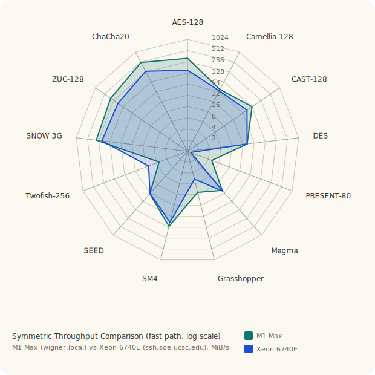

# SYMMETRIC

The symmetric side follows the same project-wide implementation rule as the
rest of the crate: pure idiomatic Rust, no architecture intrinsics, no C/FFI,
and as few dependencies as possible. Where a fast table-driven path and a
portable software constant-time path pull in different directions, the crate
keeps both visible rather than hiding the tradeoff.

## Common Block-Cipher API

Every block cipher implements:

```rust
pub trait BlockCipher {
    const BLOCK_LEN: usize;
    fn encrypt(&self, block: &mut [u8]);
    fn decrypt(&self, block: &mut [u8]);
}
```

Most block-cipher types also expose typed `encrypt_block` / `decrypt_block`
helpers for callers that know the block size at compile time.

The dedicated `Ct` types are the software constant-time variants. They exist
only where the portable fast implementation would otherwise rely on
secret-indexed table lookups or similarly awkward software tradeoffs. `SIMON`
and `SPECK` do not have separate `Ct` types because their shipped round
functions are already table-free ARX / bitwise designs.

## Modes, Hashes, and MACs

### Modes

The generic mode layer in `src/modes/` supplies:

- SP 800-38A: `Ecb`, `Cbc`, `Cfb`, `Ofb`, `Ctr`
- SP 800-38B: `Cmac`
- SP 800-38D: `Gcm`, `Gmac`
- SP 800-38E: `Xts`

These wrappers are generic over any `BlockCipher`, so the same mode code works
across AES, DES, Camellia, PRESENT, CAST-128, and the other block ciphers.

Operational caveats:

- `ECB` is included for completeness and test coverage, not because it is a
  good default.
- `CBC`, `CFB`, `OFB`, and block-cipher `CTR` require correct IV / counter
  discipline from the caller.
- `GCM` requires nonce uniqueness, and the portable `GHASH` path is documented
  as not constant-time.
- `XTS` is for storage-style sector encryption, not general message transport.

### Hashes and XOFs

Implemented hash families:

- SHA-1
- SHA-2: `Sha224`, `Sha256`, `Sha384`, `Sha512`, `Sha512_224`, `Sha512_256`
- SHA-3: `Sha3_224`, `Sha3_256`, `Sha3_384`, `Sha3_512`
- XOFs: `Shake128`, `Shake256`

SHA-1 / SHA-2 are Merkle-Damgard constructions and therefore inherit the usual
length-extension caveat when used as raw keyed digests. For keyed integrity:

- use `Hmac<H>`
- or prefer SHA-3 / SHAKE if sponge semantics are the better fit

### MACs

Implemented message-authentication layers:

- `Hmac<H>` over any in-tree `Digest`
- `Cmac`
- `Gmac`

These provide integrity and authenticity, not signatures or non-repudiation.

## CSPRNGs

Implemented generators:

- `BlumBlumShub`
- `BlumMicali`
- `CtrDrbgAes256`

The first two are intentionally historical / reference generators. The
standards-track generator is `CtrDrbgAes256`, which follows SP 800-90A Rev. 1
CTR_DRBG with AES-256.

## Cipher Families

### Block Ciphers

Implemented block-cipher families:

- DES / Triple-DES
- AES
- CAST-128 / CAST5
- Camellia
- Serpent
- Twofish
- SEED
- PRESENT
- Magma
- Grasshopper
- SM4
- SIMON
- SPECK

Design philosophy by family:

- `DES / Triple-DES`: the classic U.S. IBM / NIST line. It is a Feistel design
  from the hardware-centric 1970s, so the tiny S-boxes and heavy bit
  permutations reflect gate-count and wiring concerns more than modern software
  taste. The implementation preserves the traditional fast table-driven shape
  because the whole point of DES in software is how far that old design can be
  pushed, while `DesCt` makes the constant-time tradeoff explicit instead of
  pretending the two goals coincide.
- `AES`: the U.S. federal standard selected by NIST, but designed in Belgium
  as Rijndael. Its SP-network structure is a software/hardware compromise: fast
  table-driven software on one hand, compact byte-oriented hardware on the
  other. The crate keeps both views visible: the fast path for ordinary
  software benchmarking, and a separate Boyar-Peralta-style `Ct` path so the
  constant-time cost is concrete.
- `CAST-128 / CAST5`: a Canadian design from Carlisle Adams and Stafford
  Tavares. It is a round-function-heavy Feistel cipher built around large keyed
  S-boxes, sitting between DES-era Feistel design and the later AES finalists.
  The implementation keeps the keyed-round shape obvious rather than hiding it
  behind abstractions.
- `Camellia`: a Japanese design (NTT and Mitsubishi) from the AES era. It
  deliberately blends an SP-network core with Feistel-style `FL` / `FLINV`
  layers, reflecting a design culture that wanted AES-class performance without
  abandoning older structural ideas. The writeup and code keep that hybrid
  structure visible because that split personality is the whole design.
- `Serpent`: a European AES finalist (Anderson, Biham, Knudsen) built as the
  conservative answer to AES selection. Its philosophy is “simple boolean
  layers, many rounds, wide security margin,” so the implementation keeps the
  bitslice round structure explicit rather than chasing table speed tricks.
- `Twofish`: the U.S. AES-finalist line from Schneier and collaborators. Its
  design mixes key-dependent S-boxes, an MDS layer, and whitening, reflecting a
  software-first philosophy that squeezes complexity into precomputation and
  linear algebra instead of just adding rounds. The code keeps the `q`
  permutations, RS/MDS layers, and keyed `h()` transform visible because
  Twofish’s design is about the interaction of those components, not just the
  Feistel shell around them.
- `SEED`: the Korean national standard. It is a Feistel cipher that leans on
  large 8-bit S-boxes and a compact algebraic round mix, closer in feel to the
  1990s national-standard school than to the later ARX stream ciphers. The
  implementation favors readability of the round algebra and the key schedule
  over trying to disguise it as “just another AES-like block cipher.”
- `PRESENT`: a lightweight European academic design aimed at tiny hardware. Its
  philosophy is minimum area and simple logic, so the code keeps the 4-bit
  S-box / bit permutation structure direct and simple.
- `Magma`: the older Russian standard line (GOST 28147-89). It is a 32-round
  Feistel design with 4-bit substitution and a single rotate, intentionally
  small and regular in the style of older Soviet/Russian block-cipher design.
  The implementation keeps the nibble structure obvious and treats the `Ct`
  path as a software side-channel concession rather than a redesign.
- `Grasshopper`: the newer Russian standard (Kuznyechik / GOST R 34.12-2015).
  It is a byte-oriented SP-network whose identity is its linear `L` transform
  over `GF(2^8)`. Compared to `Magma`, it reflects a much more modern
  byte-oriented design style. The code emphasizes that linear layer because it
  is the part that makes Grasshopper look and cost different from AES.
- `SM4`: the Chinese national standard. Its round function is a compact
  “S-box then linear diffusion” transform, a pragmatic software/hardware middle
  ground that looks closer to the East Asian national-standard family than to
  the Bernstein ARX line. The implementation keeps the `T = L(tau(...))`
  structure front and center because that is the design’s defining rhythm.
- `SIMON`: the U.S. NSA minimalist bitwise line. Its philosophy is “only the
  operations hardware and software both like”: rotates, AND, XOR. That is why
  there is no separate `Ct` split; the native round function is already close
  to the ideal constant-time software shape.
- `SPECK`: the U.S. NSA ARX counterpart to `SIMON`. Its design philosophy is
  software-first simplicity: add, rotate, XOR, and nothing else. The
  implementation therefore focuses on exactness and endianness rather than
  alternate `Ct` variants.

### Stream Ciphers

Implemented stream-cipher families:

- Rabbit
- Salsa20
- ChaCha20
- XChaCha20
- SNOW 3G
- ZUC-128

Design philosophy by family:

- `Rabbit`: an eSTREAM-era software stream cipher built around eight coupled
  counters and a nonlinear integer `g`-function rather than a pure ARX quarter
  round. Its design philosophy is software throughput with a more structured
  internal state than the Bernstein line, and the implementation keeps that
  counter/state split explicit because that is what makes Rabbit distinct.
- `Salsa20`: the U.S. Bernstein line, built around a fast ARX core. The
  quarter-round structure is intentionally simple and pipeline-friendly, so the
  implementation keeps the core word-mixing visible.
- `ChaCha20`: also Bernstein’s work, and explicitly a refinement of Salsa20
  rather than a different design family. It pushes for better diffusion per
  round while keeping the same ARX spirit. The code keeps the quarter-round and
  state layout explicit because ChaCha’s design is evolutionary.
- `XChaCha20`: not a new core cipher, but a longer-nonce construction around
  ChaCha20. Its design philosophy is operational robustness: keep ChaCha20’s
  fast core, but fix nonce-management pain by stretching a 24-byte nonce into a
  subkey plus ordinary ChaCha20 state.
- `SNOW 3G`: the 3GPP telecom stream-cipher core used underneath UEA2/UIA2.
  Like ZUC, it is state-machine-centric rather than ARX-centric: a 16-word
  LFSR feeds a three-register FSM and two byte-oriented S-box layers. The
  crate keeps both the fast table-driven path and a separate `Ct` path because
  the secret-indexed nonlinear steps are exactly where the software side-
  channel tradeoff lives.
- `ZUC-128`: the Chinese mobile-stream-cipher line (standardized through the
  3GPP / LTE world). It is very different from the ARX family: a word-structured
  LFSR plus a nonlinear filter and S-box layer, reflecting a telecom-stream-
  cipher tradition rather than the Bernstein ARX line. The implementation leaves
  that contrast obvious, because the cost profile comes from that architectural
  choice.

## Symmetric Performance

Measured with [pilot-bench](https://github.com/ascar-io/pilot-bench) driving
`pilot_cipher`, a dedicated Rust binary that encrypts 1 MiB per round and
prints MB/s to stdout.  Pilot repeats the round until a 20 % confidence
interval is achieved, correcting for autocorrelation and startup transients.
Columns: **Block** and **Key** in bits; **MB/s** mean; **±CI** half-width at
95 %; **Runs** rounds required to reach CI. The tables below are parallel runs
on:

- Apple M1 Max (`wigner.local`)
- Intel Xeon 6740E (`ssh.soe.ucsc.edu`, single-core slice)

### AES

| Cipher | Block | Key | M1 Max MB/s | M1 Max ±CI | M1 Max Runs | Xeon 6740E MB/s | Xeon 6740E ±CI | Xeon 6740E Runs |
|---|---:|---:|---:|---:|---:|---:|---:|---:|
| aes128 | 128 | 128 | 356.9 | ±1.104 | 67 | 184.2 | ±2.067 | 30 |
| aes128ct | 128 | 128 | 45.59 | ±0.0675 | 30 | 29.46 | ±0.3586 | 30 |
| aes192 | 128 | 192 | 298.5 | ±0.4451 | 98 | 163.7 | ±1.344 | 41 |
| aes192ct | 128 | 192 | 37.66 | ±0.0815 | 97 | 24.85 | ±0.07704 | 30 |
| aes256 | 128 | 256 | 250.7 | ±0.7685 | 30 | 146.6 | ±0.5858 | 95 |
| aes256ct | 128 | 256 | 32.08 | ±0.1211 | 60 | 21.43 | ±0.0476 | 60 |

### Camellia

| Cipher | Block | Key | M1 Max MB/s | M1 Max ±CI | M1 Max Runs | Xeon 6740E MB/s | Xeon 6740E ±CI | Xeon 6740E Runs |
|---|---:|---:|---:|---:|---:|---:|---:|---:|
| camellia128 | 128 | 128 | 97.56 | ±0.1489 | 30 | 89.81 | ±0.5087 | 30 |
| camellia128ct | 128 | 128 | 4.274 | ±0.02931 | 90 | 0.7366 | ±0.005964 | 34 |
| camellia192 | 128 | 192 | 71.86 | ±0.1047 | 42 | 67.36 | ±1.923 | 30 |
| camellia192ct | 128 | 192 | 3.205 | ±0.01073 | 104 | 0.5514 | ±0.004394 | 49 |
| camellia256 | 128 | 256 | 71.75 | ±0.163 | 45 | 68.25 | ±0.3351 | 30 |
| camellia256ct | 128 | 256 | 3.202 | ±0.01273 | 51 | 0.5509 | ±0.006618 | 30 |

### CAST-128

| Cipher | Block | Key | M1 Max MB/s | M1 Max ±CI | M1 Max Runs | Xeon 6740E MB/s | Xeon 6740E ±CI | Xeon 6740E Runs |
|---|---:|---:|---:|---:|---:|---:|---:|---:|
| cast128 | 64 | 128 | 158.3 | ±0.4163 | 64 | 112.5 | ±1.997 | 40 |
| cast128ct | 64 | 128 | 3.157 | ±0.006318 | 74 | 1.494 | ±0.00211 | 30 |

### DES / 3DES

| Cipher | Block | Key | M1 Max MB/s | M1 Max ±CI | M1 Max Runs | Xeon 6740E MB/s | Xeon 6740E ±CI | Xeon 6740E Runs |
|---|---:|---:|---:|---:|---:|---:|---:|---:|
| des | 64 | 56 | 57 | ±0.07397 | 42 | 56.74 | ±0.3056 | 39 |
| desct | 64 | 56 | 6.707 | ±0.03602 | 90 | 2.844 | ±0.004186 | 30 |
| 3des | 64 | 168 | 17.31 | ±0.1177 | 73 | 18.28 | ±0.1791 | 45 |

### Grasshopper (GOST R 34.12-2015)

| Cipher | Block | Key | M1 Max MB/s | M1 Max ±CI | M1 Max Runs | Xeon 6740E MB/s | Xeon 6740E ±CI | Xeon 6740E Runs |
|---|---:|---:|---:|---:|---:|---:|---:|---:|
| grasshopper | 128 | 256 | 21.19 | ±0.04924 | 85 | 9.946 | ±0.01412 | 60 |
| grasshopperct | 128 | 256 | 2.978 | ±0.01025 | 71 | 0.6682 | ±0.008386 | 60 |

### Magma (GOST R 34.12-2015)

| Cipher | Block | Key | M1 Max MB/s | M1 Max ±CI | M1 Max Runs | Xeon 6740E MB/s | Xeon 6740E ±CI | Xeon 6740E Runs |
|---|---:|---:|---:|---:|---:|---:|---:|---:|
| magma | 64 | 256 | 36.97 | ±0.3509 | 120 | 39.47 | ±0.06449 | 69 |
| magmact | 64 | 256 | 8.602 | ±0.07443 | 30 | 5.328 | ±0.003707 | 90 |

### PRESENT

| Cipher | Block | Key | M1 Max MB/s | M1 Max ±CI | M1 Max Runs | Xeon 6740E MB/s | Xeon 6740E ±CI | Xeon 6740E Runs |
|---|---:|---:|---:|---:|---:|---:|---:|---:|
| present80 | 64 | 80 | 8.49 | ±0.0126 | 150 | 2.422 | ±0.01003 | 30 |
| present80ct | 64 | 80 | 3.112 | ±0.007697 | 44 | 1.037 | ±0.001012 | 43 |
| present128 | 64 | 128 | 8.491 | ±0.02129 | 180 | 2.423 | ±0.008242 | 41 |
| present128ct | 64 | 128 | 3.113 | ±0.009799 | 30 | 1.037 | ±0.0009949 | 30 |

### SEED

| Cipher | Block | Key | M1 Max MB/s | M1 Max ±CI | M1 Max Runs | Xeon 6740E MB/s | Xeon 6740E ±CI | Xeon 6740E Runs |
|---|---:|---:|---:|---:|---:|---:|---:|---:|
| seed | 128 | 128 | 47.63 | ±0.02589 | 96 | 46.67 | ±0.6579 | 30 |
| seedct | 128 | 128 | 3.164 | ±0.007878 | 30 | 0.547 | ±0.005596 | 30 |

### Serpent

| Cipher | Block | Key | M1 Max MB/s | M1 Max ±CI | M1 Max Runs | Xeon 6740E MB/s | Xeon 6740E ±CI | Xeon 6740E Runs |
|---|---:|---:|---:|---:|---:|---:|---:|---:|
| serpent128 | 128 | 128 | 8.02 | ±0.02756 | 60 | 4.306 | ±0.005304 | 120 |
| serpent128ct | 128 | 128 | 5.819 | ±0.0244 | 38 | 1.663 | ±0.002046 | 255 |
| serpent192 | 128 | 192 | 8.01 | ±0.03646 | 126 | 4.303 | ±0.006154 | 120 |
| serpent192ct | 128 | 192 | 5.771 | ±0.007716 | 180 | 1.662 | ±0.001534 | 65 |
| serpent256 | 128 | 256 | 7.922 | ±0.02142 | 128 | 4.309 | ±0.004677 | 30 |
| serpent256ct | 128 | 256 | 5.769 | ±0.01545 | 120 | 1.665 | ±0.000989 | 157 |

### SM4

| Cipher | Block | Key | M1 Max MB/s | M1 Max ±CI | M1 Max Runs | Xeon 6740E MB/s | Xeon 6740E ±CI | Xeon 6740E Runs |
|---|---:|---:|---:|---:|---:|---:|---:|---:|
| sm4 | 128 | 128 | 149.7 | ±0.913 | 160 | 118.7 | ±5.222 | 30 |
| sm4ct | 128 | 128 | 4.634 | ±0.01157 | 150 | 0.8286 | ±0.008949 | 40 |

### Twofish

| Cipher | Block | Key | M1 Max MB/s | M1 Max ±CI | M1 Max Runs | Xeon 6740E MB/s | Xeon 6740E ±CI | Xeon 6740E Runs |
|---|---:|---:|---:|---:|---:|---:|---:|---:|
| twofish128 | 128 | 128 | 11.66 | ±0.04096 | 90 | 23.61 | ±0.03581 | 30 |
| twofish128ct | 128 | 128 | 1.944 | ±0.004743 | 36 | 1.416 | ±0.002056 | 90 |
| twofish192 | 128 | 192 | 11.31 | ±0.04161 | 95 | 21.62 | ±0.4312 | 33 |
| twofish192ct | 128 | 192 | 1.708 | ±0.005327 | 60 | 1.119 | ±0.001227 | 66 |
| twofish256 | 128 | 256 | 10.91 | ±0.08408 | 55 | 20.42 | ±0.03148 | 88 |
| twofish256ct | 128 | 256 | 1.504 | ±0.02823 | 30 | 0.9164 | ±0.0009864 | 52 |

### Simon

| Cipher | Block | Key | M1 Max MB/s | M1 Max ±CI | M1 Max Runs | Xeon 6740E MB/s | Xeon 6740E ±CI | Xeon 6740E Runs |
|---|---:|---:|---:|---:|---:|---:|---:|---:|
| simon32_64 | 32 | 64 | 58.81 | ±0.1292 | 61 | 44.92 | ±0.3409 | 30 |
| simon48_72 | 48 | 72 | 75.65 | ±0.2915 | 90 | 60.97 | ±1.724 | 30 |
| simon48_96 | 48 | 96 | 75.39 | ±0.3227 | 120 | 61.69 | ±0.2531 | 30 |
| simon64_96 | 64 | 96 | 98.75 | ±0.112 | 62 | 79.9 | ±0.1491 | 74 |
| simon64_128 | 64 | 128 | 92.03 | ±0.2395 | 128 | 76.56 | ±0.2758 | 32 |
| simon96_96 | 96 | 96 | 96.19 | ±0.2892 | 210 | 82.79 | ±0.1889 | 60 |
| simon96_144 | 96 | 144 | 93.72 | ±0.04744 | 101 | 79.31 | ±1.181 | 30 |
| simon128_128 | 128 | 128 | 172.4 | ±0.502 | 49 | 113.4 | ±0.2196 | 92 |
| simon128_192 | 128 | 192 | 168.7 | ±1.584 | 90 | 112.6 | ±0.3917 | 30 |
| simon128_256 | 128 | 256 | 160.7 | ±0.3922 | 42 | 107.7 | ±0.6561 | 30 |

### Speck

| Cipher | Block | Key | M1 Max MB/s | M1 Max ±CI | M1 Max Runs | Xeon 6740E MB/s | Xeon 6740E ±CI | Xeon 6740E Runs |
|---|---:|---:|---:|---:|---:|---:|---:|---:|
| speck32_64 | 32 | 64 | 145 | ±0.2903 | 117 | 94.49 | ±1.361 | 30 |
| speck48_72 | 48 | 72 | 218.1 | ±0.4533 | 210 | 147.6 | ±0.678 | 57 |
| speck48_96 | 48 | 96 | 176.9 | ±1.115 | 37 | 125.8 | ±0.4216 | 34 |
| speck64_96 | 64 | 96 | 199.2 | ±0.2672 | 91 | 176.8 | ±0.7553 | 32 |
| speck64_128 | 64 | 128 | 189.5 | ±0.2085 | 30 | 166.5 | ±4.785 | 60 |
| speck96_96 | 96 | 96 | 257.2 | ±0.6015 | 30 | 188 | ±0.7951 | 41 |
| speck96_144 | 96 | 144 | 246.5 | ±0.3442 | 30 | 184.6 | ±0.9154 | 30 |
| speck128_128 | 128 | 128 | 617.4 | ±2.697 | 36 | 315.8 | ±2.465 | 30 |
| speck128_192 | 128 | 192 | 596.2 | ±1.566 | 62 | 305.3 | ±4.528 | 43 |
| speck128_256 | 128 | 256 | 573.1 | ±1.863 | 150 | 301.9 | ±2.639 | 44 |

### Stream ciphers

| Cipher | Block | Key | M1 Max MB/s | M1 Max ±CI | M1 Max Runs | Xeon 6740E MB/s | Xeon 6740E ±CI | Xeon 6740E Runs |
|---|---:|---:|---:|---:|---:|---:|---:|---:|
| chacha20 | stream | 256 | 533 | ±1.535 | 249 | 306.4 | ±1.882 | 30 |
| xchacha20 | stream | 256 | 535 | ±2.972 | 30 | 302.4 | ±2.589 | 31 |
| salsa20 | stream | 256 | 521.8 | ±2.423 | 152 | 308.7 | ±1.369 | 51 |
| rabbit | stream | 128 | 928.9 | ±17.53 | 121 | 405.5 | ±2.759 | 35 |
| snow3g | stream | 128 | 336.7 | ±0.9843 | 120 | 245.3 | ±1.032 | 62 |
| snow3gct | stream | 128 | 14.5 | ±0.07323 | 62 | 2.878 | ±0.02996 | 30 |
| zuc128 | stream | 128 | 361.7 | ±5.657 | 189 | 222 | ±4.073 | 48 |
| zuc128ct | stream | 128 | 18.69 | ±0.04068 | 137 | 3.26 | ±0.03818 | 30 |

Cross-platform summary radar:



The radar below compares representative fast-vs-`Ct` pairs across
table-driven ciphers. Simon and Speck are absent because their designs are
already table-free bitwise/ARX, so there is no software `Ct` variant to compare.


## References

The primary standards and papers are stored in `pubs/`. The BibTeX index is in
[README.md](README.md).
