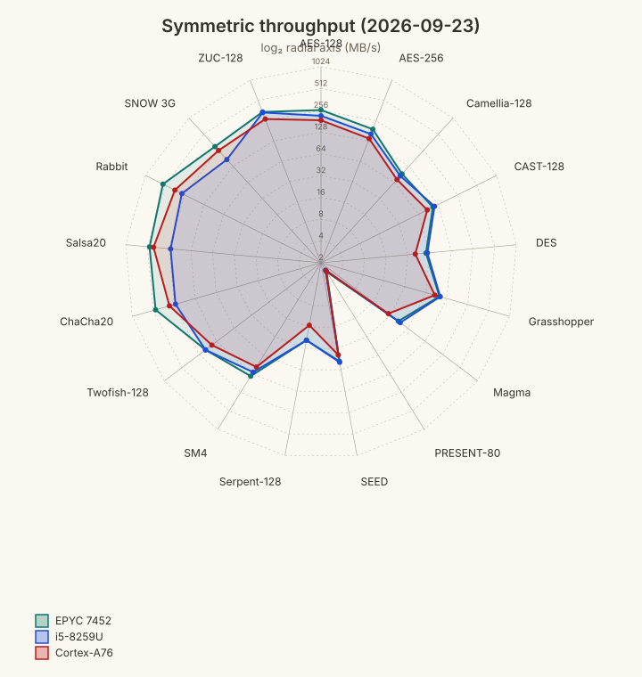
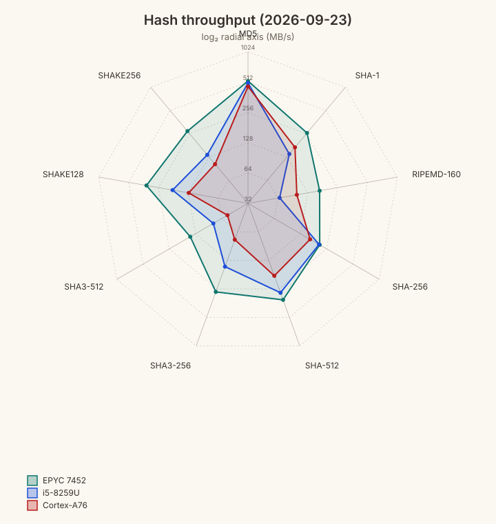

# SYMMETRIC

The symmetric side follows the same project-wide implementation rule as the
rest of the crate: pure idiomatic Rust, no C/FFI, and as few dependencies as
possible. Architecture intrinsics are intentionally avoided in the cipher
cores; the only intrinsic path in the in-tree library is an aarch64
`FEAT_SHA3` Keccak-f[1600] fast path, gated on runtime feature detection,
with the portable scalar Keccak as the always-correct fallback. Where a fast
table-driven path and a portable software constant-time path pull in
different directions, the crate keeps both visible rather than hiding the
tradeoff.

## Common Block-Cipher API

Every block cipher implements:

```rust
pub trait BlockCipher {
    const BLOCK_LEN: usize;
    fn encrypt(&self, block: &mut [u8]);
    fn decrypt(&self, block: &mut [u8]);
}
```

Most block-cipher types also expose typed `encrypt_block` / `decrypt_block`
helpers for callers that know the block size at compile time.

The dedicated `Ct` types are the software constant-time variants. They exist
only where the portable fast implementation would otherwise rely on
secret-indexed table lookups or similarly awkward software tradeoffs. `SIMON`
and `SPECK` do not have separate `Ct` types because their shipped round
functions are already table-free ARX / bitwise designs.

## Modes, Hashes, and MACs

### Recent Additions

The following primitives were completed during the most recent round of work.
The focus was filling in missing hash and mode surface APIs rather than adding
new block-cipher families.

- Hashes completed for compatibility: `Md5`, `Sha1`
- Stream-cipher extended-nonce variant: `XChaCha20`
- AEAD and misuse-resistant modes:
  `Eax`, `Ocb`, `Siv`, `AesGcmSiv<C>` (aliases `Aes128GcmSiv`, `Aes256GcmSiv`
  on the T-table AES and `Aes128GcmSivCt`, `Aes256GcmSivCt` on the
  constant-time AES), `ChaCha20Poly1305`
- AES key wrapping surface: `AesKeyWrap`

### Modes

The generic mode layer in `src/modes/` supplies:

- SP 800-38A: `Ecb`, `Cbc`, `Cfb`, `Cfb8`, `Ofb`, `Ctr`
- SP 800-38B: `Cmac`
- SP 800-38C: `Ccm`
- SP 800-38D: `Gcm`, `GcmVt`, `Gmac`, `GmacVt`
- SP 800-38E: `Xts`
- SP 800-38F / RFC 3394: `AesKeyWrap` (no-padding AES key wrap)
- RFC 5297: `Siv`
- RFC 7253: `Ocb`
- Bellare-Rogaway-Wagner EAX: `Eax`
- RFC 8452: `AesGcmSiv<C>` (`Aes128GcmSiv`, `Aes256GcmSiv`, `Aes128GcmSivCt`, `Aes256GcmSivCt`)
- RFC 8439: `Poly1305`, `ChaCha20Poly1305`

Reference set for the newly added mode paths:

- `Ccm`: NIST SP 800-38C (`pubs/sp800-38c.pdf`)
- `AesKeyWrap`: RFC 3394 and NIST SP 800-38F
  (`pubs/rfc3394-aes-key-wrap.pdf`, `pubs/sp800-38f.pdf`)
- `Siv`: RFC 5297 (`pubs/rfc5297-siv.pdf`)
- `Ocb`: RFC 7253 (`pubs/rfc7253-ocb.pdf`)
- `AesGcmSiv<C>`: RFC 8452 (`pubs/rfc8452-aes-gcm-siv.pdf`); POLYVAL constant-time,
  the AES calls those of `C`
- GCM test cases 3–18: McGrew & Viega, *The Galois/Counter Mode of Operation
  (GCM)*, revised 2005-05-31 (`pubs/mcgrew-viega-2005-gcm-revised-spec.pdf`,
  Internet Archive capture of the NIST-hosted file; Appendix B)
- `Poly1305` / `ChaCha20Poly1305`: RFC 8439 (`pubs/rfc8439-chacha20-poly1305.pdf`)

These wrappers are generic over any `BlockCipher`, so the same mode code works
across AES, DES, Camellia, PRESENT, CAST-128, and the other block ciphers.

Operational caveats:

- `ECB` is included for completeness and test coverage, not because it is a
  good default.
- `CBC`, `CFB`, `OFB`, and block-cipher `CTR` require correct IV / counter
  discipline from the caller.
- `GCM` requires nonce uniqueness and enforces the SP 800-38D per-call payload
  bound of $(2^{32}-2)$ counter blocks (`68_719_476_704` bytes) to prevent
  counter wrap. `Gcm`/`Gmac` are the default constant-time GHASH path and
  `GcmVt`/`GmacVt` are explicit variable-time reference paths whose GHASH
  is variable-time in both operands (the data and the hash subkey `H`).
- `XTS` is for storage-style sector encryption, not general message transport.
  Data units are 1 to 2^20 blocks (`XTS_MAX_DATA_UNIT_BLOCKS`, SP 800-38E §4).
- `Siv` (RFC 5297) accepts at most 2^36 − 16 bytes per message (32-bit counter
  addition, §2.5) and 126 associated-data components (§7); `decrypt` returns
  `false` beyond either bound.

### Hashes and XOFs

Implemented hash families:

- MD5 (`Md5`) for legacy compatibility
- RIPEMD-160 (`Ripemd160`) for legacy compatibility
- SHA-1
- SHA-2: `Sha224`, `Sha256`, `Sha384`, `Sha512`, `Sha512_224`, `Sha512_256`
- SHA-3: `Sha3_224`, `Sha3_256`, `Sha3_384`, `Sha3_512`
- XOFs: `Shake128`, `Shake256`

Reference set for the newly added hash paths:

- MD5: RFC 1321 (`pubs/rfc1321-md5.pdf`)
- RIPEMD-160: Dobbertin/Bosselaers/Preneel, FSE 1996
  (`pubs/ripemd-160-a-strengthened-version-of-ripemd.pdf`)

SHA-1 / SHA-2 are Merkle-Damgard constructions and therefore inherit the usual
length-extension caveat when used as raw keyed digests. For keyed integrity:

- use `Hmac<H>`
- or prefer SHA-3 / SHAKE if sponge semantics are the better fit

### MACs

Implemented message-authentication layers:

- `Hmac<H>` over any in-tree `Digest`
- `Cmac`
- `Gmac`

These provide integrity and authenticity, not signatures or non-repudiation.

## CSPRNGs

Implemented generators:

- `CtrDrbgAes256` (`CtrDrbg<Aes256>`, T-table AES, variable-time)
- `CtrDrbgAes256Ct` (`CtrDrbg<Aes256Ct>`, constant-time AES)

The shipped generator is `CtrDrbg<C>`, which follows SP 800-90A Rev. 1
CTR_DRBG with AES-256 and keys an encrypt-only schedule once per update; the
two aliases produce identical output and differ only in whether the DRBG key
can leak through the cache.

## Cipher Families

### Block Ciphers

Implemented block-cipher families:

- DES / Triple-DES
- AES
- CAST-128 / CAST5
- Camellia
- Serpent
- Twofish
- SEED
- PRESENT
- Magma
- Grasshopper
- SM4
- SIMON
- SPECK

Design philosophy by family:

- `DES / Triple-DES`: the classic U.S. IBM / NIST line. It is a Feistel design
  from the hardware-centric 1970s, so the tiny S-boxes and heavy bit
  permutations reflect gate-count and wiring concerns more than modern software
  taste. The implementation preserves the traditional fast table-driven shape
  because the whole point of DES in software is how far that old design can be
  pushed, while `DesCt` and `TripleDesCt` make the constant-time tradeoff
  explicit instead of pretending the two goals coincide.
- `AES`: the U.S. federal standard selected by NIST, but designed in Belgium
  as Rijndael. Its SP-network structure is a software/hardware compromise: fast
  table-driven software on one hand, compact byte-oriented hardware on the
  other. The crate keeps both views visible: the fast path for ordinary
  software benchmarking, and a separate Boyar-Peralta-style `Ct` path so the
  constant-time cost is concrete.
- `CAST-128 / CAST5`: a Canadian design from Carlisle Adams and Stafford
  Tavares. It is a round-function-heavy Feistel cipher built around large keyed
  S-boxes, sitting between DES-era Feistel design and the later AES finalists.
  The implementation keeps the keyed-round shape obvious rather than hiding it
  behind abstractions.
- `Camellia`: a Japanese design (NTT and Mitsubishi) from the AES era. It
  deliberately blends an SP-network core with Feistel-style `FL` / `FLINV`
  layers, reflecting a design culture that wanted AES-class performance without
  abandoning older structural ideas. The writeup and code keep that hybrid
  structure visible because that split personality is the whole design.
- `Serpent`: a European AES finalist (Anderson, Biham, Knudsen) built as the
  conservative answer to AES selection. Its philosophy is “simple boolean
  layers, many rounds, wide security margin,” so the implementation keeps the
  bitslice round structure explicit rather than chasing table speed tricks.
- `Twofish`: the U.S. AES-finalist line from Schneier and collaborators. Its
  design mixes key-dependent S-boxes, an MDS layer, and whitening, reflecting a
  software-first philosophy that squeezes complexity into precomputation and
  linear algebra instead of just adding rounds. The code keeps the `q`
  permutations, RS/MDS layers, and keyed `h()` transform visible because
  Twofish’s design is about the interaction of those components, not just the
  Feistel shell around them.
- `SEED`: the Korean national standard. It is a Feistel cipher that leans on
  large 8-bit S-boxes and a compact algebraic round mix, closer in feel to the
  1990s national-standard school than to the later ARX stream ciphers. The
  implementation favors readability of the round algebra and the key schedule
  over trying to disguise it as “just another AES-like block cipher.”
- `PRESENT`: a lightweight European academic design aimed at tiny hardware. Its
  philosophy is minimum area and simple logic, so the code keeps the 4-bit
  S-box / bit permutation structure direct and simple.
- `Magma`: the older Russian standard line (GOST 28147-89). It is a 32-round
  Feistel design with 4-bit substitution and a single rotate, intentionally
  small and regular in the style of older Soviet/Russian block-cipher design.
  The implementation keeps the nibble structure obvious and treats the `Ct`
  path as a software side-channel concession rather than a redesign.
- `Grasshopper`: the newer Russian standard (Kuznyechik / GOST R 34.12-2015).
  It is a byte-oriented SP-network whose identity is its linear $L$ transform
  over $GF(2^8)$. Compared to `Magma`, it reflects a much more modern
  byte-oriented design style. The code emphasizes that linear layer because it
  is the part that makes Grasshopper look and cost different from AES.
- `SM4`: the Chinese national standard. Its round function is a compact
  “S-box then linear diffusion” transform, a pragmatic software/hardware middle
  ground that looks closer to the East Asian national-standard family than to
  the Bernstein ARX line. The implementation keeps the
  $T = L(\tau(\cdot))$
  structure front and center because that is the design’s defining rhythm.
- `SIMON`: the U.S. NSA minimalist bitwise line. Its philosophy is “only the
  operations hardware and software both like”: rotates, AND, XOR. That is why
  there is no separate `Ct` split; the native round function is already close
  to the ideal constant-time software shape.
- `SPECK`: the U.S. NSA ARX counterpart to `SIMON`. Its design philosophy is
  software-first simplicity: add, rotate, XOR, and nothing else. The
  implementation therefore focuses on exactness and endianness rather than
  alternate `Ct` variants.

### Stream Ciphers

Implemented stream-cipher families:

- Rabbit
- Salsa20
- ChaCha20
- XChaCha20
- SNOW 3G
- ZUC-128

Design philosophy by family:

- `Rabbit`: an eSTREAM-era software stream cipher built around eight coupled
  counters and a nonlinear integer `g`-function rather than a pure ARX quarter
  round. Its design philosophy is software throughput with a more structured
  internal state than the Bernstein line, and the implementation keeps that
  counter/state split explicit because that is what makes Rabbit distinct.
- `Salsa20`: the U.S. Bernstein line, built around a fast ARX core. The
  quarter-round structure is intentionally simple and pipeline-friendly, so the
  implementation keeps the core word-mixing visible.
- `ChaCha20`: also Bernstein’s work, and explicitly a refinement of Salsa20
  rather than a different design family. It pushes for better diffusion per
  round while keeping the same ARX spirit. The code keeps the quarter-round and
  state layout explicit because ChaCha’s design is evolutionary.
- `XChaCha20`: not a new core cipher, but a longer-nonce construction around
  ChaCha20. Its design philosophy is operational robustness: keep ChaCha20’s
  fast core, but fix nonce-management pain by stretching a 24-byte nonce into a
  subkey plus ordinary ChaCha20 state.
- `SNOW 3G`: the 3GPP telecom stream-cipher core used underneath UEA2/UIA2.
  Like ZUC, it is state-machine-centric rather than ARX-centric: a 16-word
  LFSR feeds a three-register FSM and two byte-oriented S-box layers. The
  crate keeps both the fast table-driven path and a separate `Ct` path because
  the secret-indexed nonlinear steps are exactly where the software side-
  channel tradeoff lives.
- `ZUC-128`: the Chinese mobile-stream-cipher line (standardized through the
  3GPP / LTE world). It is very different from the ARX family: a word-structured
  LFSR plus a nonlinear filter and S-box layer, reflecting a telecom-stream-
  cipher tradition rather than the Bernstein ARX line. The implementation leaves
  that contrast obvious, because the cost profile comes from that architectural
  choice.

## Symmetric Performance

> **What is and is not current.** The cipher and hash tables below are the
> 2026-09-23 sweep and post-date every rewrite of this year's audit round: the
> SNOW 3G and ZUC arithmetic, the GHASH/POLYVAL multiply, and the MD5, SHA-1
> and SHA-2 compression functions. The go-fast comparison sections further
> down are older single-host snapshots, and their GHASH baseline is the one
> that multiply replaced, so their speedup figures are against a comparator
> this crate no longer ships.

Measured with [pilot-bench](https://github.com/darrelllong/pilot-bench)
driving `pilot_cipher`, a dedicated Rust binary that encrypts a fixed
workload per round and prints MB/s to stdout. Pilot repeats the round until
the chosen confidence interval is achieved, correcting for autocorrelation
and startup transients.

Columns: **Block** and **Key** in bits; **MB/s** mean; **±CI** half-width at
**90%**; **Runs** rounds required to reach CI. The 2026-09-23 sweep, taken
for 0.8.0, was run with `PILOT_PRESET=normal --confidence-level 0.90` (10% CI
half-width target, autocorrelation tolerance 0.2, ≥ 50 rounds minimum sample
size) and `PILOT_SESSION_LIMIT=300`, one case at a time on each of:

- AMD EPYC 7452 (`twilight`, Linux, idle)
- Intel Core i5-8259U (`dmz`, Linux, idle)
- Arm Cortex-A76 (`darby`, Raspberry Pi 5, Linux, idle)

The raw per-host tables, the host notes and the merge commands are in
[bench/sweep-2026-09-23](bench/sweep-2026-09-23/README.md). The compilers
differ with the hosts, which is part of what each column measures.

### AES

| Cipher | Block | Key | EPYC 7452 MB/s | EPYC 7452 ±CI (90%) | EPYC 7452 Runs | i5-8259U MB/s | i5-8259U ±CI (90%) | i5-8259U Runs | Cortex-A76 MB/s | Cortex-A76 ±CI (90%) | Cortex-A76 Runs |
|---|---|---|---|---|---|---|---|---|---|---|---|
| aes128 | 128 | 128 | 259.1 | ±2.04 | 86 | 215 | ±3.095 | 50 | 187 | ±0.9462 | 860 |
| aes128ct | 128 | 128 | 38.07 | ±0.1536 | 80 | 37.03 | ±0.1609 | 110 | 25.17 | ±0.08767 | 50 |
| aes192 | 128 | 192 | 217.4 | ±1.99 | 59 | 184.1 | ±1.479 | 233 | 159.2 | ±0.8312 | 80 |
| aes192ct | 128 | 192 | 31.46 | ±0.1064 | 50 | 30.86 | ±0.09317 | 52 | 21.06 | ±0.06936 | 50 |
| aes256 | 128 | 256 | 190.9 | ±1.431 | 110 | 161.8 | ±1.322 | 50 | 138.5 | ±0.6975 | 50 |
| aes256ct | 128 | 256 | 26.9 | ±0.09494 | 50 | 26.72 | ±0.1323 | 202 | 17.97 | ±0.04938 | 110 |

### Camellia

| Cipher | Block | Key | EPYC 7452 MB/s | EPYC 7452 ±CI (90%) | EPYC 7452 Runs | i5-8259U MB/s | i5-8259U ±CI (90%) | i5-8259U Runs | Cortex-A76 MB/s | Cortex-A76 ±CI (90%) | Cortex-A76 Runs |
|---|---|---|---|---|---|---|---|---|---|---|---|
| camellia128 | 128 | 128 | 91.76 | ±0.4113 | 200 | 84.37 | ±0.2066 | 50 | 72.12 | ±0.1417 | 80 |
| camellia128ct | 128 | 128 | 6.022 | ±0.006175 | 110 | 6.641 | ±0.0541 | 80 | 4.307 | ±0.0019 | 110 |
| camellia192 | 128 | 192 | 67.78 | ±0.3022 | 50 | 67.27 | ±0.168 | 350 | 53.95 | ±0.08325 | 50 |
| camellia192ct | 128 | 192 | 4.427 | ±0.005752 | 50 | 4.971 | ±0.01859 | 50 | 3.233 | ±0.001876 | 80 |
| camellia256 | 128 | 256 | 68.02 | ±0.2852 | 50 | 68.95 | ±0.3006 | 290 | 54.02 | ±0.09356 | 50 |
| camellia256ct | 128 | 256 | 4.415 | ±0.02472 | 50 | 4.959 | ±0.02753 | 260 | 3.221 | ±0.04062 | 50 |

### CAST-128

| Cipher | Block | Key | EPYC 7452 MB/s | EPYC 7452 ±CI (90%) | EPYC 7452 Runs | i5-8259U MB/s | i5-8259U ±CI (90%) | i5-8259U Runs | Cortex-A76 MB/s | Cortex-A76 ±CI (90%) | Cortex-A76 Runs |
|---|---|---|---|---|---|---|---|---|---|---|---|
| cast128 | 64 | 128 | 106.7 | ±0.691 | 84 | 112.9 | ±0.7696 | 50 | 87.19 | ±0.2067 | 83 |
| cast128ct | 64 | 128 | 1.855 | ±0.004124 | 80 | 1.839 | ±0.006345 | 56 | 1.292 | ±0.006311 | 100 |

### DES / 3DES

| Cipher | Block | Key | EPYC 7452 MB/s | EPYC 7452 ±CI (90%) | EPYC 7452 Runs | i5-8259U MB/s | i5-8259U ±CI (90%) | i5-8259U Runs | Cortex-A76 MB/s | Cortex-A76 ±CI (90%) | Cortex-A76 Runs |
|---|---|---|---|---|---|---|---|---|---|---|---|
| des | 64 | 56 | 57.1 | ±0.2627 | 110 | 59.76 | ±0.3133 | 50 | 40.62 | ±0.2779 | 50 |
| desct | 64 | 56 | 3.203 | ±0.00619 | 50 | 3.003 | ±0.01055 | 50 | 3.37 | ±0.03264 | 51 |
| 3des | 64 | 168 | 18.12 | ±0.05389 | 51 | 19.78 | ±0.07761 | 110 | 13.59 | ±0.2065 | 50 |
| 3desct | 64 | 168 | 1.062 | ±0.001618 | 86 | 1.005 | ±0.002548 | 50 | 1.123 | ±0.007652 | 50 |

### Grasshopper (GOST R 34.12-2015)

| Cipher | Block | Key | EPYC 7452 MB/s | EPYC 7452 ±CI (90%) | EPYC 7452 Runs | i5-8259U MB/s | i5-8259U ±CI (90%) | i5-8259U Runs | Cortex-A76 MB/s | Cortex-A76 ±CI (90%) | Cortex-A76 Runs |
|---|---|---|---|---|---|---|---|---|---|---|---|
| grasshopper | 128 | 256 | 100.3 | ±0.5777 | 118 | 102.9 | ±0.8583 | 50 | 86 | ±0.6352 | 500 |
| grasshopperct | 128 | 256 | 3.452 | ±0.004624 | 50 | 3.904 | ±0.01165 | 50 | 2.657 | ±0.03653 | 50 |

### Magma (GOST R 34.12-2015)

| Cipher | Block | Key | EPYC 7452 MB/s | EPYC 7452 ±CI (90%) | EPYC 7452 Runs | i5-8259U MB/s | i5-8259U ±CI (90%) | i5-8259U Runs | Cortex-A76 MB/s | Cortex-A76 ±CI (90%) | Cortex-A76 Runs |
|---|---|---|---|---|---|---|---|---|---|---|---|
| magma | 64 | 256 | 43.57 | ±0.1581 | 54 | 47.13 | ±0.1715 | 50 | 29.37 | ±0.02028 | 80 |
| magmact | 64 | 256 | 6.575 | ±0.01082 | 50 | 6.499 | ±0.04727 | 85 | 4.419 | ±0.0004203 | 80 |

### PRESENT

| Cipher | Block | Key | EPYC 7452 MB/s | EPYC 7452 ±CI (90%) | EPYC 7452 Runs | i5-8259U MB/s | i5-8259U ±CI (90%) | i5-8259U Runs | Cortex-A76 MB/s | Cortex-A76 ±CI (90%) | Cortex-A76 Runs |
|---|---|---|---|---|---|---|---|---|---|---|---|
| present80 | 64 | 80 | 2.812 | ±0.01133 | 50 | 2.635 | ±0.005212 | 143 | 2.702 | ±0.03748 | 50 |
| present80ct | 64 | 80 | 1.333 | ±0.002494 | 50 | 1.271 | ±0.02038 | 52 | 1.013 | ±0.00496 | 50 |
| present128 | 64 | 128 | 2.829 | ±0.00514 | 80 | 2.635 | ±0.0059 | 112 | 2.702 | ±0.01988 | 130 |
| present128ct | 64 | 128 | 1.338 | ±0.002149 | 50 | 1.274 | ±0.00975 | 56 | 1.013 | ±0.005195 | 50 |

### SEED

| Cipher | Block | Key | EPYC 7452 MB/s | EPYC 7452 ±CI (90%) | EPYC 7452 Runs | i5-8259U MB/s | i5-8259U ±CI (90%) | i5-8259U Runs | Cortex-A76 MB/s | Cortex-A76 ±CI (90%) | Cortex-A76 Runs |
|---|---|---|---|---|---|---|---|---|---|---|---|
| seed | 128 | 128 | 48.73 | ±0.2025 | 50 | 50.15 | ±0.148 | 110 | 39.64 | ±0.03308 | 51 |
| seedct | 128 | 128 | 4.25 | ±0.0102 | 80 | 4.902 | ±0.0175 | 118 | 3.219 | ±0.03478 | 181 |

### Serpent

| Cipher | Block | Key | EPYC 7452 MB/s | EPYC 7452 ±CI (90%) | EPYC 7452 Runs | i5-8259U MB/s | i5-8259U ±CI (90%) | i5-8259U Runs | Cortex-A76 MB/s | Cortex-A76 ±CI (90%) | Cortex-A76 Runs |
|---|---|---|---|---|---|---|---|---|---|---|---|
| serpent128 | 128 | 128 | 24.56 | ±0.09073 | 50 | 24.58 | ±0.1799 | 110 | 15.11 | ±0.04457 | 50 |
| serpent192 | 128 | 192 | 24.63 | ±0.07263 | 50 | 24.77 | ±0.6822 | 51 | 15.07 | ±0.1768 | 53 |
| serpent256 | 128 | 256 | 24.59 | ±0.0859 | 50 | 24.7 | ±0.1643 | 110 | 15.13 | ±0.04147 | 80 |

### SM4

| Cipher | Block | Key | EPYC 7452 MB/s | EPYC 7452 ±CI (90%) | EPYC 7452 Runs | i5-8259U MB/s | i5-8259U ±CI (90%) | i5-8259U Runs | Cortex-A76 MB/s | Cortex-A76 ±CI (90%) | Cortex-A76 Runs |
|---|---|---|---|---|---|---|---|---|---|---|---|
| sm4 | 128 | 128 | 139.4 | ±1.153 | 50 | 120.3 | ±0.3068 | 50 | 98.9 | ±0.3264 | 50 |
| sm4ct | 128 | 128 | 6.532 | ±0.01547 | 50 | 7.406 | ±0.02472 | 170 | 4.736 | ±0.002596 | 230 |

### Twofish

| Cipher | Block | Key | EPYC 7452 MB/s | EPYC 7452 ±CI (90%) | EPYC 7452 Runs | i5-8259U MB/s | i5-8259U ±CI (90%) | i5-8259U Runs | Cortex-A76 MB/s | Cortex-A76 ±CI (90%) | Cortex-A76 Runs |
|---|---|---|---|---|---|---|---|---|---|---|---|
| twofish128 | 128 | 128 | 198.9 | ±1.409 | 50 | 199.7 | ±2.702 | 173 | 154.9 | ±1.05 | 80 |
| twofish128ct | 128 | 128 | 1.02 | ±0.003989 | 110 | 1.456 | ±0.02872 | 50 | 0.866 | ±0.003247 | 53 |
| twofish192 | 128 | 192 | 197.7 | ±2.01 | 80 | 88.66 | ±0.7334 | 411 | 156.1 | ±0.5255 | 50 |
| twofish192ct | 128 | 192 | 0.7884 | ±0.00198 | 153 | 1.126 | ±0.006314 | 50 | 0.6786 | ±0.002655 | 76 |
| twofish256 | 128 | 256 | 198.3 | ±2.145 | 230 | 200.5 | ±1.232 | 232 | 155.8 | ±0.7713 | 80 |
| twofish256ct | 128 | 256 | 0.6394 | ±0.001587 | 84 | 0.9194 | ±0.003647 | 50 | 0.5654 | ±0.002494 | 50 |

### Simon

| Cipher | Block | Key | EPYC 7452 MB/s | EPYC 7452 ±CI (90%) | EPYC 7452 Runs | i5-8259U MB/s | i5-8259U ±CI (90%) | i5-8259U Runs | Cortex-A76 MB/s | Cortex-A76 ±CI (90%) | Cortex-A76 Runs |
|---|---|---|---|---|---|---|---|---|---|---|---|
| simon32_64 | 32 | 64 | 54.94 | ±0.2045 | 56 | 47.63 | ±0.1615 | 55 | 45.57 | ±0.06187 | 50 |
| simon48_72 | 48 | 72 | 72.99 | ±0.3711 | 50 | 66.96 | ±0.1127 | 204 | 59.46 | ±0.1098 | 80 |
| simon48_96 | 48 | 96 | 72.92 | ±0.3776 | 55 | 69.23 | ±0.4673 | 85 | 59.52 | ±0.09701 | 50 |
| simon64_96 | 64 | 96 | 94.55 | ±0.658 | 50 | 91.55 | ±0.7346 | 260 | 59.39 | ±0.08706 | 147 |
| simon64_128 | 64 | 128 | 90.45 | ±0.4657 | 51 | 77.4 | ±0.111 | 119 | 75.02 | ±0.3532 | 140 |
| simon96_96 | 96 | 96 | 98.19 | ±0.593 | 50 | 94.27 | ±0.2686 | 170 | 79.07 | ±0.3511 | 50 |
| simon96_144 | 96 | 144 | 93.83 | ±0.4618 | 350 | 84.41 | ±0.1445 | 203 | 76.45 | ±0.2185 | 59 |
| simon128_128 | 128 | 128 | 159.5 | ±1.28 | 52 | 116.2 | ±0.3162 | 50 | 149.5 | ±0.7668 | 81 |
| simon128_192 | 128 | 192 | 158.7 | ±1.277 | 50 | 116.7 | ±0.4071 | 110 | 148.3 | ±0.6069 | 50 |
| simon128_256 | 128 | 256 | 151 | ±1.169 | 113 | 92.51 | ±0.2631 | 83 | 141.7 | ±0.9359 | 80 |

### Speck

| Cipher | Block | Key | EPYC 7452 MB/s | EPYC 7452 ±CI (90%) | EPYC 7452 Runs | i5-8259U MB/s | i5-8259U ±CI (90%) | i5-8259U Runs | Cortex-A76 MB/s | Cortex-A76 ±CI (90%) | Cortex-A76 Runs |
|---|---|---|---|---|---|---|---|---|---|---|---|
| speck32_64 | 32 | 64 | 109.9 | ±0.7187 | 53 | 87.63 | ±0.1951 | 50 | 72.48 | ±0.1344 | 148 |
| speck48_72 | 48 | 72 | 164.9 | ±1.355 | 80 | 124.6 | ±0.3952 | 80 | 106 | ±0.3471 | 56 |
| speck48_96 | 48 | 96 | 151.6 | ±1.006 | 80 | 122.6 | ±0.3341 | 51 | 112.9 | ±0.4176 | 50 |
| speck64_96 | 64 | 96 | 233.7 | ±2.088 | 200 | 185.2 | ±1.046 | 53 | 120.9 | ±0.4714 | 50 |
| speck64_128 | 64 | 128 | 227.9 | ±2.245 | 204 | 177.1 | ±0.5403 | 50 | 116.4 | ±0.3956 | 50 |
| speck96_96 | 96 | 96 | 227.6 | ±2.173 | 80 | 181.2 | ±0.9105 | 50 | 172.6 | ±1.299 | 200 |
| speck96_144 | 96 | 144 | 224.4 | ±1.815 | 50 | 180.4 | ±0.5488 | 110 | 167 | ±0.8726 | 110 |
| speck128_128 | 128 | 128 | 565.3 | ±9.356 | 50 | 211.6 | ±2.429 | 260 | 302.6 | ±1.822 | 50 |
| speck128_192 | 128 | 192 | 549.9 | ±9.48 | 80 | 207 | ±2.491 | 50 | 294.7 | ±1.451 | 50 |
| speck128_256 | 128 | 256 | 535.6 | ±4.455 | 50 | 200.1 | ±2.442 | 170 | 229.1 | ±1.382 | 387 |

### Stream ciphers

| Cipher | Block | Key | EPYC 7452 MB/s | EPYC 7452 ±CI (90%) | EPYC 7452 Runs | i5-8259U MB/s | i5-8259U ±CI (90%) | i5-8259U Runs | Cortex-A76 MB/s | Cortex-A76 ±CI (90%) | Cortex-A76 Runs |
|---|---|---|---|---|---|---|---|---|---|---|---|
| chacha20 | stream | 256 | 474.1 | ±5.86 | 80 | 245.7 | ±1.233 | 80 | 300.1 | ±5.181 | 449 |
| xchacha20 | stream | 256 | 471.9 | ±7.043 | 50 | 246.1 | ±0.9889 | 50 | 377.5 | ±2.648 | 50 |
| salsa20 | stream | 256 | 477.3 | ±5.733 | 85 | 244 | ±3.708 | 52 | 420.4 | ±4.772 | 111 |
| rabbit | stream | 128 | 549.5 | ±6.65 | 50 | 281 | ±2.272 | 50 | 359.9 | ±4.032 | 142 |
| snow3g | stream | 128 | 298.8 | ±3.438 | 50 | 170.7 | ±1.325 | 50 | 252.5 | ±5.473 | 50 |
| snow3gct | stream | 128 | 24.54 | ±0.06708 | 50 | 26.66 | ±0.1126 | 80 | 18.06 | ±0.0149 | 50 |
| zuc128 | stream | 128 | 344.2 | ±3.813 | 50 | 337.7 | ±6.877 | 143 | 271.1 | ±2.188 | 350 |
| zuc128ct | stream | 128 | 26.01 | ±0.06338 | 50 | 28.54 | ±0.142 | 80 | 18.67 | ±0.02207 | 50 |

### What a keystream costs below a megabyte

The table above is a megabyte in one call, which is the best case: whole
blocks, one construction amortised over sixteen thousand of them. What a
caller actually asks for is often a record or a word.
`benchmarks/benches/keystream_sizes.rs` measures the other shapes; these are
`baase` (Cortex-X925, idle), criterion's median of each estimate.

| Request | One call | A word at a time | Offset by one byte |
|---|---:|---:|---:|
| 4 B | 89.5 ns | 90.4 ns | — |
| 16 B | 89.2 ns | 95.5 ns | 90.3 ns |
| 64 B | 91.9 ns | 134.0 ns | 92.6 ns |
| 480 B | 571 ns | 926 ns | 567 ns |
| 512 B | 574 ns | 951 ns | 568 ns |
| 4 KiB | 4.39 µs | 7.40 µs | 4.38 µs |
| 1 MiB | 1.114 ms | — | 1.115 ms |

Construction alone is 34.0 ns, and a construction plus one block is 91.2 ns.
Three things follow:

- **Below one block, the cost is the setup.** A four-byte request costs the
  same as a sixty-four-byte one, and 38% of it is the constructor. A caller
  that needs a word at a time should hold one cipher, not build one per call.
- **Holding the cipher is worth 1.7×.** Asking for a page a word at a time
  costs 7.40 µs against 4.39 µs in one call, because each call re-enters and
  re-checks rather than because the keystream costs more. The penalty is 1.07×
  at sixteen bytes, where the setup still dominates, and settles at 1.68× by a
  page.
- **Alignment does not matter here.** A buffer starting one byte into its
  allocation measures the same as an aligned one at every size, within the
  intervals. The XOR is byte-wise and the block generation does not touch the
  caller's buffer.

The marginal cost of a whole block, from the 64-to-512-byte span, is 68.9 ns,
which is 933 MB/s at a page and 942 MB/s at a megabyte: the keystream reaches
its asymptote well before the megabyte the table above uses.

### Hash and XOF throughput

`pilot_hash` reports the same MB/s shape as `pilot_cipher`, absorbing a
fixed input per round and finalizing into a hash digest or squeezing a
fixed-size XOF output. SHAKE128 / SHAKE256 squeeze 32 bytes per round so the
per-byte input cost dominates.

### MD5 / SHA-1 / RIPEMD-160 (legacy)

| Hash | Out | EPYC 7452 MB/s | EPYC 7452 ±CI (90%) | EPYC 7452 Runs | i5-8259U MB/s | i5-8259U ±CI (90%) | i5-8259U Runs | Cortex-A76 MB/s | Cortex-A76 ±CI (90%) | Cortex-A76 Runs |
|---|---|---|---|---|---|---|---|---|---|---|
| md5 | 128 | 524 | ±5.391 | 50 | 501.3 | ±3.232 | 298 | 461.9 | ±4.03 | 53 |
| sha1 | 160 | 261.1 | ±3.758 | 50 | 139.4 | ±0.7217 | 320 | 170.4 | ±0.5746 | 110 |
| ripemd160 | 160 | 168.9 | ±2.048 | 80 | 66.67 | ±3.347 | 50 | 99.44 | ±0.3003 | 110 |

### SHA-2 (FIPS 180-4)

| Hash | Out | EPYC 7452 MB/s | EPYC 7452 ±CI (90%) | EPYC 7452 Runs | i5-8259U MB/s | i5-8259U ±CI (90%) | i5-8259U Runs | Cortex-A76 MB/s | Cortex-A76 ±CI (90%) | Cortex-A76 Runs |
|---|---|---|---|---|---|---|---|---|---|---|
| sha224 | 224 | 214.3 | ±1.455 | 80 | 209.7 | ±2.369 | 50 | 165.4 | ±0.8062 | 112 |
| sha256 | 256 | 212.4 | ±1.921 | 142 | 208.7 | ±2.843 | 208 | 165.1 | ±1.074 | 50 |
| sha384 | 384 | 333.6 | ±3.943 | 50 | 280.4 | ±1.45 | 80 | 246.2 | ±3.926 | 208 |
| sha512 | 512 | 333.8 | ±3.869 | 50 | 280.9 | ±1.265 | 140 | 186.1 | ±0.9578 | 80 |
| sha512_224 | 224 | 337.8 | ±2.778 | 56 | 280 | ±1.483 | 50 | 186.1 | ±0.9495 | 207 |
| sha512_256 | 256 | 336.8 | ±3.914 | 80 | 279 | ±1.582 | 50 | 186 | ±1.155 | 110 |

### SHA-3 (FIPS 202)

| Hash | Out | EPYC 7452 MB/s | EPYC 7452 ±CI (90%) | EPYC 7452 Runs | i5-8259U MB/s | i5-8259U ±CI (90%) | i5-8259U Runs | Cortex-A76 MB/s | Cortex-A76 ±CI (90%) | Cortex-A76 Runs |
|---|---|---|---|---|---|---|---|---|---|---|
| sha3_224 | 224 | 294.1 | ±3.217 | 50 | 159.7 | ±0.5992 | 50 | 81.92 | ±0.299 | 140 |
| sha3_256 | 256 | 275.3 | ±2.956 | 80 | 148.9 | ±3.563 | 50 | 77.31 | ±0.9678 | 290 |
| sha3_384 | 384 | 213.3 | ±1.958 | 50 | 115 | ±0.6979 | 50 | 62.82 | ±0.1768 | 80 |
| sha3_512 | 512 | 147 | ±1.078 | 50 | 79.96 | ±0.1796 | 51 | 55.05 | ±0.185 | 950 |

### SHAKE XOFs (FIPS 202; 32-byte squeeze)

| Hash | Out | EPYC 7452 MB/s | EPYC 7452 ±CI (90%) | EPYC 7452 Runs | i5-8259U MB/s | i5-8259U ±CI (90%) | i5-8259U Runs | Cortex-A76 MB/s | Cortex-A76 ±CI (90%) | Cortex-A76 Runs |
|---|---|---|---|---|---|---|---|---|---|---|
| shake128 | xof | 338.3 | ±3.878 | 59 | 184.3 | ±1.164 | 143 | 126.8 | ±0.5039 | 50 |
| shake256 | xof | 276.1 | ±2.753 | 80 | 136.1 | ±0.347 | 50 | 103.2 | ±0.4181 | 117 |

Cross-platform summary Kiviat diagrams (radar charts; log-radial axis,
outer ring = faster):




The Kiviat diagram (radar chart) below compares representative fast-vs-`Ct`
pairs across
table-driven ciphers. Simon and Speck are absent because their designs are
already table-free bitwise/ARX, so there is no software `Ct` variant to compare.


### Apple-Silicon Go-Fast Alternative (`fast/Apple-Silicon`)

These numbers come from the isolated Apple-Silicon alternative kernels in
`fast/Apple-Silicon/aarch64-alt`, using the local comparator binaries after
correctness checks against baseline/reference outputs. Unlike the Pilot tables
above, this section is a focused single-host microbenchmark snapshot on M4 Pro.

| Primitive | Comparator | Unit | Go-fast Throughput | Baseline/Reference Throughput | Speedup |
|---|---|---|---:|---:|---:|
| AES-128 encrypt | `compare_aes128` | MiB/s | 9803.92 | 502.88 | 19.50x |
| AES-256 encrypt | `compare_aes256` | MiB/s | 6040.76 | 264.80 | 22.81x |
| SHA-256 digest | `compare_sha256` | MiB/s | 2417.54 | 364.57 | 6.63x |
| GHASH multiply | `compare_ghash` | Mops/s | 117.79 | 9.23 (`ct_ref`) | 12.75x |

Promotion gate for the published go-fast set is $\ge 5\times$ speedup.
Exploratory results below that bar (not promoted):

- `compare_chacha20`: `1.53x`
- `compare_shake` (ML-KEM+ML-DSA-like): `1.07x`

Apple go-fast throughput Kiviat diagram (radar chart, two curves; per-axis normalized):


### x86 Go-Fast Alternative (`fast/x86`, moore.soe.ucsc.edu)

These numbers come from the isolated x86 alternative kernels in
`fast/x86/x86-alt`, measured on `moore.soe.ucsc.edu` (AMD EPYC 7452) after
correctness checks against baseline/reference outputs.
Source run log:
[fast/x86/results/alt_suite_20260310_061035.md](fast/x86/results/alt_suite_20260310_061035.md)

| Primitive | Comparator | Unit | Go-fast Throughput | Baseline/Reference Throughput | Speedup |
|---|---|---|---:|---:|---:|
| AES-128 encrypt | `compare_aes128` | MiB/s | 2557.36 | 248.95 | 10.27x |
| AES-256 encrypt | `compare_aes256` | MiB/s | 2043.97 | 185.42 | 11.02x |
| GHASH multiply | `compare_ghash` | Mops/s | 42.39 | 2.54 (`ct_ref`) | 16.71x |

All published x86 go-fast kernels currently clear the $\ge 5\times$ promotion gate.

x86 go-fast throughput Kiviat diagram (radar chart, two curves; per-axis normalized):


## References

The primary standards and papers are stored in `pubs/`. The BibTeX index is in
[README.md](README.md).
