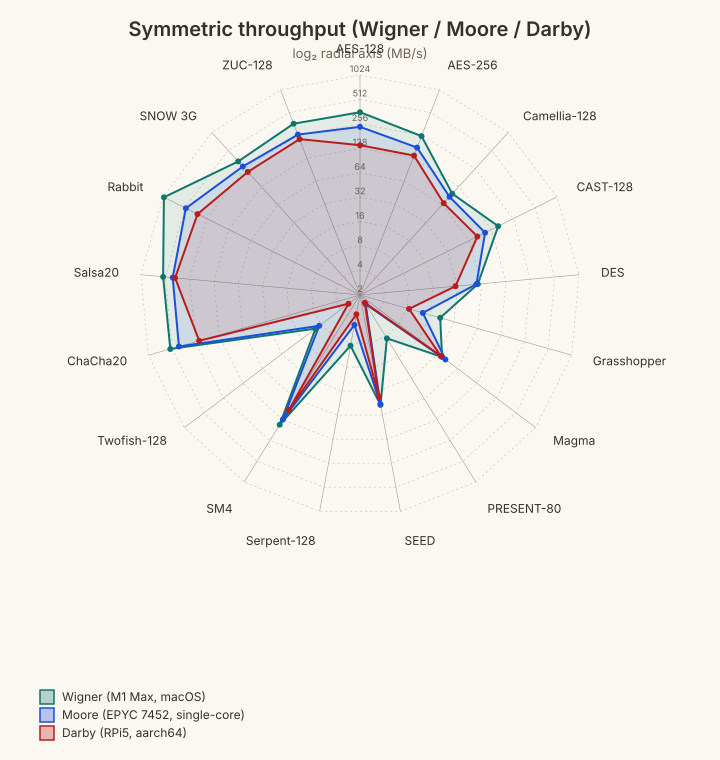
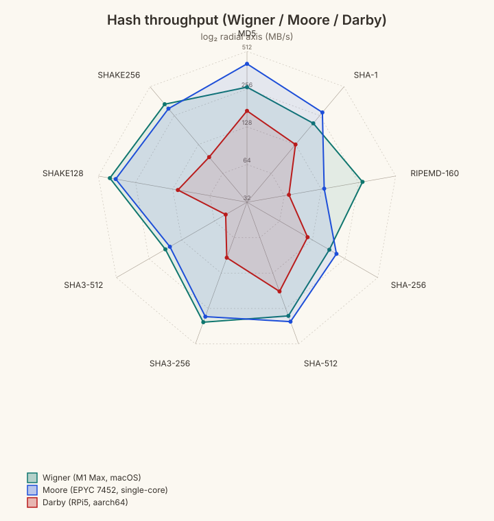
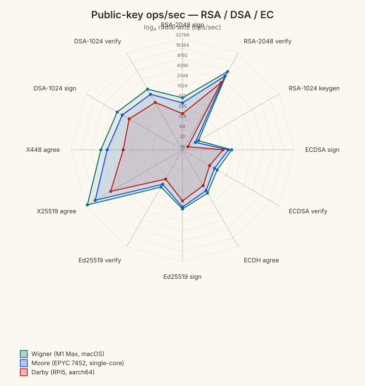
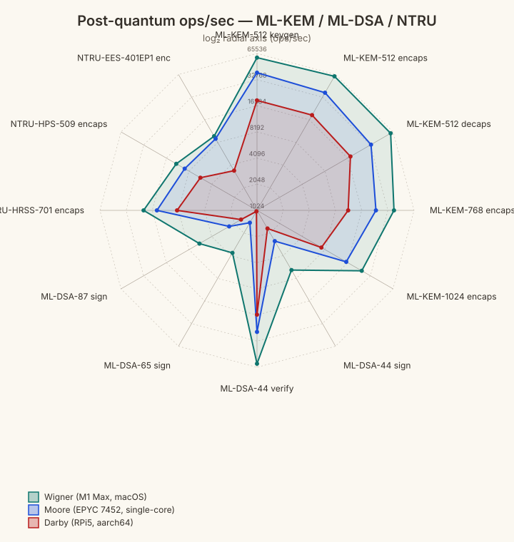

# Three-platform Pilot sweep — 2026-05-08

Pilot-bench sweep across three platforms covering the full symmetric, hash,
and public-key (incl. post-quantum) surface of the cryptography crate.

## Hosts

| Tag | Host | CPU | OS | Cores |
|---|---|---|---|---|
| `wigner` | `wigner.local` | Apple M1 Max | Darwin 25.3.0 (macOS) | 10 |
| `moore`  | `moore.soe.ucsc.edu` | AMD EPYC 7452 | Linux 5.4.0 (Ubuntu) | 128 (single-core slice) |
| `darby`  | `darby.local` | Broadcom BCM2712 (RPi 5) | Linux 6.12.62 (Debian bookworm) | 4 |

All hosts pinned to the same commit set:

- cryptography: `eac8df0`
- pilot-bench: `097624d`

## Pilot configuration

Run with `PILOT_PRESET=normal PILOT_CONFIDENCE_LEVEL=0.90`:

- 90% confidence interval (matches the request for "90% CI")
- 10% CI half-width target
- autocorrelation tolerance ≤ 0.2
- ≥ 50 rounds minimum sample size

Per-round workload sizes left at defaults: 256 KiB per `pilot_cipher`/`pilot_hash`
invocation, `PILOT_PK_ITERS_PERCENT=25` for `pilot_pk`.

## Wall-clock totals

| Host | Symmetric | Hash | Public-key | Total |
|---|---:|---:|---:|---:|
| Wigner | 5m00s | 4s   | 15m38s | 20m42s |
| Moore  | 3m14s | 4s   | 19m43s | 23m01s |
| Darby  | 4m53s | 7s   | 24m33s | 29m33s |

## Outputs

```
sweep-2026-05-08/
├── README.md                   ← this file
├── wigner/                     ← raw stdout from each script per host
├── moore/
├── darby/
├── merged/                     ← 3-way side-by-side Markdown tables (radars embedded inline)
│   ├── symmetric.md
│   ├── hash.md
│   └── pk.md
└── csv/                        ← extracted (label,wigner,moore,darby) rows
    ├── symmetric.csv
    ├── hash.csv
    ├── pk_rsa_ec.csv
    └── pk_pq.csv
```

Kiviat (radar) SVGs live in the repo's shared `assets/` tree:

```
assets/
├── sweep-2026-05-08-symmetric-radar.svg
├── sweep-2026-05-08-hash-radar.svg
├── sweep-2026-05-08-pk-rsa-ec-radar.svg
└── sweep-2026-05-08-pk-pq-radar.svg
```

## Radars









## How to reproduce / extend

```bash
# 1. Drive the sweeps on a fresh host (after a fresh pull + rebuild):
PILOT_PRESET=normal PILOT_CONFIDENCE_LEVEL=0.90 \
  bash scripts/bench_all.sh         > /tmp/symmetric.md
PILOT_PRESET=normal PILOT_CONFIDENCE_LEVEL=0.90 \
  bash scripts/bench_all_hash.sh    > /tmp/hash.md
PILOT_PRESET=normal PILOT_CONFIDENCE_LEVEL=0.90 \
  bash scripts/bench_all_pk_full.sh > /tmp/pk.md

# 2. Merge three platforms' results side-by-side:
python3 scripts/merge_three_pilot_tables.py \
  --a wigner/symmetric.md --b moore/symmetric.md --c darby/symmetric.md \
  --a-label "Wigner (M1 Max)" --b-label "Moore (EPYC 7452)" --c-label "Darby (RPi5)" \
  --mode sym --confidence-pct 90 --out merged/symmetric.md

# 3. Extract per-radar CSVs and emit SVGs:
python3 scripts/build_radar_csvs.py
python3 assets/generate_three_platform_radar.py \
  --csv csv/symmetric.csv --out radar/symmetric-radar.svg \
  --title "Symmetric throughput" --units "MB/s"
```
